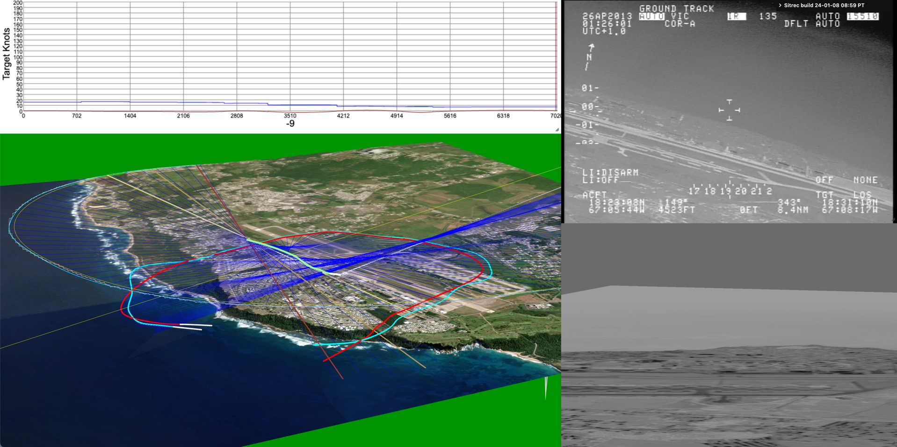

# Sitrec2

Sitrec (Situation recreation) is a web application that allows for the real-time interactive 3D recreation of various situations. It was created initially to analyze the US Navy UAP/UFO video (Gimbal, GoFast, and FLIR1/Nimitz), but has expanded to include several other situations (referred to as "sitches"). It's written mostly by [Mick West](https://github.com/MickWest), with a lot of input from the members of [Metabunk](https://www.metabunk.org).

Here's a link to [Sitrec on Metabunk](https://www.metabunk.org/sitrec).

There is also a [serverless copy on GitHub Pages](https://mickwest.github.io/Sitrec2/) with very limited data egress: it has no server, the files you load never leave your browser, and the only remote services it contacts on its own are the two map-tile providers; anything else needs your own provider key and your action. See [Deploying Sitrec on GitHub Pages](docs/dev/Deploying-on-GitHub-Pages.md) and [where Sitrec sends data](docs/UserDataEgressCheck.md).

My goal here is to create a tool to effectively analyze UAP/UFO cases, and to share that analysis in a way that people can understand it. Hence, I focused on making Sitrec run in real-time (30 fps or faster), and be interactive both in viewing, and in exploring the various parameters of a sitch.  

### User Documentation

The same list is in the app under **Help → Documentation**, grouped the same way. It is
defined once, in [`src/docsRegistry.js`](src/docsRegistry.js), which also feeds the in-app AI
assistant — so if you add a doc, add it there.

**Start here**

- [Getting Started - What Sitrec is, and building your first sitch](docs/CustomSitchTool.md)
- [Doing Defensible Analysis - How to reach a conclusion that holds up, and how to write it up](docs/DefensibleAnalysis.md)
- [The Sitrec User Interface - How the menus work](docs/UserInterface.md)
- [Keyboard Shortcuts](docs/KeyboardShortcuts.md)
- [Glossary - sitch, traverse, LOS, HAE, MISB, and the rest](docs/Glossary.md)
- [What's New](docs/WhatsNew.md)

**Data and tracks**

- [Loading and Filtering Tracks - Formats, importing, filtering, and display](docs/Tracks.md)
- [Where to Get Flight Data - ADS-B Exchange, FlightRadar24, FlightAware and friends](docs/KMLDataSources.md)
- [Saving and Loading Sitches - Server saves and local folder workflow](docs/SavingAndLoading.md)
- [Custom Models and 3D Objects - Add your own planes](docs/CustomModels.md)
- [Reference Objects](docs/ObjectReferences.md)

**The world**

- [GIS, Geodesy, and Altitude - Datums, coordinate systems, and how to spot a datum error](docs/GIS.md)
- [Terrain and Elevation - Map vs elevation sources, and which surface a ground query hits](docs/Terrain.md)
- [Atmospheric Refraction - Horizons, and why distant things look higher than they are](docs/Refraction.md)
- [Wind in Sitrec - Wind menu, atmospheric data sources, streamlines](docs/Wind.md)
- [Historic Skies - Reconstructing the sky for dates back to 1700, and what stays accurate there](docs/HistoricSkies.md)
- [Haze and Aerial Perspective](docs/AtmosphericAerialPerspective.md)

**Video tools**

- [Rendering and Exporting Video](docs/Video.md)
- [Masking Out Part of the Video](docs/Masking.md)
- [Star Tracker - Identify the stars, and measure the field of view](docs/StarTracker.md)
- [Point Track and Stabilization](docs/PointTrack.md)
- [Long Exposure Simulation](docs/LongExposure.md)
- [Lens Ghosts and Reflections](docs/LensGhost.md)

**Analysis**

- [Traverse Methods - How LOS + physical assumptions resolve target positions per frame](docs/TraverseMethods.md)
- [Traverse Analysis and the Verdict - The Analyze button, the gallery, and what it licenses](docs/TraverseAnalysis.md)
- [Camera Modes - Normal (Az/El) and Satellite (quaternion) view modes](docs/satcam.md)
- [Recreating Starlink Situations - Horizon Flares](docs/Starlink.md)

**Bespoke examples (not typical)**

- [Recreating Gimbal - Walkthrough: build a Gimbal sitch from scratch via drag-and-drop](docs/gimbal-recreate.md)
- [Nimitz / Tic Tac - Handling sources that disagree](docs/Nimitz.md)
- [Football and Cable Cam](docs/Football.md)

**Advanced**

- [Control Sitrec with ChatGPT site tools (WebMCP)](docs/WebMCP.md)
- [Local Custom Sitches - JSON-based sitch definitions for advanced setups](docs/LocalCustomSitches.md)
- [Scripted Camera Moves](docs/ScriptedVideo.md)
- [What's New (Details)](docs/WhatsNew-Details.md)

### Technical Documentation (for coders and webmasters)

- [Installing and Configuring a Sitrec Server](docs/dev/Installing-and-configuring.md)
- [Deploying Sitrec on a VPS with Podman and Caddy - A public site on its own domain from the released container image, with HTTPS and self-applying updates](docs/dev/Deploying-on-a-VPS.md)
- [Deploying Sitrec on GitHub Pages - How the serverless build at mickwest.github.io/Sitrec2 is made and published, what it can and cannot do, and how to fork it](docs/dev/Deploying-on-GitHub-Pages.md)
- [Installing Hardened Sitrec on AWS - The secure build behind a load balancer with client certificate authentication, a private bucket, and no route to the internet](docs/dev/Installing-Hardened-Sitrec-on-AWS.md)
- [File Rehosting and Related Server Configuration](docs/dev/FileRehosting.md)
- [Custom Terrain and Elevation Sources, WMS, etc.](docs/dev/CustomTerrainSources.md)
- [Adding New Settings - Developer checklist for new user settings](docs/dev/ADDING_NEW_SETTINGS.md)
- [Settings Manager Architecture - Server/cookie fallback and sanitization](docs/dev/SettingsManager.md)
- [Dynamic GUI Mirroring - API for mirrored GUI controls](docs/dev/dynamic-gui-mirroring.md)
- [MISB Timing & Sync - Per-frame KLV/video alignment in TS-sourced files](docs/dev/misb-timing.md)
- [Wind Internals - Data flow, file formats, and atmospheric data sources](docs/Wind-Internals.md)
- [The User Data Egress Check - Every push is checked for new ways user data could leave the app; where Sitrec sends data and how much](docs/UserDataEgressCheck.md)

### Legacy documentation
- [Adding a Sitch in Code (older method)](docs/dev/AddSitchInCode.md)

The most common use case is to display three views:
- A video of a UAP situation 
- A 3D recreation of that video 
- A view of the 3D world from another perspective (with movable camera) 
- Plus various graphs and stats. 

Here's the [famous Aguadilla video](https://www.metabunk.org/sitrec/?sitch=agua)

Sitrec uses or ingests a variety of data sources

- ADS-B files in KML format from ADSB Exchange, FlightAware, Planefinder, and others
- Satellite orbital data (mostly Starlink) as CCSDS OMM in CSV, or as legacy Two/Three Line Element (TLE) files
- Star catalogs (BSC, etc.)
- Video (mp4, mov, H.264, H.265 )
- DJI Drone tracks from Airdata as .csv
- GLB (Binary GLTF 3D models)
- Generic custom data in .csv
- PBA (Pico Balloon Archive) .txt files
- MISB style 3d Track data in KLV or CSV format
- Image files (jpg, png, etc) as single frame videos or ground overlays
- Image Overlays in KMZ format

 
Some types of situations covered:

- UAP Videos
  - Taken from a plane where a target object's azimuth and elevation are known ("angles only")
  - Taken from a plane of another plane
  - Taken from a plane looking in a particular direction
  - From a fixed position
- Viewing the sky (with accurate planets and satellites)

City Location and population data from: https://simplemaps.com/data/us-cities
