# Getting Started with Sitrec

Sitrec recreates a real-world situation (a **"sitch"**) in an interactive 3D view, so you can line it up against a video or photo — terrain, sky, aircraft, satellites, the Sun, and stars, all at the right **place** and **time**. It was originally built to analyze US Navy UAP videos.

## What Sitrec does, and what it cannot do

**A camera tells you the *direction* to an object. It never tells you the distance.** A light in the sky could be a drone 200 m away or an airliner 40 km away, and in the footage they can look identical. A single line of sight gives a direction, not a distance: from one fixed viewpoint, the bearing geometry alone does not fix the range.

So Sitrec does not work out what the object was. What it does is let you **test explanations**: put a plane, a satellite, a balloon or a lantern in the sky at the right place and the right time, and see whether it lands on your line of sight, moves the way the video shows, and looks right.

(The one thing that *does* pin down distance is **parallax** — the observer moving sideways relative to the object, so the geometry changes. A camera on a moving aircraft can give you this. A phone on a tripod cannot.)

## The four things you need

Whatever your footage, you are trying to pin down four things — the **DTLD**:

| | |
|---|---|
| **D**ate | Which day. Wrong day, wrong sky |
| **T**ime | To the second if you want to match a satellite; to the minute for aircraft |
| **L**ocation | Where the camera was |
| **D**irection | Where it was pointing, and how zoomed in |

Often one or two are missing, and part of the work is using the others to recover them. If you have none of them, Sitrec cannot help you.

## Start by watching one

Before building anything, load a finished sitch and just watch it. This is the fastest way to understand what the views are:

1. **File → Open** (in the **Server** section) brings up the sitch browser. Choose the **Featured** category — these are hand-picked, complete scenarios. You do not need an account to browse and open these; you only need one to *save* your own.
2. Load one and press **spacebar** to play it. Or click straight through to the [Aguadilla sitch](https://www.metabunk.org/sitrec/?sitch=agua).
3. Drag inside the **Main View** to look around. Drag the slider at the bottom to scrub through time.

You are looking at, typically: the **Main View** (the god's-eye 3D view), the **Look View** (what the camera sees, simulated), the **Video View** (the actual footage), and some graphs.

Now read the [User Interface](UserInterface.md) guide so you are comfortable with menus, views, and the time controls — in particular, hold **`Q`** to move or resize a view.

Here's an informal video demonstrating many of the concepts described here:
<https://www.youtube.com/watch?v=EMjTDRKbK5U>

## Which of these are you?

To build your own, start a blank sitch: **File → New Sitch** (or go straight to
`?sitch=custom`). Then follow whichever of these describes your situation:

### A. "I filmed it myself, from the ground"

The case with the least data. You have a video or photo, you know
roughly where you were standing and roughly when.

You will not be dragging in a track — you will be *placing* the camera by hand. The full
walkthrough for this is **[Recreating a Sighting](Starlink.md#recreating-a-starlink-situation)**:
set the date and time, set the camera location by street address with **Lookup**, point the
camera, add the video, then test explanations. It is written around Starlink flares but steps
1 and 3 apply to any ground-based sighting.

Then come back here for [Adding and Syncing Video](#adding-and-syncing-video).

### B. "It was filmed from an aircraft, and I have the flight track"

Drag the track in and Sitrec will put the camera on it. Continue at
[A Single Simple Track](#a-single-simple-track) below.

### C. "I have video with metadata embedded in it"

Military or drone footage that records where the camera was and where it was pointing. This is
the richest case — the geometry is largely given to you rather than set by hand. Continue at
[Complex Tracks and Video](#complex-tracks-and-video).

---

## Custom Sitch Basics

A sitch is generally a recreation of a video involving a UAP (an unidentified object). As such there are some fundamental components

- The Camera Position
- The Camera Heading
- The Camera's field of view
- Other known objects in the scene
- A potential UAP

The position of the camera, and the other known objects, is defined by a **track** — just a list of positions at known times, sometimes with other data embedded in the same track, like where the camera is pointing.

> **Don't have a track?** That is fine and normal — see route **A** above. A fixed camera on
> the ground is set by hand, under **Camera → Location**, and needs no track at all.

To get a track into Sitrec, just import it (again, either via the "import" option on the file menu, or by dragging and dropping it directly into the browser window). The currently supported track formats are:

- **KML or KMZ formatted ADS-B tracks.** *ADS-B* is the position signal airliners broadcast continuously; flight-tracking sites record it and let you export a flight as a KML file. These are typically exported from FlightRadar24, Planefinder.net, FlightAware.com, or ADSB Exchange — see [Where to Get Flight Data](KMLDataSources.md) for which export button to press on each, and which altitude option to choose.
- **ADS-B traces fetched by aircraft.** For a sighting within roughly the last 24 hours you can skip the file export: **Contents → Import ADS-B Track...** asks for the aircraft's ICAO 24-bit hex address (shown on most flight trackers) and fetches its recent positions directly from adsb.lol. Dragging in a downloaded readsb `trace_full_*.json` file works too.
- **DJI drone data.** The `.srt` subtitle file a DJI drone writes alongside its video can be dragged in directly. The flight log is different: it has to be extracted from the encrypted data file to CSV using an online service.
- **CSV files.** These currently need the relevant columns with headers matching the default MISB field names — see the Generic CSV section of [Tracks](Tracks.md) for the exact headers.
- **MISB KLV files.** *MISB* is a military standard for metadata recorded alongside video: where the camera was, where it was pointing, and its zoom. *KLV* is the binary container that metadata travels in, usually embedded in a `.TS` video file. To import it into Sitrec you need to extract it, for example with ffmpeg (`ffmpeg -i truck.ts -map 0:1 -c copy -f data output.klv`). These files vary in format.

This list covers the most common formats, not all of them. See [Loading and Filtering Tracks](Tracks.md) for the rest.

There are other ways a track can be created, for example from a file listing speed and bank angles of a plane over time. Importing a file like that is not currently supported in the Custom Sitch Tool, as it generally requires custom code. For a simple jet track, the **Physics → Simple Flight Sim** folder (TAS, Turn Rate, Total Turn, Jet Heading) with the **Flight Sim** option in the Camera's **Position** selector can generate one. 

(Sitrec is a work in progress, and I code largely around the data I have available. If there is a data format that is not supported that you have data available for, then I'd be happy to support it if you can give me the data. If you want it supported, but _can't_ give me the data, then that ,_might_ also be possible. Drop me a line: mick@mickwest.com )

# A Single Simple Track

So, you've got a track of a camera position, like an ADS-B track, just drag it in. You'll see something like this 

Sitrec will center the main view over the track you just loaded. The Look View will initially be pointing North, but the the camera will be locked to the start of the track you just loaded. The terrain around the start point will also be loaded (that's the small patch visible)

If you zoom in you'll see more of the initial setup:

The Camera essentially has three sets of parameters: Position, Heading, and Field of View (FOV). You see these three sources in the Camera menu, which is organized into sub-folders: **Location** (led by the **Position** selector), **Heading** (led by the **Camera Heading** selector), and **FOV (Zoom)** (led by the **Camera FOV** selector). There's also a **Camera Tweaks** sub-folder for less-common adjustments. Each selector is a drop-down menu, because each one is a _data source_. [The Camera and Target Menus](CameraAndTarget.md) is the full reference for every source and control.

By default when you load a single simple track (i.e. a track with no heading or FOV info embedded in it), you get the following setup:

- **Position**: the loaded track's name (e.g. the flight number) - meaning the camera will move along the track you just loaded
- **Camera FOV**: Manual - meaning you manually control the FOV with the slider in the FOV (Zoom) folder
- **Camera Heading**: Manual - meaning you set the heading yourself with the PTZ (pan/tilt/roll) controls below

### Camera Heading: Manual & PTZ

You can adjust the camera heading using the PTZ controls. These default to absolute values (the "Relative Heading" check box is off). So a pan of 0° means north, and a tilt of 0° means level with the ground under the camera. A positive tilt goes up, negative goes down. Pan runs from -180° to +180°, so west is -90°; tick **Use 0-360 for Pan** if you would rather give it as a compass bearing (west = 270°). It is the same angle written two ways, and nothing but the slider changes. 

Changing the PTZ mode to "Relative Heading" (check the box) means that the heading is relative to the ground track of the jet. This allows you to simulate looking forward (Pan = 0°), or to the pilot's left or right. 

In the above image you will see red lines. These are _lines of sight_ (LOS) — the straight rays from the camera through the object, showing where the plane's camera is looking.

There's also a blue line, the **Traverse**. This is where the object would have been, *if* you accept one particular assumption.

The red lines are the lines of sight from the camera setup. The blue line is one path along those lines, chosen by the traverse method's assumption: that the object held a constant altitude, or a constant speed, or drifted with the wind, or was on the ground. A different assumption gives a different path that fits the same lines of sight.

There are various ways of calculating a Traverse (described in detail in [Traverse Methods](TraverseMethods.md), which lists what each one assumes); the default is "Target Object" (the traverse follows the target track); other options include "Constant Air Speed", "Constant Altitude", etc. More on Traverses later — and see [Traverse Analysis and the Verdict](TraverseAnalysis.md). 

In addition, there is the Traverse Object, which defaults to a cube. You can change this in the Objects menu. For example if you wanted to simulate a plane flying 1NM to the pilot's left, you could change:

- PTZ to "relative"
- Pan to -90° (i.e. 90° left of the plane)
- Tgt Start Distance to 1NM
- Traverse Object "Model or Geometry" to "model"
- Model to "737 MAX 8 BA"

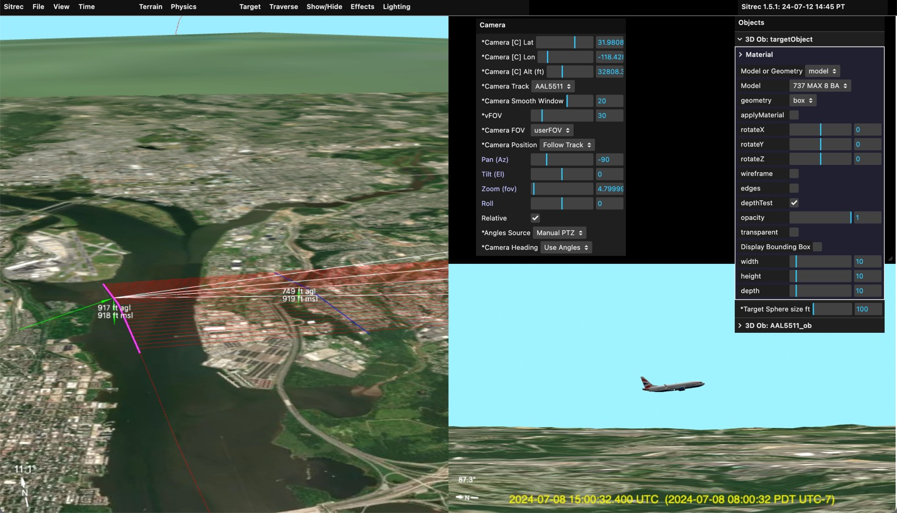

You might not see the plane in the main view, but if you zoom in it's there. 

### Camera Heading: To Target

The camera can also point towards a target. This can be fixed, or moving. A moving target would normally be another track (see later) but can also be set (in the Target menu) to "fixedTarget". You can then adjust the Latitude, Longitude and Altitude to a particular spot. This can be done by editing the numbers directly, or by holding down the "X" key while pointing at a spot on the ground. 

When moving the target (or, later, the camera) the altitude is kept constant. Press the Shift key in addition to "X" to drop the target to 7 ft above the ground. For example:
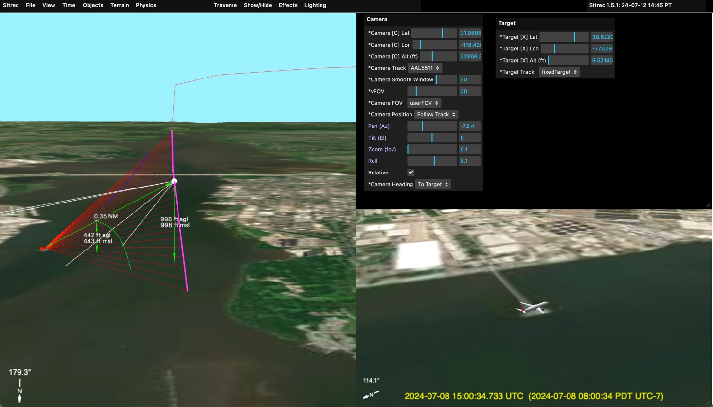
Here the target has been set to the end of the pier. The traverse object then appears between the pier and the camera. 

### Fixed camera

You can fix the camera to a particular point by selecting "Manual" from the "Position" dropdown (in the Camera menu's Location folder).  You can leave the target fixed to create a static scene, or you can change the target track to the plane's track.

Example:
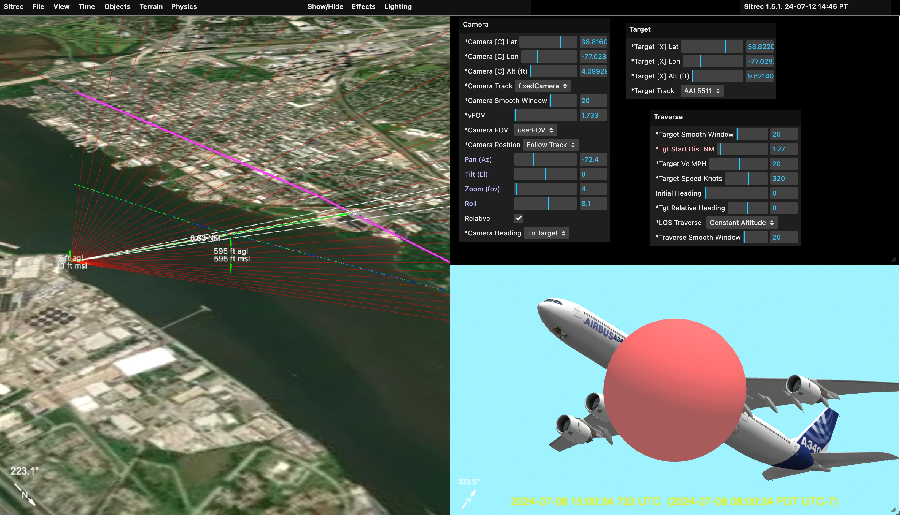

Here the camera is fixed on the ground, and the target track is set to the plane's track (AAL5511, the flight number). The traverse is set to "constant altitude" and the traverse object is set to a large red balloon. 

Note since the PTZ controls are disabled (greyed out), you can now adjust the FOV with the "VFOV (deg)" slider in the Camera menu's FOV (Zoom) folder. 

### Setting the camera or target location by name

You don't have to know coordinates. The **Camera** menu's **Location** folder (and, for the target, the **Target** menu) has three handy controls for positioning a fixed camera or target:

- **Lookup** — type a **place name** (e.g. "Phoenix, AZ"), `lat,lon` coordinates in any form (decimal degrees, degrees minutes seconds, hemisphere letters — see [Coordinate formats](GIS.md#coordinate-formats)), an MGRS grid reference, a `lat,lon,altitude` triple, or an ECEF `x,y,z` triple in metres, and Sitrec jumps there. The last two also set the altitude; everything else drops to ground level.
- **Geolocate from browser** — uses your device's location to set the current position.
- **Go To the above position** — moves the view to it.

### Placing things with a right-click

You can also place things straight onto the map. **Right-click the ground** in the main view or the look view to open the **Ground** menu. The top of it shows the location you clicked. Useful items to start with:

- **Set Camera Above** / **Set Camera on Ground** — move a fixed camera to that point, at its current altitude or at eye level on the ground.
- **Set Target Above** / **Set Target on Ground** — the same for a fixed target.
- **Add 3D Object** — put an object that stays in one place, for example a known landmark or a candidate object.
- **Create Track with Object**, **Create In->Out Obj Track** and **Create Track (No Object)** — draw a new track by hand, starting at that point.

The same menu also adds pins, balloons, buildings, clouds, ground overlays and grids. See [Adding Objects and Tracks](SceneObjects.md) for all of it.

## Two Simple Tracks

The basic configurations above really become more powerful when you have two tracks (or a complex track, see later). With two tracks typically one will be the camera, and one will be the target (a potential UAP). 

To get two tracks into Sitrec, you can just drag them in. You can drag in two at once, but the order is important, so it's better to do them one at a time. The first track will be the camera track and the second will be the target track.  For example:
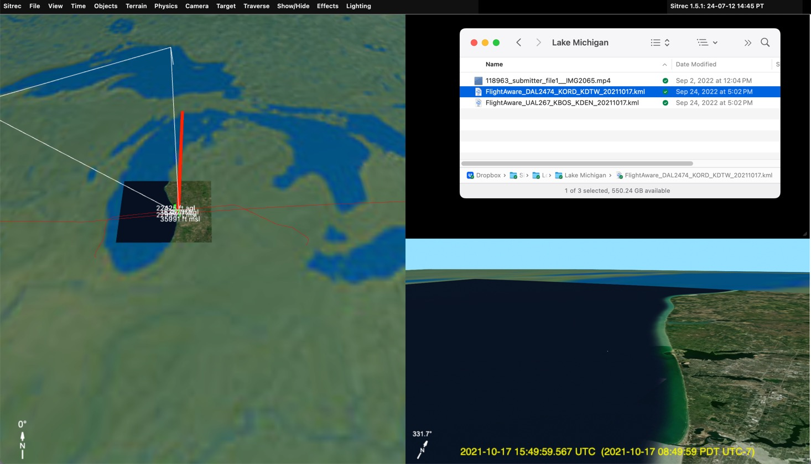
Here I dragged in two ADS-B tracks. Sitrec automatically calculates the closest point of approach, and uses that as the likely region of interest (you can change it if you want something else). Here the United flight is the one with the camera, looking down. The Delta flight, going in the opposite direction is the candidate UAP.

With the correct target set, we can add models, and zoom in. 
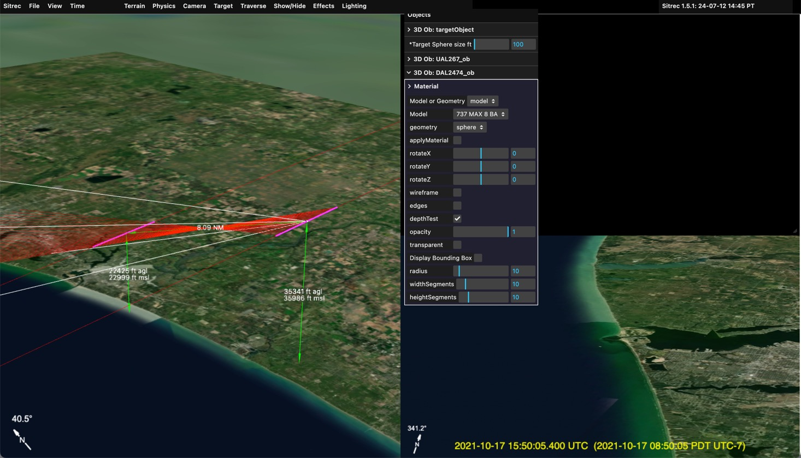

Here you can just barely see the 737 by the mouth of the estuary. At this range the 737 shows as a small shape with no visible wings. 

## Setting the date and time

Getting the time right is **crucial** — it determines where the Sun, Moon, stars, and satellites are, and how shadows fall. There are two key times, both shown at the top of the **Time** menu:

- **startTime** — the real-world time at frame 0 (the first frame of the video).
- **nowTime** — the time at the *current* frame: the start time plus the elapsed frame time.

The Year / Month / Day / Hour / Minute / Second sliders in the Time menu edit the **nowTime**; the large slider at the bottom of the screen (and the arrow keys) move you through the frames. A common workflow is to scrub (drag) to a frame with something distinctive on screen, then adjust the time until the simulation matches — Sitrec works out the start time for you. You'll do exactly this when syncing video, next.

## Adding and Syncing Video

This situation has a video file as well as the ADS-B tracks. To load it, just drag it in (or file/import)
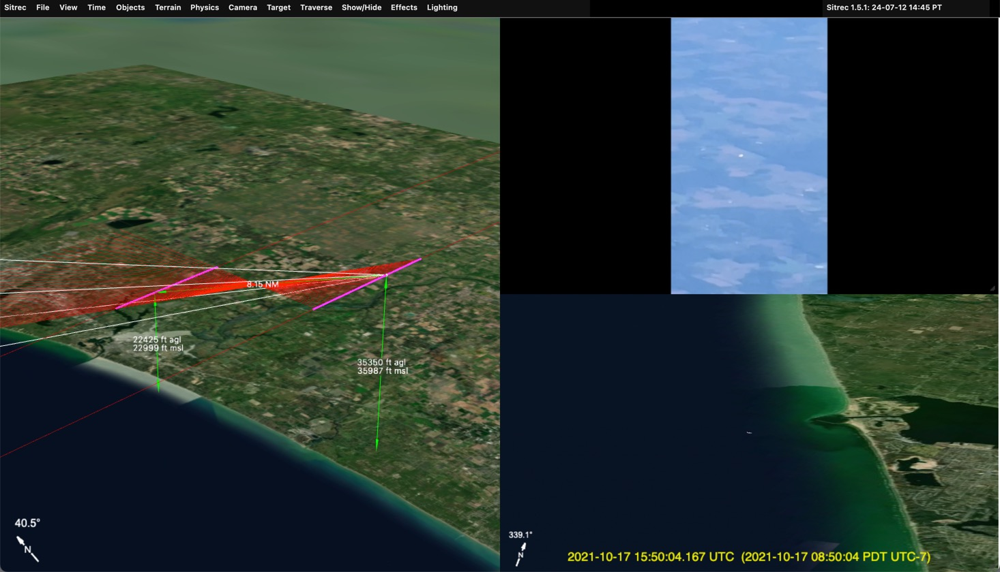
Note not all formats are supported. The best is to convert it to simple h264 .MP4 format with a constant frame rate. A dropped video file is read into memory in full (frames are decoded as you need them), so it is best to keep it small, 720p or 480p, and no longer than is needed. See [Loading and Adjusting Video](LoadingVideo.md) for the formats Sitrec can play.

**Check the frame rate and the length.** When a video loads, the sitch takes its length from it: in the **Time** menu, **Sitch Frames** becomes the number of frames in the video, and **Video FPS** becomes the frame rate Sitrec found in the file. Check that **Video FPS** is what you expect (for example 29.97 or 30). If the file states a wrong rate, for example footage that was slowed down or sped up, type the correct value in **Video FPS**. **Sitch Duration** shows the same length as a time. See [Time, Frames and Syncing](TimeAndSync.md#length-and-frame-rate) and [Changing the frame rate](LoadingVideo.md#changing-the-frame-rate).

Here we see the "UAP" is similar in the look view and in the video, but the background is wrong. This is because we are simply using the time of the closest point of approach as our start time. That's not the actual start time of the video.

Complex videos (later) often have exact time code embedded. Here were have a simple video and two simple tracks, so we have to set the time manually. A good starting point is the time in the video file, but these times are often wrong or inaccurate. 

To sync the time manually, use the main slider to advance the the video to a distinctive point that will show up in the look view. 
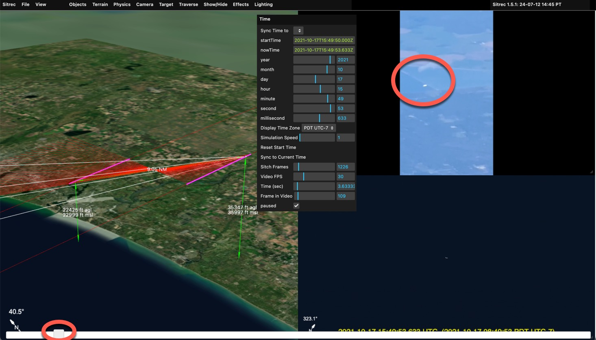
Here I moved it so the white object is over the boundary between to segments of a pond or reservoir. With that fixed, I now grab the "Seconds" or "Minutes" slider in the Time Menu and drag it until it matches. I also adjust the zoom, and fine tune the milliseconds
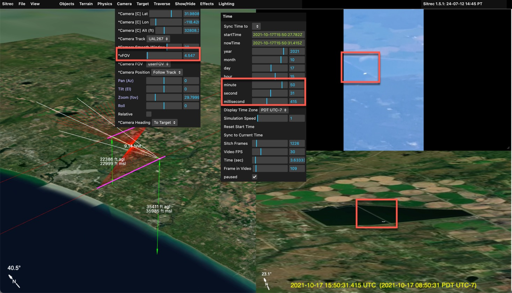

The target now lines up with the background. With the time now synced you can scrub back and forth with the main slider and observer that the target lines up with other distinctive parts of the background 

With that you can adjust the effects to more closely match atmospheric, optical, and sensor effects. 
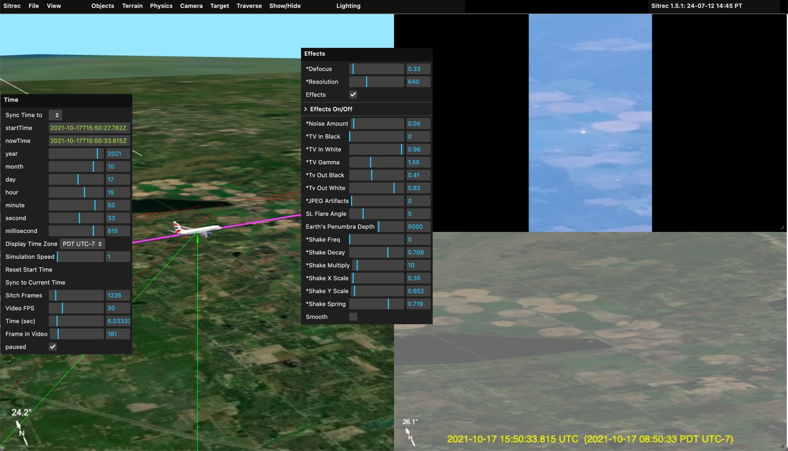

Here I bring in the Tv Out Black and White to simulate the haze. I also defocus slightly and reduced the resolution. 

For infrared or night-vision footage there are two dedicated sensor simulations in the effects menu: **Thermal** (white-hot/black-hot polarity, an Ironbow color palette, sensitivity, hot-spot bloom, and sensor noise) and **NightVision** (an image-intensifier look with phosphor green, gain, bloom, and a circular tube mask). Both live in the **Effects → Rendering Effects → Thermal/NV** folder — enable checkboxes and parameter sliders together.

NightVision also has an **NVG Sat Boost** slider (default 4). Real intensifier tubes show satellites the naked eye cannot, so while NightVision is enabled this multiplies satellite brightness in the look view — the same brightness the Sat Brightness slider controls. Set it to 1 for no boost.

Note in situation like this, the target is often darker than anticipated. To match the brightness of the video, use **Scene Exposure** in the **Lighting** menu, and **Look Exposure** and **Highlight Rolloff** in **Lighting → Look View Output**. See [Match the video's exposure](Lighting.md#match-the-videos-exposure).

You can also drag in an image (for example JPG, PNG, GIF, WebP, BMP or TIFF) and it will act like a video. The current number of frames will not be changed. 

## Complex Tracks and Video

Some platforms, like DJI or other drones, or commercial and military cameras, encode additional data besides the camera position. Typically, this will include the direction the camera is pointing, possible a track of the ground positions below the center cross-hairs, the field of view, and other things. 

The MISB format is commonly used in military and law enforcement applications, but is not widely used by the public. However, MISB has a very rich data definition, covering everything you are likely to have in other formats. So I use MISB as an internal data representation. ADS-B tracks are converted to a MISB table (a spreadsheet) with just the position data. The DJI drone data contains FOV and heading data which likewise is converted into the relevant fields in an internal MISB table. 

Native MISB is also supported from original .TS files, or extracted in either KLV or CSV formats. I don't have many examples to work with, so if you've got any you can share, I'd appreciate it. Mick@mickwest.com

### Using a single MISB-style complex track. 

In the scenario where we have a single complex track, a plane or a drone is filming an object. So we will have the position of the camera, and then the heading and elevation angles, as well as FOV. We might also have a center track, which gives the ground point under the crosshair directly. 

Complex video is the original video file. You can use the original .TS file, or use it split into a data file (.CSV or .KLV, or .BIN) and a video files (.MP4). Splitting is useful as you can recode the video to fit in the size limits (and play back facter) Just drag the .TS file, or the extracted files, into Sitrec. Example: 
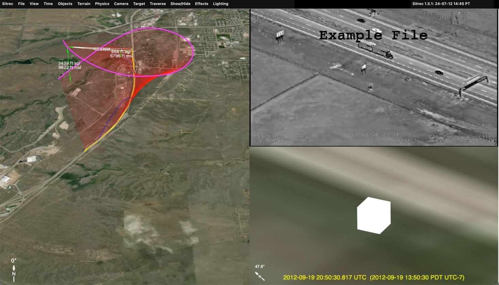

Here's what you see immediately after dragging in a MISB .TS file (or a .KLV and a .MP4). Since the MISB file contain time code information, it is automatically synced to the correct start time. The video file is used to set the length. This assumes the KLV and the Video start at the same time. If the video is just showing a portion of the MISB data, then they may have to manually adjust the start time. 

In this instance we see the road is correct, but a bit low resolution. We need to adjust the terrain

## Adjusting the terrain

"Terrain" in Sitrec is the background graphics — i.e. the ground. Sitrec displays detailed background similar to Google Earth, controlled by the **Terrain** menu:

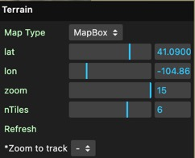

By default, terrain uses **dynamic subdivision** (the **Dynamic Subdivision** checkbox in **Terrain → Terrain Tweaks**): as you move and zoom the camera, Sitrec automatically loads higher-resolution tiles where you're looking, so you don't normally need to set a center point or zoom level by hand. The main control you'll use is **Map Type**, which selects the imagery source (satellite, street map, etc.).

For the MISB truck example the default terrain already covers the track; zooming in loads the detail automatically:

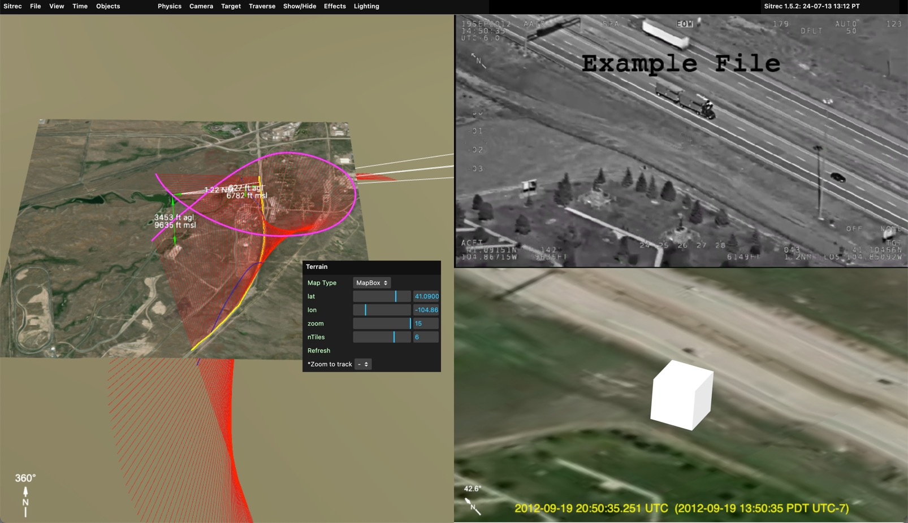

We see here the match between the video and the derived view. The center of both images is just below the road. We also see the shadow of the road sign in the upper left and the matching paths in the lower left. 

### MISB Traverse and Targets

This particular MISB file has a center track (meaning a track of the position of the ground behind the center crosshairs). Sitrec has taken this as the default target. Here's the setup immediately after dropping in the files:
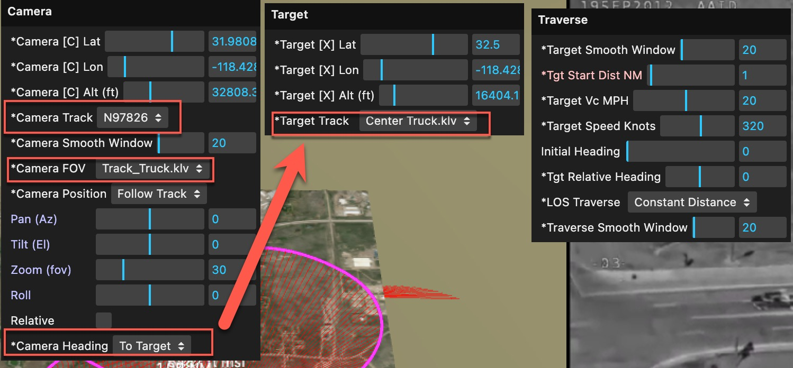

The Camera track (the position of the camera) is set to the main position track in the MISB file, i.e. the "platform" (aircraft) position.

The file also has FOV data, so this is automatically selected for "Camera FOV" - you can change this back to manual if you like

Since we have a target track, then the Camera Heading is set to "To Target".

The "Traverse" setup starts out as the default, "Target Object", with a start distance of 1 NM. Since we don't have a UAP in this case, and we know we are just following the truck, the traverse doesn't matter much here — the MISB center track is already used as the target (as noted above), so the traverse object simply drives along the road. 

However, if we _did_ have a suspected UAP in the frame, then we would select one of the various form of LOS traversal (ways of traversing the lines of sight). For example, constant altitude:

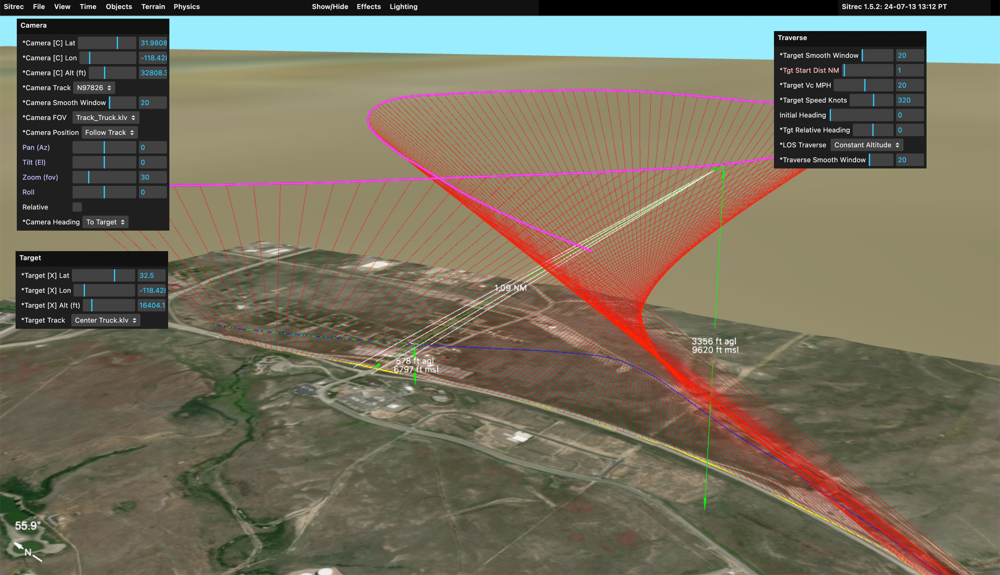

Here we still have a start distance of 1NM, and with the constraint that the altitude must remain constant, this creates the blue path seen here. We can then add a traverse model to see what it looks like (again, this is assuming your video has some unidentified object in it)
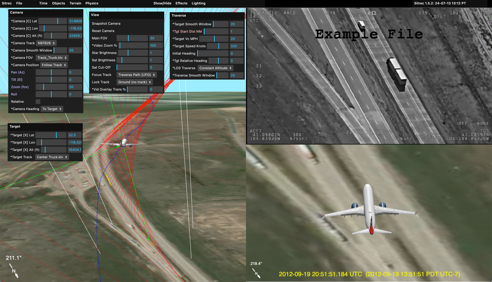

## Tracking an object and running the traverse analysis

When the object in your video is the unknown, the steps are:

1. **Line up the camera** with the video, as described above: position, heading, field of view and time.
2. **Mask the ground** if the object is over terrain, sea or cloud, so the tracking tools ignore those pixels: **Video → Masking**. See [Masking](Masking.md).
3. **Track the object**: **Video → Point Track**, then **Enable Point Track**, drag the yellow cursor onto the object, and **Start Point Track**. This gives the object's position in every frame. See [Point Tracking](PointTrack.md).
4. **Turn the track into lines of sight**: set **Traverse → LOS Source** to **Camera + Point Track**. Each frame now has a ray from the camera through the object.
5. **Test explanations**: **Traverse → Analyze Traverse Methods...** tries many assumptions against those rays and shows the results as a gallery, with a one-line verdict above it. See [Traverse Analysis and the Verdict](TraverseAnalysis.md).

[The Ideas Behind the Traverse Analysis](TraverseConcepts.md) explains what the results mean.

## Adding satellites

Many sitches involve satellites — Starlink flares are one satellite scenario Sitrec supports in detail. Satellites are loaded from published orbital data, not from a file you usually provide:

- In the **Satellites** menu, click **Load LEO Satellites For Date** to download the low-Earth-orbit satellites for the simulation's current date/time — use this for past events. **Load ACTIVE Satellites** loads current, real-time positions instead.
- You can also **drag in your own orbital data file** if you have specific data — either CCSDS OMM in CSV, or a legacy TLE file. A TLE file does not need exact columns: one written with single spaces between fields, or without the international designator, is read field by field.
- For a single satellite you can **paste a TLE straight into Sitrec** (Ctrl/Cmd+V outside a text field, or press `G` and paste into the box) — the two element lines, with or without a name line above them. It is loaded exactly as a dropped TLE file would be, and saved with the sitch the same way. Indentation, tabs, blank lines and squeezed-out spaces do not matter: the elements are read field by field and written back out as a properly formatted TLE. Either way, if none of the satellites you load would show with the current satellite filters, **Other Satellites** is turned on so they do.
- **Show Satellites (Global)** toggles satellite display on and off.

Because orbital predictions drift over time, always load the data for the date you're investigating. And if the event was only a day or two ago, note that the data for it is still being published and will be incomplete — see [Investigating Starlink Flares](Starlink.md#wait-a-few-days-before-analysing-a-very-recent-event) for the full Starlink-flare workflow.

## Save your sitch

Save often. **File → Server → Save** (or **Save As**) saves the sitch to the server, where you can reopen and share it; you need to be logged in. **File → Local → Save Local** saves it to a folder on your own computer instead. See [Saving and Loading Sitches](SavingAndLoading.md).

## A few more basics

- **Units.** **Physics → Units** switches the displays between **Nautical**, **Imperial/US**, **Metric** and **Feet only**. See [Units](UserInterface.md#units).
- **Measuring.** **Show → Measurements → Add Measurement** shows an altitude, or a distance between two things, in the 3D views. See [Measurements](UserInterface.md#measurements).
- **Your own models.** Drag a `.glb` or `.ply` model file into the sitch to add your own 3D model. See [Custom Models](CustomModels.md).
- **Camera setup.** Every camera and target option is described in [The Camera and Target Menus](CameraAndTarget.md).

## Where to go next

**Basics**

- [User Interface](UserInterface.md) — menus, sliders, views, 3D navigation, units and settings.
- [Saving and Loading](SavingAndLoading.md) — keeping and sharing your work.
- [URL Parameters](URLParameters.md) — opening Sitrec with a sitch, file, location or time already set.

**Building the scene**

- [The Camera and Target Menus](CameraAndTarget.md) and [Camera View Modes](satcam.md) — pointing the camera.
- [Adding Objects and Tracks](SceneObjects.md) — the ground right-click menu, buildings, clouds, overlays and grids.
- [Loading and Filtering Tracks](Tracks.md) — supported formats, filtering bad data, smoothing, and multi-track setups.
- [Custom Models](CustomModels.md) — built-in and imported 3D models.
- [Lighting](Lighting.md) — the Sun, exposure and atmosphere.

**Video and time**

- [Loading and Adjusting Video](LoadingVideo.md) — formats, frame rate, and the video view tools.
- [Time, Frames and Syncing](TimeAndSync.md) — the Time menu, In and Out frames, and syncing.
- [Motion Analysis](MotionAnalysis.md) — measuring how the picture moves, stabilizing, and ground tracks.
- [Rendering and Exporting Video](Video.md) — getting your recreation out as a video file.

**Analysis**

- [Point Tracking](PointTrack.md) and [Masking](Masking.md) — following the object through the video.
- [Traverse Methods](TraverseMethods.md), [The Ideas Behind the Traverse Analysis](TraverseConcepts.md) and [Traverse Analysis and the Verdict](TraverseAnalysis.md) — reconstructing and testing a target's path.

**Sky**

- [Satellites](Satellites.md) — loading and showing satellites.
- [Investigating Starlink Flares](Starlink.md) — a satellite scenario that has its own guide.
- [Star Tracker](StarTracker.md) — using the stars.
