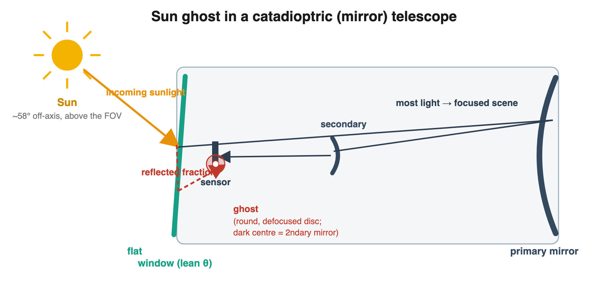
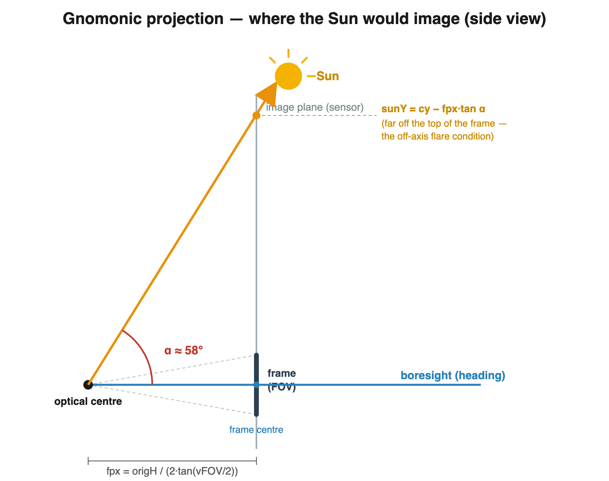
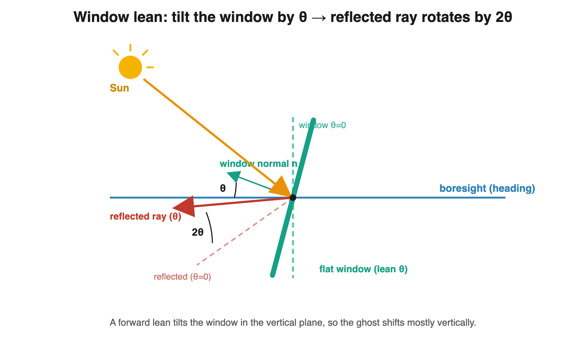
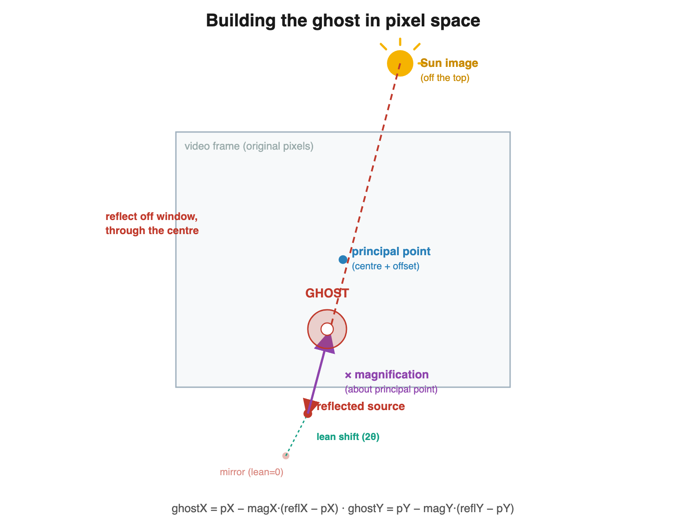
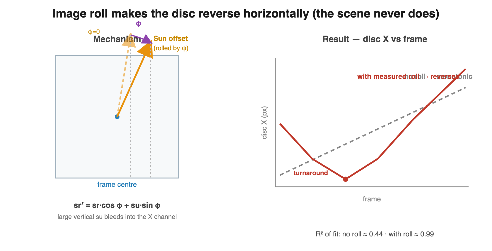

# Lens Ghost — Simulating a Sun Reflection in a Mirror Telescope

> **[BETA] — admin only.** The Lens Ghost overlay and the companion "MQ-9 Light Path"
> 3D view are experimental and currently created only for admin users. In the live UI
> both carry a "[BETA]" prefix: the overlay folder is **Video → [BETA] Lens Ghost**, and
> the 3D view is **[BETA] MQ-9 Light Path** in the Views menu.

## What this is

The **Lens Ghost** tool (`CNodeLensGhost`) draws a *simulated* sun reflection — a
"ghost" disc — as an overlay on a video, and fits it to a tracked disc in the
footage. It was built to test whether the bright "disc" in the Pr055 / Corbell
MQ-9 MTS thermal video (the "huge disc hiding in the clouds") is an **internal
reflection of the Sun** rather than a physical object.

The short answer it produces: the disc's motion — sweeping left-then-right while
drifting steadily down — is reproduced by a sun-ghost model to high accuracy, and
that motion is **decoupled from the scene** (it reverses while the clouds only ever
translate one way), which a real object at cloud distance cannot do.

This document explains *exactly* how the ghost position is computed.

---

## 1. The optical setup

The MTS turret (e.g. AN/DAS-1 / MTS-B class) on an MQ-9 is a **catadioptric**
(mirror, Cassegrain-type) telescope with a long focal length and a narrow field of
view, sitting behind a **flat protective window**. In a thermal (MWIR) system that
window is **germanium**, not glass, with a high refractive index (~4.0) and a
correspondingly high surface reflectance — an efficient ghost generator. The Sun is
by far the brightest thing in the MWIR band, so even a faint internal reflection
shows up as an obvious bright disc.



Two consequences matter:

- The ghost is a **defocused disc** — the reflected cone refocuses at the wrong
  plane, so it's an out-of-focus image of the circular aperture. Because the window
  is **flat**, the disc stays **round** (a curved refractor would smear it into a
  teardrop). A central dark spot can appear from the secondary-mirror obstruction
  (a "donut").
- The ghost's position on the sensor is set by the **Sun direction relative to the
  camera**, not by the scene. As the turret slews, the ghost tracks the Sun — so it
  can move *against* the background.

---

## 2. Coordinate conventions

Everything is computed in **original-video pixels**, with the principal point at the
frame centre, matching `CNodeTrackingOverlay`'s pixel↔angle convention (including the
`fovCoverage` letterbox correction) so the ghost and the disc track share one scale.

```
   (0,0) ┌───────────────────────────┐
         │                           │      x → right   (increasing)
         │            • (cx,cy)      │      y → down    (increasing)
         │         frame centre      │      cx = origW/2,  cy = origH/2
         │                           │
         └───────────────────────────┘ (origW, origH)
```

The camera basis per frame comes from the line-of-sight node
(`JetLOSCameraCenter.getValueFrame(f)`):

```
   heading  — the boresight (optical axis), points where the camera looks
   right    — image +x axis  (already includes the camera's roll)
   up       — image +y axis  (already includes the camera's roll)
```

The focal length in pixels:

```
   fpx = origH / ( 2 · tan(vFOV_adjusted / 2) )
   vFOV_adjusted = 2 · atan( tan(vFOV/2) / fovCoverage )
```

---

## 3. Where the Sun *would* image (the gnomonic projection)

Let **s** be the unit vector toward the Sun (ECEF, from `getCelestialDirection`).
Decompose it in the camera basis:

```
   sf = s · heading     (component along the boresight; sf > 0 means in front)
   sr = s · right       (horizontal component)
   su = s · up          (vertical component)
```

The Sun's *direct* image (where it would appear if it were in frame) is the standard
pinhole/gnomonic projection:

```
   sunX = cx + fpx · (sr / sf)
   sunY = cy − fpx · (su / sf)      ( − because image y is down, world up is +su )
```



For the Pr055 case the Sun is ~58° off-axis and **above** the frame, so `sunY` is far
off the top — it is not in the picture. This is the classic "bright source just out of
frame" flare condition.

---

## 4. The flat-window reflection (with adjustable lean)

The ghost is formed by reflecting the Sun off the **flat front window**. The window
normal **n** is the boresight tilted forward by the **Window Lean** angle (θ, 0–30°)
about the camera's *right* axis. In camera-basis components:

```
   n = (0, sin θ, cos θ)        in (right, up, heading)
```



Reflect the Sun direction across the window plane (mirror through the plane whose
normal is **n**):

```
   r = s − 2 (s · n) n
```

and project **r** the same way to get the **reflected source image**:

```
   reflX = cx + fpx · (r·right / r·heading)
   reflY = cy − fpx · (r·up    / r·heading)
```

- At **θ = 0** (window perpendicular to the boresight) this is simply the **mirror of
  the Sun image through the frame centre**.
- A tilted flat mirror obeys the **2θ rule**: tilting the window by θ rotates the
  reflected ray by **2θ**, so increasing the lean shifts the reflected image — and
  hence the ghost — mostly **vertically** (because the lean is in the vertical plane).
  This is the physical origin of the disc's vertical offset; before the lean was
  modeled, that offset had to be faked with an enormous principal-point offset.

```
   reflected-image Y vs lean (Pr055, frame 180, illustrative):
      lean  0° →  reflY ≈ 5232      (far below)
      lean 10° →  reflY ≈ 2834
      lean 20° →  reflY ≈ 1482
      lean 30° →  reflY ≈  407      (near centre)
```

---

## 5. The ghost: magnify the reflection about the principal point

The curved telescope mirror(s) give the reflection optical power (a magnification),
and the principal point may be offset from the frame centre:

```
   pX = cx + centerOffsetX        (principal point)
   pY = cy + centerOffsetY

   ghostX = pX − magX · (reflX − pX)
   ghostY = pY − magY · (reflY − pY)
```



`magX` and `magY` are **anisotropic** — they can differ because a tilting flat window
introduces direction-dependent (keystone-like) stretching. With the reflection now
modeled explicitly (Section 4), the fitted magnifications come out **positive and
small** (the real curved-mirror power), instead of the unphysical `magX ≈ −1` the
earlier "mirror-through-centre only" model required.

A defocused disc of diameter `diameter` (px) is drawn at `(ghostX, ghostY)`, with an
optional central obstruction (`obstruction`, the secondary-mirror donut) and a soft
edge (`softness`).

---

## 6. Image roll — why the disc *reverses* horizontally

This is the subtle part. As the turret slews, the boresight sweeps **monotonically**
past the Sun — the background (clouds) only ever translate one way. Yet the disc
sweeps left, **stops, and comes back**. Where does the reversal come from?

The camera's **image roll** φ (rotation about the boresight, measured from the
video's optical flow — `cameraMotionTrack.imageRot`) rotates the basis, which rotates
the Sun's large *off-axis* offset between the horizontal and vertical axes:

```
   sr' =  sr·cos φ + su·sin φ
   su' =  su·cos φ − sr·sin φ
```

Because the Sun sits ~58° **above** the boresight, `su` is large. As φ changes by
~14° over the clip, that large vertical offset bleeds into the horizontal channel and
**back again** — producing a horizontal reversal even though the boresight never
reverses.



The amount applied is `rollScale × imageRot`. If the recreation's camera already
carries the measured roll (via the **Camera Motion (Background) → Recovered roll**
option) the LOS basis includes it and `rollScale` can stay 0; otherwise `rollScale`
supplies it from the motion track.

---

## 7. Putting it together: the two-axis decomposition

The Pr055 disc motion decomposes cleanly into two independent mechanisms:

```
   ┌─────────────┬──────────────────────────────┬───────────────────────────┐
   │ Axis        │ Driver                        │ Behaviour / fit           │
   ├─────────────┼──────────────────────────────┼───────────────────────────┤
   │ Y (down)    │ slew/tilt geometry + window   │ monotonic descent,        │
   │             │ lean — no roll needed         │ R² ≈ 0.998                │
   ├─────────────┼──────────────────────────────┼───────────────────────────┤
   │ X (sweep)   │ image roll rotating the large │ left→right reversal,      │
   │             │ vertical Sun offset           │ R² ≈ 0.99 (with real roll)│
   └─────────────┴──────────────────────────────┴───────────────────────────┘
```

The Y fit is the strongest single piece of corroboration: it needs **no fitted Y
roll term** — the downward drift falls straight out of the sun-vs-camera geometry. A
real descending object's vertical motion would be independent of its horizontal
sweep; here the two are locked projections of one rigid sun-relative geometry.

---

## 8. Fitting to a tracked disc

`Fit to Disc Track` does a least-squares fit of the model to a manual/auto disc
track. The track source is, in priority order:

1. the **Auto Tracker** (`CObjectTracking`, the "Camera + Point Track" cursor) —
   gives both X and Y;
2. a manual **`CNodeTrackingOverlay`** track.

Because the ghost is **linear** in the reflected source image position `(reflX,reflY)`
for a fixed lean and roll, the fit is cheap:

```
   for each candidate rollScale k:
       compute reflX, reflY per frame  (apply roll k·imageRot, then reflect off the window)
       linear-fit  trackX = A + B·reflX   →  magX = −B,  pX = A/(1−B)
       linear-fit  trackY = A'+ B'·reflY  →  magY = −B', pY = A'/(1−B')
   keep the k with the lowest combined RMSE
```

`Window Lean` is a **manual** parameter (set it, then fit). An axis whose track has no
variance (e.g. an X-only track) is skipped and left unchanged. The fit reports R²,
RMSE, frame range, and which axes were fitted, and flags:

- **rollScale hit the scan edge** (no real roll signal to fit);
- **magX ≈ −1 degeneracy** (principal point indeterminate — see below).

A separate on-video HUD warning (not part of the fit report) flags **stabilized video**
(camera roll ≈ 0 → the reversal can't be reproduced).

---

## 9. Parameters

```
   Source           celestial body (Sun / Moon)                 — MEASURED direction
   Window Lean°     0–30°, forward tilt of the flat window       — physical / set by hand
   Roll Coupling    rollScale × imageRot applied to the basis    — FITTED (or 0 if LOS rolls)
   Magnification X  horizontal magnification (curved mirror)     — FITTED
   Magnification Y  vertical magnification (anisotropy)          — FITTED
   Centre Offset X  principal-point offset, px                   — FITTED (n/a near magX=−1)
   Centre Offset Y  principal-point offset, px                   — FITTED
   Disc Diameter    defocus disc size, px                        — ASSUMED (cosmetic)
   Obstruction      central donut ratio (secondary mirror)       — ASSUMED (cosmetic)
   Edge Softness    disc edge softness                           — cosmetic
   Opacity, Colour  appearance                                   — cosmetic
```

The overlay also shows an on-video **HUD** (Sun az/el + off-axis angle, roll
provenance, fit R²/RMSE, warnings), a **reflection line** (source → optical centre →
ghost), an off-frame **Sun arrow**, and a **"PREDICTED sun ghost"** label so the
modelled disc is never mistaken for the tracked object.

---

## 10. The MQ-9 light-path 3D view

A companion bespoke 3D view ("[BETA] MQ-9 Light Path", in the Views menu — see
`BespokeView.js`) shows a close-up of the MQ-9 with the **boresight** (where the MTS
looks) and the **incoming sun ray** drawn from the turret, so the ~58° angle between
them — the off-axis flare condition — is visible in 3D and animates over the clip.

---

## 11. Limitations & open questions

- **Stabilized footage has no roll.** If the loaded video was stabilized (camera
  motion removed), `imageRot ≈ 0` and the horizontal reversal cannot be reproduced
  from that clip — fit the **raw** clip instead. The tool detects and warns about this.
- **The ~2× roll-scale factor.** Empirically the disc needs ≈0.5× the measured
  cumulative `imageRot`. Because the fit reaches R² ≈ 0.99 with a single scalar, this
  is almost certainly a *linear bookkeeping* factor (an over-accumulated rotation or a
  sign/convention double-count), **not** a large-angle nonlinearity. It is left as a
  fitted, on-screen-labelled parameter pending a definitive measurement.
- **magX ≈ −1 degeneracy.** With the older mirror-only model the principal-point
  offset blew up near `magX = −1`; modeling the window reflection explicitly removes
  the need for that regime, but the guard/label remains.
- **Off-axis validity.** The linear-in-reflected-position model is *consistent with*
  the data; with X-and-Y track data it is well constrained, but a full validation
  would also predict the disc **diameter** vs field angle, which the current model
  treats as a free constant.
