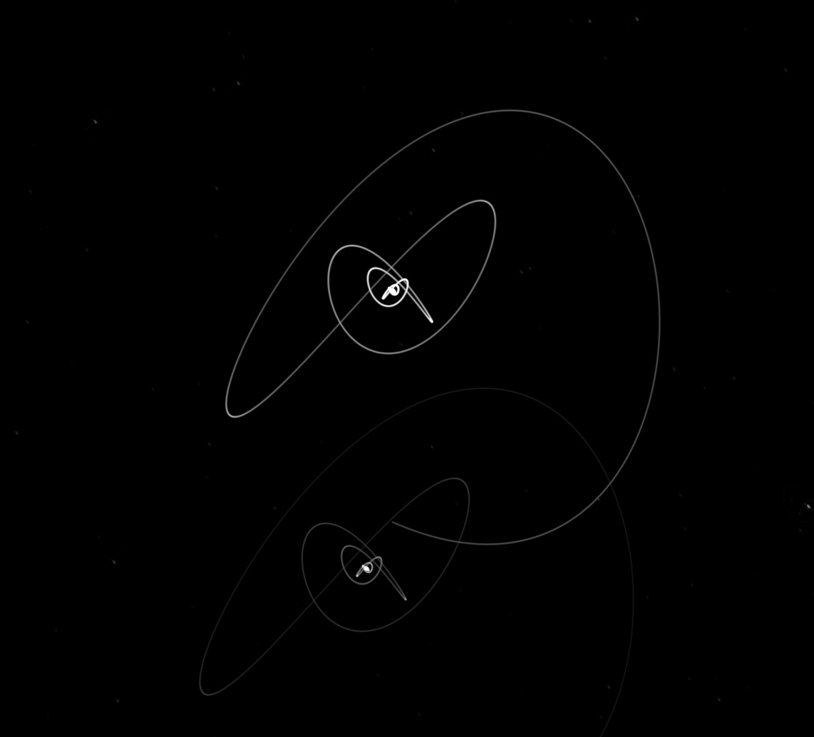
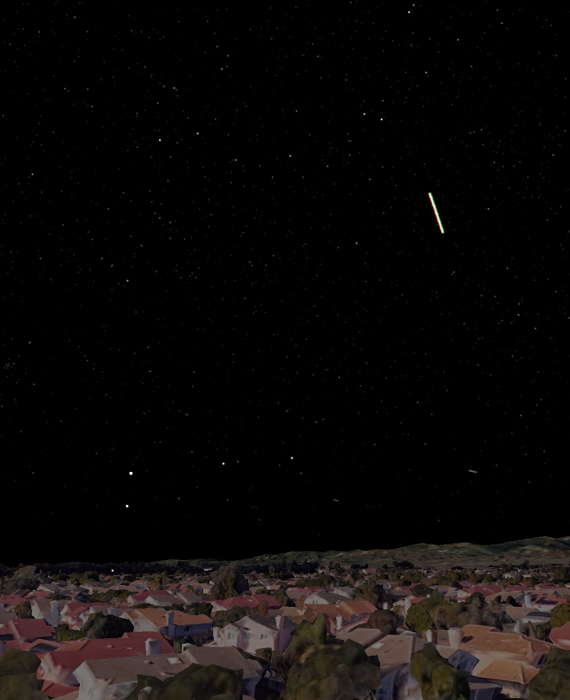
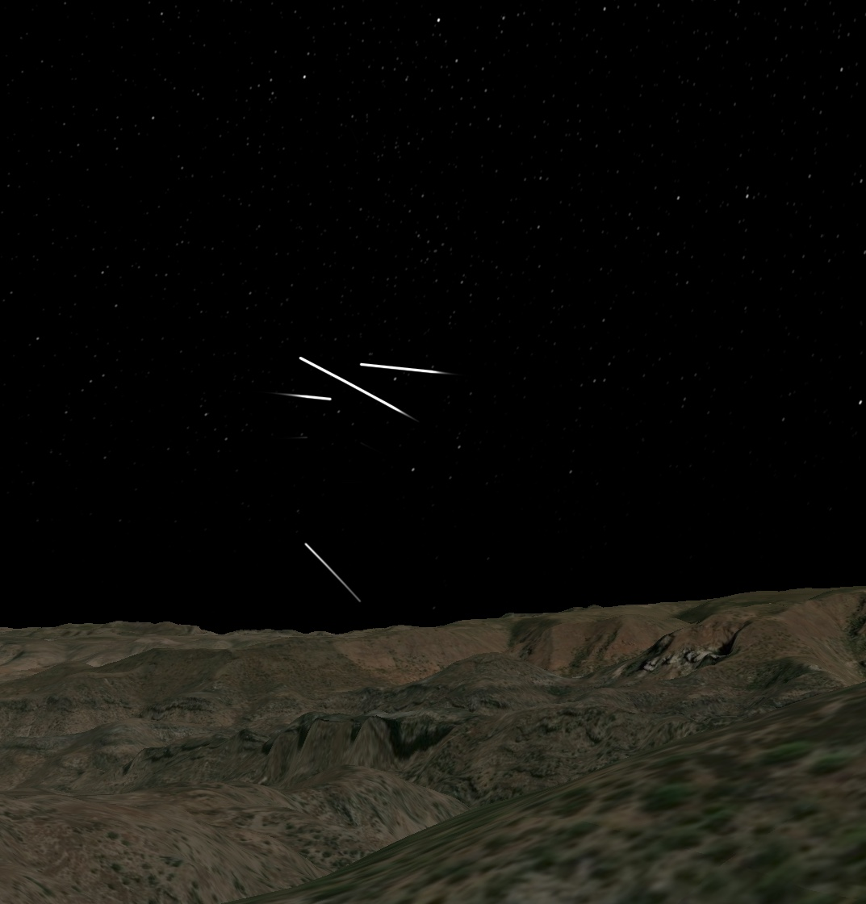

# Long Exposure Simulation

Sitrec can simulate a **long-exposure photograph** taken with the look camera: the scene
is sampled across the exposure and averaged into a single still image, as if the camera's
shutter had been open for that long in real time. Anything that moves — aircraft,
satellites, stars, or the camera itself — leaves a trail, with physically correct brightness.

You'll find it under **Video → Long Exposure**.

## Quick start

1. Set **Duration (Minutes)** (default 5). The exposure runs from the **start of the
   sitch** for that long — extending past the sitch's own end if necessary.
2. Open **Video → Long Exposure** and click **Render Long Exposure**.
3. While it renders, a preview of the developing exposure is shown, updated every 30 frames.
   The progress widget's **Enough** button stops early and keeps a correctly-exposed
   shorter exposure.
4. The result opens in a window with an **Exposure (EV)** slider and **Save PNG**.

The EV slider re-tone-maps the kept high-dynamic-range result live — push it up to reveal
faint trails and stars, down to isolate only the brightest sources, without re-rendering.
Bright values roll off through a soft photographic shoulder rather than clipping hard.

## Why "HDR Point Sources" matters

A simple average of the rendered frames is *not* what a real camera records. Sitrec's live
view draws stars, planets, and aircraft lights as small **fuzzy discs bright enough to see**
— a display convention. Venus's real brightness is more like **2300× pixel saturation**: in a
real exposure it stays a blinding point no matter how you average, and when it trails, the
trail stays bright. If you just average the display's fuzzy discs, a moving Venus smears
into a barely-visible blob and faint stars vanish entirely.

With **HDR Point Sources** enabled (the default), the fuzzy display discs are hidden during
the exposure and each source is instead drawn with its **true linear flux**, computed from
its astronomical magnitude:

- **Stars** — the full catalog (not just the stars bright enough to display), with
  atmospheric extinction dimming them toward the horizon (and optionally reddening
  them too — see *Horizon Reddening*). Extinction scales with the camera's altitude —
  an airborne observer sits above most of the air — and the horizon dips
  correspondingly below 0°.
- **Planets** — at their refracted apparent positions. They are rendered white: the colored
  display sprites (green Venus, etc.) are identification aids, not photometry.
- **The Moon** — stays as the rendered textured disk, scaled so its total light matches its
  actual phase-dependent magnitude. In any exposure long enough to show stars, the Moon
  burns out — just like a real photo.
- **Aircraft / model lights** — navigation, beacon, strobe, and landing lights on 3D models,
  with realistic candela, inverse-square falloff and distance haze. **Strobes leave dashed
  trails** (the dash spacing is the strobe period), and colored lights trail in
  their own color — red/green wingtips make aircraft trails instantly recognizable.
- **Satellites** — only the ones that are actually **flaring** (sun-glint within the flare
  cone), plus the **ISS when sunlit**. Everything else is omitted, as in a real photograph.
  A flare streak brightens smoothly from nothing, holds full brightness through the heart
  of the flare, and fades back to nothing.

All sources are positioned **continuously between frames** (not just at frame instants), so
trails are smooth curves even during fast camera motion.

### Calibration controls

| Control | Meaning |
|---|---|
| **Duration (Minutes)** | The exposure (shutter) time in minutes of sitch time, from the start of the sitch. If longer than the sitch itself, the timeline is extended for the render. |
| **Lock Camera Heading** | On by default: the camera holds the heading it has *right now* for the whole exposure — a tripod doesn't track. Works in any camera mode (To Target, Celestial Lock, Horizon Flare Region…), behaving as if Use Angles were locked on the current spot in the sky. The Camera Nudge still applies on top. Turn off to let the active camera mode steer during the exposure. |
| **HDR Background** | On by default: in a dark scene the lighting (Sun + Ambient) is temporarily boosted so the background renders using the full 8-bit range, then scaled back down in the HDR buffer. Pushing the EV slider up then reveals smooth ground detail instead of quantized color bands. Calibrated on the first frame; the lighting is restored after the render (including Enough/cancel). |
| **Horizon Reddening** | Chromatic extinction (off by default): sources near the horizon redden as well as dim. In real star-trail photos the effect is largely masked by blue star colors and sky glow, so the default is dimming only. |
| **Star Tint** | Intrinsic blue-white color of star trails (0 = flat white, 1 = bright-star population average). With Horizon Reddening on, extinction neutralizes the blue before warming, as in real star-trail photos. |
| **Saturation Magnitude** | The star magnitude whose light just saturates one pixel in a single frame — the "ISO" of the simulated camera. Default 4: Venus (−4.4) is then ~2300× saturation. Lower = a less sensitive camera. |
| **Light Brightness** | Multiplier on model-light brightness. 1 = realistic candela (~100 cd navigation light ≈ magnitude 0 at 15 km). |
| **Moon Gain** | Multiplier on the magnitude-calibrated Moon disk (1 = physical). |
| **Point Spread (px)** | The Gaussian point-spread width of splatted sources, in pixels. |
| **Wait For Loading** | Settle terrain/3D-tiles each frame before capture (slower, but stable terrain). |
| **Frame Step** | Sample every Nth frame of the range (default 30, ~30× faster). Exposure brightness is unaffected, and point-source trails (stars, lights, satellite flares — including strobe dashes) are integrated continuously between samples so they stay smooth and photometrically exact. Only background/scene motion becomes stepped. Set to 1 for a full-quality render. |
| **Refraction** | The same setting as View → Atmospheric Refraction. When on, splatted sources use refracted apparent positions, and horizon culling and extinction follow the refracted direction. |
| **Occlusion Mask** | Hide splatted sources behind terrain and other opaque foreground (a planet setting behind a hill stays hidden). Exact under camera rotation, and recalculated automatically whenever the camera position moves. |

## Camera Nudge

**Video → Long Exposure → Camera Nudge** jolts the look camera at a chosen time: it bounces
around and settles, like a tripod that's been bumped — and every light in the frame writes
that bounce into the exposure as a decaying zigzag trail.

- **Nudge Time (s)** — when the bump happens (sitch time).
- **Magnitude (°)** — peak deflection of the first swing.
- **Frequency (Hz)** — how fast it oscillates (the "elasticity" of the mount).
- **Damping** — how quickly it settles: low values ring for a long time.
- **Direction (°)** — rotates the bounce pattern.

While the Camera Nudge folder is open (and the nudge enabled), the full bounce trajectory is
drawn live on the look view: a cyan path fading as it settles, a yellow dot at the impulse
start, and a green dot showing where the camera offset is at the current frame. The nudge
also works during normal playback, so you can scrub through the bounce.

The nudge is deterministic — the same parameters always produce exactly the same bounce, so
renders are repeatable.

## Examples

### Stars and planets, with a camera nudge

A 5.5° telephoto view of Venus (large trail) and a second planet. The camera was nudged 2°
one second into the exposure: every point source traces the same decaying bounce, ending at
a bright settled point. Note how the trail dims where the camera was moving fastest —
brightness is dwell-time-correct photometry.

### Aircraft at night

Live ADS-B aircraft with 3D models. The nearby aircraft's lights saturate and trail; strobes
leave dashes; red/green navigation lights trail in color. Distant aircraft fade with
inverse-square falloff and atmospheric extinction, just as a camera would record them.

### Starlink flares

A Starlink Horizon Flares scenario: only the satellites that actually flare during the
exposure appear, each leaving a streak that swells from nothing to full brightness and fades
out again as the sun-glint sweeps past the observer. Constellation lines and the equatorial
grid are automatically excluded from exposures — chart overlays aren't light.

## Nuances and limitations

- **Exposures are real time.** Duration is sitch (wall-clock) time; playback speed is
  ignored. The exposure starts at the first frame of the sitch; if it is longer than the
  sitch, the timeline is temporarily extended (the world keeps evolving — sky rotation,
  satellites, tracks hold their last position) and restored after the render.
- The result is the **time-average** of the scene — the same brightness convention as a
  single frame. A static scene looks identical to one frame; trails dim in proportion to
  how fast they move (dwell time). Use the EV slider to "push" the exposure.
- Anything that saturates in the **base render** (bright clouds, city glow, terrain) is
  clipped at single-frame white — only catalogued point sources, model lights, satellites
  and the Moon carry true HDR values.
- **HDR Background** boosts only what the scene lights illuminate. Content that doesn't
  respond to lighting (the atmosphere's sky glow) is recorded proportionally darker —
  negligible at night, which is the only time the boost engages (in a bright scene it
  calibrates to 1× and changes nothing).
- **Occlusion** uses a screen-space mask of opaque foreground (on by default): anything
  the look view renders as solid — terrain, buildings, models — blocks splatted sources
  behind it. The mask is sampled once per camera position (recomputed if the camera
  moves), so objects that move *during* the exposure occlude at their sampled positions
  only, and an aircraft's body still doesn't hide its own far-side lights.
- Non-flaring satellites are omitted entirely (they are far below the visibility of the
  star field in a real exposure of this kind).
- Long Exposure and Camera Nudge settings are saved with custom sitches.
