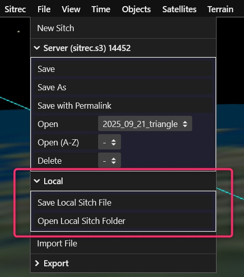
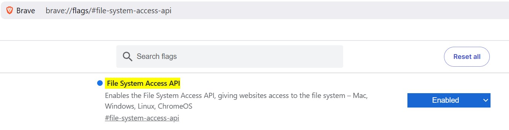

# Saving and Loading Sitches

This guide explains all save/load workflows in Sitrec:

- **Server/S3 save**: versioned saves you can reopen/share.
- **Local folder save**: fast local workflow without a file server.

Use whichever matches your workflow. You can also move between them.

## Saving to the Server (Versioned)

Server save is best when you want version history and easy sharing.

### What the Server menu does

In **File -> Server (...)**, you will see:

- **Save**: save a new version of the current sitch.
- **Save As**: save under a new sitch name.
- **Open**: open the sitch browser to load your saved sitches (and featured sitches).
- **Versions**: load any saved version of the currently loaded sitch.

If you are not logged in, server saving is disabled until login.

### How versions work

- Each **Save** creates a timestamped version in that sitch's server folder.
- **Save** does not delete old versions.
- The **Versions** dropdown shows timestamps; newest is marked **(latest)**.
- Loading a sitch from **Open** loads its latest version by default.
- If content is unchanged, Sitrec can skip creating a duplicate new version.

### Save vs Save As

- **Save** keeps the current sitch name and appends a new version.
- **Save As** prompts for a new sitch name, creating a separate sitch history.

### Asset handling on server save

When needed, Sitrec rehosts dynamic/imported assets before saving so the sitch references stable server objects instead of temporary local drops.

### Satellite data in a saved sitch

Satellite data is stored with the sitch, so reopening it always shows exactly the
satellites you saw, even years later.

One case needs a little care. Orbital data is published a while after it applies, so a
set loaded within a day or two of the date it covers is only partly filled in — see
[Investigating Starlink Flares](Starlink.md#wait-a-few-days-before-analysing-a-very-recent-event).
A sitch saved that soon after an event therefore stores an incomplete set.

When you reopen a sitch **you** saved, Sitrec notices this and offers to fetch the rest.
Choosing to refresh **adds** the missing satellites to what is already loaded rather than
replacing anything, so if you had combined several sets yourself, all of them are kept.

The refreshed data is only loaded, not stored, until you save: you can check the result
first, and save later from the File menu if you prefer. The original stored data is never
altered or deleted, so earlier versions of the sitch keep opening exactly as they always
did.

## Saving to a Local Folder

Local save is best when you want fast offline-like iteration and no server dependency.

### Browser support

Local folder access uses the browser File System Access API. Not all browsers support it:

| Browser | Local Folder Access |
|---------|-----|
| Chrome  | Yes |
| Opera   | Yes |
| Edge    | Yes |
| Safari  | No  |
| Firefox | No  |
| Brave   | No by default (see below) |

If unsupported, Sitrec shows a message asking you to use Chrome or Edge.

**Brave Browser:** local filesystem access is disabled by default but can be enabled by visiting `brave://flags/#file-system-access-api` and enabling the File System Access API. Full details [can be found here](https://github.com/brave/brave-browser/issues/29411#issuecomment-1534565893).

### First-time setup

1. Open **File -> Local -> Select Local Sitch Folder**.
2. Pick a working folder (prefer a dedicated project subfolder).
3. Use **Open Local Sitch**, **Save Local**, or **Save Local As...**.

`Save Local`, `Save Local As...`, and `Open Local Sitch` appear after a working folder is selected.

### Local menu actions

- **Select Local Sitch Folder**: select/change your working folder. Does not auto-load a sitch.
- **Open Local Sitch**: pick a `.json`/`.js` sitch from the working folder.
- **Save Local**: save to current local target.
- **Save Local As...**: save with a new filename in the working folder.
- **Reconnect Folder**: re-grant permission if the browser has remembered the folder but access is no longer granted.

### Important `Save Local` behavior

- After **New Sitch** or after loading from server/S3, `Save Local` behaves like `Save Local As...` first.
- This prevents accidentally overwriting your last local sitch file.

### What gets copied into the local folder

For portable local sitches, Sitrec copies **dynamic/imported** assets that have in-memory source data (for example dropped files).

Path behavior is:

- If an asset already points to a valid relative path in the working folder, Sitrec keeps/reuses that path.
- Otherwise, Sitrec chooses a default path under `local/...`, typically:
  - `local/media`
  - `local/tracks`
  - `local/models`
  - `local/assets`

So those `local/...` folders are defaults for newly copied assets, not a guaranteed location for every local reference.

If the exact same file content already exists at the chosen path, Sitrec reuses it.
If a same-name file exists with different bytes, Sitrec keeps both (adds suffixes like `-2`, `-3`).

## Keyboard Shortcuts

`Cmd/Ctrl+S` repeats the last successful save intent when possible:

- last action local -> local save
- last action local-as -> local save as
- last action server -> server save

If there is no prior save action, server save is used when available; otherwise local save is used.

`Cmd/Ctrl+O` opens the server sitch browser.

## Choosing Between Server and Local

- Use **Server/S3** when you want version history, sharing, and cloud-backed access.
- Use **Local folder** when you want maximum load/save speed and no backend dependency.
- You can switch workflows anytime:
  - server -> local: load from server, then `Save Local`/`Save Local As...`
  - local -> server: open local sitch, then server `Save`/`Save As`

## Status and Error Feedback (Local)

The Local menu has a persistent **Status** row showing:

- local state (Ready / Needs reconnect / No folder)
- current folder name
- current save target file (if armed)

If local save fails, Sitrec shows a user-visible error dialog with error type/code/message and recovery guidance.
For example, `NotFoundError` usually means the selected folder/file was moved, deleted, or is no longer accessible.

## Caveats

- Server save/load options may be hidden in builds where server saving is disabled.
- Server save generally requires login for your own saved sitches.
- Local folder permissions are browser-controlled and can be revoked between sessions.
- Avoid system/protected folders (for example certain top-level macOS folders); use a normal project subfolder.
- Local and server workflows are separate; local saves are not auto-synced to server.

## Troubleshooting

### "Local folder access is not supported"

Use Chrome or Edge.

### Local save fails with `NotFoundError`

Selected folder/file is no longer available. Re-select **Select Local Sitch Folder**, then save again.

### `Open Local Sitch` is missing

Select a working folder first with **Select Local Sitch Folder**.

### Dragged media worked before save, but fails after reload

Re-save after selecting a valid local folder (for local workflow), or save to server again so media/object references are persisted correctly.
