# Star Tracker

The Star Tracker takes a video of the night sky and works out, frame by frame, which points of light are **stars** and which are **moving against the stars**. It then identifies the stars against a catalog, which tells you where the camera was pointing, roughly how wide its field of view was, and how it was rolled — none of which you need to know in advance.

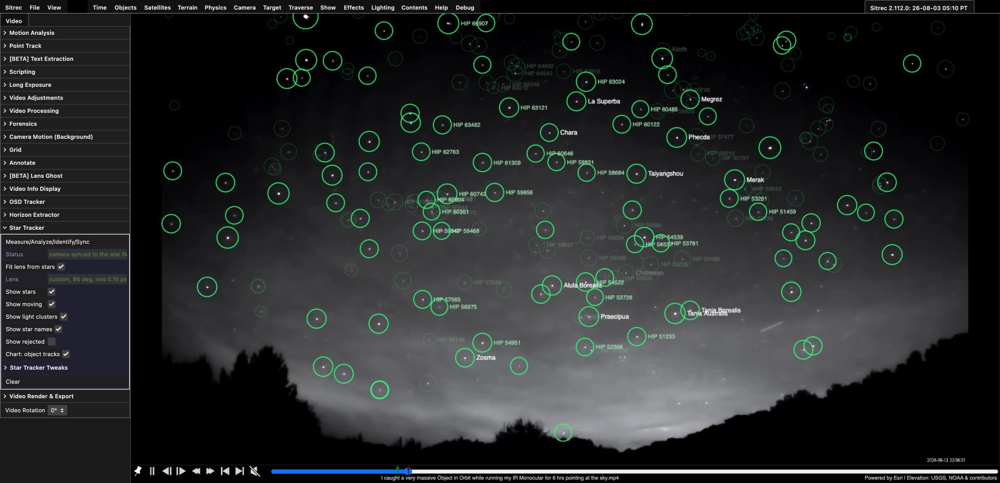

*A night-vision clip analysed end to end. Green circles are fixed on the sky, named where the catalog matched them. The panel on the left is the whole Star Tracker menu.*

> **Just want the controls?** Jump to the [GUI reference](#gui-reference). For how it actually works, see [How it works](#how-it-works).

## Quickstart

1. Load a video of the night sky and open **Video → Star Tracker**.
2. Set the **In** and **Out** markers on the timeline to the stretch you want analysed. This is the range the analysis uses — not the whole video. **A few hundred frames is usually plenty**; there is rarely anything to gain from thousands.
3. Click **Full Analysis**.
4. Wait. Detection decodes and scans **every frame in the range**, so the time scales with the frame count — on 720p night-vision footage it runs at roughly ten frames a second, making a few hundred frames about a minute. Expect slower on higher-resolution or busier footage. Press **Enough (solve what we have)** at any point to stop scanning and solve what has been measured so far.

That is the whole common path. When it finishes, the **Status** line tells you what it found — for example `231 stars, 5 moving, sigma 0.30 px`.

That last number is the clip's position noise, and it is the one to sanity-check: a few tenths of a pixel means the stars are being measured crisply. Sitrec will not report below 0.15 px whatever the fit says, so a value pinned there is a floor rather than a measurement. Several pixels means soft focus, heavy compression or a shaky mount — the analysis still runs, but only larger motions will clear the bar.

**Full Analysis** chains four stages, each of which also has its own button in [Star Tracker Tweaks](#star-tracker-tweaks) if you want to run it alone: *Detect Star Size* → *Find Candidate Stars* → *Identify Stars (catalog)* → *Sync Camera to Star Field*.

## Glossary

- **track** (or **tracklet**) — one point of light followed across several frames.
- **reference coordinates** — a common grid shared by every frame, with the camera's own motion taken back out, so a star sits at the same place in it all through a pan (see [Stage 2](#stage-2--undo-the-cameras-motion)). It is anchored to the *first analysed frame's* pixels — a convenient common ruler, not celestial coordinates. Turning it into a real sky position is what [Identify](#identifying-the-stars) does.
- **the map** — the solved position of every track in those reference coordinates.
- **sigma (σ)** — a noise level. **Two different ones appear below, and it is worth keeping them apart:**
  - *brightness* sigma, used by **Detect threshold** — how much the sky's brightness flickers from pixel to pixel. A detection must stand this far above the local sky.
  - *position* sigma, used by everything that judges movement — how much a well-measured point wanders between frames, in pixels. This is the one the Status line reports.
- **PSF** — point spread function; how big a single star's blob is in pixels. Cameras and focus settings differ, so this is measured rather than assumed.
- **In/Out range** — the A–B markers on the timeline, the same pair every other Sitrec analysis uses. Set them with the **In** and **Out** buttons on the playback bar, or by dragging the markers.
- **RA/Dec** — right ascension and declination: longitude and latitude on the sky. A fixed address for a star, independent of where you are or when you look.
- **optical axis** — the point in the image the lens looks straight out through. Normally the centre of the picture, but **not** in footage that has been cropped off-centre.
- **plate solve** — working out where a picture of the sky is pointing by identifying the stars in it, with no starting guess. That is what [Identify](#identifying-the-stars) does.

## Reading the results

Once an analysis finishes, the video view is annotated:

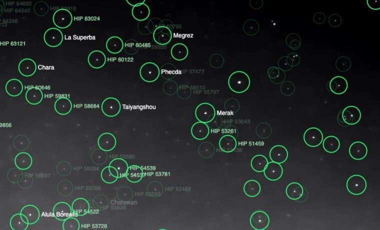

| What you see | What it means |
|---|---|
| **Bright green circle** | A star among the hundred brightest in the field — **or** one the catalog gave a real name to, which always draws at full strength however faint it measured |
| **Faint thin green circle** | A star fainter than that with no proper name — measured exactly the same way, drawn quietly so a rich field does not bury the footage it is annotating |
| **Star name** (`Megrez`, `HIP 53726`) | The catalog identification. A proper name where the star has one — drawn more prominently — otherwise its Bayer designation (`Alpha Ursae Majoris`), otherwise its Hipparcos number |
| **Red circle** | Something moving against the stars, labelled with how far it drifted |
| **Orange ring** | Lights moving together as one object. A ring can also mark a *single* light too fragmented to hold as one track — a flashing beacon, say — which is then labelled `faint moving object` |

A red detection looks like this:

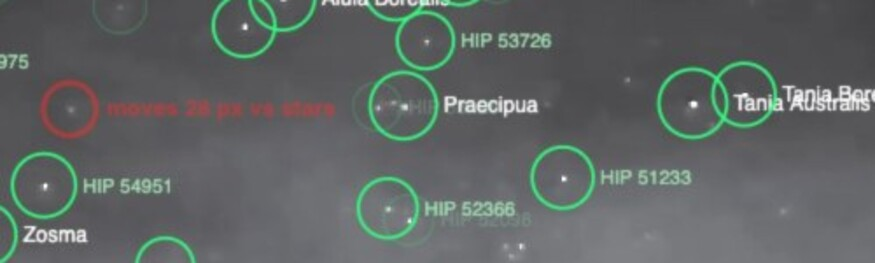

*`moves 28 px vs stars` — this point of light did not stay where the sky did.*

**Clicking a green circle toggles that star off** — it dims but stays visible, so you can click it back on. This is for the case where you can see something has been mis-measured, or know a "star" is really a planet, and would rather it did not vote. Toggling is read when identification runs, so **re-run *Identify Stars (catalog)*** for it to take effect. Only stars toggle; red and orange markers do not.

### The five verdicts

Every track ends up in one of five classes. Only two are drawn by default:

| Class | Meaning | Drawn |
|---|---|---|
| `star` | Fixed on the sky within the noise | Green |
| `moving` | A real, coherent drift against the sky | Red |
| `cameraFixed` | Fixed in the *frame* while the sky slides past — dust, a hot pixel, a reticle | Only with **Show rejected** |
| `incoherent` | Detected repeatedly but scattered; never settled anywhere | Only with **Show rejected** |
| `short` | Too few detections to say anything either way | Never drawn |

`short` is normally the largest group by far — in a typical clip most detections appear in too few frames to judge. That is expected, not a failure.

## GUI reference

The Star Tracker folder lives under **Video**.

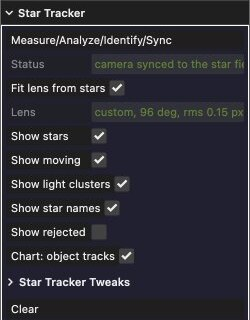

| Control | What it does |
|---|---|
| **Full Analysis** | The one-click path: run all four stages in order. Each stage checks what the previous one actually produced, so a failure after the first stops the chain with its own error still on screen rather than being overwritten by the next stage complaining. (*Measure* is the exception — see [Stage 0](#stage-0--measure-the-star-size)) |
| **Optimize Adjustments for Frame** | Tune the picture for this analysis — the same thing as *Optimize For Star Tracking* under Video Adjustments, offered here because this is where you are when you want it. See [Optimize For Star Tracking](#optimize-for-star-tracking). Its *Enough* / *Abort* controls appear in whichever folder you can see, so a run started here can be stopped here |
| **Status** | What the last stage did, or what it found |
| **Fit lens from stars** | Measure the camera's actual optics from the star field, and judge motion on a sphere rather than with a flat model. Reasonable to leave on: it declines when the clip does not constrain a lens, and says so. See [why this matters](#why-fitting-the-lens-matters) |
| **Lens** | The fitted lens, e.g. `custom, 96 deg, rms 0.15 px`, or why it declined |
| **Show stars** | Draw the green circles |
| **Show moving** | Draw the red circles |
| **Show light clusters** | Draw the orange rings |
| **Show star names** | Label identified stars |
| **Show rejected** | Also draw the tracks classified `incoherent` or `cameraFixed`. These are things that *were* followed but did not qualify as stars — not blobs the detector threw out earlier |
| **Use mask** | Discard detections that fall inside the video mask, so trees, rooftops and other lit foreground are never mistaken for stars. On by default, and does nothing unless a mask has been painted — see [Masking out the ground](#masking-out-the-ground) |
| **Apply adjustments** | Analyse the frame as you see it, with **Video → Video Adjustments** applied — levels, curves, sharpen, blur, brightness and the rest. On by default, and does nothing unless you have set some adjustments. Turn it off to analyse the raw decoded frame instead, which can find stars that are not visible on screen, or miss ones that only the adjustments bring out |
| **Chart: object tracks** | Include moving-object tracks on the star chart exported by *Make Star Chart (PNG)*, rather than stars alone |
| **Display during analysis** | Show what each stage is working on while it runs — see [Watching it work](#watching-it-work). On by default |
| **Clear** | Discard the analysis: the overlay, the solve, the fitted lens reported in the Camera menu, and the camera options that Sync added. Your Tweaks settings are left alone |

### Star Tracker Tweaks

Most clips need none of these. They are here for footage the defaults do not suit.

| Control | Range | What it does |
|---|---|---|
| **Detect Star Size (current frame)** | — | Measure the star blob size on the frame currently shown, and scale the detection settings to it. Pressing it replaces *Min blob area* whatever it was set to; the copy that runs inside **Full Analysis** leaves a value you chose alone |
| **Detect threshold (sigma)** | 3–10 | How far above the local sky a pixel must be to count, in multiples of the sky's *brightness* noise. Lower finds fainter stars and more false ones. Tuned automatically by [Optimize For Star Tracking](#optimize-for-star-tracking) |
| **Min blob area (px)** | 2–40 | Smallest blob accepted. Once you set it by hand — or [Optimize For Star Tracking](#optimize-for-star-tracking) sets it — it is yours: **Full Analysis** runs with it rather than quietly measuring over it. Pressing **Detect Star Size** still replaces it, because that button *is* the request to measure |
| **Min detections per track** | 3–40 | How many frames a point must appear in before it is judged at all. Below this it is `short` |
| **Moving: significance** | 2–20 | How *confident* the drift must be — how many times larger than its own uncertainty. Raise it if slow-drifting stars are being called movers |
| **Moving: min drift (sigma)** | 2–40 | How *far* it must actually move, in multiples of this clip's position noise. Raise it to ignore small real motions and only catch obvious ones |
| **Find Candidate Stars** | — | Run the analysis only |
| **Identify Stars (catalog)** | — | Run the catalog match against the last analysis |
| **Sync Camera to Star Field** | — | Point Sitrec's camera the way the identification says the real one was pointing |
| **Make Star Chart (PNG)** | — | Export a chart of the solved field |

## Optimize For Star Tracking

**Video → Video Adjustments → Optimize For Star Tracking** tunes the picture, and then the
detector, for the frame you are looking at. Press it on a representative frame with the sky
visible; it works on the current frame only. The same button is in the Star Tracker folder as
**Optimize Adjustments for Frame** — one feature, two places to reach it, and its *Enough* /
*Abort* controls appear in both while it runs.

It finishes by identifying the stars for the settings it chose, so the run **ends with the stars
named on screen** rather than leaving you to press *Full Analysis* to find out what it found.

It runs in two stages, and you can stop it at any point with **Enough (Accept)** — which keeps the
best settings found so far — or **Abort (Reset)**, which puts every slider back exactly as it was.

**Stage 1 — the picture (about 10 seconds).** A genetic search over *Brightness*, *Contrast*,
*Shadows*, *Highlights*, *Dehaze* and *Blur*.

Before the search starts, Sitrec measures the frame **with those six controls at neutral** and
keeps the result as a fixed yardstick — a map of how statistically significant every part of the
picture is against its own noise. A candidate's detections are then credited by what that *fixed*
map says is at each location.

That indirection is the whole trick, and it is worth understanding, because the obvious approach
fails badly. The detector decides what is a star by comparing each blob against the **local noise**.
So if you crush the blacks hard enough, the measured noise collapses, and every surviving speck of
sensor noise starts looking like a brilliant star. An earlier version of this feature scored
candidates on their own pixels and did exactly that: it drove contrast up, "found" 58 stars, and
identified **none** of them. Letting the candidate supply its own yardstick means the search can
always cheat. Letting it move detections around a yardstick it cannot touch means it cannot.

Each candidate is then scored on three things:

- **Anchor quality** — the best 25 detections, credited by the fixed evidence at their positions
  and by how point-like they are. Twenty-five because that is exactly how many the catalog matcher
  uses to build its quads, so past 25 a tail of extra detections adds nothing at all.
- **Purity** — the share of detections the evidence map actually supports. Detections with nothing
  behind them now *cost* something rather than being free.
- **Tonal integrity** — clipping and noise-floor collapse measured against the neutral frame. This
  prices the cheat directly.

Masked detections are not counted at all, or it would optimise for whatever makes the *trees*
brightest. Your current settings are always tried first, so it can honestly answer "already
optimal", and it can never return something worse than what you started with.

**Stage 2 — the detector (ten seconds or so).** Everything here is scored on how many stars the
**catalog actually identifies** — the real end of the pipeline, not a proxy for it. It:

1. measures what the settings you arrived with identify, as the baseline to beat;
2. re-scores stage 1's best few candidates the same way, because stage 1 judges a *picture* and
   this judges the *answer*;
3. sweeps *Detect threshold* and *Min blob area* from
   [Star Tracker Tweaks](#star-tracker-tweaks) for whichever candidate wins;
4. and, if none of that identifies more stars than you already had, **puts everything back and
   tells you so**. The button cannot leave you worse off than when you pressed it.

The second stage exists because extracting *more* detections only helps up to the depth of the star
catalog. Past that, the extra detections have no catalog counterpart, they become clutter in the
quad search, and identification collapses entirely — on the reference still, 47 detections
identified **zero** stars where the same picture at a higher threshold gave 15 detections and 8
identified. Counting detections cannot see that happen; counting identified stars cannot miss it.

Measured on the reference still, five consecutive runs from the same starting point:

| | detections | identified |
|---|---|---|
| Untouched | 16 | 8 |
| Optimized | 20–28 | **14, 15, 15, 25, 27** |

Note what the winning settings look like: the search typically *lowers* contrast or lifts the
highlights gently, and leaves detections in the twenties rather than the sixties. A modest,
well-separated star field identifies far better than a crowded one.

The search is stochastic, so runs differ; pressing it twice is reasonable if a result looks
unambitious. If a run genuinely cannot beat your settings it says "Kept your settings" and changes
nothing.

**The number it reports is the number you get.** Run **Full Analysis** afterwards and it reproduces
the identification the optimizer promised, because the settings it chose are the settings the
analysis runs with — including *Min blob area*, which the chained *Detect Star Size* would
otherwise have silently re-measured. With **Auto detect threshold** on, the threshold is
re-measured before every analysis, so the optimizer does not sweep one; it tunes the picture and
the blob size and leaves the threshold to the automation you asked for.

Three things worth knowing:

- It refuses to run unless the Star Tracker's **Apply adjustments** is on — with it off the
  analysis reads the raw frame, so anything this found would be tuned for a picture the Star
  Tracker is never going to look at.
- The settings are tuned for *one* frame. On a clip whose exposure or sky brightness changes, check
  a frame from each part before trusting them across the whole thing.
- On a video, stage 2 judges each candidate by analysing the **current frame alone**, so it stays a
  half-minute job on a clip of any length. The adjustments it picks are still applied to the whole
  clip when you run the analysis.
- When it applies new settings it leaves *their* analysis on screen, stars named. On a video that
  is a single-frame analysis where a whole-clip one may have been — run **Full Analysis** to get
  the clip back, and it will reproduce these numbers. When it changes nothing (aborted, or it could
  not beat your settings) your previous analysis and synced camera are restored untouched.

One limitation worth knowing: the yardstick is measured from the neutral frame, so it sees what is
*statistically* present rather than what is visible — a star too faint to see still counts. But if
the footage is so crushed that the neutral frame holds no signal at all, there is nothing for the
reference to find, and the search will under-credit adjustments that genuinely recover it.

## Masking out the ground

If the frame contains trees, rooftops, a hillside or anything else lit from below, mask them out
before analysing. Lit foliage is exactly what the detector is looking for — small, bright and
stationary — and it is detected in quantity.

Measured on a wide night photograph with a treeline: without a mask it detected about a thousand
"stars", roughly 40% of them foliage, and identification could not hold a consensus against that
and failed. With the ground masked it kept 423 detections, none in the trees, and identified
**221 stars**.

1. Open **Video → Masking** and click **Mask Ground (auto)**.
2. Check the red overlay covers the foliage, and tidy it by hand with **Edit Mask** if not.
3. Leave **Use mask** ticked in the Star Tracker folder — it is on by default.

Detections inside the mask are discarded before classification, and are tallied with the other
rejection reasons, so *Show rejected* and the troubleshooting table below still explain why a
particular point was not circled. Note the detector still *looks* inside masked regions, so the
local background near a mask edge is measured from those pixels; that is a small effect, but it
means a mask is not quite the same as cropping the frame.

See [Masking](Masking.md) for the other ways to build a mask — including masking a burned-in
timestamp or reticle, which is worth doing for the same reason.

## Interrupting a long run

Detection walks every frame in the In/Out range before anything can be solved, so a long range takes a long time. Two buttons appear while it runs:

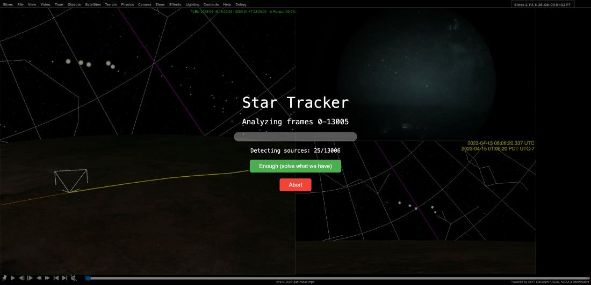

- **Enough (solve what we have)** — stop scanning, keep every frame measured so far, and run the full solve on that shorter stretch. If you started from **Full Analysis**, identification and camera sync still follow exactly as on a complete run; if you started from **Find Candidate Stars**, only the analysis runs, as it would anyway. The Status line records how much of the clip the numbers came from, e.g. `(stopped early, 60/300 frames)`.
- **Abort** — stop and discard the run. Note that Abort is checked between stages rather than continuously, so pressing it during the final lens fit may not take effect until that stage finishes.

Use **Enough** when the answer has clearly settled, or when you set the range wider than you meant to.

Playback is **paused for the duration and cannot be resumed** — the detect pass steps the video frame by frame itself, and live playback advancing the same counter would interleave with it. When the run finishes it parks on the **first analysed frame**, which is the one the overlay is drawn for, and stays paused.

## Watching it work

With **Display during analysis** on (the default), each stage shows what it is doing.

| Stage | What you see |
|---|---|
| **Detecting sources** | Every accepted blob on the current frame circled, with a running count. These are raw detections — nothing is solved yet, so there is no classification, no name, and a star missed on this frame simply is not circled. It is the honest picture of what the detector is handing the solver, which makes a bad **Detect threshold** or **Min blob area** obvious without waiting for the run to end |
| **Fitting camera lens** | A crosshair at the **optical axis** the fit currently believes in, tethered to the frame centre so the offset is the visible quantity, with the running rms and focal length. It draws lightly while searching and solidly once settled |
| **Solving sky rotation** / **Re-solving on stars only** | The residual being minimised, how far it has come, and the **step size against the tolerance that stops the loop** — so you can tell "nearly done" from "stuck" |
| **Identifying** | Verified quads drawn over the field, line weight scaling with how much of the whole field each hypothesis explains. Usually invisible: on a good map identification finishes in well under a tenth of a second. You will mostly see this when it is *struggling*, which is when it is worth seeing |

Two stages — **Solving camera motion** and **Building star map** — have no display yet.

## How it works

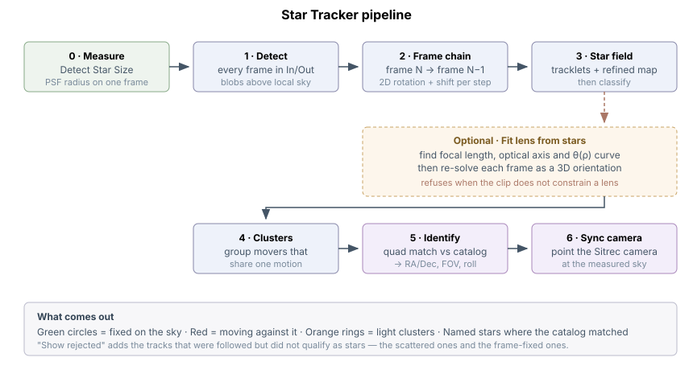

### Stage 0 — measure the star size

Star blobs are a few pixels across, but *how many* depends on the camera, the focus, the exposure and the resolution. Rather than assume, **Detect Star Size** measures the point spread function on the frame you are looking at and scales the detection settings to match. A failure here does not stop the chain — the previous (or default) settings stay in place, so the analysis is still runnable.

### Stage 1 — find the point sources

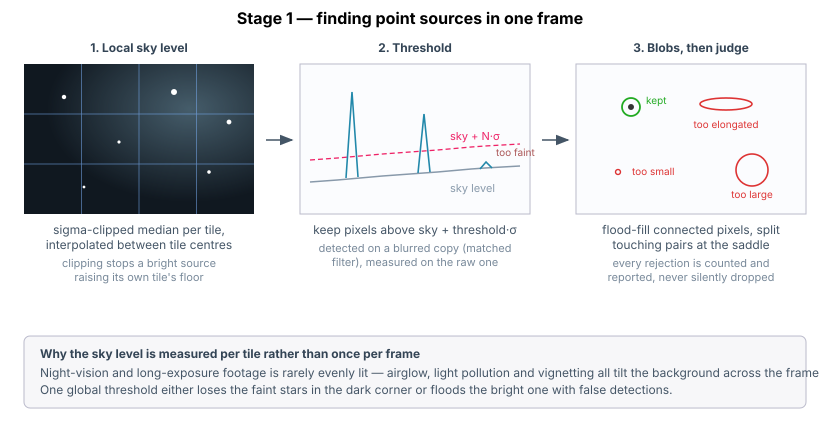

Each frame is reduced to brightness alone (luma), and the **sky level is measured per tile** rather than once for the whole frame — night footage is rarely evenly lit, and one global threshold either loses the faint stars in the dark corner or floods the bright one with false detections. Each tile's level is a *sigma-clipped* median: samples well above the running median are discarded and it is re-measured, which stops a bright source from dragging up the very background it is measured against.

Detection then runs on a blurred copy (a matched filter, which favours things the size of a star) while measurement runs on the raw pixels. Connected bright pixels are flood-filled into blobs, and each blob is judged on area, elongation, signal-to-noise, colour evidence, whether it touches the frame edge, and whether it holds more than one peak. Two stars close enough to merge into a single blob are **rejected as blended** rather than split apart — the peaks are counted (by checking for a dip in brightness along the line joining them) but separating them is not attempted, so a merged pair is dropped rather than guessed at.

Almost nothing is discarded without a record: each rejection is tallied with its reason, and a sample of individual cases is kept, both stored on the analysis result. The exception is specks below the minimum area, which are dropped during the flood fill and never reach the tally at all. Note these are **diagnostic records, not something drawn on the video** — *Show rejected* is a separate control covering tracks that failed *classification* later on.

### Stage 2 — undo the camera's motion

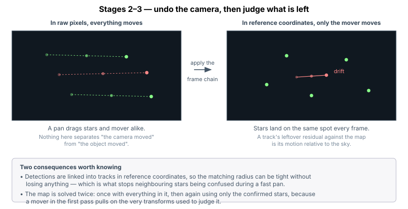

Between consecutive frames, the same stars appear in slightly different places. Matching them gives a flat **2D transform** — one rotation and one shift — describing how the camera moved. Scale is deliberately held fixed: letting it float lets a handful of hot pixels drag the fit, and on a synthetic test that free-scale version recovered only 22 px of a commanded 38 px motion while inflating scale by 7%. Chaining those steps gives, for every frame, a transform into a common **reference** grid.

Three matchers run: predict where each star should be from the previous step's motion; match triangle shapes, which works even after a jump because a triangle's shape does not depend on where the camera is pointing; and vote on a common offset. **All three are consulted every time and the one explaining the most sources wins** — deliberately not a fallback cascade, because a tight cluster of stationary artifacts can look like a strong lock while the real field has shifted somewhere else entirely, registering the frame wrongly with no failure to show for it. Inlier count is the honest arbiter. Frames where nothing worked are recorded rather than papered over, and weakly-fitted frames are flagged so a chain that is partly guesswork does not look uniformly trustworthy.

This stage also spots things **fixed in the frame** while the sky slides past — dust, hot pixels, a reticle.

### Stage 3 — build the map and judge what moved

Detections are grouped into tracks **in reference coordinates**, not raw pixels. That matters: in reference coordinates a star barely moves however fast the camera pans, so the matching radius can be kept tight, which is what stops neighbouring stars being confused during a fast pan. (It is not free — where the frame registration is rough, a single real track can still fragment into several.)

The map and the transforms are then refined together, which removes the drift that accumulates along a chain of frame-to-frame steps. After that, **a track's leftover residual against the map *is* its motion relative to the sky** — nothing has to be assumed about what the "normal" motion ought to be.

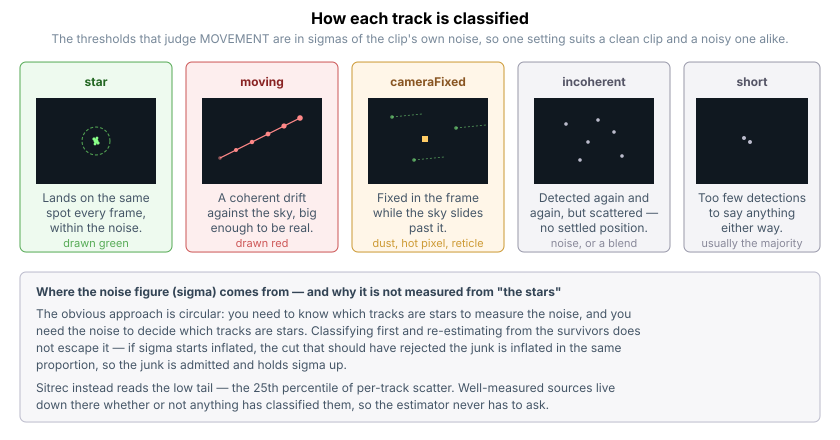

Where there are enough confirmed stars to support it, the solve then runs a **second time using only those stars**. This matters more than it sounds: the first pass necessarily includes the movers and the artifacts, and those pull on the very transforms used to judge them. Re-solving on things that actually belong to the sky gives a cleaner map, and the classification is repeated against it. On a sparse field with too few confirmed stars the second pass is skipped and the first-pass verdicts stand.

### Why fitting the lens matters

Everything above treats the picture as flat. A real lens is not.

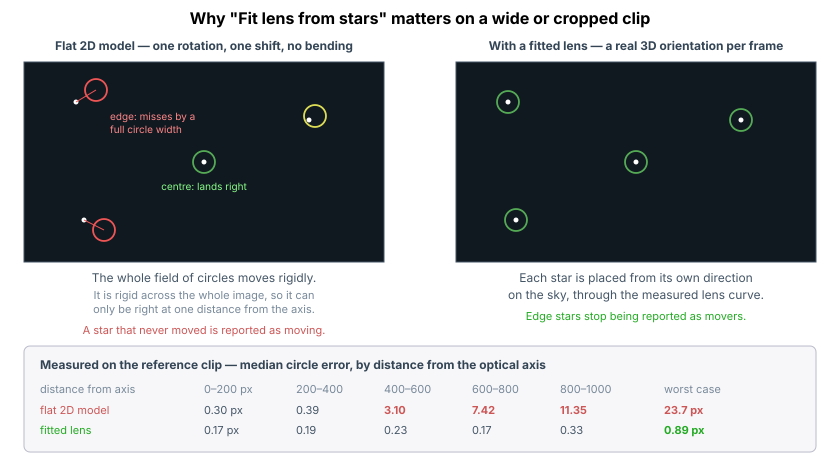

*Measured on one particular clip: a cropped wide-angle Starlink timelapse whose optical axis sits 336 px off centre, sampled at a single frame over the 231 stars observed in it. The figures show the shape of the problem, not a universal scale — on a narrow-field clip the flat model's error stays small everywhere.*

The flat model moves the whole field of circles rigidly. But a wide lens *bends*: one rotation of the sky moves a star at the frame edge a different number of pixels than a star at the centre. A rigid model can therefore only be correct at one distance from the optical axis, and the error grows outward from there. Adding degrees of freedom does not rescue it — a full homography was measured at 11.4 px against the rigid model's 11.7, because radial compression simply is not a projective effect.

On a cropped clip the error is lopsided rather than symmetric, because a crop moves the optical axis away from the centre of the picture.

With **Fit lens from stars** on, Sitrec measures the focal length, the position of the optical axis and the shape of the lens curve from the star field itself, then re-solves each frame as a genuine 3D orientation, placing each star from its own direction on the sky.

The fit works from a pair of frames far enough apart to have moved appreciably (the *baseline*), sharing enough matched stars, and rotating in a way that actually exercises the lens. The rotation that tells you **nothing** is roll about the optical axis — spin the camera about its own line of sight and every star moves a long way while no star changes its distance from the axis, which is precisely the quantity a lens curve describes. A pan across the sky does constrain it. When the correspondences suggest the axis is *not* near the frame centre, a coarse grid search runs first, because on a cropped clip the true axis can be hundreds of pixels away in a direction local hill-climbing walks away from; on a normally-centred clip that search is skipped and refinement goes straight to work.

**It declines when the evidence does not support a fit**, and scores candidates against stars held out of the final fitting rather than only the ones it trained on. That is what makes it reasonable to leave on: on a clip that does not constrain a lens it says so in the **Lens** field and the flat model stands. It is a guard, not a proof — the holdout is not fully independent (earlier stages of the search see all the correspondences), so treat a fitted lens as good evidence rather than a certificate.

**What the lens fit does not change.** It improves the *verdicts* — which tracks are called stars — and the placement of the circles. It does **not** migrate the rest of the pipeline onto the sphere: detections are still associated in 2D, and star identification and cluster placement still work from the flat chart. See [Limitations](#limitations-and-when-it-refuses).

### Stage 4 — group the movers

Several red detections moving together are usually one object — an aircraft's navigation lights, say. Tracks that are not stars and share a common motion are grouped into a single cluster, drawn as an orange ring. Notably this includes tracks that were individually dismissed as *short* or *incoherent*, which is exactly what a flashing light looks like on its own.

### Identifying the stars

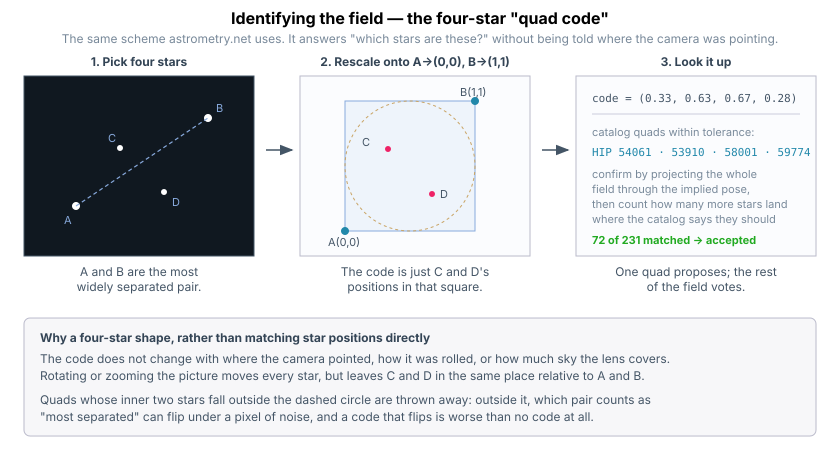

Identification uses the same scheme as [astrometry.net](https://astrometry.net): a **quad code**. Take four stars; find the two most widely separated, call them A and B; then describe where the other two sit in coordinates where A is (0,0) and B is (1,1).

That description does not change when the camera points elsewhere, rolls, or zooms — so it can be looked up in an index of catalog quads without any starting guess about where the picture is. (Strictly the invariance is exact only for a flat, undistorted picture; the matcher widens its tolerance to absorb the lens curvature rather than modelling it.) A matching catalog quad proposes a camera orientation and scale; the rest of the field then votes on it, by projecting every catalog star through that proposal and counting how many land where they should.

The catalog ships with Sitrec and is fetched from your own Sitrec server the first time you press Identify — no third-party service is contacted. It holds about 118,000 stars keyed by Hipparcos number, down to roughly magnitude 12. (Its file is named `BSC5`, after the much smaller Bright Star Catalogue, which is a legacy name rather than a description of the contents.) The *index* is built only from the bright end — the tiers cut at magnitude 6.5 — but the final match runs against the whole catalog, so stars far fainter than any naked-eye limit can still be named. The quad index is **built at runtime** rather than shipped, taking a couple of seconds on first use in a session, so it can never drift out of sync with the catalog. Proper names come from the IAU Catalog of Star Names. A star must appear in a reasonable share of the analysed frames to be offered to the matcher, so a very short range gives it little to work with.

The result is the field centre in RA/Dec, the roll angle, and a field of view. Read that last figure as an approximation: it is the field the picture *would* span if the lens were perfectly rectilinear, and the pixels-per-degree figure applies at the field centre. On a genuine fisheye it is a useful ballpark, not a measurement of the lens — that is what **Fit lens from stars** is for. **Sync Camera to Star Field** then points Sitrec's camera accordingly.

## Limitations and when it refuses

- **The lens fit declines on clips whose motion does not exercise the lens.** Rolling about the line of sight, or too short a baseline between the frames it compares, leaves the lens shape unconstrained. This is reported in the **Lens** field, not hidden.
- **Star identification needs enough stars.** A handful of bright points in a narrow field may not produce a unique quad match.
- **A still image is a special case.** With one real frame there is no motion to solve, so every detected point is taken as a star — which is all a single exposure can honestly claim. The **Enough** button is not offered, since there is nothing to stop short of.
- **The frame range is the In/Out range**, not the whole video. If the analysis covers less than you expected, check your A–B markers.
- **Identification runs on the flat 2D map, even when a lens has been fitted.** The two features are deliberately decoupled for now: the matcher is calibrated end to end against what the flat chart produces, and feeding it the extra edge stars the lens fit recovers costs it its match consensus. So a fitted lens improves what is *called a star*, but does not currently widen what gets *named*.

## Troubleshooting

| Symptom | Likely cause |
|---|---|
| Almost everything is called *moving* | The lens was not fitted and the clip is wide or cropped, so the flat model is biased at the frame edges. Check the **Lens** field |
| Very few stars found | **Detect threshold (sigma)** too high, or **Min blob area** too large for this footage. Run **Detect Star Size** on a representative frame first |
| A visible star is not circled | Turn on **Show rejected**: if it appears, it was followed but judged `incoherent` or `cameraFixed`. If it does not, it never got past detection — lower **Detect threshold (sigma)** or **Min blob area** |
| Identification finds nothing | Too few solved stars, or a field too sparse for a unique quad. Try a longer In/Out range |
| The run is taking forever | Press **Enough (solve what we have)** — a few hundred frames is usually plenty |

## See also

- [Masking](Masking.md) — excluding trees, an OSD or a vignette from the analysis. Usually the
  single biggest improvement on footage with any foreground in it
- [Long Exposure](LongExposure.md) — stacking frames, which pairs naturally with star work
- [Starlink](Starlink.md) — identifying satellites among the movers
- [Tracks](Tracks.md) — what Sitrec does with a moving object once you have one
- [Star Tracker: Prior Work and Novelty](StarTracker-PriorWork.md) — how each stage of the pipeline
  relates to the published literature: what is standard practice, what diverges from it, and what is
  a local heuristic. Written for readers who want the references rather than the controls
