# Star Tracker

The Star Tracker takes a video of the night sky and works out, frame by frame, which points of light **stay fixed on the sky** and which **move against it**. It then identifies the fixed points against a star catalog, which tells you where the camera was pointing, roughly how wide its field of view was, and how it was rolled. The identification needs no starting guess, so you do not need to know any of this in advance. To turn the result into a direction over the ground, Sitrec needs the time and place: see [Where the answer is](#where-the-answer-is).

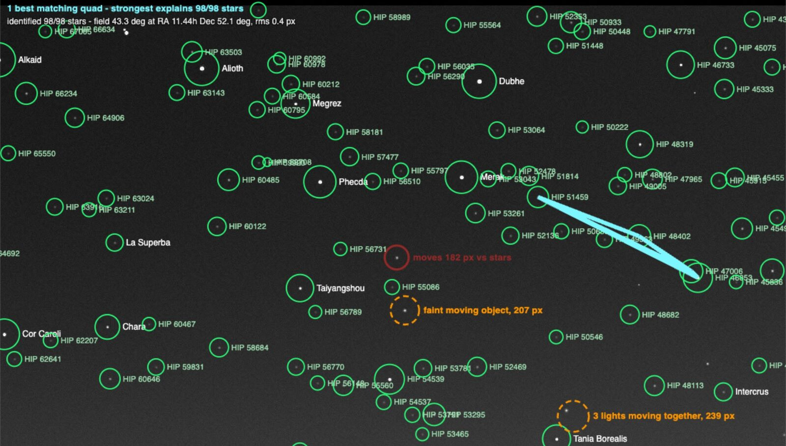

*A generated test clip, analysed end to end with **Fade at completion** off. Green circles are fixed on the sky, named where the catalog matched them. The clip is made from Sitrec's star catalog, so all 99 stars offered to the matcher match. The close pair at the top left is one blob, and only its brighter star, Mizar, has a circle: the detector splits two stars that merge into one blob and measures the part with the biggest peak. See [Stage 1](#stage-1--find-the-point-sources). The cyan shape is the quad that the match used: see [Identifying the stars](#identifying-the-stars). The red circle moves against the stars, and the orange dashed rings are lights grouped as moving objects: see [Reading the results](#reading-the-results).*

> **Just want the controls?** Jump to the [GUI reference](#gui-reference). For how it actually works, see [How it works](#how-it-works).

## Quickstart

1. Load a video of the night sky and open **Video → Star Tracker**.
2. If trees, buildings or burned-in text are in the frame, mask them first. See [Masking out the ground](#masking-out-the-ground).
3. Set the **In** and **Out** markers on the timeline (press **I** and **O**, or drag the markers) to the stretch you want analysed. On a new video they sit at the first and last frames, so the analysis covers the whole clip until you move them. Analysis time grows with the number of frames.
4. Click **Star Tracker Analysis**.
5. Wait. Detection decodes and scans **every frame in the range**, so the time scales with the frame count, and with the resolution and busyness of the footage. Press **Enough (solve what we have)** at any point to stop scanning and solve what has been measured so far.

That is the whole common path. When it succeeds, the **Status** line gives the identification, for example `identified 72/231 stars - field 42.3 deg at RA 11.52h Dec 52.1 deg, rms 1.2 px`. That is the stars matched out of the stars offered, the field of view, the sky position of the field's centre, and the fit error. The menu row can cut the line short. The copy at the top left of the video shows all of it. [Where the answer is](#where-the-answer-is) says how to use these numbers.

The identification replaces the analysis summary. To see that summary, press **Find Candidate Stars** in [Star Tracker Tweaks](#star-tracker-tweaks). The Status line then reads, for example, `231 stars, 5 moving, sigma 0.30 px`. That run replaces the identification, so press **Identify Stars (catalog)** afterwards to get it back.

The sigma figure is the clip's position noise, and it is the one to sanity-check: a few tenths of a pixel means the stars are being measured crisply. Sitrec will not report below 0.15 px whatever the fit says, so a value pinned there is a floor rather than a measurement. Values of several pixels can come from soft focus, compression or camera shake — the analysis still runs, but a point must then move further before Sitrec calls it moving.

**Star Tracker Analysis** runs three steps, each of which also has its own button in [Star Tracker Tweaks](#star-tracker-tweaks) if you want to run it alone: *Detect Star Size* → *Find Candidate Stars* → *Identify Stars (catalog)*. When identification succeeds and **Sync Camera to Star Field** is ticked (the default), it also points Sitrec's camera to match.

## Where the answer is

After a successful **Star Tracker Analysis**:

| You want | Where it is |
|---|---|
| Field of view and sky position | The **Status** line. `field` is the angle across the wider side of the star map, and it is an estimate: see [Identifying the stars](#identifying-the-stars). On a steady clip the map is the size of the frame, so `field` is the field of view across the wider side of the frame. On a clip that drifts or pans, the map is larger than the frame and `field` reads high. On a video with the Fisheye render on, or with **From timelapse**, the map holds only the central 70 degrees of the field, so `field` reads 70 degrees or less whatever the lens: use the **Lens** row. The look camera does not use this number. `RA` and `Dec` are the sky position of the field's centre. A pan that makes the star map more than about 1.25 times the frame is identified in time windows, and the line then gives only star and window counts |
| Camera direction and roll | The look camera. With **Sync Camera to Star Field** ticked, **Camera → Heading → Camera Heading** and **Camera → FOV (Zoom) → Camera FOV** read **Star Track**, and the look view shows the solved direction, roll and field of view. The sync gives a direction and roll for each analysed frame, so the camera follows a hand-held clip frame by frame. Frames outside the analysed range keep the nearest solved direction and roll. The greyed **Pan (Az)**, **Tilt (El)** and **Roll** rows in **Camera → Heading** follow the solved camera on every frame, so they give its azimuth, elevation and roll. The compass on the look view also gives the azimuth, and **Show → Show Compass Elevation** adds the elevation |
| The lens | The **Lens** row, and the full fit in **Camera → Lens** |

To check the match, compare the stars in the look view with the stars in the video. The look view draws no stars until the sun is about 9 degrees below the horizon at the camera position, and the ground hides stars below the horizon. A new custom sitch starts in daylight. If the video did not set the Start Time, set a night time when that part of the sky is above the horizon: see [Time, Frames and Syncing](TimeAndSync.md).

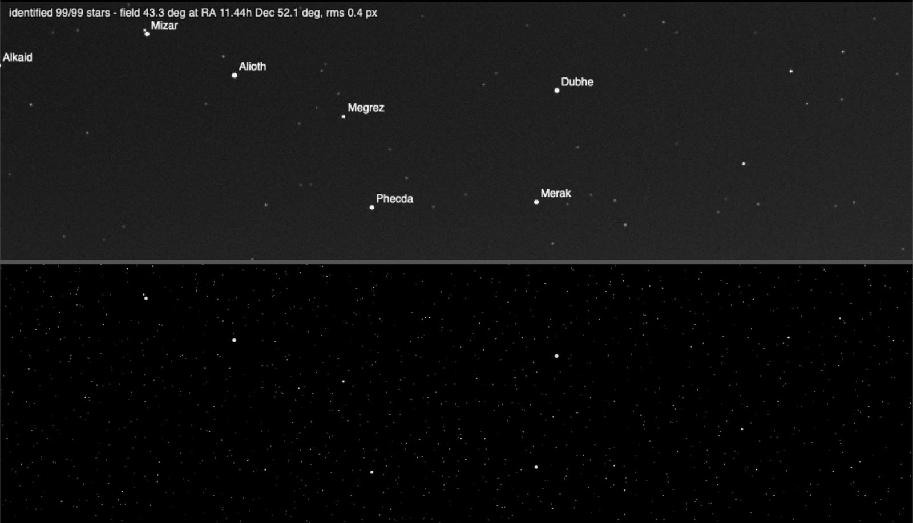

*Top: the generated test clip after the [completion fade](#reading-the-results), with the named stars labelled. Bottom: the look view after the camera sync. The bright stars sit at the same places in both views. The look view also draws fainter stars than this clip shows. Both views are cropped to their upper part, so the red and orange marks of this clip are out of the picture.*

**Time and place.** Identification needs neither. The camera sync does need the time: Sitrec turns the solved sky position into a camera direction with the sitch's date and time. Each second of error in Start Time turns the camera by about 15 arcseconds about the Earth's axis. A wrong camera position does not change that direction in space, but it changes the ground under it, and so the azimuth and elevation. Set the Start Time and the camera position first if the look view must also match the ground. See [Time, Frames and Syncing](TimeAndSync.md).

**Keeping the result.** Saving a sitch keeps the camera track from the sync, but not the analysis or its circles, so run the analysis again after a reload. A **MISB TS (H.264)** export carries the camera's orientation and field of view for each frame: see [Rendering and Exporting Video](Video.md).

## Glossary

- **track** (or **tracklet**) — one point of light followed across several frames.
- **reference coordinates** — a common grid shared by every frame, with the camera's own motion taken back out, so a star sits at the same place in it all through a pan (see [Stage 2](#stage-2--undo-the-cameras-motion)). It is anchored to the *first analysed frame's* pixels — a convenient common ruler, not celestial coordinates. Turning it into a real sky position is what [Identify](#identifying-the-stars) does.
- **the map** — the solved position of every track in those reference coordinates.
- **sigma (σ)** — a noise level. **Two different ones appear below, and it is worth keeping them apart:**
  - *brightness* sigma, used by **Detect threshold** — how much the sky's brightness flickers from pixel to pixel. A detection must stand this far above the local sky.
  - *position* sigma, used by everything that judges movement — how much a well-measured point wanders between frames, in pixels. This is the one **Find Candidate Stars** reports on the Status line.
- **PSF** — point spread function; how big a single star's blob is in pixels. Cameras and focus settings differ, so this is measured rather than assumed.
- **In/Out range** — the In and Out markers on the timeline, the same pair every other Sitrec analysis uses. Set them with the **I** and **O** keys at the current frame, with **Time → In Frame [I]** and **Out Frame [O]**, or by dragging the markers.
- **RA/Dec** — right ascension and declination: longitude and latitude on the sky. A fixed address for a star, independent of where you are or when you look.
- **optical axis** — the point in the image the lens looks straight out through. Normally the centre of the picture, but **not** in footage that has been cropped off-centre.
- **plate solve** — working out where a picture of the sky is pointing by identifying the stars in it, with no starting guess. That is what [Identify](#identifying-the-stars) does.
- **quad** — four stars taken as one shape. The matcher compares these shapes with the catalog.
- **rms** — root mean square: a typical size of a set of errors, here in pixels.
- **residual** — the error left over after a fit.

## Reading the results

With **Fade at completion** on (the default), a successful identification removes most of the annotation after about three seconds: first the quad lines, then the circles shrink into their stars, then the HIP-number labels, one second each. Their switches in [Star Tracker Display](#star-tracker-display) (**Show quad lines**, **Show star markers**, **Show HIP star numbers**) turn off as each layer goes. What stays is the named stars over your footage, and any red and orange markers. If fewer than 12 stars have proper names, the brightest HIP-numbered stars stay too, up to 12 labels. To see or toggle stars again, tick **Show star markers** back on in **Star Tracker Display**; to keep the full annotation, untick **Fade at completion** before you run. A failed run never fades.

Before the fade, the video view is annotated like this:

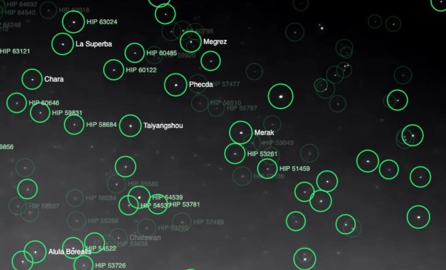

| What you see | What it means |
|---|---|
| **Bright green circle** | A star among the hundred brightest in the field — **or** one the catalog gave a real name to, which always draws at full strength however faint it measured |
| **Faint thin green circle** | A star fainter than that with no proper name — measured exactly the same way, drawn quietly so a rich field does not bury the footage it is annotating |
| **Star name** (`Megrez`, `HIP 53726`) | The catalog identification. A proper name where the star has one — drawn more prominently — otherwise its Hipparcos number |
| **Red circle** | Something moving against the stars, labelled with how far it drifted |
| **Orange ring** | Lights moving together as one object. A ring can also mark a *single* light too fragmented to hold as one track — a flashing beacon, say — which is then labelled `faint moving object` |

A red detection looks like this:

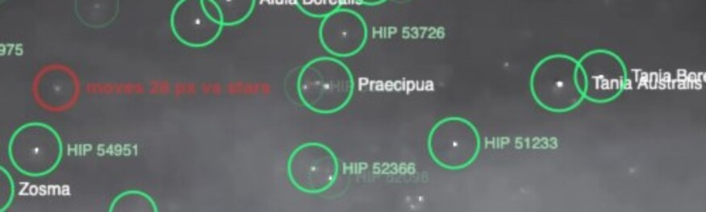

*`moves 28 px vs stars` — this point of light did not stay where the sky did.*

The Star Tracker does not put a moving object into the 3D views. To follow one and get a line of sight, use [Point Tracking](PointTrack.md).

**Clicking a green circle toggles that star off** — it dims but stays visible, so you can click it back on. This is for the case where you can see something has been mis-measured, or know a "star" is really a planet, and would rather it did not vote. Toggling is read when identification runs, so **re-run *Identify Stars (catalog)*** for it to take effect. Only stars toggle; red and orange markers do not. The circle is what you click, so turning **Show star markers** off also turns the toggling off — names alone are not clickable.

### The five verdicts

Every track ends up in one of five classes. Only two are drawn by default:

| Class | Meaning | Drawn |
|---|---|---|
| `star` | Fixed on the sky within the noise, over the analysed frames | Green |
| `moving` | A coherent drift against the sky, above both **Moving** thresholds. A wide or cropped clip with no fitted lens can give false ones: see [Troubleshooting](#troubleshooting) | Red |
| `cameraFixed` | Fixed in the *frame* while the sky slides past — dust, a hot pixel, a reticle | Amber, only with **Show rejected** |
| `incoherent` | Detected repeatedly, but seen on under 40% of the frames it spans, or scattered; never settled anywhere | Dashed gray, only with **Show rejected** |
| `short` | Too few detections to say anything either way | Never drawn |

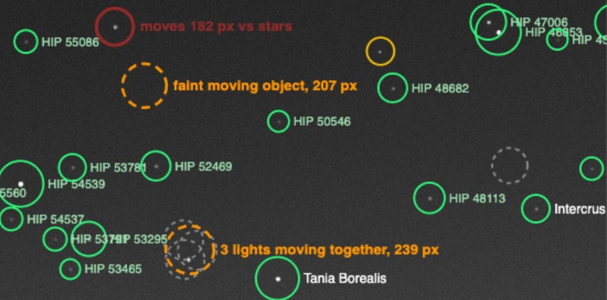

*The marks together on a frame of the generated test clip, with **Show rejected** on and **Show quad lines** off. Red: a steady point that drifts, `moves 182 px vs stars`. Orange dashed rings: `3 lights moving together, 239 px`, and `faint moving object, 207 px`, which is one flashing light, dark on this frame. Amber: a hot pixel, `cameraFixed`. Dashed gray: `incoherent`. At the right, a point that shows on too few of the frames it spans, dark on this frame. Over the orange ring, each of the three flashing lights on its own.*

`short` is often the largest group. That is expected, not a failure.

Green means only that the point did not move measurably. A planet is green, and so is anything that drifts less than the **Moving** thresholds. A name means that the point's position matched a catalog star.

## GUI reference

The Star Tracker folder lives under **Video**.

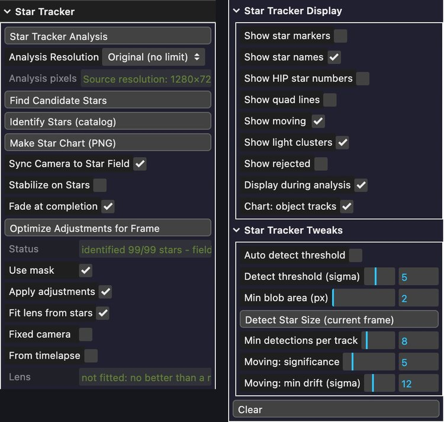

*The folder after a run, with [Star Tracker Display](#star-tracker-display) and [Star Tracker Tweaks](#star-tracker-tweaks) open. The completion fade has turned off **Show star markers**, **Show HIP star numbers** and **Show quad lines**. The menu is one column. It is cut in two here to fit the page: the part on the right continues from the bottom of the part on the left.*

| Control | What it does |
|---|---|
| **Star Tracker Analysis** | The one-click path: run all three steps in order. If the analysis fails, the chain stops and its error stays on screen. A failed *Detect Star Size* does not stop it — see [Stage 0](#stage-0--measure-the-star-size) |
| **Analysis Resolution** / **Analysis pixels** | The resolution the frames are analysed at, shared with the other video analysis tools. See [Analysis resolution](PointTrack.md#analysis-resolution) in Point Track |
| **Sync Camera to Star Field** | On by default. Whenever an identification succeeds, point Sitrec's camera the way the identification says the real one was pointing: *Star Track* is selected as both the heading and the FOV source (only the heading on a fisheye or timelapse run, where the Fisheye render carries the field of view). Untick it to put both back to the sources they were on before, so you can compare the solved pointing with your own |
| **Fade at completion** | On by default. After a successful identification, fade out the quad lines, then the star circles, then most HIP-number labels, and turn off their switches in [Star Tracker Display](#star-tracker-display). See [Reading the results](#reading-the-results). Tick a switch again to bring its layer back. A failed run never fades |
| **Optimize Adjustments for Frame** | Tune the picture for this analysis — the same thing as *Optimize For Star Tracking* under Video Adjustments, offered here because this is where you are when you want it. See [Optimize For Star Tracking](#optimize-for-star-tracking). Its *Enough* / *Abort* controls appear in whichever folder you can see, so a run started here can be stopped here |
| **Status** | What the last stage did, or what it found |
| **Use mask** | Discard detections that fall inside the video mask, so trees, rooftops and other lit foreground are never mistaken for stars. On by default, and does nothing unless a mask has been painted — see [Masking out the ground](#masking-out-the-ground) |
| **Apply adjustments** | Analyse the frame as you see it, with **Video → Video Adjustments** applied — levels, curves, sharpen, blur, brightness and the rest. On by default, and does nothing unless you have set some adjustments. Turn it off to analyse the raw decoded frame instead, which can find stars that are not visible on screen, or miss ones that only the adjustments bring out |
| **Fit lens from stars** | Measure the camera's actual optics from the star field, and judge motion on a sphere rather than with a flat model. Reasonable to leave on: it declines when the clip does not constrain a lens, and says so. See [why this matters](#why-fitting-the-lens-matters) |
| **Fixed camera** | The camera did not move, turn or zoom during the clip — a mounted allsky or meteor camera. The sky then turns rigidly about one axis at one rate, so the solver fits three numbers for the whole clip instead of an orientation per frame. Far more robust on a sparse or very wide field, and the **Lens** field reports the exposure interval the fitted rate implies. It needs a lens: the Fisheye render, or a successful **Fit lens from stars**. Off by default; leave it off for hand-held or panned footage. See [Allsky and fisheye footage](#allsky-and-fisheye-footage) |
| **From timelapse** | The loaded file is one still image: a stack of star trails from a fixed camera, taken between the **In** and **Out** frames. Star Tracker Analysis then finds the trails instead of points, and the lens and the camera's pointing are fitted from both ends of every trail. On a real video this box has no effect. Off by default. See [Timelapse star trails](#timelapse-star-trails) |
| **Lens** | The fitted lens, e.g. `custom, 96 deg, rms 0.15 px`, or why it declined. The angle is the horizontal field of view, and **custom** means a lens curve fitted from the stars. **Camera → Lens** holds the full fit, with the horizontal, vertical and diagonal fields of view and a **Copy lens JSON** button. Sitrec's camera FOV is the vertical value. When the Fisheye render is on it reports that lens instead, e.g. `fisheye (Camera menu) Equisolid-angle fisheye, 158.6 deg circle, rms 0.30 px` — plus, after identification, the lens calibrated from the named stars |
| **Star Tracker Display** | A sub-menu with the switches for what the Star Tracker draws on the video. See [Star Tracker Display](#star-tracker-display) |
| **Star Tracker Tweaks** | A sub-menu with the detection and classification settings, and the separate steps that **Star Tracker Analysis** runs. See [Star Tracker Tweaks](#star-tracker-tweaks) |
| **Clear** | Discard the analysis: the overlay, the solve, the fitted lens reported in the Camera menu, and the camera options that Sync added. Your Tweaks settings are left alone |

### Star Tracker Display

The switches for what the Star Tracker draws. Each switch controls one layer, so you can turn one off and keep the others.

| Control | What it does |
|---|---|
| **Show star markers** | Draw the green circles round the stars. The circles only — the names and the quad lines are separate switches, so you can read the names over clean video |
| **Show star names** | Label identified stars with their catalog names. Independent of **Show star markers**: with the circles off the name sits beside the star itself |
| **Show HIP star numbers** | Also label the stars that have no proper name, by Hipparcos number. Most matches are these; untick it to leave only the named stars. Needs **Show star names** |
| **Show quad lines** | Draw the four-star shapes the solve matched against the catalog, line weight scaling with how much of the field each one explains. On by default; they are the visible evidence for the identification, so turn them off once you trust it. See [Identifying the stars](#identifying-the-stars) |
| **Show moving** | Draw the red circles |
| **Show light clusters** | Draw the orange rings |
| **Show rejected** | Also draw the tracks classified `incoherent` or `cameraFixed`. These are things that *were* followed but did not qualify as stars — not blobs the detector threw out earlier |
| **Display during analysis** | Show what each stage is working on while it runs — see [Watching it work](#watching-it-work). On by default |
| **Chart: object tracks** | Include moving-object tracks on the star chart exported by *Make Star Chart (PNG)*, rather than stars alone |

### Star Tracker Tweaks

**Star Tracker Analysis** measures **Min blob area** for you, unless you chose it, and sets **Detect threshold (sigma)** only when **Auto detect threshold** is on. The other sliders keep their values. These controls are here for footage the defaults do not suit.

| Control | Range | What it does |
|---|---|---|
| **Detect Star Size (current frame)** | — | Measure the star blob size on the frame currently shown, and scale the detection settings to it. Pressing it replaces *Min blob area* whatever it was set to; the copy that runs inside **Star Tracker Analysis** leaves a value you chose alone |
| **Auto detect threshold** | — | Off by default. Measure the detection threshold from three spread-out frames each time *Detect Star Size* runs: inside **Star Tracker Analysis**, or when you press the button. **Find Candidate Stars** alone uses the slider value. The slider below shows the value it chose; when the frames are too sparse to read, the slider's own value stands |
| **Detect threshold (sigma)** | 2–10 | How far above the local sky a pixel must be to count, in multiples of the sky's *brightness* noise. Lower finds fainter stars and more false ones. Tuned automatically by [Optimize For Star Tracking](#optimize-for-star-tracking) |
| **Min blob area (px)** | 2–40 | Smallest blob accepted. Once you set it by hand — or [Optimize For Star Tracking](#optimize-for-star-tracking) sets it — it is yours: **Star Tracker Analysis** runs with it rather than quietly measuring over it. Pressing **Detect Star Size** still replaces it, because that button *is* the request to measure |
| **Min detections per track** | 3–40 | How many frames a point must appear in before it is judged at all. Below this it is `short` |
| **Moving: significance** | 2–20 | How *confident* the drift must be — how many times larger than its own uncertainty. Raise it if slow-drifting stars are being called movers |
| **Moving: min drift (sigma)** | 2–40 | How *far* it must actually move, in multiples of this clip's position noise. Raise it to ignore small real motions and only catch obvious ones |
| **Find Candidate Stars** | — | Run the analysis only |
| **Identify Stars (catalog)** | — | Run the catalog match against the last analysis |
| **Make Star Chart (PNG)** | — | Export a chart of the solved field |

## Optimize For Star Tracking

**Video → Video Adjustments → Optimize For Star Tracking** tunes the picture, and then the
detector, for the frame you are looking at. Press it on a representative frame with the sky
visible; it works on the current frame only. The same button is in the Star Tracker folder as
**Optimize Adjustments for Frame** — one feature, two places to reach it, and its *Enough* /
*Abort* controls appear in both while it runs.

It finishes by identifying the stars for the settings it chose, so the run **ends with the stars
named on screen** rather than leaving you to press *Star Tracker Analysis* to find out what it found.

It runs in two parts: a search over the picture, then a check against the catalog. You can press
**Enough (Accept)** to stop the picture search. The catalog check still runs, and it can still
reject the result. A press during the check shortens it and uses the best result so far.
**Abort (Reset)** puts every slider back exactly as it was. The result, and any refusal to run,
appear in a **Star Tracking** row under the button, not in **Status**.

**The picture search (about 10 seconds).** A genetic search over *Brightness*, *Contrast*,
*Shadows*, *Highlights*, *Dehaze* and *Blur*. Each candidate is scored against a fixed measurement
of the untouched frame: see
[How Optimize For Star Tracking scores a picture](#how-optimize-for-star-tracking-scores-a-picture).
Your current settings are always tried first, so the search can answer that you were already right.

**The catalog check (ten seconds or so).** Everything here is scored on how many stars the
**catalog actually identifies** — the real end of the pipeline, not a proxy for it. It:

1. measures what the settings you arrived with identify, as the baseline to beat;
2. re-scores the picture search's best few candidates the same way, because the search judges a
   *picture* and this judges the *answer*;
3. sweeps *Detect threshold* and *Min blob area* from
   [Star Tracker Tweaks](#star-tracker-tweaks) for whichever candidate wins;
4. and, if none of that identifies more stars than you already had, **puts everything back** and
   says "Kept your settings".

New settings are kept only when they identify more stars on this frame.

The check exists because extracting *more* detections only helps up to the depth of the star
catalog. Past that, the extra detections have no catalog counterpart, they become clutter in the
quad search, and identification collapses entirely — on one test image, 47 detections identified
**zero** stars where the same picture at a higher threshold gave 15 detections and 8 identified.

On one test image, five consecutive runs from the same starting point gave the results below.
Other footage can differ.

| | detections | identified |
|---|---|---|
| Untouched | 16 | 8 |
| Optimized | 20–28 | **14, 15, 15, 25, 27** |

The search is stochastic, so runs differ; pressing it twice is reasonable if a result looks
unambitious.

The settings it chose are the settings **Star Tracker Analysis** runs with — including *Min blob area*,
which the chained *Detect Star Size* would otherwise have silently re-measured. On a still image,
Star Tracker Analysis therefore gives the same result as the optimizer. On a video the optimizer scores
only the current frame, so a whole-clip Star Tracker Analysis can identify a different number of stars. With
**Auto detect threshold** on, the threshold is re-measured before every **Star Tracker Analysis**, so the
optimizer does not sweep one; it tunes the picture and the blob size and leaves the threshold to
the automation you asked for.

Four things worth knowing:

- It refuses to run unless **Enable Video Effects** and the Star Tracker's **Apply adjustments**
  are on — with either off the analysis reads the raw frame, so anything this found would be tuned
  for a picture the Star Tracker is never going to look at.
- The settings are tuned for *one* frame. On a clip whose exposure or sky brightness changes, check
  a frame from each part before trusting them across the whole thing.
- On a video, the catalog check judges each candidate by analysing the **current frame alone**, so
  it stays a half-minute job on a clip of any length. The adjustments it picks are still applied to
  the whole clip when you run the analysis.
- When it applies new settings it leaves *their* analysis on screen, stars named. On a video that
  is a single-frame analysis where a whole-clip one may have been — run **Star Tracker Analysis** to get
  the clip back. When it changes nothing (aborted, or it could not beat your settings) your previous
  analysis is restored.

## Masking out the ground

If the frame contains trees, rooftops, a hillside or anything else lit from below, mask them out
before analysing. Lit foliage is exactly what the detector is looking for — small, bright and
stationary — and it is detected in quantity.

Measured on a wide night photograph with a treeline: without a mask it detected about a thousand
"stars", roughly 40% of them foliage, and identification could not hold a consensus against that
and failed. With the ground masked it kept 423 detections, none in the trees, and identified
**221 stars**.

1. Open **Video → Masking → Auto Masking** and click **Mask Ground (auto)**.
2. Check the red overlay covers the foliage, and tidy it by hand with **Edit Mask** if not.
3. Leave **Use mask** ticked in the Star Tracker folder — it is on by default.

Detections inside the mask are discarded before classification. They are not drawn, and they do
not appear in *Show rejected*, which covers only tracks that failed classification. If an expected
star is missing, turn on **Video → Masking → Show Mask** and check whether it is under the mask.
Note the detector still *looks* inside masked regions, so the
local background near a mask edge is measured from those pixels; that is a small effect, but it
means a mask is not quite the same as cropping the frame.

See [Masking](Masking.md) for the other ways to build a mask — including masking a burned-in
timestamp or reticle, which is worth doing for the same reason.

## Interrupting a long run

Detection walks every frame in the In/Out range before anything can be solved, so a long range takes a long time. Two buttons appear while it runs:

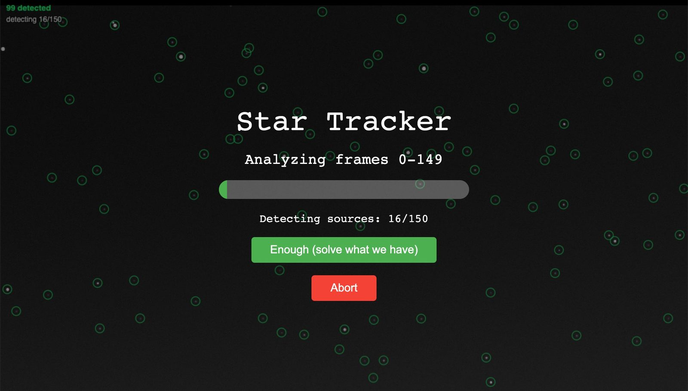

*Detection on a generated test clip, at frame 16 of 150. Behind the dialog, **Display during analysis** circles the detections on this frame, and the top left gives the count, `99 detected`. See [Watching it work](#watching-it-work).*

- **Enough (solve what we have)** — stop scanning, keep every frame measured so far, and run the full solve on that shorter stretch. If you started from **Star Tracker Analysis**, identification and camera sync still follow exactly as on a complete run; if you started from **Find Candidate Stars**, only the analysis runs, as it would anyway. After **Find Candidate Stars**, the Status line records how much of the clip the numbers came from, e.g. `(stopped early, 60/300 frames)`. After **Star Tracker Analysis**, the identification line replaces it. The button goes away when scanning ends, because after that there is nothing left to stop short of.
- **Abort** — stop and discard the run. It takes effect within a fraction of a second while frames are scanned, and while the camera motion and the star map are solved. The stages after those check it only between steps, so pressing it during the lens fit may not take effect until that stage finishes.

Use **Enough** when the answer has clearly settled, or when you set the range wider than you meant to.

Playback is **paused for the duration and cannot be resumed** — the detect pass steps the video frame by frame itself, and live playback advancing the same counter would interleave with it. When the run finishes it parks on the **first analysed frame**, the start of what was measured, and stays paused.

## Watching it work

With **Display during analysis** on (the default), each stage shows what it is doing.

| Stage | What you see |
|---|---|
| **Detecting sources** | Every accepted blob on the current frame circled, with a running count. These are raw detections — nothing is solved yet, so there is no classification, no name, and a star missed on this frame simply is not circled. It shows what the detector passes to the solver, which makes a bad **Detect threshold** or **Min blob area** obvious without waiting for the run to end |
| **Fitting camera lens** | A crosshair at the **optical axis** the fit currently believes in, tethered to the frame centre so the offset is the visible quantity, with the running rms and focal length. It draws lightly while searching and solidly once settled |
| **Solving sky rotation** / **Re-solving on stars only** | The residual being minimised, how far it has come, and the **step size against the tolerance that stops the loop** — so you can tell "nearly done" from "stuck" |
| **Identifying** | Verified quads drawn over the field, line weight scaling with how much of the whole field each hypothesis explains. On a good map the search is over in under a tenth of a second, and a hard field can take seconds. Up to five of the best quads stay on screen afterwards, until the fade removes them |

Two stages — **Solving camera motion** and **Building star map** — draw nothing on the video. On a long clip they take up to a minute, so they run in a background thread: the page stays responsive, the progress bar moves through them, and its text gives the percentage of the solve done.

## How it works

This section is for readers who want the method. You do not need it to use the tool.

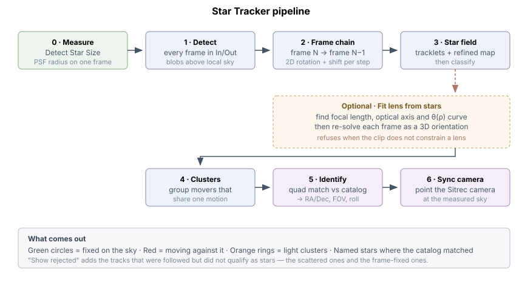

### Stage 0 — measure the star size

Star blobs are a few pixels across, but *how many* depends on the camera, the focus, the exposure and the resolution. Rather than assume, **Detect Star Size** measures the point spread function on the frame you are looking at and scales the detection settings to match. A failure here does not stop the chain — the previous (or default) settings stay in place, so the analysis is still runnable.

### Stage 1 — find the point sources

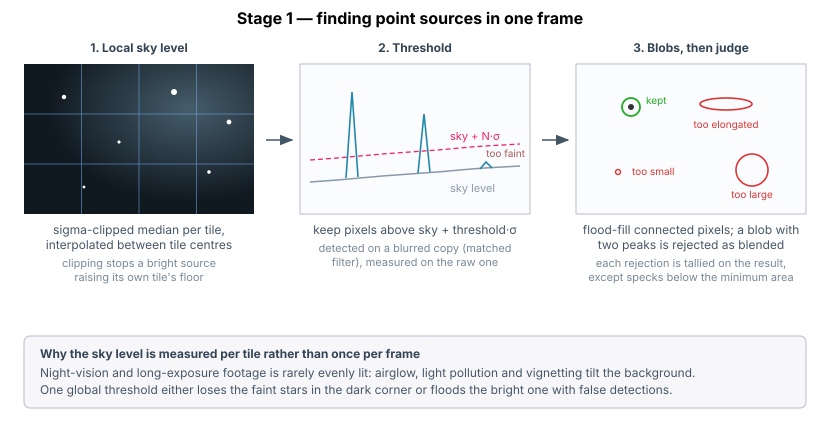

Each frame is reduced to brightness alone (luma), and the **sky level is measured per tile** rather than once for the whole frame — night footage is rarely evenly lit, and one global threshold either loses the faint stars in the dark corner or floods the bright one with false detections. Each tile's level is a *sigma-clipped* median: samples well above the running median are discarded and it is re-measured, which stops a bright source from dragging up the very background it is measured against.

Detection then runs on a blurred copy (a matched filter, which favours things the size of a star) while measurement runs on the raw pixels. Connected bright pixels are flood-filled into blobs, and each blob is judged on area, elongation, signal-to-noise, color evidence and whether it touches the frame edge. A blob that holds more than one peak is **split**. That is two stars close enough to merge into a single blob, or a bright star with a fainter star inside its halo. The peaks are found by a dip in brightness along the line that joins them. The blob is divided along those dips, and the part that holds the biggest peak is measured as the source. The biggest peak is the brightest one. When more than one peak is at the clip level, it is the one whose part holds the most light. The other parts are not measured, so the fainter star of a merged pair gets no circle. The limit on area is applied to the whole blob.

Almost nothing is discarded without a record: each rejection is tallied with its reason, and a sample of individual cases is kept, both stored on the analysis result. The exceptions are specks below the minimum area, which are dropped during the flood fill, and the fainter parts of a split blob. Neither reaches the tally. Note these are **diagnostic records, not something drawn on the video** — *Show rejected* is a separate control covering tracks that failed *classification* later on.

### Stage 2 — undo the camera's motion

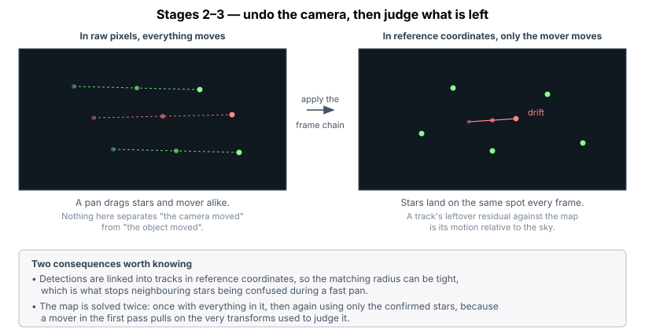

Between consecutive frames, the same stars appear in slightly different places. Matching them gives a flat **2D transform** — one rotation and one shift — describing how the camera moved. Scale is deliberately held fixed: letting it float lets a handful of hot pixels drag the fit. Chaining those steps gives, for every frame, a transform into a common **reference** grid.

Three matchers run: predict where each star should be from the previous step's motion; match triangle shapes, which works even after a jump because a triangle's shape does not depend on where the camera is pointing; and vote on a common offset. **All three are consulted every time and the one explaining the most sources wins**, because a tight cluster of stationary artifacts can look like a strong lock while the real field has shifted somewhere else entirely, registering the frame wrongly with no failure to show for it. Frames where nothing worked are recorded rather than papered over, and weakly-fitted frames are flagged so a chain that is partly guesswork does not look uniformly trustworthy.

This stage also spots things **fixed in the frame** while the sky slides past — dust, hot pixels, a reticle.

### Stage 3 — build the map and judge what moved

Detections are grouped into tracks **in reference coordinates**, not raw pixels. That matters: in reference coordinates a star barely moves however fast the camera pans, so the matching radius can be kept tight, which is what stops neighbouring stars being confused during a fast pan. (It is not free — where the frame registration is rough, a single real track can still fragment into several.)

The map and the transforms are then refined together, which removes the drift that accumulates along a chain of frame-to-frame steps. After that, **a track's leftover residual against the map *is* its motion relative to the sky** — nothing has to be assumed about what the "normal" motion ought to be.

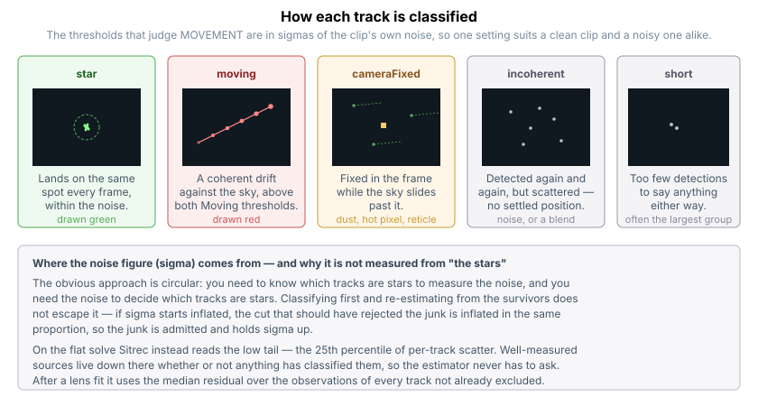

Where there are enough confirmed stars to support it, the solve then runs a **second time using only those stars**. This matters more than it sounds: the first pass necessarily includes the movers and the artifacts, and those pull on the very transforms used to judge them. Re-solving on things that actually belong to the sky gives a cleaner map, and the classification is repeated against it. On a sparse field with too few confirmed stars the second pass is skipped and the first-pass verdicts stand.

### Why fitting the lens matters

Everything above treats the picture as flat. A real lens is not.

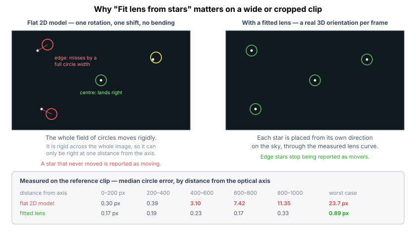

*Measured on one particular clip: a cropped wide-angle Starlink timelapse whose optical axis sits 336 px off centre, sampled at a single frame over the 231 stars observed in it. The figures show the shape of the problem, not a universal scale — on a narrow-field clip the flat model's error stays small everywhere.*

The flat model moves the whole field of circles rigidly. But a wide lens *bends*: one rotation of the sky moves a star at the frame edge a different number of pixels than a star at the centre. A rigid model can therefore only be correct at one distance from the optical axis, and the error grows outward from there. A homography (a transform that maps one flat picture to another in perspective) does not rescue it either: it measured 11.4 px against the rigid model's 11.7. A homography describes a rotation of a distortion-free camera exactly, so what remains is the lens's own radial distortion.

On a cropped clip the error is lopsided rather than symmetric, because a crop moves the optical axis away from the centre of the picture.

With **Fit lens from stars** on, Sitrec measures the focal length, the position of the optical axis and the shape of the lens curve from the star field itself, then re-solves each frame as a genuine 3D orientation, placing each star from its own direction on the sky.

The fit works from a pair of frames far enough apart to have moved appreciably (the *baseline*), sharing enough matched stars, and rotating in a way that actually exercises the lens. The rotation that tells you **nothing** is roll about the optical axis — spin the camera about its own line of sight and every star moves a long way while no star changes its distance from the axis, which is precisely the quantity a lens curve describes. A pan across the sky does constrain it. When the correspondences suggest the axis is *not* near the frame centre, a coarse grid search runs first, because on a cropped clip the true axis can be hundreds of pixels away; on a normally-centred clip that search is skipped.

**It declines when the evidence does not support a fit**, and scores candidates against stars held out of the final fitting rather than only the ones it trained on. That is what makes it reasonable to leave on: on a clip that does not constrain a lens it says so in the **Lens** field and the flat model stands. The holdout score is not a fully independent test, because earlier stages of the search see all the correspondences.

**What the lens fit does not change.** It improves the *verdicts* — which tracks are called stars — and the placement of the circles. It does **not** migrate the rest of the pipeline onto the sphere: detections are still associated in 2D, and star identification and cluster placement still work from the flat chart. See [Limitations](#limitations-and-when-it-refuses).

### Stage 4 — group the movers

Several red detections moving together are usually one object — an aircraft's navigation lights, say. Tracks that are not stars and share a common motion are grouped into a single cluster, drawn as an orange ring. Notably this includes tracks that were individually dismissed as *short* or *incoherent*, which is exactly what a flashing light looks like on its own.

### Identifying the stars

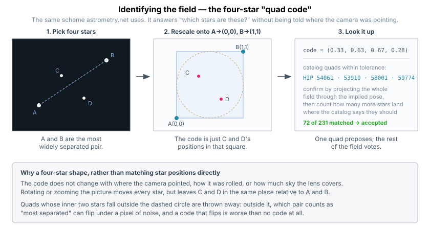

Identification uses the same scheme as [astrometry.net](https://astrometry.net): a **quad code**. Take four stars; find the two most widely separated, call them A and B; then describe where the other two sit in coordinates where A is (0,0) and B is (1,1).

That description does not change when the camera points elsewhere, rolls, or zooms — so it can be looked up in an index of catalog quads without any starting guess about where the picture is. (Strictly the invariance is exact only for a flat, undistorted picture; the matcher widens its tolerance to absorb the lens curvature rather than modelling it.) A matching catalog quad proposes a camera orientation and scale; the rest of the field then votes on it, by projecting every catalog star through that proposal and counting how many land where they should.

The catalog ships with Sitrec and is fetched from your own Sitrec server the first time you press Identify — no third-party service is contacted. It holds about 118,000 stars keyed by Hipparcos number, down to roughly magnitude 12. The *index* is built only from the bright end — the tiers cut at magnitude 6.5 — but the final match runs against the whole catalog, so stars far fainter than any naked-eye limit can still be named. The quad index is **built at runtime** rather than shipped, so it can never drift out of sync with the catalog. Proper names come from the IAU Catalog of Star Names. A star must appear in a reasonable share of the analysed frames to be offered to the matcher, so a very short range gives it little to work with.

The result is the field centre in RA/Dec, the roll angle, and a field of view. Read that last figure as an estimate: it is the field the star map *would* span if the lens were perfectly rectilinear, and the pixels-per-degree figure applies at the field centre. On a fisheye without the Fisheye render it is a rough estimate, not a measurement of the lens — that is what **Fit lens from stars** is for. With **Sync Camera to Star Field** ticked, Sitrec's camera is then pointed accordingly.

### Allsky and fisheye footage

An allsky camera breaks two of the assumptions above at once: its field is far too wide for any
flat model, and it never turns — so the lens fit, which needs the camera to move, refuses. Both
are handled by telling Sitrec what it already knows.

**A known lens.** For a video clip, when **Fisheye Lens** is ticked in **Camera → FOV (Zoom) → Fisheye**, the Star Tracker takes that
lens — the projection, the image circle's size and centre — as the camera's optics and skips the
fit entirely; the **Lens** field says `fisheye (Camera menu) …`. The lens is read in fractions
of the frame height exactly as the render defines it, so it is exact whenever the look view is
framed like the video. The classification then runs on the sphere through that lens, as it does after
a successful fit. Roll is not part of a lens: the solved orientation absorbs it, and the camera
sync puts it back. A single still image without **From timelapse** is analysed without the Fisheye
lens, so this section does not apply to it: see [Limitations](#limitations-and-when-it-refuses).

**Fixed camera.** Tick **Fixed camera** and the sky-rotation solve stops fitting an orientation
per frame. This needs a lens: turn on the Fisheye render, or let **Fit lens from stars** succeed.
With neither, the box has no effect, and the **Lens** field shows `not fitted: ...` or `off`. A camera that does not move sees the whole sky turn rigidly about one axis (the
celestial pole) at one rate (the Earth's), so the clip's entire camera motion is three numbers,
and every star in every frame votes on the same three. That is what makes a timelapse whose
stars move under a pixel per frame solvable: there is too little in any one frame to pin its
orientation, but plenty across all of them to pin one axis. The rate is *fitted*, not taken from
the clock, and comparing it with the sidereal rate reports the exposure interval — on
one test allsky clip, `0.0628 deg/frame (15.0 s/frame)`, which is the camera's 15 s
exposures recovered from the stars alone. The frames must be equal time steps; a gap in the
timelapse shows up as a raised rms.

**Identification, and the lens calibrated from it.** A 160° field has no flat chart, so a
known-lens run identifies from a gnomonic chart of the solved *sphere* (a flat map of part of the
sky, projected from the sphere's centre), limited to the central
70° a plane can carry, and verified at a wider tolerance than usual, to allow for a lens
matched by hand. Once stars are named, every one of them
is a pixel-to-catalog correspondence, and those calibrate the lens far more strongly than any
pair of frames could: focal length, centre and orientation are fitted for the projection you
chose, the match is then widened to every star out to the rim, and the other projections are
scored on the same stars so the **Lens** field can say if one of them fits better. **Sync
Camera to Star Field** then sets the Fisheye render's **Fisheye FOV °**, **Center X %** and **Center Y %** from that fit
(the projection and the drawn circle are left as you set them) and points the camera. On the
same clip the render's stars land within a pixel of the video's across the whole field,
where the hand-matched lens had been fifteen pixels out at 30° off-axis.

### Timelapse star trails

A fixed camera that stacks its exposures into one image draws every star as an arc about the
celestial pole. There are no points to detect, but each trail holds two exact star positions:
where the star was when the stack started, and where it was when the stack ended. Load the one image, tick **From
timelapse**, set **In** and **Out** to the start and end of the stack, and press **Star Tracker Analysis**.
On a real video the box has no effect.

1. **Trails.** The image is thresholded against the local sky, and the pixels kept are the
   ridges of lines that run *along* circles about one centre. That centre is found first, as the
   point the trails' normals pass closest to; a satellite or aircraft line that crosses a trail
   points the wrong way, so it is cut out of the trail rather than merged with it. Pieces of a
   dotted or broken trail are joined end to end, but never into a chain that spans clearly more
   than a typical star's turn — two stars at the same declination share a circle.
2. **Start and end.** Each end is measured where the brightness along the trail falls to half its
   level, which is where the true end is whatever the star's brightness. The sky turns
   counterclockwise about the north celestial pole as seen looking at it, so a trail starts at its
   clockwise end around the pole and ends at its counterclockwise end (the other way round about
   the south pole). The *Status* line shows the centre and the turn only when **Find Candidate
   Stars** runs alone. After **Star Tracker Analysis** the **Lens** line reports the turn.
3. **Identification.** The starts become the image's stars at the **In** frame, and are identified
   as for any still. A star too close to the centre to show an arc is used at its middle.
4. **Lens and pointing.** A fixed camera has one orientation relative to the ground for the
   whole stack, while every star moves. So the fit is made in Earth-fixed coordinates, with each
   star's direction computed as the render draws it (with aberration and refraction for the
   camera's position). The stack is taken to be centred on the In/Out range: how far the
   stars turned is *measured*, and every start is the star's direction half that turn before the
   middle of the range, every end half that turn after it. The order of the ends is checked against
   the Earth's rotation and swapped if the camera was pointed the other way. Every projection is
   fitted — the General fisheye curve with its *k* free — to every catalog star found on a trail
   end, and the best one is kept. The General curve is chosen only when it beats every named
   projection clearly.

The **Lens** line then reads, for example, `timelapse fit: General fisheye (curve k) k 0.889,
f 1349 px, centre (77, -25) px off, rms 1.32 px over 715 trail ends; trails turn 20.6 min (In/Out
20.0)`. The measured turn reads slightly long, because each measured end lies about half a pixel
past the true one; that does not move the middle, which is what sets the camera. With **Sync
Camera to Star Field** on, the Fisheye render (**Camera → FOV (Zoom) → Fisheye**) is turned on
and set to that lens — projection, **Curve k**, **Fisheye FOV** and **Center X/Y** — and the look
camera is held at the fitted orientation for every frame. That orientation is fixed relative to
the ground, so it stays correct when you move the camera's position afterwards: the stars are
far enough away that a move of a few kilometres does not change them, while it does move nearby
aircraft and the skyline.

Use **Use mask** to keep foreground lights and the ground out of the trail search.

### How Optimize For Star Tracking scores a picture

Before the search starts, Sitrec measures the frame **with the six picture controls at neutral**
and keeps the result as a fixed yardstick — a map of how statistically significant every part of
the picture is against its own noise. A candidate's detections are then credited by what that
*fixed* map says is at each location.

The detector decides what is a star by comparing each blob against the **local noise**. So if
you crush the blacks hard enough, the measured noise collapses, and every surviving speck of
sensor noise starts looking like a brilliant star. A candidate scored against its own pixels could
therefore raise its score that way. Scored against the fixed yardstick, it cannot.

Each candidate is scored on four things:

- **Anchor quality** — the 25 detections the catalog matcher would use for its quads: isolated,
  compact and round, brightest first. Each is credited by the fixed evidence at its position and
  by how close its size is to the size of the frame's own stars.
- **Depth** — the same credit over as many detections as the field can carry, so a real star past
  the 25th still counts.
- **Junk cost** — each detection costs in proportion to how little evidence is behind it.
- **Tonal integrity** — clipping and noise-floor collapse measured against the neutral frame.

Masked detections are not counted at all, or it would optimise for whatever makes the *trees*
brightest.

One limitation worth knowing: the yardstick is measured from the neutral frame, so it sees what is
*statistically* present rather than what is visible — a star too faint to see still counts. But if
the footage is so crushed that the neutral frame holds no signal at all, there is nothing for the
reference to find, and the search will under-credit adjustments that genuinely recover it.

## Limitations and when it refuses

- **The lens fit declines on clips whose motion does not exercise the lens.** Rolling about the line of sight, or too short a baseline between the frames it compares, leaves the lens shape unconstrained. This is reported in the **Lens** field, not hidden.
- **Star identification needs enough stars.** It refuses fewer than five, and a handful of bright points in a narrow field may not produce a unique quad match. If identification fails, set the camera's direction and field of view by hand: see [The Camera and Target Menus](CameraAndTarget.md).
- **Hand-held footage works, but a zoom reads as motion.** The frame-to-frame solve holds scale fixed. In a synthetic test of that solve, a 5% zoom across 40 frames called 79 of 84 stars *moving*. Analyse a stretch with no zoom.
- **The Star Tracker reads the stabilized picture.** With **Video → Motion Analysis → Stabilize Video** or **Video → Point Track → Stabilize** on, the detector reads the shifted frames, so the solve follows the shifted picture and not the camera. Press **Disable Stabilization** before you run the analysis.
- **A still image is a special case.** With one real frame there is no motion to solve, so every detected point is taken as a star. The **Enough** button is not offered, since there is nothing to stop short of. On a still, the Fisheye render, **Fit lens from stars** and **Fixed camera** have no effect, and identification uses the flat chart. **From timelapse** is the exception: it takes the Fisheye render as its starting lens.
- **The frame range is the In/Out range**, not the whole video. If the analysis covers less than you expected, check your In and Out markers.
- **Identification runs on the flat 2D map when a lens has been *fitted*.** The two features are deliberately decoupled for now: the matcher is calibrated end to end against what the flat chart produces, and feeding it the extra edge stars the lens fit recovers costs it its match consensus. So a fitted lens improves what is *called a star*, but does not currently widen what gets *named*. A *known* fisheye lens is the exception — its identification runs on a chart of the sphere (see [Allsky and fisheye footage](#allsky-and-fisheye-footage)), but only the central 70° of the field takes part in the blind match; the rim stars are named afterwards, through the calibrated lens.
- **From timelapse needs the stack's time.** The stars cannot tell when the stack was taken,
  because a time offset turns the sky exactly as turning the camera about the pole does. The
  stack is taken to be centred on the In/Out range; an error of *t* seconds in that
  turns the camera by 15 arcseconds per second about the celestial pole. Something fixed to the
  ground — a skyline, an aircraft track — is what can check it. A trail cut by the frame edge or
  the skyline is left out of the fit; one that crosses another star's trail on the same circle
  can be cut short, and the fit discards it.
- **Fixed camera assumes equal time steps.** Dropped frames or a gap in a timelapse cannot be expressed by one rate, and show up as a raised rms; untick it and the free per-frame solve handles them.

## Troubleshooting

| Symptom | Likely cause |
|---|---|
| Almost everything is called *moving* | The lens was not fitted and the clip is wide or cropped, so the flat model is biased at the frame edges. Check the **Lens** field |
| Very few stars found | **Detect threshold (sigma)** too high, or **Min blob area** too large for this footage. Run **Detect Star Size** on a representative frame first, or press **Optimize Adjustments for Frame** on a frame with sky and then run **Star Tracker Analysis** |
| A visible star is not circled | Check that **Show star markers** is on, in **Star Tracker Display**: the completion fade turns it off. Then turn on **Show rejected**: if the point appears, it was followed but judged `incoherent` or `cameraFixed`. If it does not, it is a `short` track (lower **Min detections per track**, or use a longer In/Out range), a detection under the mask (turn on **Show Mask** to check), or a point the detector never accepted (lower **Detect threshold (sigma)** or **Min blob area**) |
| Identification finds nothing | Too few solved stars, or a field too sparse for a unique quad: try a longer In/Out range. Or too many detections: clutter defeats the match. Mask the ground, raise **Detect threshold (sigma)**, or press **Optimize Adjustments for Frame** |
| Fisheye footage: many real stars called *moving*, or the sphere solve fails | Turn on **Fixed camera** for a mounted camera. Check the Fisheye render is roughly matched to the footage first — the solve takes that lens as given |
| The run is taking forever | Press **Enough (solve what we have)**, or shorten the In/Out range |

## See also

- [Masking](Masking.md) — excluding trees, an OSD or a vignette from the analysis
- [Point Tracking](PointTrack.md) — follow an object and turn it into a line of sight
- [Long Exposure/Stacking](LongExposure.md) — stacking frames, which pairs naturally with star work
- [Investigating Starlink Flares With Sitrec](Starlink.md) — Starlink satellites in Sitrec. The Star Tracker does not name moving objects
- [Tracks](Tracks.md) — loading and filtering track data
