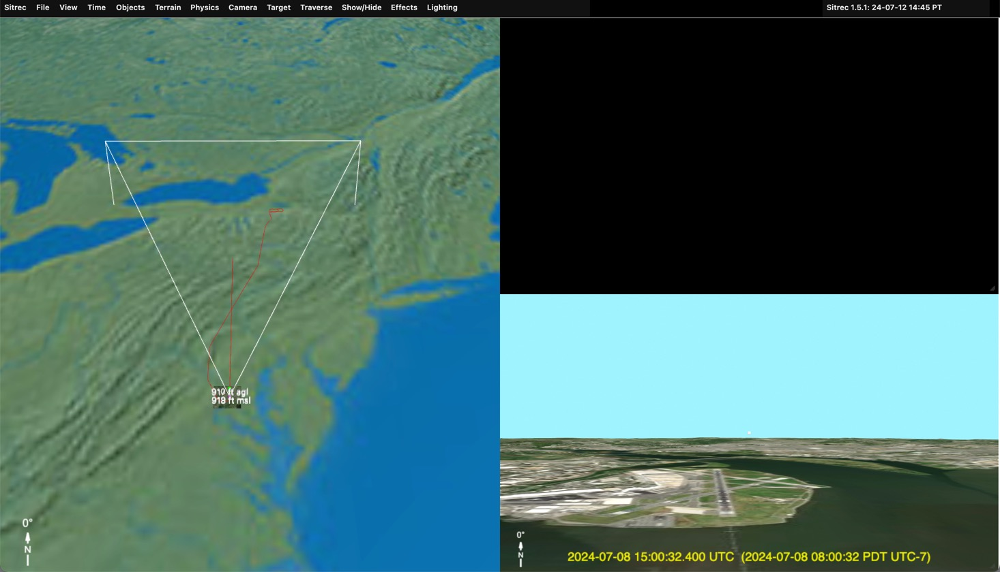
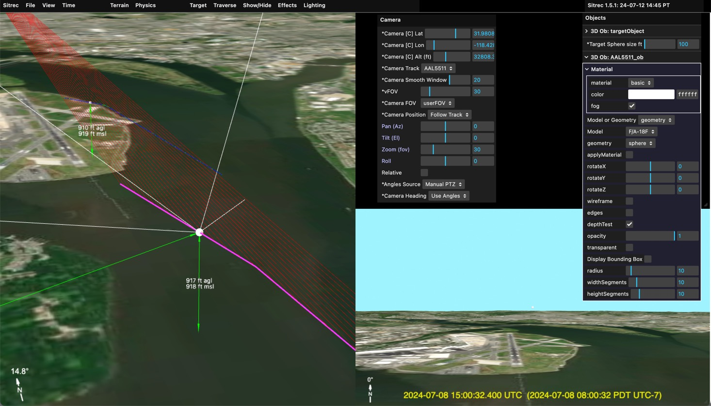

# Loading and Filtering Tracks

Tracks are the core data type in Sitrec. A track is a time-series of 3D positions (latitude, longitude, altitude) that represents the path of an aircraft, drone, satellite, balloon, or other object. Most sitches are built around one or more tracks.

This guide covers:
- [Supported track formats](#supported-track-formats)
- [Importing tracks](#importing-tracks)
- [Working with multiple tracks](#working-with-multiple-tracks)
- [Track display controls](#track-display-controls)
- [Filtering bad data](#filtering-bad-data)
- [Smoothing and interpolation](#smoothing-and-interpolation)
- [Altitude handling](#altitude-handling)
- [Timing and synchronization](#timing-and-synchronization)
- [Exporting tracks](#exporting-tracks)

## Supported Track Formats

Sitrec auto-detects the format of imported files. You don't need to specify the type — just drag and drop.

### ADS-B / Flight Tracking (KML/KMZ)

The most common track source. Export a KML or KMZ file from a flight tracking service:

- **FlightRadar24** (flightradar24.com)
- **Planefinder.net**
- **FlightAware** (flightaware.com)
- **ADSB Exchange** (adsbexchange.com)

KML files can contain **multiple tracks** (e.g., all flights in an area during a time window). When you import a KML with three or more tracks, Sitrec shows a selection dialog so you can choose which tracks to load.

### ADS-B Trace by Aircraft (adsb.lol)

If you know the aircraft's ICAO 24-bit hex address (shown on most flight trackers, e.g. `a1b2c3`), **Controls → Import ADS-B Track...** fetches roughly the **last 24 hours** of its positions directly from [adsb.lol](https://adsb.lol) — no file export needed. The track is named from the aircraft's callsign or registration. You can also drag in a downloaded readsb/tar1090 `trace_full_*.json` file. Geometric (GPS) altitude is used when the trace carries it, with barometric altitude as the fallback. Data is ODbL-licensed by adsb.lol; credit "adsb.lol" when publishing imagery made with it.

### Live ADS-B Traffic (adsb.lol)

**Controls → Live ADS-B Traffic** shows **every aircraft adsb.lol can currently see** around wherever the camera is, updated every few seconds. Each aircraft is a small dart pointing along its course, colored by altitude, with a short trail showing where it has just been:

| Color | Altitude |
|---|---|
| Grey | On the ground, or altitude unknown |
| Red | Below 1,000 ft |
| Orange | 1,000 – 5,000 ft |
| Yellow | 5,000 – 10,000 ft |
| Green | 10,000 – 20,000 ft |
| Cyan | 20,000 – 30,000 ft |
| Violet | Above 30,000 ft |

**Traffic Radius** sets how far to look, in nautical miles, up to 250. The **Traffic** readout below it says how many aircraft are being shown, so an empty sky over open ocean can be told apart from a feed that is not working.

Some things worth knowing:

- **It follows the camera, not the sitch origin.** The search is centered on wherever you are currently looking, so flying somewhere else brings up that area's traffic on the next update.
- **It sets the clock to now and pauses playback.** The feed is the live present, so the scene has to be the present too — otherwise the sun, the sky and the traffic would all disagree. Scrubbing the playhead has no meaning while it is on.
- **It is not saved with the sitch.** This is a view of the live present, not part of a recreation, so switching it on never changes what a saved sitch contains.
- **It needs the Sitrec server**, so it is unavailable in the desktop app and other serverless builds.

**Click an aircraft to promote it to a real track.** A single click on any of the darts fetches that aircraft's full ~24-hour trace and adds it as an ordinary Sitrec track, with all the usual measurement tools — the same thing **Import ADS-B Track...** does, without needing to know the hex address. The Traffic readout says `importing …` while the trace is fetched, which takes a second or two.

Dragging is unaffected: a press that moves before you release is a camera drag, not a click, so you can still orbit and pan starting from anywhere on screen.

The live layer is for situational awareness; promote an aircraft when you want to analyse it.

Data is ODbL-licensed by adsb.lol; credit "adsb.lol" when publishing imagery made with it.

### Other Live Feeds

**Controls → Live Feeds** overlays other live data on the world. Each has its own on/off switch and a count underneath it, so an empty result can be told apart from a feed that is not working — the count reads `loading…` before the first answer, a number once it has one, and says so plainly when the source is unreachable.

| Feed | What | Coverage | Source |
|---|---|---|---|
| **Military Aircraft** | Aircraft flagged military or government, as magenta darts | Worldwide | adsb.lol (ODbL) |
| **Marine Traffic (AIS)** | Vessel positions, as teal boxes pointing along their course | **Baltic Sea only** | Fintraffic Digitraffic (CC BY 4.0) |
| **Webcams** | Roadside cameras; click one to open its current image | **Finland only** | Fintraffic Digitraffic (CC BY 4.0) |
| **Weather Balloons** | Radiosondes currently aloft, with altitude and climb rate | Worldwide | SondeHub |
| **Rocket Launches** | The last 40 orbital launches, at their pads | Worldwide | Launch Library 2 |
| **Earthquakes** | Magnitude 2.5+ in the last 24 hours, sized by magnitude | Worldwide | USGS |

Two of these are regional, and deliberately so: **live AIS and webcam feeds that need no key are hard to find**, and the Finnish open-data service is the one that does both without an account or a data-sharing agreement. If you switch on Marine Traffic over California you will correctly see nothing.

Some notes on reading them:

- **Shape as well as colour.** Ships are boxes, webcams octahedra, balloons spheres, launches cones, aircraft darts. With several layers on at once colour alone stops being enough, and it is no help at all to a colour-blind viewer.
- **Clicking does something different per feed.** A military aircraft imports its full track, exactly like a civil one. A webcam opens its live image. A launch or earthquake opens its source page. A ship or balloon shows its details in the count line for a few seconds.
- **Weather balloons answer a real question.** "Could it have been a weather balloon?" is one of the standard mundane explanations, and this says whether one was actually up there.
- **Earthquakes are drawn at the epicentre**, on the surface. Depth is in the details rather than the position — a quake plotted at its true hypocentre is inside the Earth and invisible.
- **None of it is saved with your sitch.** These are views of the live present, not part of a recreation.
- **All need the Sitrec server**, so they are unavailable in the desktop app and other serverless builds.

Credit the source shown in the table when publishing imagery made with one of these feeds.

### DJI Drone Data (CSV)

DJI drone flight logs exported from [Airdata](https://airdata.com) in CSV format. These include full IMU data: position, altitude, heading, pitch, roll, and gimbal orientation.

### DJI Drone Subtitles (SRT)

SRT metadata files extracted from DJI drone video. These contain per-frame position and gimbal angles embedded as video subtitles.

### MISB / KLV (CSV or binary)

Military-standard metadata (STANAG 0601) from surveillance platforms. Contains sensor position, gimbal angles, field of view, frame center coordinates, and slant range. Can be in CSV form (with MISB column headers) or binary KLV format.

### STANAG 4676

NATO track exchange format, accepted as **XML** (the standard's own container) and as a
flattened **CSV** export of the same data — both load identically. The track point's
`dynamics/pos` is the standard's authoritative estimate of the tracked object and
imports as the **primary track**,
labelled **(Target)**. Files produced by GXP InMotion also carry two proprietary
positions per point — the endpoints of the sensor's line of sight through the tracked
pixel — which import as supplementary reference tracks: **(Platform)** (`posHigh`, the
sensor end of the ray — its altitude varies per frame like an aircraft track) and
**(Ground)** (`posLow`, the ray's ground intersection). On a direct load these
auto-select the **camera** track (Platform) and the **target** track (Target); Ground is
a reference track with no role. (The three positions are collinear, so the camera at
Platform points identically whether it aims at Target or Ground.) When the tracker
ground-locks the target, `dynamics/pos` coincides with `posLow` and the duplicate is
dropped automatically, so such files yield two tracks instead of three (the surviving
Target track is on the ground in that case).

The **CSV** flavour carries one row per track point, with the three positions in parallel
column families:

| Columns | Meaning |
|---------|---------|
| `UTC0` | file base time, epoch milliseconds (constant on every row) |
| `UTC` / `t` | epoch milliseconds for this point / its time in seconds relative to `UTC0` |
| `FRM` | source video frame number (not used — the pipeline is time-based) |
| `TPLAT`, `TPLON`, `TPHAE` | the tracked object — XML `dynamics/pos` → **(Target)** |
| `SLAT`, `SLON`, `SHAE` | the sensor end of the ray — XML `posHigh` → **(Platform)** |
| `GLAT`, `GLON`, `HAE` | the ground intersection — XML `posLow` → **(Ground)** |

Header matching is case-insensitive and order-independent, and extra columns are ignored.
Detection requires the `TP*` family plus at least one of the `S*`/`G*` families, so a CSV
carrying only a target position keeps loading as a [generic CSV](#generic-csv). A missing
`UTC` column falls back to `UTC0` + `t`.

STANAG heights are WGS-84 ellipsoidal (HAE) — declared in XML by the `<dynamics cs="...">`
attribute, and stated outright by the CSV's `HAE`/`SHAE`/`TPHAE` column names. Sitrec
reads this and skips the MSL→HAE geoid conversion that other (MSL) sources get — without
this the track would sit ~N metres underground (N is the local
EGM96 geoid undulation, e.g. ≈ −19 m in Colorado). Note the **(Ground)** point is the
*producer's* line-of-sight/DEM intersection: it can sit a few metres above or below
Sitrec's terrain wherever the two elevation models disagree, which is normal.

### ASTERIX radar (PCAP)

EUROCONTROL ASTERIX surveillance data (CAT-048 and CAT-062) captured as network packets — `.pcap` or `.pcapng` files (and raw ASTERIX byte streams). A single capture typically contains many aircraft, so it is imported as a multi-aircraft file: Sitrec extracts one track per detected target.

### Generic CSV

A flexible format for **position tracks**, with auto-detected columns. Header names are matched case-insensitively, and most fields accept several aliases:

| Data | Recognized column headers |
|------|---------------------------|
| **Time** (required) | `DATETIMEUTC`, `DATETIME_UTC`, `DATE_TIME_UTC`, `DATETIME UTC`, `UTC`, `DATETIME`, `DATE_TIME`, `TIMESTAMP`, `TIME`, `DATE`, `DTG`, `DT`, or `FRAME` (a frame number) |
| **Latitude / Longitude** | `LAT` / `LATITUDE` / `TPLAT` / `LATITUDEDEGS`, and `LON` / `LONG` / `LONGITUDE` / `TPLON` / `LONGITUDEDEGS` |
| **Grid** (instead of lat/lon) | `MGRS` / `GRID` / `GRIDREF` / `GRID_REF` (military grid), or `REGGRID` / `REG_GRID` / `GRID56` / `GRID_56` (Maidenhead / ham-radio locators) |
| **Altitude** | `ALTITUDE` / `ALT` / `ALTITUDE (m)*` / `TPHAE` / `alt_m` (metres), `ALTITUDE (FT)` / `ALT (FT)` / `ALTITUDE(FT)` / `ALT(FT)` (feet), `ALTITUDEKM` (km), or `AGL` / `ALT (m/agl)` (above ground level) |
| **Identification** | `AIRCRAFT` / `AIRCRAFTSPECIFICTYPE`, `CALLSIGN` / `TAILNUMBER` / `BALLOON_CALLSIGN` |
| **Multiple tracks** | `TRACK_ID` / `THRESHERID` / `STAGENUMBER` (one track per distinct ID) |
| **Speed** | `SPEED_KTS` (knots; stored as airspeed) |

A generic CSV needs, at minimum, a **time** column plus either **lat + lon** or a **grid** column. Altitude defaults to ground/sea level if absent.

**Multiple tracks in one CSV**: if a track-ID column is present, Sitrec splits the data into separate tracks by ID.

**Time formats**: Sitrec auto-detects ISO dates, Unix epoch (seconds, milliseconds, or microseconds), relative seconds, and `FRAME` numbers (converted to time using the sitch's fps).

**Grid coordinates**: both MGRS and Maidenhead (ham radio) grid locators are accepted in place of lat/lon.

> A generic position CSV says *where the camera (or object) is*, not where it is **looking**. To give the look-camera a track of pointing angles (azimuth/elevation), use a Camera Angle Track — see below.

### Camera Angle Tracks (Az / El / Heading / FOV)

This is how you give the look-camera a **track of azimuth/elevation** (or heading, or field of view). The CSV's first column is `frame` (a frame number) or `time`, followed by one or more angle columns:

| Header | Drives |
|--------|--------|
| `az` | Azimuth, in degrees |
| `el` | Elevation, in degrees |
| `heading` | Camera heading, in degrees |
| `fov` or `zoom` | Field of view |

You can combine several columns in one file — e.g. a header of `frame,az,el` with one row per frame:

```
frame,az,el
0,123.4,5.2
1,123.6,5.3
```

Sitrec feeds these into the look camera's Az/El controller, so it pans/tilts to follow your angles. If the first column is `time`, the values may be ISO datetimes or seconds, and are converted to frames using the sitch's fps. Import it by dragging it in (or **File → Import File**), exactly like any other track.

### FlightRadar24 CSV

Direct CSV export from FlightRadar24 with fixed columns: Timestamp, UTC, Callsign, Position, Altitude, Speed, Direction.

### GeoJSON

Standard GeoJSON FeatureCollections with Point geometries. Supports multiple tracks via `thresherId` or `dtg` properties.

### Radiosonde / Weather Balloon

Atmospheric sounding data from weather balloons:

- **IGRA2** format (NOAA fixed-width text)
- **UWYO** format (University of Wyoming, TEXT:LIST or TEXT:CSV)

These reconstruct 3D trajectories from atmospheric profiles and include wind, pressure, and temperature data. Sonde tracks can be colored by temperature gradient and display wind direction arrows.

### FlightClub JSON

Rocket and high-altitude balloon trajectory data from FlightClub, with orbital propagation support.

### NITF

National Imagery Transmission Format files with embedded metadata.

### Sitrec Spline (.spline.json)

Sitrec's own interchange format for a **hand-drawn** track — the control points of a
spline, not a per-frame path. Dropping one in creates a synthetic track, identical to
one made with **Add Track**, with the control points already placed and editable.

This is how a hand-authored solution moves between sitches as a data file instead of
being hard-coded in a `Sit*.js`. Write one out with the **Export Spline** button, found
in a synthetic track's folder under **Contents** and in the spline editor's own folder
under **Physics**, or as **Spline Control Points (JSON)** in the track's sub-folder
under **File ▸ Export** — where it sits alongside the per-frame exports of the track
the spline generates.

```json
{
  "fileType": "sitrec-spline",
  "version": 1,
  "name": "Aguadilla UAP Spline",
  "sourceSitch": "agua",
  "fps": 29.97,
  "frames": 7028,
  "curveType": "chordal",
  "constantSpeed": false,
  "extrapolateTrack": true,
  "altitudeLock": -1,
  "altitudeLockAGL": true,
  "altitudeDatum": "HAE",
  "columns": ["frame", "lat", "lon", "alt"],
  "points": [
    [0, 18.503705640095387, -67.1504289887557, 29.22562827449292],
    [121, 18.500549008435044, -67.14880906435559, 57.510756713338196]
  ]
}
```

Points are `[frame, lat, lon, alt]`. Being geodetic, the file survives a change of Earth
model or sitch origin — unlike the raw ECEF arrays older sitches embed. Altitude is
**HAE** (height above ellipsoid), so the round trip is exact with no geoid lookup.
`color` is optional: omit it and the importer takes the next palette colour.

The file is validated on import and refused with a message naming the problem, so
hand-editing is safe to attempt. In particular **frame numbers must strictly
increase** — the spline's frame-to-curve mapping divides by the gap between
adjacent control points, so a repeated frame would put NaN into every frame of the
track. `curveType` must be one of `linear`, `catmull`, `centripetal`, `chordal`.

Two things to watch:

- **Frames are video frames.** Load the video (or otherwise set the sitch's frame
  count) *before* dropping the spline. The control points are expanded across
  `Sit.frames` at import and are not re-expanded if the frame count changes later, so
  a spline whose points run to frame 7027 dropped into a 900-frame sitch is truncated.
- **The file is consumed, not kept.** Once imported, the control points belong to the
  synthetic track and are saved with the sitch, so the `.spline.json` itself is not
  persisted or re-uploaded — otherwise reloading would import a second copy.

### Sitrec Camera FOV (.fov.json)

Not a track — camera zoom keyframes — but it is a droppable Sitrec data file, so it
is listed here with the rest. Dropping one loads it into the **FOV Editor** and
selects that editor as the camera's FOV source.

Write one with **Camera ▸ FOV (Zoom) ▸ Export for FOV Editor**. That samples
whatever is *currently* driving the camera FOV — the selected Camera FOV source in a
custom sitch, or the camera itself in a legacy sitch that computes zoom in code —
across every frame, then reduces those samples to keyframes that reproduce them
under the editor's linear interpolation to within a small tolerance (1e-4 degrees).
Each straight run of samples is collapsed to its two endpoints, so a constant zoom
becomes two keyframes rather than one.

```json
{
  "fileType": "sitrec-fov",
  "version": 1,
  "name": "agua-fov",
  "sourceSitch": "agua",
  "sourceNode": "lookCamera.preRenderFunction",
  "fps": 29.97,
  "frames": 7028,
  "units": "degrees",
  "axis": "vertical",
  "interpolation": "linear",
  "columns": ["frame", "fov"],
  "keyframes": [[0, 0.8], [6, 0.8], [7, 4], [634, 4], [635, 0.8]]
}
```

`fov` is the **vertical** field of view in degrees, matching both the editor's y
axis and Three.js's `PerspectiveCamera.fov`.

An **instant** zoom change — a real camera stepping between discrete zoom levels —
comes out as two keyframes one frame apart, as in the sample above (frame 6 at 0.8°,
frame 7 at 4°). Under linear interpolation that is a step, not a ramp. A gradual
zoom reduces to just the endpoints of each linear segment.

This is how the Aguadilla sitch's zoom track, which lives in code as a CSV column
read per frame, becomes 12 editable keyframes in a custom sitch.

Keyframe frame numbers are absolute, so a file authored over a different frame count
will not line up with the video — the importer warns when the counts differ.

## Importing Tracks

There are two ways to get a track into Sitrec:

### Drag and Drop

Drag a track file from your desktop directly into the Sitrec browser window. This is the quickest method.



When a track is loaded, Sitrec automatically centers the 3D view over the track and sets up a camera that follows it.

### File Menu Import

Use **File > Import File** to open a file picker. This works identically to drag and drop.

### What Happens When a Track Loads

1. Sitrec detects the file format automatically
2. The track data is parsed and converted to an internal representation
3. The 3D view centers over the track
4. A colored track line appears in the scene
5. Track controls appear in the **Contents** menu on the right



## Working with Multiple Tracks

### Two-Track Setup (Camera + Target)

The most common setup for analyzing UAP videos uses two tracks:

- **First track imported** = camera platform (the aircraft filming)
- **Second track imported** = target object (the UAP or other aircraft)

Sitrec automatically calculates the closest point of approach and sets the region of interest accordingly.


### Selecting from Multi-Track Files

When you import a file containing **three or more tracks** (common with ADS-B KML exports covering an area), Sitrec shows a **Track Selection Dialog**:

- Each track is listed with its callsign/name and altitude range
- Checkboxes let you select which tracks to import
- A **Filter** panel provides additional filtering options (see below)

### Multi-Track Filter Panel

The filter panel (available during multi-track import and later from the Contents menu) lets you narrow down which tracks to load:

| Filter | Description |
|--------|-------------|
| **Altitude Range (ft)** | Only show tracks with points within the specified altitude range |
| **Crosses Frustum** | Only show tracks that pass through the camera's field of view |
| **Towards Camera** | Only show tracks moving towards the camera position |
| **Away From Camera** | Only show tracks moving away from the camera position |

These filters use preview data and work within the current sitch time window.

### Managing Loaded Tracks

Each loaded track gets its own folder in the **Contents** menu. You can:

- **Show/hide** individual tracks with the visibility checkbox
- **Recolor** tracks using the Line Color picker (the folder label color updates to match)
- **Remove** a track with the Remove button (with confirmation)
- **Highlight** a track by hovering over its folder label (the track line turns white temporarily)
- **Center camera** on a track using the "Go to track" button

## Track Display Controls


Each track's folder in the Contents menu provides these controls:

### Visibility and Appearance

| Control | Description |
|---------|-------------|
| **Visible** | Show or hide this track |
| **Line Color** | Color picker for the track line |
| **Poly Color** | Color for the ground extension polygons |
| **Extend To Ground** | Draw semi-transparent vertical walls from the track down to the terrain |
| **Display Step** | Frame spacing (1-100). Higher values skip frames for sparser display |

### Contrails

Contrails simulate the visual appearance of condensation trails behind aircraft, adjusted for wind:

| Control | Range | Description |
|---------|-------|-------------|
| **Contrail** | on/off | Enable contrail ribbon rendering |
| **Contrail Secs** | 2-5000 | Duration of the contrail in seconds |
| **Contrail Width m** | 10-200 | Maximum ribbon width in meters |
| **Contrail Initial Width m** | 0-100 | Width at the exhaust point |
| **Contrail Ramp m** | 0-2000 | Distance over which width ramps up |
| **Contrail Spread m/s** | 0-20 | Rate of outward spread |

### Altitude Adjustments

| Control | Range | Description |
|---------|-------|-------------|
| **Alt offset** | -1000 to +1000 m | Manual altitude adjustment, applied in the source's own datum |
| **Alt Lock** | -1 to 100,000 ft | Force a fixed altitude (-1 = off). Shown in your display units; stored in metres |
| **Alt Lock AGL** | on/off | On: the lock is height above the ground below. **Off: the lock is HAE** (height above the WGS84 ellipsoid), *not* MSL |

> **The altitude lock is HAE, not MSL.** Locking an object to "10,000 ft" with *Alt Lock AGL*
> off puts it at 10,000 ft above the ellipsoid, which in Los Angeles is about 10,115 ft above
> sea level. In the continental US the difference is 20–40 m almost everywhere; see
> [GIS, Geodesy and Altitude](GIS.md) for the value at your location.

> **An Alt offset applied by eye is not a fix.** If a track sits underground, the offset that
> makes it look right also invalidates every altitude, altitude-difference and vertical-speed
> number you take from it afterwards. Diagnose the datum first — the signature table in
> [GIS.md](GIS.md) tells you which mistake you are looking at. If you do end up using an
> offset, record its value and why.

## Filtering Bad Data

ADS-B and other track data sources sometimes contain **spurious data points** — sudden position jumps caused by reception errors, multipath interference, or encoding issues. Sitrec includes a g-force filter that detects and removes these bad points.

> **This filter encodes a physical assumption, and in a UAP investigation that assumption is
> the thing you are testing.**
>
> The filter's premise is that acceleration above *Max G* must be measurement error. That is
> a safe premise for airliner ADS-B and a loaded one for an anomaly report: if the question is
> "did this object manoeuvre impossibly?", switching the filter on answers it for you, in the
> shape of a data-quality fix.
>
> Sitrec will also *offer* to do it. When a track loads with a maximum g above the threshold,
> a dialog appears — *"Bad points in track data 'X'. Max g-force: Ng. Enable Bad Data Filter?"*
> — and clicking yes silently removes the points that prompted the question. (Tracks that look
> like rockets are exempted from the prompt automatically, and under regression or MCP
> automation the filter is **enabled without asking**, so scripted runs are always filtered.)
>
> **Work with it off first.** If you then enable it, report the threshold you used, how many
> points it removed, and what the result looks like with it off — that comparison is the
> evidence, not either run on its own.

### How the G-Force Filter Works

The filter computes the acceleration (in g) between consecutive valid points. Any point that would require physically impossible acceleration to reach is flagged as bad data. For example, a sudden 50-nautical-mile jump between adjacent data points implies thousands of g's of acceleration — clearly an error.

### Filter Controls

Each data track has a **Filter Bad Data** folder with:

| Control | Default | Description |
|---------|---------|-------------|
| **Enable Filter** | off | Turn the g-force filter on or off |
| **Try Altitude First** | on | Before removing a point entirely, try fixing just its altitude by interpolating from neighbors. Many ADS-B errors are altitude-only |
| **Max G** | 10.0 | Acceleration threshold in g (0.1-10). Points exceeding this are filtered. 10g allows for sparse curved tracks where computed g can be high; most spurious data generates 100g+ |

### What Gets Filtered

- The filter runs **multiple passes**, iteratively removing the worst points
- Filtered points are hidden from the display but the original data is preserved
- If "Try Altitude First" is enabled, the filter attempts to **correct** altitude before removing the point entirely
- A typical bad ADS-B point generates 100g+ of apparent acceleration, well above the 10g default threshold

## Smoothing and Interpolation

Track data is often noisy or sparse. Sitrec provides several smoothing methods to clean up track paths:

### Available Methods

The smoothing-method dropdown shows these option keys directly:

| Method | Description |
|--------|-------------|
| **none** | No smoothing — raw data points |
| **moving** | Rolling moving average |
| **movingPolyEdge** | Moving average with polynomial edge handling (better behaviour at the ends of the track) |
| **sliding** | Sliding window average |
| **savgol** | Savitzky-Golay polynomial-fitting filter that preserves peaks better than simple averaging |
| **spline** | Catmull-Rom spline. With no associated data track it fits a smooth curve through interpolated control points; when a data track is present it does a chordal Catmull-Rom spline through the actual data points |

### Smoothing Parameters

| Parameter | Description |
|-----------|-------------|
| **Smoothing window** | Rolling window size (larger = smoother) |
| **SavGol Poly Order** | Polynomial degree for Savitzky-Golay |
| **Catmull Tension** | Catmull-Rom spline tension (0 = loose, 1 = tight) |
| **Catmull Intervals** | Number of control points for spline fitting |
| **Edge Fit Order** | Polynomial order used for the edge fit at the ends of the track |
| **Edge Fit Window** | Window size for the edge fit |

### What smoothing costs you

Smoothing is a low-pass filter on position, and the quantity it removes first is
**acceleration** — which is usually the quantity a UAP analysis exists to measure. A wider
window does not just tidy the picture; it drives peak g downwards, roughly as the square of
the window length.

This matters directly, because the traverse analysis grades candidates on maximum kinematic
acceleration and its tier boundaries are stated in g (see
[Traverse Methods](TraverseMethods.md)). Smoothing a track can therefore move a candidate
across a threshold without anything about the underlying data having changed.

It cuts both ways. Smoothing the *camera* track changes the line-of-sight directions, and so
changes every fit computed from them.

**The rule: run the analysis on the raw track first, then on the smoothed one, and report
both.** Any g-figure, turn-rate or "impossible manoeuvre" claim taken from a smoothed track
alone is a statement about the filter, not about the object. Always state the method and the
window alongside the number.

## Altitude Handling

Track altitudes come in several reference systems. Understanding these is important for accurate 3D reconstruction. See also [GIS, Geodesy, and Altitude](GIS.md) for a full reference.

### Altitude Types

| Type | Reference | Common Sources |
|------|-----------|---------------|
| **HAE** (Height Above Ellipsoid) | WGS84 ellipsoid | Raw GPS, ADS-B `alt_geom`, STANAG 4676, MISB tags 75/78, Custom1 `TPHAE` |
| **MSL** (Mean Sea Level) | Geoid (EGM96) | KML `absolute`, MISB Tag 15, most map software |
| **Pressure Altitude** | Standard atmosphere (1013.25 hPa) | ADS-B `alt_baro`, flight instruments |
| **AGL** (Above Ground Level) | Local terrain | DJI `rel_alt`, some military data |

### How Sitrec Handles Altitude

- Internally, Sitrec works in **HAE** (ellipsoid height) for 3D rendering
- Terrain tiles are loaded as **MSL** and converted to HAE using the **EGM96** geoid model
- KML `absolute` altitudes are **MSL** (measured from the EGM96 geoid, per OGC KML 2.2/2.3)
  and are converted to HAE on the way to the 3D scene, on both import and export
- Sources whose altitudes are **already HAE** are flagged so the MSL→HAE conversion is
  skipped: STANAG 4676 (`cs="WGS_84"`), MISB ellipsoid-height tags 75/78 (used
  automatically when the MSL tag 15/25 is absent), and the Custom1 CSV `TPHAE` column
- If a track has only AGL altitude, Sitrec adds the local terrain elevation
- The **Alt offset** slider lets you manually correct systematic altitude errors

### Common Altitude Issues

- **Track appears underground**: The altitude reference may not match Sitrec's expectation. Try a positive Alt offset.
- **Track is too high**: Some ADS-B sources report pressure altitude, which can differ from geometric altitude by hundreds of feet depending on weather. Try a negative Alt offset.
- **Inconsistent altitude between tracks**: Different sources use different references (HAE vs MSL vs pressure). The EGM96 geoid offset at a given location can be up to ~100 meters.

## Timing and Synchronization

### Absolute Timestamps

Most track formats include absolute timestamps (UTC). Sitrec uses these to:

- Determine the sitch time window automatically
- Synchronize multiple tracks on the same timeline
- Sync tracks with video (when video has embedded timecode)

### Relative Timestamps

Some formats (frame numbers, seconds from zero) don't have absolute times. For these tracks:

- A **Start Time** field appears in the track's GUI folder
- Enter an ISO datetime (e.g., `2024-03-15T14:30:00Z`) or partial time (e.g., `14:30`) to anchor the track
- Sitrec uses the [chrono-node](https://github.com/wanasit/chrono) library to parse flexible date/time input

### Time Offset

Every track has a **Time offset (sec)** slider (-600 to +600 seconds) for fine-tuning synchronization. This is useful when:

- Video and track timestamps are slightly out of sync
- Different data sources have clock drift
- You need to manually align events

## Exporting Tracks

Sitrec can export tracks in several formats via the export buttons in the **Export** folder (each track gets its own sub-folder there):

### Export Formats

| Format | Contents |
|--------|----------|
| **CSV** | Frame, Time, Lat, Lon, Alt(m) — simple tabular data |
| **KML** | Google Earth compatible with `<gx:Track>`, timestamps, and altitude mode |
| **MISB CSV** | Full 12-column MISB-standard format including heading, pitch, roll, FOV, gimbal angles |
| **Spline JSON** | Control points of a hand-drawn spline track — see [Sitrec Spline](#sitrec-spline-splinejson). Also available as the **Export Spline** button in the track's **Contents** folder |
| **FOV JSON** | Camera zoom keyframes — see [Sitrec Camera FOV](#sitrec-camera-fov-fovjson). Exported with **Camera ▸ FOV (Zoom) ▸ Export for FOV Editor** |

Exported files are downloaded directly to your browser's download folder, named after
the track (e.g. `MISB-Aguadilla Ground Spline.csv`).

A spline track — one made with **Add Track**, dropped in as a `.spline.json`, or built
into a sitch — gets all four: its control points *and* the per-frame track it generates,
in CSV, MISB CSV and KML. The per-frame formats export the **smoothed** track, so they
match the line drawn on screen and reflect the track's Smoothing window, altitude offset
and altitude lock. The control points do not carry the altitude offset, which is stored
separately in the file and re-applied on import.

### Export Altitude Datums

Exports write each format's conventional datum, converting via the EGM96 geoid as needed:

- **KML** exports use `altitudeMode` `absolute`, whose altitudes are **MSL** (EGM96)
  per the KML spec — so exported tracks land at the correct height in Google Earth.
- **MISB CSV** exports keep the MISB column conventions: `SensorTrueAltitude` (tag 15)
  and `FrameCenterElevation` (tag 25) are **MSL**. A track whose source altitudes are
  HAE (e.g. STANAG 4676) writes them unconverted into the **ellipsoid-height columns**
  (`SensorEllipsoidHeight` / `FrameCenterHeightAboveEllipsoid`, tags 75/78) instead —
  re-importing such a CSV detects the HAE column and preserves the datum, so a
  STANAG → MISB CSV → Sitrec round trip is loss-free.

There is no STANAG 4676 exporter (XML or CSV); STANAG-derived tracks export through the
formats above.

## MISB Track Data

MISB (Motion Imagery Standards Board) tracks contain rich metadata beyond simple position. When a MISB track is loaded, Sitrec can use:

- **Sensor position** (lat, lon, alt) — where the camera is
- **Platform attitude** (heading, pitch, roll) — orientation of the aircraft
- **Gimbal angles** (azimuth, elevation, roll) — where the camera is pointing relative to the aircraft
- **Field of view** (horizontal, vertical) — zoom level of the camera
- **Frame center** (lat, lon, elevation) — where the camera footprint hits the ground
- **Slant range** — distance from camera to target

This data enables Sitrec to reconstruct the exact camera frustum (the pyramid-shaped field of view) and project it onto the terrain.

For a detailed walkthrough of importing MISB data, see the [Custom Sitch Tool](CustomSitchTool.md) guide.
