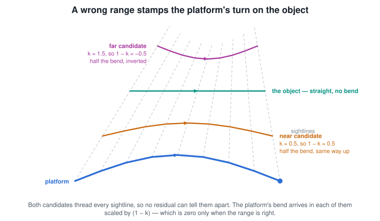
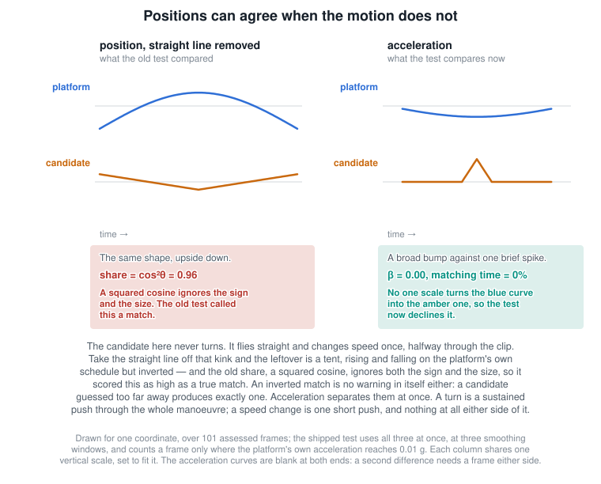
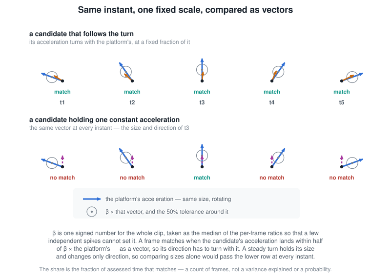
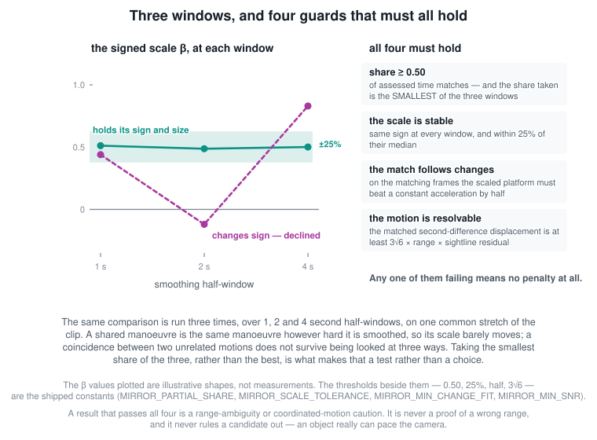

# Traverse Analysis and the Verdict

This document covers **Traverse ▸ Analyze Traverse Methods…** — the button that runs every
method at once, ranks the results, and issues an executive verdict — and how to read what it
gives you without reading more into it than it says.

For how each individual method computes a path, see [Traverse Methods](TraverseMethods.md).
For how to conduct and write up an investigation, see
[Doing Defensible Analysis](DefensibleAnalysis.md).

---

## Physically Plausible Analysis (the Analyze button and the extra fits)

LOS-only data never uniquely determines a trajectory: near-perfect fits exist
at many ranges, provided the object is allowed to maneuver. The tools in this
section make that ambiguity explicit. Each fit adds one *stated assumption* (a
nominal speed, roughly straight and level flight, low kinematic acceleration)
as a soft target rather than an exact constraint, so that it can report, for
every range, how much maneuvering the sightlines would force on that
assumption. The targets define the question each fit asks; they are not a
preference of the analysis. The interesting output is the family of plausible
solutions — and how much maneuvering every *other* interpretation would require.

### Global Fit: Minimum Acceleration

(Formerly "Global Fit: Plausible" — the display name now describes the
algorithm's objective rather than a claimed result; saved sitches still
serialize the original menu key.)

**Model**: the range along each LOS ray is a smooth cubic B-spline λ(f)
(25 control points). The trajectory follows the rays, with a soft range floor
(so it can never end up behind the camera) and a light output smoothing that
sheds frame-scale pointing jitter; the acceleration objective is measured
over ~half-second strides so that jitter cannot dominate it.

**Method**: two-stage. Stage 1 solves a pure-smoothness (no speed target)
coarse sweep over range: when the sensor itself maneuvers (an orbit, a hard
turn), geometry alone pins the range — the smoothness-vs-range valley is
decisive and the speed target is *not used* (the Minimum Acceleration Fit
Results folder shows "not needed (geometry)"). Only when that valley is flat — the classic
narrow-baseline case like Gimbal, where range is unobservable from geometry —
does Stage 2 fall back to the soft air-speed target
`((airspeed − Target Speed)/σ)²` with σ ≈ 60 kt (IRLS), which is then what
gives the plausibility-vs-range curve a real minimum. The winner is refined
and re-solved at full quality (the result appears as **Found Range**; the
**Min Dist** / **Max Dist** limits in Traverse Analysis Tweaks bound the
search). Where Constant Air Speed holds a speed *exactly*, Minimum
Acceleration treats speed (when used at all) as a loose target and finds the
smoothest path consistent with the rays.

**When to use**: as the "best fit" interpretation of a hypothesis like
"a ~350 kt aircraft at ~30 NM" — it shows what the *smoothest* version of that
hypothesis looks like, and its acceleration/turn metrics quantify how demanding the
hypothesis is at that distance.

### Global Fit: Minimum Speed

**Model**: the same on-the-rays B-spline range profile as Minimum
Acceleration, but the
objective is inverted: instead of the least-maneuvering path near a target
speed, it finds the **slowest** object consistent with the sightlines, then
applies a curvature-penalized smoothing pass that sheds sensor pointing
jitter (which would otherwise read as enormous kinematic acceleration on a slow object).

**When to use**: this is the drifting-lantern / near-static reading. When the
sensor orbits or passes a slow, close object, most of the apparent motion is
the sensor's own parallax — the slowest consistent object is then a
near-static drifter (the classic Aguadilla answer, ~12 kt). It takes no
parameters; the range follows from where the sightlines let an object move
least. A final few IRLS passes level the air speed over the first/last 15%
of the clip (the spline endpoints are data-starved, so without this the
speed graph of an exactly-constant-speed object read as a ±5 kt end wobble).
The Analyze gallery's **Minimum Speed** candidate uses this same fit, so
applying it reproduces exactly the previewed path.

### Global Fit: Physics — the dynamics models

The Physics fit integrates a real dynamics model forward with RK4 and fits
its parameters to the sightlines with **differential evolution** (a
genetic-style global search) followed by Nelder-Mead polish. Three models are
available via the **Physics Model** dropdown in the Traverse menu:

**Sky Lantern** — pure wind-drift kinematics. A sky lantern is a
near-perfect wind tracer (grams of mass, large drag area), so its horizontal
velocity *is* the wind at its current altitude: a solved wind vector with a
linear altitude shear (clamped so it can never reverse or blow up — the wind
aloft is allowed to be stronger, e.g. "wind from the east, increasing with
altitude"). The wind may also **vary smoothly across the clip** (a duration-
invariant linear + quadratic drift, priced by a variability prior so it cannot
wander without support), letting the balloon follow a gently curving drift as
real wind veers over minutes — a constant wind can only produce a straight
ground track. Vertical motion follows the lantern life cycle — rise while the
flame burns, exponential buoyancy decay after flame-out, terminal sink — and
the solved flame-out time can fall before the clip (a lantern already in its
cooling descent, the Aguadilla case), inside it, or after it (still climbing
throughout). The base-wind components are bounded to ±40 m/s, the shear
multiplier to 0.25–3, and rise/sink parameters to 4 m/s. Those are broad search
constraints, not a certified lantern envelope: the wind box is wide enough to
reach ordinary winds aloft from any bearing, and along its diagonal it admits
110 kt, which is not lantern-like. Excluding non-lantern motion is the job of
the light-wind speed prior and the kinematic ordinariness screen, not of the
box. Its residual measures
compatibility with this particular wind-tracer/life-cycle model, not the
probability that the object is a lantern. Bound-pinned and shear-clamped
solutions therefore need explicit scrutiny.

**Fixed Wing Aircraft** — constant horizontal airspeed, a linearly-varying turn rate,
constant climb rate, and wind advection. Parameters (initial range, heading,
horizontal airspeed, turn rate, turn acceleration, climb, wind E/N) share the same DE +
polish recipe; the cost combines LOS angular error with explicit soft targets
for speed, turn, climb, and (when supplied) wind. The generic conventional
prior searches 25–360 m/s horizontal airspeed and ±40 m/s climb. It does not
cover every fighter in the catalog, and a result on a bound makes this test
incomplete rather than excluding every possible fixed-wing aircraft.

**Quadcopter** — a hover-capable multirotor drone. Unlike a fixed-wing, it
needs no forward airspeed to stay aloft, so ground speed is free to fall to
zero (hover) or rise, the heading can swing on a wide turn budget, and it can
climb or descend far more steeply than a plane. Parameters (initial range,
heading, speed, along-track acceleration, turn rate/acceleration, climb, wind
E/N) fit with the same DE + polish recipe. A selected make/model bounds initial
speed and vertical rate and penalizes full-clip overspeed. The generic fit
permits initial ranges from 50 m to 20 km and air-relative horizontal speed up
to 60 m/s. This is a broad kinematic compatibility test: acceleration can push
the trajectory beyond nominal speed during the clip, so it is not a hard
flight-envelope certification.

**Make / model (Fixed-Wing and Quadcopter).** When Fixed Wing or Quadcopter is
selected, a second dropdown chooses a specific airframe/drone whose approximate
performance envelope tightens the fit bounds — Cessna 172, Boeing 737-800,
MQ-9 Reaper, F/A-18E/F, F-35, F-16; DJI Mini 4 Pro, Air 3, Mavic 3, Phantom 4
Pro, DJI FPV, Racing FPV. Both default to **AUTO**, which fits a generic
envelope and can report the closest compatible catalog envelope from speed,
climb, g, and altitude where available. Quadcopter climb capability is
direction-aware: a solved descent is checked against the drone's maximum
descent rate (usually the smaller number), not its climb rate. Catalog
figures are approximate values used to bracket and describe the search, not
exact specifications or IDs.

Solved parameters (wind, rates, fit error, and any selected/compatible catalog
envelope) appear in the Physics Fit Results folder. Residuals from different
models are not directly comparable object-type probabilities: the models have
different parameter counts, priors, bounds, and wind freedom. Use them as
model-conditioned diagnostics and inspect bound hits and sensitivity.

**Drone (flown inputs)** — a gallery-only companion to the free Quadcopter that
asks a different question. The free Quadcopter asks "is there *any* path inside
the envelope that fits?" — almost always yes, which is how it can produce a
many-revolution corkscrew that buys a tiny residual. The flown-inputs fit instead
models a drone as a *few held control inputs* (forward speed, yaw, climb, changed
occasionally): it seeds from the best geometric path, inverts it into the control
history needed to fly it, and refines while paying for control **effort** — how
much the inputs must move — rather than for path shape. Holding an input is free,
a steady orbit is cheap, and an aggressive-but-deliberate manoeuvre stays
reachable; only motion that buys no residual (the corkscrew) is priced out.
Reading the gap between its residual and the free Quadcopter's is the point: a
small gap means an ordinary flight explains the sightlines as well as any
contortion.

### Ground contact and underground rejection

LOS-only geometry can produce trajectories that pass **underground**. The
analysis samples each candidate against loaded terrain (falling back to the
reference surface) and demotes sustained penetration below the configured
tolerance. This is a rejection check, not a terrain-following solve.

Beyond that always-on check, the **Ground contact** selector in *Traverse
Analysis Tweaks* constrains the solution space to how the object touches the
ground:

- **Airborne (any)** — the default; no ground contact required (underground
  is still rejected).
- **On the ground** — adds a dedicated **Ground Vehicle** candidate: the point
  where each sightline meets a curved, constant-elevation shell near the local
  terrain height (distinct from the stationary *Ground Object*), then checks
  samples against the actual terrain. It does not follow changing DEM height
  over slopes or ridges.
- **Starts on ground** — takeoff, or a released balloon: the trajectory begins
  on the surface, then a portion is airborne.
- **Ends on ground** — landing, or a descending balloon: the trajectory ends on
  the surface.

The non-airborne modes also add a soft **ground prior** to the fixed-wing,
lantern and quadcopter fits, pulling the relevant endpoint(s) toward the
surface so the physics fits find takeoff/landing/release/descent solutions
rather than purely mid-air ones. This is gated: in the default Airborne mode
the fits are byte-identical to before.

### Analysis integrity

The analysis is engineered to be honest about what LOS-only data can and
cannot determine:

- **Paired wind fits**: every wind-dependent analysis method has a **supplied
  wind** result and an independent wind treatment. This covers Fixed-Wing Aircraft,
  Sky Lantern / Balloon, Quadcopter, Constant Air Speed, Constant Altitude,
  Minimum Acceleration and Minimum Speed, in both live analysis and BOTBench.
  Supplied wind is held fixed to the complete per-frame input series, including
  calm if selected; it is not a soft constraint. The second run searches wind
  without consuming that series when the objective can constrain it. Each result's air-relative metrics use its
  own wind. Agreement from the supplied-wind result is not independent wind
  evidence. Both candidates share their object class, so they do not count as
  two independent explanations.
  Free winds share ±40 m/s east/north search bounds and a 20 m/s component
  regularization scale centered on calm. These are analysis assumptions, not
  weather measurements or vehicle speed limits. Wind is conditional on the
  motion model and is labelled **required wind**; no confidence interval is claimed.
  The speed-based spline methods solve wind and range together. Constant
  Altitude and pure-smoothness Minimum Acceleration cannot determine a constant
  wind and now say **wind undetermined**. Their ground-frame paths are retained;
  physical compatibility uses the supplied wind assumption. An eight-direction
  perturbation of that wind shows airspeed sensitivity, not statistical uncertainty.
  Wind that reaches a search edge is disclosed separately from vehicle limits.
  Ground-frame geometric/control fits whose objective does not use wind retain
  one trajectory.
- **Balloon model selection**: analysis starts with constant horizontal drift
  and a signed constant vertical speed (four free parameters including range).
  If needed it tries linear wind change, a rise/cooling/descent lifecycle,
  altitude shear, and quadratic wind change as separate alternatives. It never
  fits time variation and altitude shear together. Among completed fits it
  selects the fewest parameters within the larger of 0.002° or 10% of the best
  mean LOS residual. This is a practical tolerance, not a statistical test.
  Incomplete searches and all attempted alternatives remain in the diagnostics.
  Range bands retain the selected model. Vertical speed is separate from
  horizontal drift and horizontal air-relative speed in the results.
- **Supplied wind plus correction**: balloon analysis also adds a constant
  east/north correction to the complete supplied series, with a quadratic
  penalty on the correction alone. *Wind correction scale* defaults to 15 kt
  per component and is explicitly an analyst assumption, not measured weather
  uncertainty. BOTBench can instead use its wind sidecar's `sigmaMS`.
  The comparison table shows supplied, required, and corrected total winds
  with their LOS errors. Available independent weather is evaluated along each
  candidate's own locations and altitudes for balloon, aircraft and quadcopter.
- **Deterministic global search**: the analysis injects seeds derived from the
  input/run into its stochastic searches and records optimizer metadata. This
  makes supported runs repeatable for the same code and inputs; it does not
  prove that a retained basin is the global optimum.
- **GPU search**: *Traverse Analysis Tweaks → GPU search (WebGPU)* is enabled
  by default. When the browser supports WebGPU, the fixed-wing and
  quadcopter fits search on the graphics card when their kernel supports the wind treatment. Many independent searches with large
  populations run at once, and they test hundreds of times more candidate
  solutions than the normal search, in less time. The graphics card scores
  candidates in single precision. The best candidates are then refined on the
  CPU, and every reported number (parameters, residual, track, bound checks)
  is computed there in double precision, as it is without this option. A larger
  search can find a better-fitting basin than the normal search, so results can
  differ from a CPU run, and they can differ slightly between graphics cards.
  The balloon model selection, drone-control fit and supplied-wind quadcopter fit use the CPU. Range bands use the selected model
  fits as their starting points. Without
  WebGPU, or if the graphics card reports an error, the analysis uses the normal
  search. The report's run audit records which search each fixed-wing run used.
- **GPU Monte Carlo presets**: *Traverse Analysis Tweaks → Monte Carlo GPU*
  adds a selected trial budget, or all six budgets, to the gallery. The presets
  `mc_50k` through `mc_1M` use order 1 and 0.1° LOS uncertainty, sampling blind
  ranges independently of the range anchor. They require WebGPU and report
  failures explicitly. The same presets are selectable in the traverse menu
  and [BOTBench](BOTBench.md#choosing-the-solvers). They compare fitting methods;
  the trial count is a search budget, not a confidence level.
- **Physical fits are seeded from the smoother**: the balloon (with its wind free
  to vary over the clip) and the drone control-input candidate start from the
  best geometric approximation — the Kalman-smoother path — and refine from
  there, rather than searching their high-dimensional parameter spaces blind.
  The smoother is regularised, and its constant-velocity start is given an
  explicit 500 m range floor because regularisation alone cannot remove an LOS
  fit's degeneracy along range. The seed carries no truth and no object
  assumptions, but it can still affect convergence and which local basin is
  retained; the free
  Quadcopter is deliberately left unseeded as the unconstrained, anomaly-reachable
  fit. Because the drone fit then starts on a good path it needs only local
  refinement (Nelder-Mead from the seed), which is why it now solves in about a
  second where it once took tens.
- **Circular-LOS detection**: when the sightlines are *constructed* from the
  target being tested (Camera Heading = "To Target" with LOS Source = raw
  Camera Center), the gallery and verdict carry a prominent
  "Constructed LOS — validation only" banner. Fits recovering the target then
  confirm internal consistency, not an independent discovery.
- **A ground answer must be visible**: the *Ground Object* is rejected, as the
  *Ground Vehicle* is when its sightlines miss the ground, unless its fitted
  surface point lies in front of the sensor and inside its horizon on at least
  98% of frames. The fit treats each sightline as a whole line, so upward
  sightlines can put the point behind the sensor. And when the sensor flies
  nearly straight toward or away from the object with the sightlines within
  about 2 degrees of horizontal, the curved-surface refinement pushes the point
  out without limit, measured at 10^20 m and more. The horizon allows 10% for
  atmospheric refraction.
- **No global object winner**: every tile carries a colored **category label**
  — *Physically based* (balloon, drone, aircraft), *LOS Constrained* (constant
  air speed / altitude / minimum acceleration), *Geometric* (stationary, ground,
  at-infinity), *Geometric Approximations* (the curve/Kalman/least-squares fits),
  and *Known Object* (star, planet, satellite). The gallery is shown in one flat,
  best-first order, but that order is decided by keys which ARE comparable across
  categories (with a usable truth track — at least five overlapping frames:
  completeness, then closeness to that track; otherwise broad-screen pass,
  eligibility, completeness, tier, and
  bound-pin count) before the common BOT Score. Finite trajectories
  use this score regardless of the method that produced them. Angular-only
  checks use different units and are displayed after tied trajectories. Each tile still reports its standing within its own category
  ("#1 of 4 physically based").
- **Fit quality, ordinariness and platform acceleration match are separate judgements**:
  a tile's tier is the worst of the three, but the **badge names whichever one
  is binding**. When
  the fit is the limit the labels read `Passes broad screen` / `Fair fit` /
  `Weak fit` / `Poor fit`; when the motion is the limit they read `Passes broad
  screen` / `Moderate` / `Low` / `Kinematically extreme`; when the solved path
  follows the camera's own changes of acceleration they read `Partial platform
  acceleration match` / `Strong platform acceleration match`. This stops a slow,
  ordinary object with a middling residual being called "Implausible" (that word
  is about the object; the evidence was about the fit), and stops a 12 g solution
  that threads the rays exactly being hidden as merely a good fit. Search-edge,
  active-model-limit, inactive-bound, internal-clamp, and optimizer-incomplete
  badges remain independently visible; a tier is never relabelled upward, and an
  incomplete result cannot receive an affirmative global winner badge. Two more
  labels exist. **Not fully tested** replaces a tier label only when a model
  limit is the binding constraint — the fit and the motion would both grade
  higher, but a pinned bound stopped the search, so the model was never fully
  tested rather than measured and found wanting (a fit that pins *and* fits
  poorly keeps the stronger "Poor fit"). **Co-leader** marks tiles that tie on
  every comparable key (screen pass, eligibility, completeness, tier, pin
  count). Their remaining order is a heuristic BOT Score tie-break, not a
  finding that one object type is more likely. Applying a truth track orders
  them by truth separation instead.
- **The criteria ribbon**: a row of small squares under each tile's heading, one
  per criterion, each carrying one white letter — **P** physically admissible,
  **L** line-of-sight fit, **S** speed, **A** acceleration, **Z** size,
  **M** platform acceleration match, **C** convergence, **W** wind, **T** truth — coloured
  green, yellow or red, with grey for anything that was not evaluated. Hovering
  a square says what it measures, what this candidate scored, and why it is that
  colour. It is a reading aid, not an input: nothing in the ribbon moves the
  order, and every number in it appears in full in the stats and the rank basis
  below.

  **Each square is judged against an object class, not an absolute threshold**,
  because almost none of these quantities has a threshold that is right for
  every candidate: 0.48 g is unremarkable for a multirotor and self-refuting for
  a balloon. A tile that names an object type — the balloon, drone and
  fixed-wing models — is graded against *the class it claims to be*, so a
  "balloon" that needs half a g shows red rather than being quietly re-judged as
  the drone that would admit the number. Every other tile claims no object type,
  so it is graded against the most ordinary class that admits it, and the
  tooltip names that class. Speed and acceleration are additionally held to the
  absolute kinematic screen, and the worse of the two verdicts wins, so the
  ribbon can never show green where the tier badge shows a kinematic problem.

  **Grey is not a pass.** It means either that the check could not run — no
  angular size in the file, no truth track loaded, no manoeuvre by the platform
  to compare against — or that it ran and settled nothing, such as an
  inconclusive wind comparison. Each grey tooltip says which. The first square
  is what keeps the rest honest: a candidate rejected outright (underground,
  non-physical, off-mode) carries no ranks at all, so without it such a tile
  would show mostly grey and read as unobjectionable.
- **Platform acceleration match (the "Coryat curve")**: assume the wrong range
  and the observing platform's own manoeuvre is injected into the solved path,
  because both the candidate and the real object lie on the same rays — the
  candidate track becomes a blend of the object's path and the camera's. Neither
  of the other two judgements can see this: such a tile follows the sightlines
  perfectly and its speeds and g-loads are unremarkable. Each trajectory tile's
  **acceleration** is therefore compared with the platform's at the same
  timestamps, and reports what share of the assessed time matches a single fixed
  scaling of it, and at what signed scale. Position is deliberately not used: it
  cannot tell an independent speed change from a shared manoeuvre. An object
  *can* pace the camera — a chase aircraft, a drone flown to follow it — so a
  matching tile keeps its place in the gallery; it is simply an extraordinary
  thing for an object to do, and the tier now says so. See
  [Does it fly the camera's path?](#does-it-fly-the-cameras-path).
- **Balloon-consistency tie-break**: a *Physically based* balloon tile is
  scored on whether its own fitted motion is self-consistent with a passive
  wind tracer — a steady climb, level, or descent drifting in one direction is
  credited, and a "balloon" that had to yo-yo vertically or curve back on
  itself is debited by the same amount. It is a consistency check on the model,
  not a preference for the object: it is bounded and only ever reorders
  otherwise equally-well-fitting candidates (it can never lift a balloon over a
  clearly better-fitting drone), so it cannot foreclose a genuine
  better-fitting energetic or maneuvering solution.
- **Family bands**: flat solution valleys are reported as bands ("50–650 kt at
  19–41 NM fit about equally") with a deterministic representative (nearest
  the Target Speed prior), instead of a knife-edge argmin that flips with
  last-bit input changes. The range bracket self-expands when the winner
  touches a grid edge, and a result still on the edge is flagged
  boundary-limited.
- **Bounds are sensitivity-checked**: a parameter merely landing within 1% of
  a numerical bound is not treated as a capability failure. The fitter probes
  it inward and demotes only locally load-bearing constraints. Flat/inactive
  parameters are reported as unconstrained; an inward improvement is reported
  as optimizer-incomplete. Duplicate manifestations of the same constraint
  (such as a speed parameter and derived overspeed) count once. This prevents a
  pre-burn lantern's unused terminal-sink parameter from being counted against
  it.
- **Curved-Earth geometry**: displayed altitudes/climb are geodetic, and the
  constant-altitude and ground candidates include Earth curvature. Dynamics
  still use one fixed-origin ENU frame, so headings and wind axes are
  origin-frame approximations over large/high-latitude scenes.
- **Physical time**: dataset speeds/accelerations honor `simSpeed`, and
  track-driven winds are sampled historically per frame (not the playhead
  value repeated; frames in a wind-data gap use the nearest row with data).
  Velocity/acceleration differentiation uses an approximately 0.5-second
  physical window rather than 15 frames, so changing source frame rate does
  not change the screen. For A-B windows too short to hold that window, the
  differentiation window clamps to the selection length — short analyses
  report real (noisier) metrics; a window too short for any statistics reads
  as invalid, never as zeros.
- **Make/model labels are envelopes, not identifications**: "Closest containing envelope:
  Boeing 737-800 (not an ID)" means the solved speed/climb sits nearest that
  catalog entry's performance envelope — nothing more.

### The Analyze button

**Traverse ▸ Analyze Traverse Methods...** runs the full battery against the current
LOS data and opens a single flat, best-first hypothesis gallery — each tile
carrying a colored category label rather than being buried under a section
heading, so that object-model tiles are not buried under curve fits that merely
thread the same rays; which tile leads is decided by the screen, not by its
name. This is a screening order, not an object verdict. The standalone HTML
report is built on demand. **Use exact result** installs the analyzed
trajectory as a frozen Analysis Snapshot; it does not silently rewrite the
speed/range assumptions used by the next run.

Each interactive graph has two display controls below the magnifier. **T**
shows or hides the truth path and starts on. **g** shows acceleration peaks
and starts off. Both controls apply to thumbnails, the detail graph and
the expanded graph together; they do not change scores or ranking. Hiding truth also
hides its peak labels and preserves the graph's scale.
Magenta is reserved for truth; solution paths use other colours.

Peak labels use two decimal places, such as **4.30g**, in the path's colour. They use the
same smoothed acceleration and trimmed time interval as **Max g-Force**,
including the valid overlap interval for truth. These are kinematic
accelerations, not total load including gravity. The candidate, truth and
sensor paths can each show up to three local maxima. Maxima must be at least
one second or 5% of the measured interval apart, whichever is greater, and
at least 48 screen pixels apart. Labels that would overlap are omitted.

The **camera icon** switches the graphs to perspective views from the scene camera's
position, heading and roll at the selected frame. The projected candidate and
truth paths are magnified to fit each graph: this is an image-plane crop, not
a change of camera position. The slider scrubs the camera and current track
positions together across the analyzed A–B interval. A filled point marks the
candidate; a larger ring marks truth, so coincident positions remain visible.
The markers use the exact frame's track samples. The slider is local to the
gallery and does not change the main playhead or refit anything.
With **g** enabled, camera mode labels only the current point on each visible
track with that frame's smoothed g-force, to two decimal places. The values
update as you scrub; peak labels return in the rotatable 3D view. No value is
shown when acceleration is unavailable for the current frame.

Camera mode, the slider, T and g stay synchronized across thumbnails, detail
and the expanded graph. Press the **camera icon** again to restore the rotatable 3D view.
Camera mode is unavailable for direction-only hypotheses and bulk results
that have no scene camera pose.

The expand button (the top-right button on each graph) enlarges that graph to
fill the left side of the results page, in place of the list of results. The
details panel stays on the right and shows the same result, even if a different
result was selected before. The expanded graph does not scroll. **Enter**
expands the graph of the selected result, and pressing it again returns to the
list. You can also return with the expand button, the top-right **X**, or
**Escape**. The
**X** on the results page closes the analysis, and **Escape** follows the same
order.

The **Left** and **Right** arrow keys select the previous or next result in the
order the tiles are shown, with set-aside results last, and wrap at the ends.
The **Up** and **Down** arrow keys select the result above or below in the grid
(the nearest one in that row), and stop at the top and bottom rows. While a
graph is expanded, the arrow keys step the expanded graph and the details panel
together, and the list is at the same result when you return to it. They do
nothing while a slider or other field has focus, or while the comparison is
open. If you have scrolled down the details
panel, a new selection keeps its frame-by-frame graphs at the same position on
the screen, so you can step through the results and compare the graphs in place.

The frame-by-frame graphs (**Kinematic acceleration**, **Speed** and **LOS fit
error**) can have two scales. The left scale starts at zero and its top rounds up to
a whole step, with a minimum: 2 g in steps of 1 g, 40 kt in steps of 10 kt, and
0.5° in steps of 0.5°. Graphs of different results therefore usually share a
scale, and a small value draws as a small line. The left scale's numbers are in
the result's color, like the lines that use it. A grey copy of the main line
(g-force, air speed or LOS error), drawn behind it, uses the **Fine scale** on
the right, which has grey numbers. The Fine scale fits the main line's own
range, but never spans less than one hundredth of the left minimum (0.02 g,
0.4 kt, 0.005°), so it shows the detail without making numerical noise look
like motion. A graph shows the Fine scale only when its span is less than 20%
of the left scale's; otherwise the grey line would only repeat the main line,
and the graph has one scale. Secondary lines, such as ground speed and the
generic-fit reference, are dashed and use the left scale only. The legend is in
the title row of each graph.

The report starts with **Ranking without truth**, using the same screening
order as the gallery with **Use Truth Track** off. If a usable reference track
is available, **Ranking with truth** follows: the same paths are ordered by
search completion, then mean 3D distance from the reference. No candidate is
refitted. Both sections appear regardless of the gallery toggle. The report's
assessment, candidate cards and detailed rank explanations use the ranking
without truth; any reference measurements there are comparison only.

Expand **Filtering and interpolation** at the top of the gallery to see every
filter on the selected input paths, the filters used by the candidate fits and
metrics, and the live traverse output filter. The same summary appears in the
full report. It records the settings when Analyze ran, with effective durations
in seconds, including simulation speed, repeated passes and shorter end windows.
Spline and Kalman stages show their control spacing or full fitting interval
where there is no fixed averaging window.

Imported tracks with recorded sensor angles have an **Angle Smooth Window
(frames)** control in their Contents folder. This filters the platform and sensor
angles before constructing sightlines, independently of position smoothing;
set it to zero to disable it. Ordinary MISB imports, including TS video metadata,
default to 120 frames for smooth playback. Saved sitches retain their saved window;
older saves without this control use the original 120-frame default. Bearings-only
analysis interchange files keep their zero default.

**Analyze Traverse Methods** temporarily sets recorded-angle smoothing on the selected
sightline path to zero. The dataset, fits and filtering summary use those unfiltered
angles. The viewing setting is restored when analysis finishes, fails or is cancelled.
Position and tracked-pixel smoothing settings are unaffected. Set the angle window
to zero yourself when inspecting unfiltered sightlines or running a live traverse
outside the analysis dialog.

At 30 fps and simulation speed 1, a window of 120 averages up to
121 samples spanning four seconds, shortening symmetrically at the source ends.
This can suppress real camera motion as well as measurement noise. When using
tracked target pixels, preserve the matching per-frame camera attitude before
combining it with the target's image offset to construct the target sightline.
Position smoothing methods and angle windows are saved with the sitch. A zero position
window does not disable spline interpolation; choose **none** for that stage.
Exact analysis snapshots bypass the live traverse position filter, and the
displayed line, object, distance graph and traverse exports use the same output.

The analyzed window can be narrower than the A-B range. A track holds its last
sample past the end of its data, and a frozen sensor on a frozen ray is not an
observation, so held frames at either end of the window are dropped and the
console reports how many, and which frames were analyzed. If more than half the
window is held frames nothing is trimmed — that is a scene problem (check that
the clip's In/Out range covers real data), and the analysis says so.

1. **Constant-air-speed sweep** — a grid over (start distance × air speed,
   15–650 kt log-spaced so slow drifters are representable alongside jets).
   Each combo is solved as the smoothest ray-following path that holds that
   air speed (a spline solve — the old frame-by-frame ray walk was a shooting
   method that exploded into corkscrews whenever the sensor maneuvered), then
   scored for smoothness (kinematic acceleration, turn-rate variability, climb) plus how well
   the requested speed could actually be held. Surfaces the valley of
   straight-flight solutions (for Gimbal: ~30–32 NM, speed loosely
   400–550 kt).
2. **Range profile** — for each assumed start range, the least-maneuvering
   spline solution with a fast-object (cruise speed) and a slow-object
   (drifting) speed target. Quantifies what an object at any given distance
   would *have* to do — e.g. at 6–8 NM the Gimbal object must nearly stop and
   whip through a rapid heading reversal, or sustain a continuous banked turn.
3. **Aircraft fit** — the differential-evolution fixed-wing fit, reported as
   interpretable parameters (range, origin-ENU heading, horizontal airspeed,
   turn, climb).

The report contains provenance, a run-audit manifest, an executive summary, sweep
and range-profile plots, common-axis track comparisons, selected time series,
and candidate tables/details. Criteria are deliberately loose checks; scores
order model-conditioned hypotheses and are not posterior probabilities.

Unchanged analyses are cached by their LOS, A-B range, timing, wind, model
options, priors, and stable terrain-data configuration. Choosing **Use exact**
or orbiting a render camera does not change those inputs and reopens the prior
gallery immediately. Render-camera terrain LOD (active tiles/revision) is kept
out of the scientific key; the cached result retains the terrain samples used
when it was graded. Adjacent terrain LODs that reconstruct the same surface
within 0.1 m are treated as equivalent; a larger change from an equal- or
higher-resolution authoritative sample, explicit terrain reload, or source
change invalidates normally. A lower-resolution fallback never overrides the
cached authoritative sample. If terrain tiles merely finish loading
*while* an analysis is running, the run is **not** discarded — it completes using
the ground samples consumed while building and grading the candidates (a late
sub-decimetre refinement is unlikely to be material) and
the gallery shows a small note that terrain finished loading, which you can act
on by re-running once it settles if you need the ground samples exact. Starting
an analysis while terrain is still doing its initial load is still blocked, since
a half-loaded start could be genuinely wrong rather than marginally off.

Notes on the gallery tiles:

- The ray-following tiles (Constant Air Speed, Constant Altitude, Minimum
  Acceleration) show their analyzed, lightly smoothed paths. **Use exact result**
  installs that exact sampled path as a snapshot, so preview, metrics, and
  applied output refer to the same result.
- Tiles are shown in one flat, best-first order, each labelled with its
  **category** and its rank within that category ("#1 of 4 physically based").
  The order is decided first by keys comparable across categories — screen pass,
  eligibility, completeness, broad-screen tier, unique active model constraints —
  and only then by the common BOT Score for finite trajectories. Solver
  category gives no preference. Angular-only checks use a separate score basis. The
  0.05 display-tie threshold is a formatting convention, not a statistical claim.
- **Mean LOS error** is the mean angular separation between the observed
  sightline and the camera-to-candidate direction, over the analyzed frames.
  It measures agreement in direction, not 3D position error. Small residuals
  show five decimal places to distinguish close results; those extra digits
  do not establish measurement accuracy. Expand the measurement details for
  the reference comparison. When a truth track covers the clip, the ratio is
  **candidate mean LOS error / truth-track mean LOS error**. The truth residual
  is a measured reference, not a guaranteed minimum or a confidence score:
  a fit that follows measurement noise can score below the truth track.
  Otherwise a generic constant-acceleration fit provides context; it is not
  a noise estimate. Neither reference replaces the raw value.
  Every solver uses the raw residual, with no solver-specific allowance.
  Object-class preferences do not add to or subtract from the BOT Score.
  BOTBench shows an expected noise residual only when a positive per-axis
  sigma and uncorrelated errors are explicitly declared. This expectation
  is not a lower bound or a test of overfitting; unknown correlation stays
  unknown. Cached benchmark rows are rebuilt when the assessment revision
  changes, separately from the expensive solver results.
- `Max kinematic acceleration (g)` is the change in smoothed air-relative
  velocity divided by gravitational acceleration. It is not aircraft load
  factor and does not include the ordinary 1 g supporting level flight.
- **True heading** is the compass direction of the candidate's horizontal
  velocity over the ground — its absolute motion, wind included — measured
  clockwise from true north. It is not the air-relative direction behind the
  speed line: a drifting balloon has no motion through the air, but it heads
  where the wind carries it. Its mean and range are circular, so a heading
  that wanders across north reads as the narrow band it is, and they use the
  same frames as the other lines (the smoothing window is trimmed at each
  end). The range is highlighted yellow when it is wider than 30° and red
  when it is wider than 45°: a straight path holds its heading, so a wide
  range marks a candidate that turns or wanders; one that turns through every
  direction reads "full circle". When the headings cancel out (a circling or
  back-and-forth path, where the unit heading vectors add up to less than a
  quarter of their count), the mean reads "no mean direction" instead of a
  direction that rounding happened to leave. Frames with no horizontal motion have no
  heading and are skipped; the line gives the share of frames that had one
  when that is not all of them, and reads "n/a" when none did (a stationary
  or ground object).
- **Constant Altitude** searches the altitude band and scores each candidate
  on the smoothed path plus its LOS residual; if the sightlines are
  near-horizontal (they never cross a constant-altitude plane) the tile
  reports "fit failed" instead of a meaningless track.
- **Minimum Speed**'s family note has two modes: with a genuine low-motion
  window (the classic saddle) it reports the range band that fits equally
  well over that window; on a continuously rotating LOS (the sensor's own
  motion triangulates the range) it reports how sharply the full-clip cost
  valley pins the range instead.
- The flexible constant-acceleration residual shown for scale is a
  **model-reference residual**, not an estimate of sensor noise. It must not be
  used to make statistical confidence or likelihood claims.
- **Physical compatibility** and **Implied object size** are disclosure lines,
  not ranking inputs. Compatibility lists all classes within the tested size,
  speed and acceleration limits, and checks steady drift for balloons. It
  replaces the old single-class Ordinariness label, which could pick a balloon
  just because it appeared first among zero-cost classes. Expanded details
  explain exclusions and missing measurements. These checks do not establish
  an object identity. Implied object size converts the file's angular-size bound to metres at
  the candidate's range. A published angular diameter is an **upper** bound, so
  the line reads `≤ X m from size bounds; no measured lower bound` rather than
  printing a fictitious lower end. Neither line moves
  the order of the tiles — the **Platform acceleration match** line, which is
  shown whenever the statistic could be computed at all, is the one stats line
  that does.
  See
  [How ordinary is the answer?](BOTBench.md#how-ordinary-is-the-answer) for the
  definition and the measured behaviour.
- The **Sky Lantern / Balloon (measured wind)** variant pins the drift to a
  supplied wind. When no wind source is loaded (winds aloft, or the sitch wind)
  it is reported as "not tested — no wind was supplied", never silently
  omitted, so a missing tile is not mistaken for a failed fit.

### Solution families — the range band a model admits

*Traverse Analysis Tweaks → "Solution families (range bands)". Off by default;
it re-fits each physics model several times.*

A single drawn trajectory is the most misleading thing this analysis can
produce, because bearings alone rarely determine range. For **any** distance
profile R(t), the path `S(t) + R(t)·D(t)` reproduces the sightlines exactly —
so a distance is only pinned once you assume something about how the object
moves, and then only as far as that assumption actually constrains it.

With this enabled, each physically-based interpretation (balloon, quadcopter,
fixed-wing) is re-fitted at a ladder of **held** ranges: the start distance is
locked to each rung and every other parameter is re-solved under the same
model. The rungs whose fit stays acceptable are the model's **admitted band**.

- Admitted members are drawn as faint tracks in the tile's own color, with
  the headline solution solid on top. A member that follows the sightlines but
  fails the physical screen (underground, extreme kinematics) is drawn dashed
  and dimmer — visible, because "the rays allow this and physics does not" is
  worth seeing, but never mistakable for part of the answer.
- The tile reports the band next to the slant range, with the number of rungs
  **sampled**: "3.0–3.6 NM (2 of 12 sampled)". A narrow band says the range is
  well constrained *for that model*; a wide one says it is not.
- **The ladder is a sample, not a measurement of the boundary.** An admitted
  rung shows that distance works; it never shows that the untested ground
  between it and its rejected neighbour does not. So a band's edges are where
  the *sampling* changed answer, and the analysis says so rather than quoting a
  distance: "2.2 NM was the only sampled range admitted; the nearest sampled
  ranges below 1.1 NM and above 4.3 NM were rejected, so the true edges lie
  between those and the band shown". Nothing here ever reports a resolved or
  exact distance, however few rungs survive.
- Admitted ranges are reported as **separate intervals** when they are not
  contiguous, and filling a gap in would invent solutions the analysis never
  found. Each gap is described on its own terms — with three bands there are
  two gaps and they can mean different things:
  - every sampled rung in it rejected → **those samples** are excluded (the
    untested ground between them is not — the ladder is discrete);
  - a rung in it produced no fit → that part is **untested, not ruled out**,
    because a failure to solve is not evidence the range is unavailable.

Four cautions, all of which the tile states:

1. **The band is conditional on its model.** It is not a general uncertainty
   on the object's distance. A balloon band and a drone band answer different
   questions and are never merged.
2. **The acceptance cut is empirical, not derived.** There is no calibrated
   sightline noise floor here (the constant-acceleration reference residual is
   explicitly not one), so the cut is set relative to the model's own best fit.
   Its width is calibrated against benchmark truth coverage — see
   `benchmarks/botbench/verdict.bench.test.js`.
3. **A band that reaches the searched bracket's edge is a bound, not a
   result.** Widen Min/Max Dist to find where it really ends.
4. **The search marches outward from the best fit, seeded from each
   neighbour.** That is far cheaper than a global search per rung, but these
   landscapes are multimodal — so a global re-search runs at each end of the
   ladder, and if it finds a better basin the band is re-traced from there and
   says so.

The band is reporting only. It never enters the ranking: a model with a
tighter band does not sort higher, because "the more determined model wins"
would be exactly the calibrated object-probability claim this analysis
declines to make.

### Physical compatibility

Every finite candidate receives the same physical-class checks, regardless of
whether it came from a physical-model fit, HSV, or a geometric curve. The
**Physical compatibility** line lists every class within the tested limits,
instead of choosing whichever class happens to be first in a zero-score tie.
It checks minimum and peak air speed, peak manoeuvring acceleration, and size
when measured. Missing size or motion information is stated explicitly.

The balloon check also requires a steady-drift path. Once horizontal travel
exceeds 20 m, net displacement below 45% of distance travelled flags circling
or backtracking. This is a heuristic check of the steady-drift interpretation,
not a claim that no changing wind field could produce a curved balloon path.
A changing-wind explanation needs separate support. Low g alone is insufficient.

These are capability screens, not fits of every object's full dynamics to the
recovered path, and not identifications. For example, a circling HSV result can
fit the multirotor speed and acceleration envelope without being representable
by the Quadcopter solver's particular constant-acceleration, smoothly varying
turn model. Expanded details name each class's limiting quantities. These
class checks are diagnostic and do not themselves alter the ranking.

### How the tiles are ranked

Each card shows a short status and its own score, for example
**Broad gates passed · BOT Score: 2.905**. These are the shared ranking screens;
physical compatibility with a tested object class is reported separately.
A result that does not pass shows its
screening status instead. Hover over the status for the placement explanation.
The BOT Score is a weighted sum of motion and sightline-fit terms. **Lower is better.** It
compares finite paths regardless of solver category and does not use truth. It
is not an object probability. Hover over **BOT Score** for the calculation,
including the numeric contribution of each term for that result.
All measurements and the screening indicators remain visible above
**Explanations and BOT Score calculation**, which expands the LOS and physical
compatibility explanations and the numeric components of the BOT Score. The selected card's
explanation also appears above its large graph.

**Compare leaders** opens a side-by-side comparison of the two leading finite
trajectories still in consideration. It always uses ranking **without truth**,
even when the gallery is ordered by truth. The selectors let you compare any
other pair. Angular-only checks are excluded because their scores use different
units. Set-aside candidates are excluded until restored.

The panel shows each weighted BOT contribution and the difference between the
two candidates. Positive differences favor the left candidate; negative ones
favor the right. The largest contribution to the gap is highlighted. The gate
table gives measured values, limits and margins, plus search-completion and
model-limit warnings. The physical-compatibility table applies the same class
limits to both paths and marks missing measurements as unassessed. These class
checks do not change the BOT Score. A result that passes the available checks
names any missing inputs, for example **Passes measured checks · size unknown**.
**Results**, **X**, or **Escape** returns to
the gallery with its selection and chart settings intact.

The gallery mixes unlike questions — object models, LOS-constrained
trajectory families, fixed-geometry checks, curve fits, catalogue matches —
and there is no cross-model likelihood that could rank them as competing
object probabilities. The flat best-first order is instead decided
**lexicographically**, by a cascade of keys that *are* comparable across
categories, before anything model-specific is consulted:

1. **Truth separation** (only when **Use Truth Track** is on): completed fits
   first, then mean 3D separation from the truth in metres — the one score
   that is soundly comparable across every category.
2. **Broad-screen pass** — anything rated *Kinematically extreme* / *Poor
   fit* (or flagged invalid, underground, or off-mode) sorts below
   everything that passed, even an incomplete pass. This ordering is
   deliberate: broad, weakly-constrained slow families are the ones that
   honestly report touching a search edge, and completeness-first would
   bury them under extreme-but-cleanly-converged solutions.
3. **Eligibility** — complete *and* top tier.
4. **Completeness** — no search-boundary or optimizer-incomplete flags.
5. **Tier** (see below), then the count of locally load-bearing model limits.
6. **Score basis** — finite trajectories use the BOT Score;
   angular-only checks use raw degrees. When all earlier keys tie, finite
   trajectories are displayed first to avoid comparing numbers with different
   units. This is a display convention, not a preference for an object type.
7. **BOT Score** for finite paths, or angular score for angular-only
   checks, then raw LOS residual. A physical-model solver gets no priority over
   an LOS-constrained or geometric solver.

Three worked examples. A *Minimum Acceleration* path that threads the rays
at 0.03° but needs 6 g is rated *Low*, so a complete balloon fit at 0.04°
and 0.3 g — top tier and eligible — leads it at the eligibility key; their
scores are never compared. A slow drifting family flagged *Search
incomplete* because its range band touches the grid edge still leads a
cleanly-converged 900 kt / 12 g solution: the extreme candidate fails the
broad-screen pass, which is decided *before* completeness, so honestly
reporting a search edge is not punished by a worse tile that merely
finished. And a catalogued planet with a close angular match (say 0.08°,
the top catalogue grade) ties a passing drone fit on every key down
through tier and pin count — but its secondary score is 0.08 (raw
degrees) while the drone's smoothness-plus-residual composite is several
units. Compared directly the planet would "win" purely on units, so
score basis separates that pair and those different units are never compared.

**The tier** for trajectory tiles is the worst of three independent 0–3
grades, and the badge names whichever one is binding.

*Fit quality*, from the raw LOS residual for every solver, graded **relative
to the scene**: the boundaries are 1.2×, 2× and 5× the flexible constant-acceleration
reference residual for that clip, clamped to a scale between 0.02° and 0.20°.
Inside 1.2× is the top grade, then *Fair fit*, *Weak fit*, and worse is a *Poor
fit*. The scale exists because scenes do not resolve equally well: on the
Aguadilla ground-track sitch every fitted candidate lands between 0.07° and
0.19° while the reference itself leaves 0.14°, so fit quality is not
distinguishing anything there and a fixed ladder would only sort noise. The
clamp is what stops the scale becoming an alibi — at the upper end the broad
screen still sits at 0.24°, well inside the old 0.5° boundary — and what stops a
noiseless synthetic file, where a truth track threads its own rays, from failing
every real model. It is deliberately **not** taken from a loaded truth track's
residual, so that blind evaluation sees exactly the tiers an analyst sees.

*Kinematic ordinariness*: ≤ 1.5 g and ≤ 650 kt is the top grade; up to 4 g
(still ≤ 650 kt) is *Moderate*; above 4 g or 650 kt is *Low*; above 9 g or
900 kt is *Kinematically extreme*.

*Platform acceleration match*: the share of the assessed time whose acceleration
matches a single fixed scaling of the platform's, at the same timestamps — 0.85
and above is *Strong platform acceleration match*, 0.50 and above is *Partial
platform acceleration match*. The share taken is the smallest of three smoothing
windows, and three further guards must hold: the signed scale must be stable
across those windows, the matching frames must establish a shared *change* of
acceleration rather than a constant one, and the matched motion must be at least
three times the positional scale the tile's own residual can resolve — so a few
metres of platform-shaped wander is never treated as evidence. It never reaches
the bottom grade, because pacing the camera is extraordinary rather than
impossible. On a tie it does not take the label: a model that both fits poorly
and matches is reported as fitting poorly, with the match still spelled out in
the rank basis.

One locally load-bearing model limit
caps the tier at 2, two or more at 1, and an unconverged optimizer caps it
at 1 as a *Provisional fit*. Two iteration-limit stops are **not** counted as
unconverged: a Nelder-Mead simplex that has collapsed to its position tolerance
on every parameter has converged even if the cost spread has not settled (no
further iteration can move it), and a fit whose cost has settled while some
parameters stay wide is reported as settled but unidentifiable on the named
parameters — an identifiability limit of the clip, not an optimizer failure.
Before this distinction the most precise fits were the likeliest to be refused;
see [Why a good fit can still read "Unresolved"](BOTBench.md#why-a-good-fit-can-still-read-unresolved). Catalogue and at-infinity tiles have no
kinematics to grade: they are tiered on angular offset alone, with the
visibility / illumination check folded in for catalogue objects.

**The secondary score** for trajectory tiles is a smoothness composite plus
the residual: `4·rms(g) + max(g) + 0.05·std(turn rate) + 0.02·(mean
vertical speed beyond 5 m/s)`, plus the scored residual divided by 0.05 —
so one score unit equals 0.05° of LOS residual, putting "how much
manoeuvring does this require" and "how well does it thread the rays" on
one scale. The composite prices exactly the things a wrong assumed
distance forces on a solution: sustained and peak acceleration, erratic
turning, and implausible climb or descent. A tile that matches the platform's
acceleration carries a further demotion of up to about 0.3° of
residual-equivalent, in proportion to the matching share. That term only ever demotes: not flying the
camera's path is the ordinary expectation, not an achievement, and rewarding it
would be a standing thumb on the scale for distant solutions.

**Balloon motion is a separate diagnostic.** Consistency measures a steady
vertical trend and one-direction drift. It helps assess the balloon
interpretation but does not change the BOT Score. The same path and motion
metrics receive the same score regardless of which solver produced them.

**Physical compatibility and forward models are separate.** Close-fitting,
complete paths from every solver, including HSV, receive the same physical
class checks. The headline lists compatible envelopes separately from the
forward models that fitted successfully. An envelope match is not an
identification or a full dynamics fit. Unknown size and other missing inputs
remain visible. The generic multirotor model and compatibility check share a
60 m/s horizontal speed limit (about 117 kt); vertical motion does not count
against that horizontal limit. These are broad tested envelopes, not universal
limits on all objects in a class.

### Does it fly the camera's path?

Range is the hard part of a bearings-only reconstruction, and getting it wrong
has a specific, recognisable consequence.

**Where the blend comes from.** Every point on frame `f`'s sightline is
`P(f) + R·u(f)`, where `P` is the platform's position and `u` the unit direction
it recorded. So a true object at range `R_t` and a candidate at range `R_c` are
both on that ray:

    X_t(f) = P(f) + R_t(f)·u(f)
    X_c(f) = P(f) + R_c(f)·u(f)

Divide the second by the first, after subtracting `P` from each, and the
direction cancels — which is exactly the trouble with a bearing. Writing
`k(f) = R_c(f) / R_t(f)` for the range ratio and rearranging:

    X_c(f) = k(f)·X_t(f) + (1 − k(f))·P(f)

That is exact, frame by frame. Over a clip where the range ratio holds roughly
steady it reads as a single blend with a constant `k`, and the coefficient on
the platform is `(1 − k)`: **guess the range wrong and the camera aircraft's own
motion is added into the solved trajectory**, scaled by how wrong the guess is,
and reversed in sign when the guess is too far. The result is a plausible-looking
banking or turning path that is really the platform's flight wearing the object's
clothes. This is what Metabunk's Gimbal thread named a *Coryat curve*.



Nothing about the fit exposes it. Such a candidate follows the sightlines as
faithfully as any other — it is a member of the same exact-ray family — and its
speeds and accelerations are unremarkable. Aguadilla's Constant Altitude tile sat
at 0.073° residual, 51 kt and 0.48 g, and led the gallery; the stamped bend cost
it less than half a g, which no screen on acceleration would ever stop. What
exposes it is comparing the candidate's motion with the **platform's**.

**Why the comparison is made on acceleration.** The blend survives
differentiation. If `k` holds roughly steady then the candidate's acceleration is
`k` times the object's plus `(1 − k)` times the platform's, exactly as its
position was, so the imprint is there to be found in acceleration as well. It is
the safer of the two places to look.

Earlier releases compared **positions**, with each path's best-fitting straight
line removed first. That test asked one question of the whole clip — how well does
a single multiple of the platform's leftover reproduce the candidate's? — and
answered it with a least-squares projection, scoring the squared cosine of the
angle between the two stacked leftovers.

A squared cosine is a forgiving thing to ask for. It ignores the sign, it ignores
the size, and it is taken over the whole clip at once, so two motions that merely
rise and fall on a similar schedule score highly whether or not they have anything
to do with one another. A candidate that never turns at all, but changes speed
once in the middle, leaves a tent-shaped position leftover that scores 0.96
against a platform turning steadily throughout.



Acceleration separates those two cases immediately, because it asks *when* as
well as *what shape*. A turn is a sustained push that lasts as long as the turn
does; a speed change is one short push with nothing at all either side of it. The
shipped test therefore works on acceleration alone, and the criterion is named
**platform acceleration match** rather than "platform mirroring".

**How the comparison is made.** Acceleration is estimated by a second difference
over a half-window `h` — `(X(t+h) − 2X(t) + X(t−h)) / h²` — for both paths, and
the two are compared **at the same timestamps**. No time shift, rotation or
per-frame gain is fitted. One signed number `β` scales the platform's acceleration
for the whole clip.

`β` is the **median** of the per-frame ratios `aX·aP / |aP|²`, taken over the
frames where the platform's own acceleration reaches 0.01 g. A median rather than
a least-squares fit, because a handful of independent acceleration spikes in the
candidate must not be allowed to set the scale for everything else.

A frame counts as **matching** when the candidate's acceleration lands within half
of `β` times the platform's:

    |aX − β·aP|  ≤  0.5 · |β·aP|

and that is a comparison of **vectors**, not of sizes. The distinction is the
point of the whole test. A steady turn holds its acceleration *magnitude* constant
and changes only its *direction*, so a test on magnitudes alone would pass any
candidate whose acceleration happened to be the right size, whichever way it
pointed. Requiring the direction to turn with the platform's is what makes a
steady turn testable at all.



The **share** is the fraction of assessed frames that match. It is a count of
frames — not a variance explained, and not a probability. Frames in which the
platform is not accelerating carry no information either way, and are not counted.

**Four guards, all of which must hold.** The comparison is run three times over,
at half-windows of 1, 2 and 4 seconds — the 2, 4 and 8 second windows the tooltip
names — on one common interior stretch of the clip. A finding needs all four of
the following, and any one of them failing means no penalty at all.

- **A majority of the time matches.** The share must reach 0.50, and the share
  taken is the **smallest** of the three windows rather than the best of them.
- **The scale is stable.** The three windows' `β` values must share one sign and
  sit within 25% of their median. A real shared manoeuvre is the same manoeuvre
  however hard it is smoothed; a coincidence between two unrelated motions rarely
  survives being looked at three ways.
- **The match follows changes.** On the matching frames, the scaled platform
  acceleration must remove at least half of the error that a *constant* candidate
  acceleration would leave. Without this, a candidate holding one steady
  acceleration that resembles the middle of the platform's turn could be credited
  with following the turn.
- **The motion is resolvable.** The matched acceleration must produce a
  second-difference displacement of at least `3√6` times the positional scale the
  candidate's own residual can resolve — about `R × ε` metres at range `R` for a
  residual of `ε` radians. The `√6` is the noise gain of a second difference,
  which combines three samples with weights 1, −2, 1, so an independent
  per-sample error of size `σ` arrives as `√6 σ`.



That last guard is what stops a few metres of platform-shaped wander being treated
as evidence. The residual is also floored at 0.01° before the comparison, because
the exact-ray Straight Line candidate reaches 3 × 10⁻⁷ degrees by construction and
would otherwise make any matched metre infinitely significant.

**What a finding says, and what it does not.** A result that passes all four is
reported as *Partial platform acceleration match* at a share of 0.50 or better,
and *Strong platform acceleration match* at 0.85 or better. Both are cautions
about **range ambiguity or coordinated motion**. Neither is a proof that the range
is wrong, and neither identifies an object.

In particular, the test no longer turns `β` into a range. An earlier release
published `R = R_c / (1 − β)`, the range at which the imprint would vanish, on the
strength of the position regression. That inversion rested on the candidate's
whole leftover being the platform's, scaled; the acceleration test makes no such
claim, because it measures what fraction of the *time* matches rather than what
fraction of the *motion* is accounted for. The figure is therefore no longer
computed, and no longer appears on a tile.

Records written before this change carry no assessment at all. The stored
statistic names its own method, and anything that is not `acceleration-pattern-v2`
is treated as unassessed and recalculated — so a cached BOTBench battery is
re-graded rather than read at face value, and some results change order as a
result.

And a matching tile is never called invalid. An object *can* pace the camera — a
chase aircraft, a drone flown to follow it — so the reading stays available, keeps
its tile, and is priced as extraordinary instead of free.

**Surfacing true anomalies.** Several deliberate choices keep a genuinely
anomalous solution from being ranked or labelled out of sight. The
fit/ordinariness split means a 12 g solution that reproduces the
sightlines exactly is badged *Kinematically extreme* — a good fit
describing extraordinary motion — rather than blending in among good
fits or being dismissed as a bad one. The free Quadcopter fit is left
unseeded as the unconstrained, anomaly-reachable search. Object-class
preferences do not change the BOT Score. The platform acceleration test demotes only what it can measure — it
needs a manoeuvring platform, a resolvable matched component, a scale that holds
across three smoothing windows, and a majority share before it says anything — and it never rules a tile out,
because an object pacing the camera is a real possibility rather than an
impossible one. And when nothing passes, the verdict is *Unresolved* — stated
with what was and wasn't tested — rather than either a manufactured
conventional winner or an anomaly claim the uncalibrated noise floor
cannot support.

## The executive verdict

The analysis ends with a one-line **executive verdict** above the gallery. It
has five codes: *insufficient* (two wordings — independent evidence is lacking
because the sightlines were constructed from the target under test, or the
range is undetermined because the sensor's motion gives no usable parallax),
*probably a wind-blown balloon* (the only affirmative verdict, gated on an
independent wind measurement), *consistent with one* conventional
interpretation, *consistent with several*, and *unresolved* (the safety valve,
not an anomaly claim). Exactly what each wording licenses you to say, and the
list of causes Sitrec has no model for at all, are in
[Reading the executive verdict without over-reading it](DefensibleAnalysis.md#7-reading-the-executive-verdict-without-over-reading-it)
and [What a fit does and does not license](DefensibleAnalysis.md#5-what-a-fit-does-and-does-not-license).

## Optional angular-size evidence

Use **Angular size…** in the results browser to inspect or enter size bounds.
Judging and fitting are separate options, both off by default. The dialog accepts
an initial diameter, start/end diameters, sparse per-frame bounds, and relative
size ratios. A clip-wide ratio bound applies at every frame; isolated samples
apply only at their stated frames. Frame 0 is the start of this analysis window.

**Assume constant projected physical size** is an explicit optional assumption,
recommended when shape and orientation stay stable. It is not enabled automatically.
Rotation, inflation, occlusion or a changing measurement axis can invalidate it.
With this assumption off, absolute measurements still constrain the projected
size required by a path, but relative size does not constrain its range changes.

For projected extent `d`, range `R`, and angular diameter `theta`, the check uses
`d = 2 R tan(theta / 2)`. A candidate supplies `R`; it does not supply a known
physical size. Under the constant-size assumption, the implied diameter intervals
must share at least one common diameter. Relative observations instead check
`R(reference) / R(frame)` against the measured extent-ratio bounds. At small angles
these are the usual angular-size ratios. One absolute sample alone does not fix
range; the same proportional change in diameter and range leaves the angle unchanged.

Absolute size is also checked against the existing broad object-class size
intervals, using the same motion-compatible classes for every solver. A conflict
means the proposed path and these assumptions do not agree. It is not an object
identification or a proof that no other path fits. Results retain conflicting
candidates so the reason remains inspectable. Among candidates with the same
broad pass/fail grade, a size conflict comes before the existing completion,
model-limit and BOT Score ordering. Unknown size checks do not count as evidence
of compatibility. Truth comparison remains a separate, requested ordering.

The **Angular size** measurement names bounds passed, conflicts or unavailable
evidence and states the projected-size assumption. The BOT Score formula and
reported LOS residual do not absorb this check. Reports include the options and
observations in their run audit, and recompute their ranking from the current
settings.

### Optional fitting

In a live analysis, **Also use size during supported fits** requests a new analysis
when size inputs or fitting assumptions change. BOTBench has a separate **Fit
angular size (experimental)** checkbox for subsequent runs. Size fitting needs
the constant projected-size assumption and size-change evidence. A single absolute
sample with unknown physical size adds no range-change fitting information.

The supported searches are fixed-wing aircraft, balloon, quadcopter, drone control
inputs, constant altitude, horizontal speed valley, constant air speed and minimum
acceleration. The existing dynamics or path construction stay in use. For the last
two, size helps select the searched range/speed; it does not add a size equation to
the inner spline solve. The range-profile search also includes the loss. Minimum
Speed's representative, fixed/ground points, CV, CA, polynomial, Kalman, Monte Carlo
and sky/catalogue fits remain LOS-only during fitting. Each result states its mode.
All finite paths can still receive the optional judging check, regardless of solver.

The additional fit loss is the mean squared violation of log size intervals,
divided by `log(1.1)^2`. For absolute samples, one unknown log diameter is fitted
jointly to the intervals. Values inside bounds cost zero. This is a tunable
heuristic, not a calibrated likelihood or confidence score. More correlated
samples do not become independent evidence merely because there are more frames.
Reported LOS error is still calculated from sightlines alone. Supported size fits
use CPU objectives; their GPU kernels do not yet include this loss.
Results show the final path's size loss separately. HSV's speed-only bootstrap is
unavailable in this mode because it does not resample the size evidence. Reports
preserve fitting inputs separately from later changes to judging settings.

### Available measurement sources

BOT input/all CSVs and generic MISB CSVs accept `AngularDiameterMinDeg` and
`AngularDiameterMaxDeg`. The minimum is optional: a published maximum alone means
`[0, maximum]`, even if camera FOV is known. Blank cells are missing observations.
BOT imports carry these columns into the live sensor track. Truth tracks do not
supply size observations automatically.

Placed A/B points in manual video tracking supply their measured angular separation
at those keyframes only. Their initial bounds are explicitly labelled **provisional
±10%** and can be edited in the analysis dialog. Untouched B handles and interpolated
frames supply no measurement. These bounds do not use the `abSize` physical-size
setting. Recorded rows repeated over multiple scene frames are counted once.

A BOT `.scenario.json` sidecar can also contain an `angularSize` observation block:

```json
{
  "angularSize": {
    "source": "Measured image extent",
    "samples": [{"frame": 0, "minDeg": 0.02, "maxDeg": 0.03}],
    "relative": [{"frame": 100, "referenceFrame": 0, "minRatio": 0.8, "maxRatio": 1.2}],
    "relativeBound": {"referenceFrame": 0, "startFrame": 0, "endFrame": 100, "minRatio": 0.5, "maxRatio": 1.5}
  }
}
```

This block is added to a valid scenario sidecar; it does not replace the frame and
timing metadata. Indices refer to original CSV data rows, starting at zero. Cropping
remaps retained observations and drops relative pairs whose reference was removed.
Bounds refer to projected extent, not brightness, bloom or an uncorrected pixel box.

Imported sensor size bounds also follow the default **Camera Center** sightline
when it is driven by that recorded sensor. The Angular size button shows the
available count and whether judging is on. Open it to inspect the recorded
samples; the blank “Add an initial/final measurement” fields are for additional
observations. Repeated display frames do not create extra measurements.

An `AngularDiameterMaxDeg` column alone contains upper bounds, not measured
diameters or ratios. These bounds can reject physical class sizes at a
candidate range. They do not constrain range changes on their own, so size
fitting is unavailable until informative size-change observations are supplied.
Neither judging nor the constant projected-size assumption is enabled automatically.
