# The Ideas Behind the Traverse Analysis

Read this before [Traverse Analysis and the Verdict](TraverseAnalysis.md),
[Doing Defensible Analysis](DefensibleAnalysis.md) or the
[BOTBench](BOTBench.md) page if words like *residual*, *prior*, *simplex*,
*conditioning* or *relSep* are new to you. Each idea below gets one picture,
a one-line definition, and the sentence that connects it to the next. The
order is deliberate: each idea is built from the one before it.

The whole problem in one line: **a camera tells you which way it was looking,
never how far.** Everything else follows from that.

## 1. A camera gives a direction, not a distance

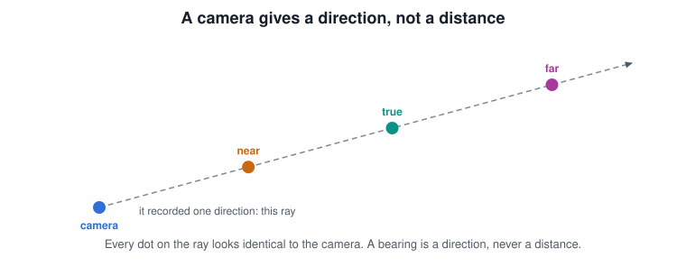

A **ray** (also *sightline* or *line of sight*, LOS) is the line from the camera
through whatever it saw. Every point on that line looks identical to the
camera, so one frame of video places the object somewhere along a line, and
nowhere in particular on it. A *bearing* is the direction of that line.

## 2. Many rays over time: the exact-ray family

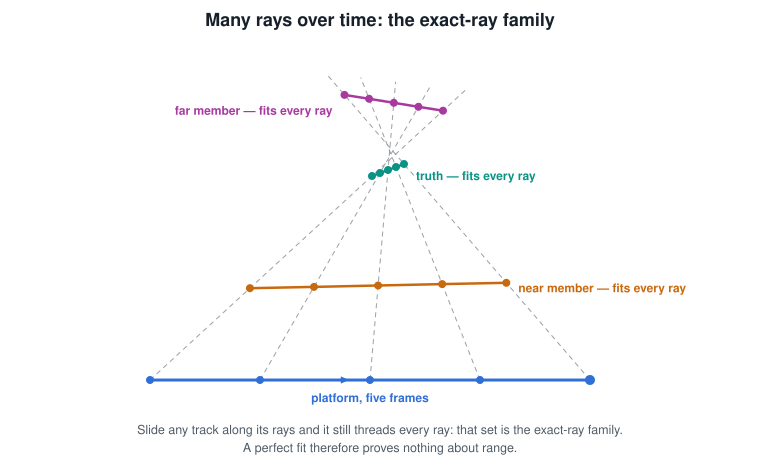

Over a clip the camera records one ray per frame. Take any track that passes
through every ray and slide the whole thing closer to the camera along those
rays, or farther away: it still passes through every ray. The camera cannot
tell the difference. The set of all such tracks is the **exact-ray family**, and
a fit that matches the rays perfectly has therefore proved nothing about
range. This is the fact the rest of the analysis is built around.

## 3. Residual: how far a candidate misses the rays

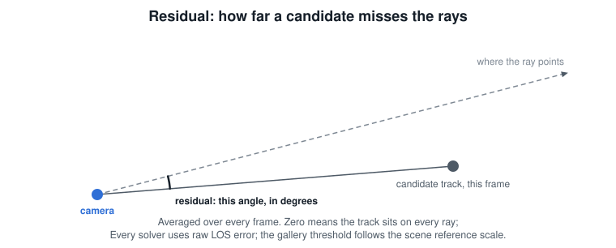

The **residual** of a candidate track is the angle, at the camera, between
where a ray points and where the candidate is at that frame, averaged over the
clip, in degrees. Zero means the candidate sits on every ray. Real sightlines
carry pointing noise, so a small residual is normal. The gallery's screen
(section 9) counts a physics fit as *close* when its residual is still 0.05°
or less after a 0.05° allowance for the ray solver has been taken off — about
0.10° as measured; a catalogued satellite or star is held to a looser 0.10°
(0.15° for a satellite) because its motion is known and is not screened. The
benchmark's existence test (section 14) uses a tighter resolving floor of
0.02°, about what the truth itself scores. Because every member of the
exact-ray
family has the same (zero) residual, **residual alone can never choose a
range**.

## 4. Parallax: the rays pivot about the object

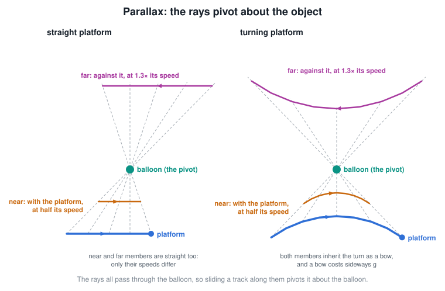

If the camera moves, its rays all pass through the object and so they *pivot*
about it. Sliding a track along the rays now changes its implied motion: a
nearer member is carried along *with* the platform at a fraction of the
platform's speed (half, for a member at half the range); a farther member is
swung the *opposite* way, faster than the platform. Both are far faster than a
drifting balloon. If the platform flies straight, the near and far members are
straight too and only their speeds differ — nothing but a speed assumption
could prefer one. If the platform
*turns*, its turn is stamped
on every wrong-range member as a bend, and a bend costs sideways acceleration
(g) that a real object may not be able to produce. That is what **parallax
buys**: not a range directly, but a price on every wrong range.

## 5. Conditioning: can the rays pin a range at all?

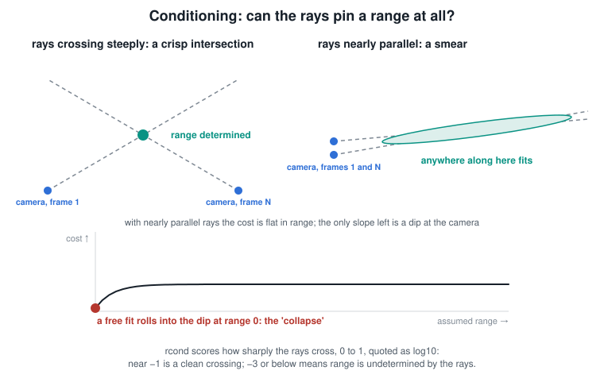

Two rays that cross steeply meet at a crisp point; two rays that are nearly
parallel meet in a long smear, and anywhere along the smear fits. The
**conditioning** of a clip is a score of how sharply its rays cross, reported
as `rcond` on a 0–1 scale and usually quoted as its log10: near −1 is a clean
crossing, −3 or below means range is not determined by the rays. When it is
not, the fitting cost is flat in range except for a dip at the camera, and a
**free fit rolls into that dip** — the analysis reports the nearest range its
search allows. That failure is called a *collapse*. Why the one slope left
points toward the camera is a property of the fitting arithmetic, not of the
scene, and this page does not derive it; what matters for reading a result is
that the dip is an artefact, and the conditioning diagnostic exists to say in
advance when the rays have no slope of their own, so that a near answer is
recognised as a collapse and not a finding.

## 6. Priors: how a choice gets made when the rays cannot choose

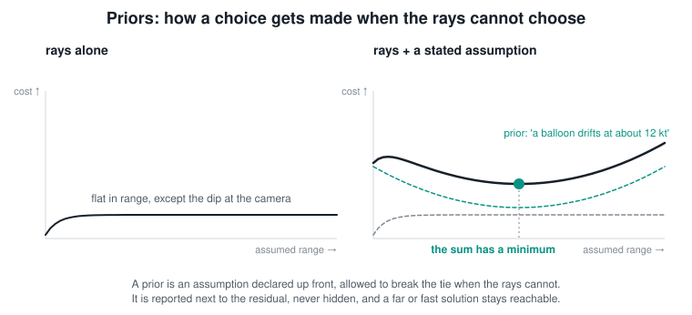

A **prior** is an assumption declared up front — "a balloon drifts at about
12 kt", "an aircraft holds roughly constant air speed" — added to the cost as a
gentle bowl. Where the rays leave the cost flat, the bowl gives it a minimum,
and that is the range the fit reports. Three rules keep this honest: the
assumption is stated, not hidden; what it cost at the solution is reported next
to the residual; and a fast, far or manoeuvring solution stays *reachable* —
a prior may make it less favoured, never impossible. A prior is not a
preference of the analysis; it is the question a particular fit is asking.

## 7. Ordinariness cost: what a candidate would have to be

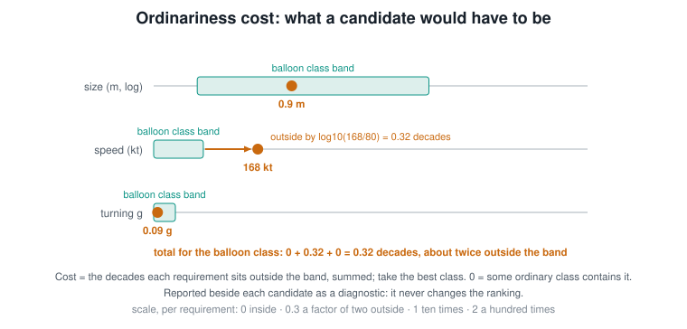

Every candidate track implies a size (from the object's angular size at that
range), a speed and a turning acceleration. Each ordinary object **class** —
balloon, bird, multirotor (a quadcopter), small fixed-wing, light aircraft, jet,
airliner — has a band for all three. The **ordinariness cost** is how far the
candidate's three requirements sit outside the nearest class's bands, measured
in decades (a factor of ten is one decade) and added up — the code and older
write-ups call the same quantity the *mundaneness cost*. Zero means some
ordinary class contains it. A cost of 0.3 is what one requirement a factor of
two outside its band costs (or smaller excesses on two or three requirements
adding to the same); 1 is one requirement ten times outside; 2, a hundred
times. It is reported beside each candidate and it **never
moves the ranking** — it says how ordinary an explanation is, not which one to
prefer.

## 8. A search box is not a physical envelope

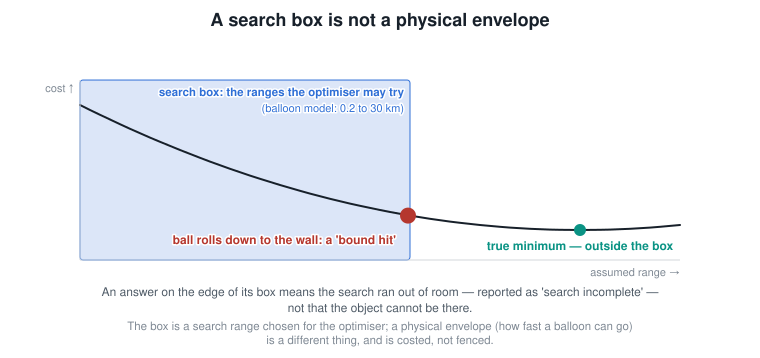

Each model's optimiser is allowed to try values inside a declared **search
box** — for the balloon model, first-ray ranges from 0.2 to 30 km. If the best
answer lies outside the box, the optimiser ends up pressed against the wall: a
**bound hit**, reported as *search incomplete*. That is a gap in the search,
not a finding about the object, and it must never be read as "a balloon cannot
be there". The physical limits of a class (how fast a balloon can go) are a
different thing, the *envelope*, and they are costed (section 7), not fenced.

## 9. The verdict is a survivor count

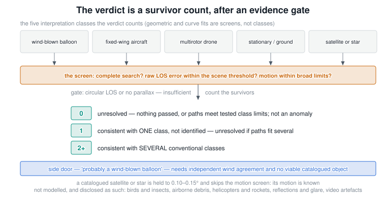

The gallery shows one **tile** per candidate explanation: the physics models,
grouped into five **interpretation classes** — wind-blown balloon, fixed-wing
aircraft, multirotor drone, stationary or ground-bound object, catalogued
satellite or astronomical object — plus the *geometric constructions*, tracks
built straight from the rays with no physics model (a straight line at
constant speed, say), which are compatibility screens rather than classes. An
interpretation class is not a class of section 7: one fixed-wing fit may come
out as a small drone, a light aircraft or an airliner, depending on the size
and speed it implies. Some ordinary causes have no model at all — birds and
insects, airborne debris, helicopters and rockets, reflections and glare,
video artefacts — and the verdict lists them as *not modelled* rather than
silently claiming to have covered them. Tiles are ranked by how well they fit
the rays — the residual; the ordinariness cost is shown beside them and does
not reorder them. Each tile passes or fails a **screen**: was the search
complete, does it fit the rays (about 0.05° after the solver allowance, as
section 3 says), is the motion ordinary (at most 1.5 g and 650 kt). That ceiling is applied to the finished
answer, after the search, and sits far above any one class's envelope — the
per-class limits are costed, as section 7 says — so a tile fails it only when
no ordinary class could fly the motion. The **verdict** is simply how many of
the five interpretation classes have a tile that passed: none is *Unresolved*
(the safety valve, not an
anomaly claim), one is *Consistent with one class, but not identified*, two or
more is *Consistent with several*. The only affirmative wording, *Probably a
wind-blown balloon*, needs an independent wind measurement to agree. Note what
the verdict does not contain: a range. What each wording licenses you to say is
in [Doing Defensible Analysis, section 7](DefensibleAnalysis.md#7-reading-the-executive-verdict-without-over-reading-it).

## 10. relSep: how far the found track is from the truth

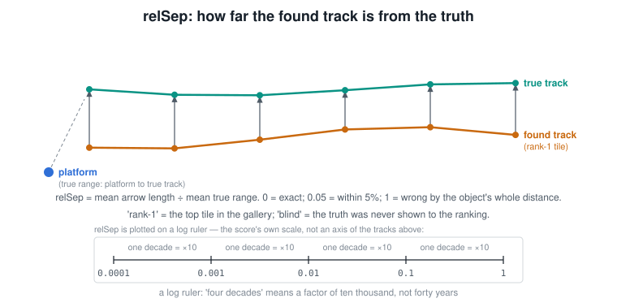

The verdict carries no range, so how is the analysis tested at all? On
benchmark scenarios the true track is known, so a result can be scored.
**relSep** is the average separation between the found track and the true one,
divided by the average true range: 0 is exact, 0.05 is "within 5%", 1 is wrong
by the object's whole distance. **Rank-1** is the top tile in the gallery;
**blind** means the truth was never shown to the ranking, so the score measures
what the analysis concluded on its own. Scores are usually plotted on a log
axis, where "four decades" means a factor of ten thousand.

## 11. Simplex: the optimiser's triangle of guesses

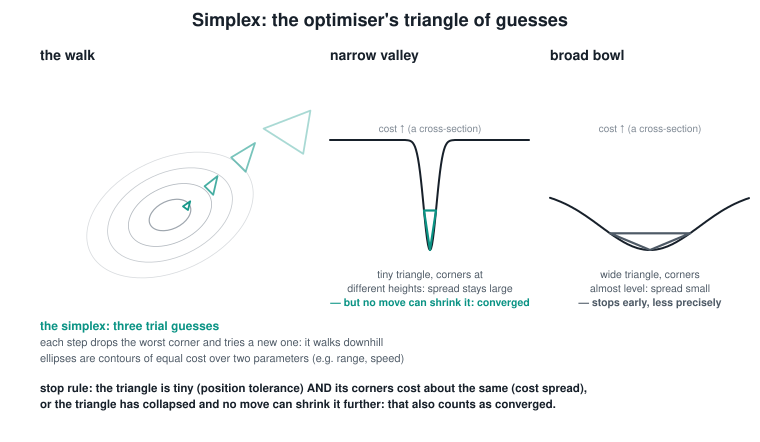

The physics models are fitted by **Nelder–Mead**, which keeps a small set of
trial guesses — in two parameters, a triangle, called the **simplex** — and at
each step drops the worst corner and tries a new one, walking downhill on the
cost. It stops when the triangle is tiny (the *position tolerance*) and its
corners cost about the same (the *cost spread*). In a narrow valley the
triangle can shrink to nothing while its corners still sit at different
heights; no further move could change that, so it has converged even though
the spread test never passed. Reading that as a failure to converge — reported
with the same *search incomplete* wording as a bound hit, though it is a
different thing — was a bug the analysis once had, and it penalised its most
precise fits.

## 12. IFOV: what one pixel can and cannot say about size

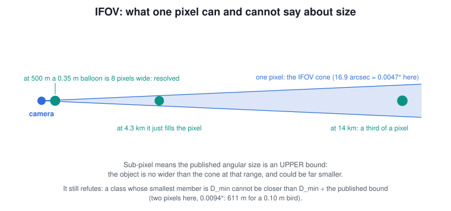

The **IFOV** is the angle one pixel spans — a thin cone from the camera,
16.9 arcseconds for a 3° field on 640 pixels (an *arcsecond* is 1/3600 of a
degree, so 0.0047°). An
object smaller than a pixel is *sub-pixel*: the video only says it is no wider
than the cone at its range, and it could be far smaller, so the published
angular size is an **upper bound** with no lower end (the benchmark publishes
a two-pixel bound, 0.0094°). That bound still refutes: a class whose smallest
member is D_min cannot be closer than D_min divided by the bound, which is why
a collapsed solution pressed against the near end of its search — 500 m, say,
implying an object under 8 cm — pays a size cost no class accepts.

## 13. Two ladders, and two kinds of range

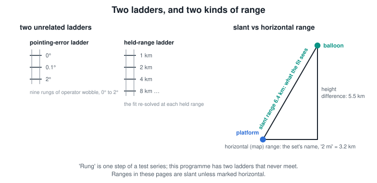

Several numbers on a result page come from a test series rather than from one
fit. A **rung** is one step of such a series, and this work has two ladders
that never meet: the *pointing-drift ladder* (a pointing error added to the
sightlines that grows steadily from zero at the first frame to 5% or 20% of
the 3° field of view at the last, so the rays slide off the object over the
clip — the observation-error model) and the *held-range ladder* (a model
re-solved with its range held at 1, 2, 4, 8 … km, which maps a solution
family). Ranges are **slant** (straight-line) unless marked horizontal; the
benchmark's balloon sets are named by horizontal miles, so the "2 mi" row is
6.4 km slant once the 5.5 km height difference between platform and balloon
is included (the figure draws the platform low by this page's convention;
in the sets it is the aircraft that is high).

## 14. The existence test: success is not finding the truth

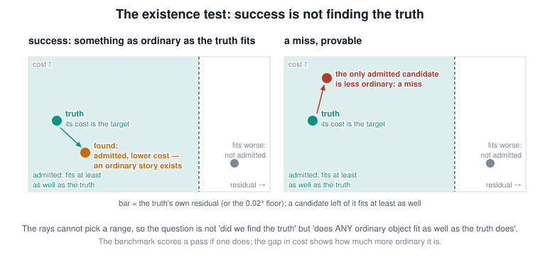

With the scoring of section 10 in hand, what counts as a pass? Since the rays
cannot pick a range, "did the analysis find the true track" is
the wrong test — it demands an answer the data cannot give. The right one: the
truth sets a bar (its own residual, or the 0.02° floor) and its own
ordinariness cost; among the candidates that fit at least as well, take the
lowest cost. **Success is finding something as ordinary as the truth**, not the
truth. If an ordinary explanation fits as well as a declared anomaly, the case
is not evidence of anything unusual, and the gap in cost says how much more
ordinary the alternative is. That is a statement about the *evidence* — the
data cannot establish an anomaly — not a claim that the object was ordinary;
section 15 shows the case where even that much is too much. A mundane truth
with no admitted candidate as ordinary as itself is a real miss, and provable.

## 15. Dynamics order: how much motion the rays can still range

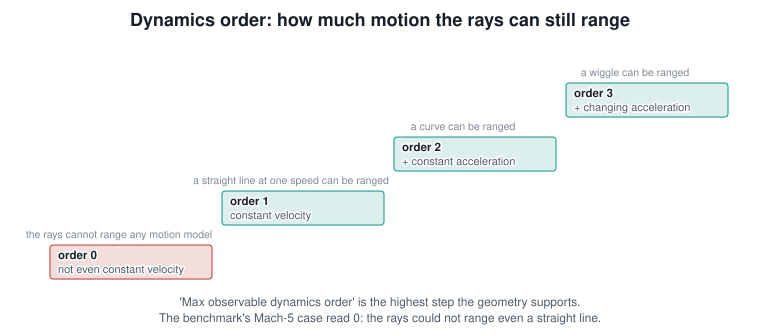

Before any fitting, the geometry is graded (the *pre-fit triage*) by the most
complicated motion model it could still range: **order 0** means not even a
straight line at constant speed can be ranged, 1 means constant velocity can,
2 adds constant acceleration, 3 adds changing acceleration. A clip that reads
0 and still receives a committed verdict — *consistent with one class* rather
than *unresolved* — is the *fast-far trap*: a Mach-5 object at 116 km and a
330 kt aircraft at 7 km thread the same rays, and the verdict took the near
one. In the benchmark's scoring that case is a *false negative* — a real
anomaly called ordinary — but the fault is the commitment, not the ordinary
candidate: when the geometry reads 0 the rays cannot tell the two apart, and
the only honest wording is that they cannot. This is the rule that reconciles
it with section 14: an ordinary alternative is a success when the rays *could*
have separated it from the anomaly and it still fits as well; when the rays
could not separate anything, no verdict should commit either way. The
distinction it turns on is **identifiability** (can a range be found at all)
versus **attributability** (can a class be named).

## 16. The benchmark: a deck of scenarios with answer keys

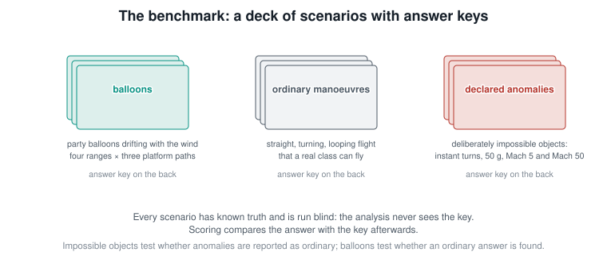

The **botsets** are generated scenarios with known truth: balloons drifting at
four ranges on three platform paths, ordinary manoeuvres a real class can fly,
and *declared anomalies* — deliberately impossible objects (instant turns,
50 g, Mach 5, Mach 50) — whose job is to check that the analysis does not
explain them away when the rays could have told them apart. Every run is
blind. "Clean" means no pointing error was
added; a *drift rung* adds the one-way slide of section 13. Named cases you will
meet in the other pages — Gimbal, Go Fast, Aguadilla — are the real videos the
method was built for; Coryat is the Metabunk member who first mapped Gimbal's exact-ray family
by hand, in 2022.

## Words used without pictures

- **LOS** — line of sight; a ray. **A–B range** — the frame interval selected
  for analysis. **Sitch** — a Sitrec situation file: the scene, tracks and video.
- **Kalman smoother** — a sequential filter that estimates a track frame by
  frame and then smooths it backwards; one of the curve fits.
- **B-spline** — a smooth curve built from control points; the flexible fit.
  **IRLS** — iteratively re-weighted least squares, a way of fitting that
  down-weights outlying frames.
- **RK4** — a standard way of integrating a physics model forward in time.
  **DE** — differential evolution, a global optimiser used to seed the physics
  fits before Nelder–Mead polishes them.
- **Gallery / tile / screen / price** — the results view, one card per
  candidate, the pass/fail test on each card, and turning a motion requirement
  into a cost.
- **Seed** — the starting guess handed to an optimiser. **Tractability set**
  — the scenarios whose geometry can range the object at all (order 1 or
  more), used to separate "the method failed" from "the data could not".
- **Plate** — a numbered explanatory figure in the analysis write-ups.
- **Stage C** — the planned change that reports the set of admitted classes
  with their range bands instead of one winner.

## Read next

- [Traverse Methods](TraverseMethods.md) — each fitting method in turn.
- [Traverse Analysis and the Verdict](TraverseAnalysis.md) — the gallery, the
  ranking and the badges.
- [Doing Defensible Analysis](DefensibleAnalysis.md) — what a result licenses
  you to say, and how to write it up.
