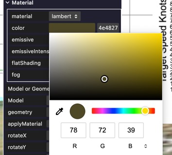
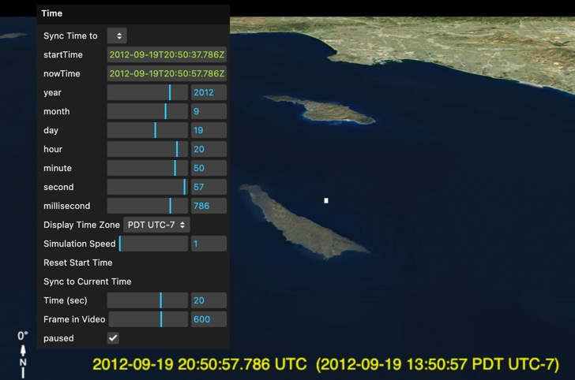

# Sitrec User Interface

Sitrec is a web application that will run in many popular desktop browser like Chrome, Safari, Edge, or Firefox 
but also refer to the [browser compatibility](SavingAndLoading.md#browser-support) section for details on local file system support. 
To run it you just enter or click on the URL of the installation. 
In this documentation I'll assume you are using the standard Metabunk installation at:

<https://www.metabunk.org/sitrec/>

You can add parameters to the address to open a particular sitch, load a file, or set the camera location or start time — see [URL Parameters](URLParameters.md).

## The Menu System

Sitrec's menus are similar to Mac/Windows menus in that there's a menu bar, and you can click on a menu to open or close it.

You can also drag the menu off the menu bar by clicking on the title (The name of the menu, e.g., "File"), and then dragging down. This will leave that menu open at the position you choose on screen. 

To re-dock a menu in the menu bar, either drag it to the top of the screen, or double-click on the title. 

## Folders

Some menus have folders - essentially a sub menu - that you can expand. For example, the Object menu has one folder per object, and each object folder has its own Material folder. 

## Sliders

Most values in Sitrec are edited via sliders. You can modify these in various ways:

- Dragging the slider will quickly adjust the value.
- Editing the number directly - click on the number and type in a new value
- Dragging the number _vertically_ will change it in small increments
- Clicking on the number and then using the up/down arrows will change the number in single steps

Most sliders will stop at the left or right minimum or maximum values, but some, such as the hours/minutes, etc., will wrap around and increment/decrement the slider above them. This makes it very convenient to adjust the time by dragging the seconds slider.

Some sliders will expand in scale if you drag over the right side, or contract in scale if you drag over the left side.

## Color Pickers

Color pickers let you edit the hex value of the color directly, or you can change the hue, saturation and intensity with the slider and the 2D color selector. You can also switch between RGB, HSL, and HEX inputs. Clicking on the eyedropper tool allows you to sample a color from anywhere on screen. 

## Views/Windows

In Sitrec the screen is divided into windows called "Views". Typically, this will consist of:

- Main View: the "god's eye view" looking down at the world
- Look View: the simulated view through the camera set to match the video
- Video View: the original video.
- Overlay Views: Various overlays, things like compasses, or simulated camera HUDs.
- Graph views: various graphs showing things like the speed and altitude of the proposed target object. 
- Editor views: things like spline editors used to make a custom curve for something like Azimuth or Bank Angle.
- Simulator views: things like the simulated aircraft displays in the Gimbal sitches.

You can modify a view in various ways:

- Double-Click on a view to hide all the other views and make this one full-screen. 
- Under the **Show → Views** menu, you can toggle individual views on and off.
- **Hold the `Q` key** and drag a view to move it on screen.
- **Hold `Q`** and drag the corners or sides of a view to resize it.

`Q` is what separates "I am editing the layout" from "I am flying the camera" — without it, dragging inside a 3D view navigates the camera instead. Holding it highlights the edges of every movable view, and moves and resizes snap to their neighbours.

These layout changes are stored with the sitch when you save it (**File → Server → Save** or **Save As**, or **File → Local → Save Local** — see [Saving and Loading Sitches](SavingAndLoading.md)).

## The View Header

Move the mouse to the top edge of a view and a thin header bar fades in, with the view's name on the left and a few icons on the right (fullscreen, pop out, 📌 pin, and ✕ close). It waits for you to mean it: stop on the strip and it is there almost at once, or keep moving along it and it arrives a moment later — either way, sweeping the pointer across the top of a view on the way somewhere else leaves it alone. It also stays away while anything is in front of it, so an open menu hanging over the strip does not get a header fading in underneath it. Pin it if you would rather it stayed put. The header is also the drag handle: drag it to move the view, no `Q` needed. Double-clicking an **empty** part of the bar toggles fullscreen, the same as the ⛶ icon — double-clicking the name or any of the buttons does that button's own job instead.

The name on the left is a menu, and it holds the controls that only affect *that* view:

- **Main** — Measurements, Labels, Pins, Lines of Sight, Current LOS, Camera Frustum, Lat/Lon Grid, Show Tracks, Extend Tracks to Ground, Compass, Time Display, Object Scale, Field of View, Y-Compress, and a Night Sky group (satellites, star names, planet labels, equatorial grid).
- **Look** — Free Look, Measurements, Labels, Pins, All Tracks, Lat/Lon Grid, Show Tracks, Extend Tracks to Ground, Compass, Time Display, Readout, North Up, Y-Compress, a Night Sky group (satellites, star names, planet labels, equatorial grid, celestial vectors), and a Video Overlay group (transparency, color key, ground video).
- **Video** — Zoom, Rotation, Readout, Grid, Annotations, EXIF/Metadata, Remove Video, an Adjustments group (effects, brightness, contrast) and a Masking group.

A **readout** is the panel of figures drawn over a view — whichever of the date, time, frame number, timecode, speeds and altitudes you have switched on. Each view has its own: the look view's is the **Look View Readout** and the video view's is the **Video Readout** (Show ▸ Look View Readout and Video ▸ Video Readout, where you choose which figures appear). Switching one on before you have chosen anything gives you something to see — the frame number on the video, the UTC clock on the look view — placed top right. In a view's own menu the row is just **Readout**, because the menu you opened already says which view it is.

These are the *same* controls as the ones in the Show, View and Video menus, not copies: changing one changes the other, and only one of them is saved with the sitch. The header simply puts them where they apply, under short names — "Measurements in Look" is just "Measurements" under **Look**, and the original wording is still in the tooltip. An item that does not apply to the current sitch (no video loaded, no night sky) is left out rather than shown greyed.

Next to the name, the busiest of those are repeated as one-click icons.

**Main** and **Look** open with the same run, in the same order, so a glance along either bar reads the same way:

| Icon | Control |
|---|---|
| struck-through eye | Declutter |
| **L** | Labels |
| map pin | Pins |
| green dimension line | Measurements |
| a track | Show Tracks |
| a track with a curtain under it | Extend Tracks to Ground |
| a satellite | Satellites |
| a star and an **S** | Star Names |
| a globe with latitude and longitude lines | Lat/Lon Grid |
| compass rose | Compass |
| clock face | Time Display |

**Main** then adds the three things only it draws: red parallel lines for Lines of Sight, a white line down a greyed-out frustum for Current LOS, and a cyan triangle for the Camera Frustum.

**Look** puts **Free Look** — three orthogonal axes — *ahead* of that run, because it is the one button that says who is flying the camera rather than what the view is drawing, and it then adds a data panel for its readout at the end. **Video** adds the data panel for its own.

**Video** also has **100%**, which sets the video zoom to 1:1 and stays lit while it is there. It remembers the zoom it took you away from, so pressing it again puts the video back exactly where it was.

An icon whose control is off is drained of color and dimmed, so a glance along the header tells you what the view is showing. They are the same controls again, not a third copy — click the icon or the menu row, it makes no difference — and an icon whose control does not exist in this sitch (no compass, no night sky) is simply absent.

**Declutter** is the first icon, and it is the whole run in one press: it hides every overlay in that view — labels, pins, measurements, tracks, star names, lines of sight, the frustum, the compass, the clock and the readout — and lights up to say the view is clear. Press it again and exactly the ones that were showing come back. If you switch something back on by hand in between, Declutter re-arms, and the next press clears the view again from wherever it now stands.

**Free Look** hands the look camera to the mouse, so it flies exactly like the main view's camera — left-drag moves the world, middle-drag orbits the point under the cursor, right-drag looks around, the wheel zooms, and WASD walks. While it is on, the Camera menu's Location and Heading sources are suspended, because you are the one aiming. Where you fly to is written into the camera's Location as you go, so switching it off keeps the camera exactly where you left it — which makes the mode a way of *choosing* a camera position, not just a way of looking around.

Free Look is also the one icon that stays on screen when the header is hidden. It sits exactly where it would be on the bar, and it is a working button: press it and you are back out of the mode. With a mouse you will usually not need to — moving the pointer up to it brings the bar in around it, and you press the real one — but on a touch screen, where there is no hover to bring the bar back, it is the way out. Nothing shows there when Free Look is off.

Because those sources are suspended, touching any of them switches Free Look off first: change anything under Camera ▸ Location or Camera ▸ Heading — or press **C** to drop the camera on the point under the cursor — and the camera comes back off the mouse, with **Free look disabled** shown briefly over the look view. Nothing is lost: the camera stays where you flew it, and the control you just reached for takes effect from there.

Camera ▸ FOV (Zoom) is the exception, because the field of view is not part of the pose and is never suspended. VFOV, HFOV, 35mm Equiv and Shift + the wheel all keep working while you fly, so you can frame what you have flown to without leaving the mode.

**Show Tracks** is a switch of its own rather than a write over every track: it decides whether tracks are drawn at all, and each track keeps its own setting underneath it. So you can turn it off to clear the view and turn it back on to find exactly the tracks you had showing — nothing is remembered because nothing was changed. To go further and switch every track back on, including the ones you turned off one at a time, **double-click** it on the main view's header bar (or use **Show Every Track** in the Contents menu).

On the **look view's** header bar the same button means a little more, because that view has a second question to answer: which tracks appear in it. Pressing it there also sets **Show in look view** on every track that is showing, to match. Tracks you have hidden are left alone — they are not drawn anywhere, so there is nothing yet to say about which views would draw them.

**Extend Tracks to Ground** works over every track at once and does remember what it found: turning it back off restores the ones that were extended. **Double-clicking** it is the blunt version — it clears it on every track and forgets the mixture.

**Object Scale** in the Main menu is an extra size multiplier for 3D objects that applies *only* in the main view, on top of Objects ▸ Global Scale. It is for finding a small object from far out without changing what the look view — the camera's own view — would really see.

## Per-view controls

Anything that can be shown in one view but not another is a **pair** of controls, named the same way throughout: "Labels in Main" and "Labels in Look", "Equatorial Grid in Main" and "Equatorial Grid in Look", and so on. The two are independent — neither is a master switch for the other — so a ticked box always means the thing is on in that view. In the view's own header menu the "in Main" / "in Look" is dropped, because the menu you opened already says which view it is.

## Measurements

**Show ▸ Measurements** holds the measurements drawn in the 3D views. A measurement is either the **altitude** of one thing (its height above the ground and above mean sea level) or the **distance** between two things. **Measurements in Main** and **Measurements in Look** turn all of them on or off in each view.

In a custom sitch, **Add Measurement** opens a dialog. Select the measurement type, then select the thing to measure: first its kind (Camera, Traverse, Track, 3D Object, Pin or Building), then the item in the list. A distance has a **From** and a **To**. You can also set a label (text shown above the value), the color, the line width, and units that are different from the sitch units. For a building, the measurement uses the middle of the roof.

Each measurement then has its own entry in the folder. Click it to open the same dialog, where you can change it, hide it with **Show**, or **Delete** it. A new custom sitch starts with three measurements: the camera altitude, the traverse altitude, and the distance from the camera to the traverse. A sitch saved before this feature is converted when it is loaded, and it is saved in the new form. If the thing a measurement uses is deleted, the measurement is not drawn, and its dialog shows the missing item as "not found".

## Units

**Physics ▸ Units** sets the unit system for speeds, distances and altitudes shown in the menus, readouts and graphs. It has four values:

| Units | Distance | Altitude | Speed | Vertical speed |
|---|---|---|---|---|
| **Nautical** | nautical miles (NM) | feet (ft) | knots (kt) | feet per minute (fpm) |
| **Imperial/US** | miles (mi) | feet (ft) | miles per hour (mph) | feet per minute (fpm) |
| **Metric** | kilometers (km) | meters (m) | kilometers per hour (km/h) | meters per second (m/s) |
| **Feet only** | feet (ft) | feet (ft) | feet per hour (fph) | feet per minute (fpm) |

A change converts the values already in the menus, so the sitch itself does not change: 1 NM becomes 1.852 km. The unit system is saved with the sitch. To choose the units that a *new* sitch starts in, use **Sitrec ▸ Settings ▸ New Sitch Startup ▸ Units**.

## Custom graphs

**Show ▸ Graphs ▸ Add Custom Graph** opens a new graph window. Each graph has its own folder in **Show ▸ Graphs**, named **Graph 1**, **Graph 2**, and so on until you give it a **Title**. In the folder:

- **X** — the horizontal axis: **Frame** (the whole clip), **Frame A→B** (only the In to Out frames), or any data series.
- **Y1 (left)**, **Y2 (right)** and **Y3 (right)** — up to three data series, on a left axis and a right axis. **None** leaves a series out.
- **Show Last (secs)** — 0 plots the whole clip. Any other value plots only the last seconds up to the current frame, so the trace scrolls during playback.
- **Show**, **Dark** and **Toggle Legend** — show or hide the graph, set its theme, and show or hide its legend.
- **Remove** — deletes the graph.

The data series available depend on what the sitch has. They include the heading, speed and g-force of each track, the Point Track position, camera motion and Motion Analysis results, the horizon angle, the angle between the Sun and the line of sight, and numeric values read from the video's on-screen display (OSD). The lists update when you add or remove a track or other source.

Custom graphs are available in a custom sitch and in other sitches you can modify, and they are saved with the sitch.

## Sitrec ▸ Settings

**Sitrec ▸ Settings** holds your own preferences. They are not part of a sitch. When you are logged in they are saved to the server; otherwise they are saved in your browser's cookies.

- **Language** — the language of the user interface. A change reloads the page, so save your work first.
- **Theme** — Classic, Dark or Light colors for the menus and the 2D views. See [Dark and light themes](#dark-and-light-themes).
- **Performance Preset** — **Quality**, **Balanced**, **Fast** or **Potato**, for fast or slow computers. It shows **Custom** after you change a setting in **Performance Tweaks**.
- **Performance Tweaks** — the individual settings: **Render Scale**, **Antialiasing (MSAA)**, **Tile Segments**, **Max Details** (terrain detail), **Frame Rate Limit**, and **Max Resolution** (the largest size of a decoded video frame).
- **AI Model**, **Sitrec Focused**, **Voice Model** and **Enable old AI models** — settings for the AI Assistant. They are shown only when the assistant is available. See [The AI Assistant](AIAssistant.md).
- **API Keys…** — use your own keys for the AI Assistant, map and terrain providers, and data feeds. See [Your API Keys](APIKeys.md).
- **Center Sidebar** — a menu area between split views.
- **Show Attribution** — the credit for the map and elevation data, drawn over the view.
- **Show Filename** — the name of the current video file, drawn at the bottom of the view and in exported videos.
- **New Sitch Startup** — how a new sitch begins: its **Units**, and an optional start location (**Use Start Location**, **Start Latitude**, **Start Longitude**, **Start Altitude (m)**), and **3D Buildings** when a 3D buildings source is available. A saved sitch always uses its own units and camera.
- **Use Beta updates** — on installations that offer a Beta version, use it instead of the fully reviewed Shipped version. After a change, Sitrec asks whether to reload now.

## Dark and light themes

**Sitrec ▸ Settings ▸ Theme** sets the colors of the user interface. It has three values:

| Theme | Result |
|---|---|
| **Classic** | The look before themes, and the start condition. The menus are dark, and each view has its own original colors: most are dark, and the classic curve graphs (Show ▸ Graphs) are white |
| **Dark** | Dark menus, and every view that has a theme is white on black |
| **Light** | Light menus, and every view that has a theme is black on white. Light suits printed figures |

The views that have a theme are the 2D panels: the graphs (Show ▸ Graphs, custom graphs, the [Video QP Graph](VideoQPGraph.md)), the curve editors such as the FOV Editor, Notes, the chat and debug panels, and the Audio Spectrum. The 3D views and the video view do not change.

A change of the Theme setting sets **all** of those views to the new mode. After that, each view is independent:

- The **◐** button in the header of a view, to the left of the fullscreen button, changes **that view only**.
- **Shift + click** on the ◐ button changes that view, and then sets **all other views** to the same mode. The menus do not change: only the Theme setting changes them.

A view draws its lines in colors that are clear on its background. When a graph has a color for one theme only, Sitrec calculates the color for the other theme: greys are mirrored (white text becomes black text), and a color keeps its hue but becomes darker for a white background or lighter for a black one.

The Theme setting is saved with your other settings, not in a sitch. A sitch saves the mode of a view when you set that view yourself with its ◐ button, or when the view is not in your theme. So a sitch that you open follows your own theme, except for a view that its author set on purpose, such as one white graph. A mode that was saved stays saved when the sitch is saved again.
 
# Time and Date User Interface

This section is a short introduction. [Time, Frames and Syncing](TimeAndSync.md) is the full reference for the Time menu, frames, Video FPS, the In and Out frames, and syncing a video to a track.

Sitrec is simulating a period of time. This time has a start time and a duration. There's three concepts of time that you need to understand in Sitrec:

## Frame Number/Time

A video has a total number of frames, and a specific number for frames per second (fps). A frame number can also be expressed as a time since the start of the video. The slider at the bottom of the screen represents the frame. You can modify this in various ways:

- Drag the large slider
- Drag the "Time (sec)" or "Frame in Video" sliders in the "Time" menu (or adjust the sliders as described earlier)
- Hold the Left or Right arrows to advance time forwards or backwards at the normal rate.
- Hold the Up and Down arrows to move through time at 10x speed: Up goes back, Down goes forward
- Tap `,` or `.` to single-step one frame backwards or forwards (hold to repeat).
- Tap `<` or `>` (Shift+`,` / Shift+`.`) to jump to the previous or next **keyframe**, where a tool has published them. If nothing has, these do nothing rather than falling back to single-stepping.
- On a video view, right drag in the window to scrub time

## Start Time and Now Time

Start Time is the time at which the video starts. i.e. it's the time at frame 0 (the first frame) of the video. Using the correct time is crucial to recreate a video. Often the start time comes from the video data, but you also might need to edit it manually to find a match.

Now Time is the time at the current frame in the video. Essentially it's the start time of the video plus the frame time. 

The Time menu shows both the start time and the now time at the top (yellow text). When the Frame Time is set to zero they will both be the same. 

The sliders for Year, Month, Day, etc. show the Now Time. This is because when you want to sync the simulation and the video, you will adjust the frame time until there's something distinctive on screen (such as two objects lining up), and then you will adjust the Start Time of the video so that the event happens at the right time in the simulation. This is conceptually simpler if you are editing the Now Time, because that's the point in time that's being displayed (the Start Time is automatically adjusted)

The look view displays the Now Time in UTC format and in the user-selected time zone. 

For time-lapse videos, you can adjust the simulation speed. To play back faster or slower without changing the simulation, use **Playback Speed** in the Time menu (1 = normal, 2 = twice as fast, 0.25 = quarter speed).

## Navigating the Main View in 3D

The Main View is a 3D view on the world, very similar in concept to other 3D viewers like Google Earth. To move the camera around, you use the mouse

- Left Drag is like dragging the world around. The camera is what actually moves.   
- Right Drag tilts the viewpoint without moving the camera
- Center Drag rotates the camera around a point in the world
- The mouse wheel zooms in and out.
- Shift + the mouse wheel changes the camera's field of view instead of moving it. This is the same zoom the Look view's wheel does, and it works in the Look view too when *Free Look Camera* is on (where the plain wheel is moving the camera). The Look camera's field of view can also be set exactly under Camera ▸ FOV (Zoom). In a sitch whose Look camera takes its field of view from the recorded data - MISB metadata, or a track's zoom - Shift + the wheel does nothing on that view, because that value is a measurement of what the real camera did.

If you get lost, you can select "Reset Camera" from the View menu. This will put the camera back to the start position. In the custom sitch tool, it will put the camera back to the position calculated when you last imported a track. You can also get this by pressing "." on the numeric keypad. 

You can also set a default using "Snapshot camera".

# Changing the Terrain

The Terrain menu has two separate dropdowns that are easy to confuse:

- **Map Type** — the *imagery* painted onto the ground. The standard Metabunk installation defaults to "ESRI World Imagery" (satellite). The full list depends on the installation's configuration and typically includes MapBox, several ESRI layers (World Imagery, Hillshade, Topo, Shaded Relief), USGS layers, Open Streetmap, MapTiler, EOX, and day-by-day satellite mosaics (Black Marble city lights, MODIS and VIIRS true color).
- **Elevation Type** — the *shape* of the ground: the digital elevation model. This is a different setting from Map Type, and it is the one that determines terrain heights, ground-level readouts and anything that intersects the ground. The default is AWS Terrarium; a National Map 3DEP source is available for the US.

Changing Map Type changes only what you see. Changing Elevation Type changes measurements.

Under Google Photorealistic 3D Tiles the situation changes again: the basemap is suppressed and the visible ground is the tile mesh, which includes buildings and trees and is a different surface from the elevation model. See [GIS, Geodesy and Altitude](GIS.md) for what that means for altitudes.

There are more terrain editing options in the [Custom Sitch Tool](CustomSitchTool.md), and elevation-source configuration is covered in [Custom Terrain Sources](dev/CustomTerrainSources.md).

