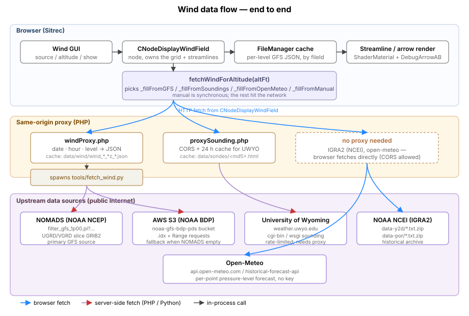
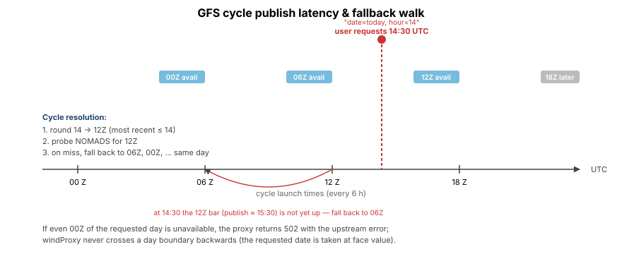
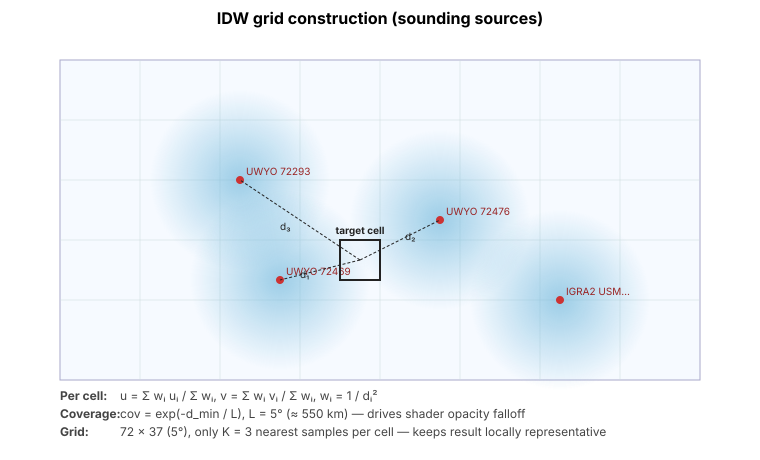
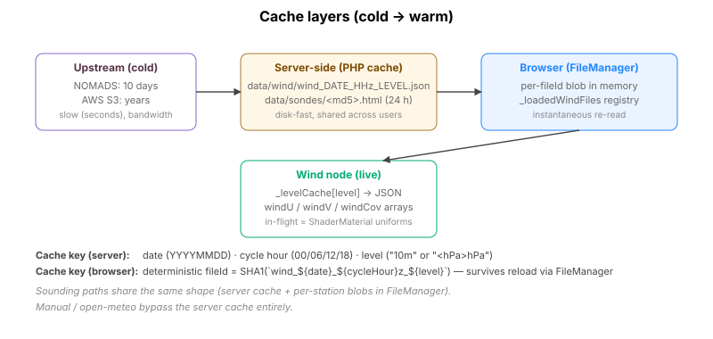

# Wind: data flow, formats, and sources

Companion to [Wind.md](Wind.md). That doc explains what each control does; this one explains where the data comes from, how it moves through the stack, and what the on-disk and in-memory formats look like. It ends with a discussion of how to make the source list *configurable* (env vars / config files) so deployers and end users can plug in their own.

## Conventions used below

A few short names recur:

- **`wn`** — shorthand for "the wind node", `NodeMan.get("windField")` (an instance of `CNodeDisplayWindField` defined in `src/nodes/CNodeDisplayWindField.js`). The Wind GUI binds directly to its fields.
- **`par`** — Sitrec's global runtime-parameter object (`import {par} from "../par"`). Holds cross-cutting UI strings and a few non-node knobs (`par.windStatus`, `par.balloonCount`).
- **GFS** — the NOAA Global Forecast System. Numerical weather prediction model run four times daily.
- **MISB** — Motion Imagery Standards Board. Standard 0903 defines a tag set used by aircraft pod metadata, including columns for wind direction (35) and speed (36).
- **eccodes** — ECMWF's GRIB decoding library (`pip install eccodes` + a system shared lib). `tools/fetch_wind.py` imports it.

## End-to-end flow



Three lanes:

1. **Browser (Sitrec)** — `CNodeDisplayWindField` (`src/nodes/CNodeDisplayWindField.js`) is the wind node. It owns the wind grid, the streamline mesh's `ShaderMaterial`, the screen-space arrow grid, and the inspect-mode arrows. The Wind GUI binds directly to its fields.
2. **Same-origin proxy (PHP)** — two scripts in `sitrecServer/`:
   - `windProxy.php` — wraps `tools/fetch_wind.py` to give the browser a stable JSON endpoint for GFS data, and caches every result in `data/wind/` keyed by date / cycle hour / level.
   - `proxySounding.php` — CORS-bridges the University of Wyoming sounding endpoints (the browser cannot fetch them directly because UWYO sets no CORS headers). 24 h disk cache keyed by URL hash in `sitrec-cache/`.
3. **Upstream public sources** — NOMADS (NOAA NCEP), AWS S3 (NOAA Big Data Program), University of Wyoming, NOAA NCEI (IGRA2), Open-Meteo.

IGRA2 and Open-Meteo are fetched *directly from the browser* — both serve `Access-Control-Allow-Origin: *`, so no PHP proxy is required. Manual and Manual-Soundings sources never touch the network at all.

## Per-source pipelines

Each entry in `WIND_SOURCES` (`src/nodes/WindSources.js`) maps to one branch inside `CNodeDisplayWindField.fetchWindForAltitude(altFt)`:

| Internal key | Branch | Upstream | Goes through | Grid build |
|---|---|---|---|---|
| `gfs` | `_fillFromGridSource(altFt)` | NOMADS GRIB filter, AWS S3 fallback | `windProxy.php` → `fetch_wind.py` → eccodes | direct (already gridded) |
| `custom` | `_fillFromGridSource(altFt)` | env `CUSTOM_WIND_URL` template | `customWindProxy.php` | direct (already gridded) |
| `uwyo` | `_fillFromSoundings(altFt, "uwyo")` | weather.uwyo.edu (cgi-bin or wsgi) | `proxySounding.php` (CORS) | **IDW** |
| `igra2` | `_fillFromSoundings(altFt, "igra2")` | ncei.noaa.gov IGRA2 zips | direct browser `fetch()` | **IDW** |
| `manual-soundings` | `_fillFromSoundings(altFt, "manual-soundings")` | files the user dropped in (IGRA2, UWYO-CSV, or UWYO-LIST — content-detected) | `FileManager.parseResult()` → `CTrackFileSonde` | **IDW** |
| `openmeteo` | `_fillFromOpenMeteo(altFt)` | api.open-meteo.com / historical-forecast-api.open-meteo.com | direct browser `fetch()` | **IDW** |
| `manual` | `_fillFromManual(altFt)` | nothing — reads `targetWind.from` / `.knots` | none | IDW (or uniform if no wind-node positions) |
| `track:<id>` | `_fillFromTrackSource(altFt)` | MISB columns 35 / 36 on the named track | none | IDW (or uniform if no wind-node positions) |

The `custom` source row is only present when `SITREC_USE_CUSTOM_WIND=true`; its dropdown label comes from `SITREC_CUSTOM_WIND_MENU_NAME` (default "Custom Wind"). It shares `_fillFromGridSource` with `gfs` — both expect the same earth.nullschool-format gridded JSON. The `manual-soundings` key is resolved internally to "accept all loaded profiles" (`_resolveSoundingProfiles` maps it to `_gatherSondeProfiles(null)`).

The four IDW sources land in **`_buildGridFromSamples(samples, sourceLabel)`**; manual usually does too (it anchors its one vector at the wind-node positions), falling back to `_buildUniformGrid(u, v, sourceLabel)` only when there are no such positions; GFS calls `_applyWindJSON` directly with the gridded JSON the proxy returns. The IDW and uniform paths produce a 5° / 72×37 grid, while GFS keeps its native 360×181 grid — but either way the streamline mesh and arrow overlay sample it identically. **The shader code never sees source-specific logic** — by the time it's drawing, every source looks identical.

### GFS (the heavy path)

```
Browser:
  CNodeDisplayWindField._fillFromGridSource(altFt)   // shared by gfs + custom
  ├ pick pressure level bracketing altFt (10 m, 1000, 925, 850, 700, 500, 300, 250, 200 hPa…)
  ├ check FileManager for cached fileId  → hit: parse and apply
  └ miss: fetch  sitrecServer/windProxy.php?date=YYYYMMDD&hour=HH&level=…

windProxy.php:
  ├ check ../data/wind/wind_<date>_<HH>z_<level>.json
  │    ├ exact-cycle hit  → readfile + exit
  │    └ earlier-cycle hit (<4 h old)  → readfile + exit  (tolerates upstream lag)
  └ shell out: python3 ../tools/fetch_wind.py --date … --hour … --level …

fetch_wind.py:
  ├ try NOMADS GRIB-filter URL (small partial download — UGRD/VGRD only)
  │    https://nomads.ncep.noaa.gov/cgi-bin/filter_gfs_1p00.pl?file=…&dir=/gfs.YYYYMMDD/HH/atmos
  ├ on miss, fall back to AWS S3 with byte-ranged .idx slicing
  │    https://noaa-gfs-bdp-pds.s3.amazonaws.com/gfs.YYYYMMDD/HH/atmos/gfs.tHHz.pgrb2.1p00.f000
  ├ cycle fallback walk: requested HH → HH-6 → HH-12 → … → 00 (same day only)
  ├ decode GRIB2 with eccodes (extract Ni, Nj, lon0, lat0, dlon, dlat, U/V values)
  └ write JSON to the cache directory

Browser (continued):
  ├ FileManager.add(fileId, json) — `skipSerialization = true` (don't bake the URL into save files)
  ├ this._levelCache[`${dateStr}_${hour}_${level}`] = json
  ├ this.windU / windV = arrays
  └ rebuildStreamlines() + propagateToWindNodes()
```

#### GFS cycle timing



GFS launches at 00 / 06 / 12 / 18 Z. Each cycle takes **~3.5–4 h** to publish to NOMADS — so a request submitted at, say, 14:30 UTC for the 12 Z cycle of *today* may find the data not yet uploaded. Two layers of fallback handle this:

- **`windProxy.php` cache layer** — earlier cycles for the same day, already cached, are served if they're less than 4 h old. This avoids hammering NOMADS with retries while the upstream slowly publishes.
- **`fetch_wind.py` cycle walk** — if the requested hour is genuinely missing, the script tries `HH - 6`, `HH - 12`, … down to 00 of the same day, on both NOMADS and AWS in turn.

**The fallback walk is same-day only.** There is no automatic walk *backwards across days* — if the browser asks for date 20260427 hour 00 and even AWS doesn't have it, the proxy returns a 502 with the upstream error in the body, and the wind node surfaces it through `wn.statusText`.

#### Worked example

Browser asks for `date=20260427&hour=14&level=500` at 14:30 UTC same day:

1. windProxy.php rounds 14 → 12Z (the most recent ≤ 14).
2. Looks for `data/wind/wind_20260427_12z_500hPa.json` — miss (12Z published ≈ 15:30, not yet).
3. Looks for `data/wind/wind_20260427_06z_500hPa.json` — hit (cached when an earlier user requested 06Z), modified 4 h ago, **served**.

If the 06Z cache hadn't existed, fetch_wind.py would have shelled out: NOMADS for 12Z (404), AWS for 12Z (404), NOMADS for 06Z (200), JSON written, served. Net result the same — the user sees 06Z data with a status line they can read.

If they request data 12 hours later for the same date, the cycle walk lands on 12Z directly and 18Z if they request the next morning's data.

#### GFS resolution

`fetch_wind.py --resolution` defaults to `1p00` (1 °) — the most reliably-cached level on NOMADS. `0p25` and `0p50` are also accepted by the URL builder but are not currently surfaced through `windProxy.php`. The 1 ° grid (`Ni = 360, Nj = 181`) is plenty for visualization at typical viewport scales. Sitrec uses the GFS grid *at its native resolution* — it does **not** downsample it to 72 × 37; `_fillFromGridSource` applies the proxy JSON's `nx`/`ny` verbatim. The 72 × 37 (5 °) grid is exclusive to the IDW sources and Manual. The streamline shader and arrow overlay sample whatever grid is loaded (full-res for GFS, 72 × 37 for the IDW sources) bilinearly via `sampleWind()`.

#### GFS retention

- **NOMADS** keeps a rolling ~10 days of cycles. Older requests will 404.
- **AWS S3 (noaa-gfs-bdp-pds)** is the deeper archive — years of data, but not infinite. The bucket is read-only public, no key required.
- For dates outside both windows, the user has to switch to one of the sounding sources.

### Soundings (UWYO / IGRA2 / Manual)

```
Browser:
  CNodeDisplayWindField._fillFromSoundings(altFt, sourceKey)
  ├ _gatherSondeProfiles(sourceKey) — walks every loaded SondeProfile node,
  │   filters to the requested source (or accepts all if sourceKey===null)
  ├ for each profile, sample (u, v) at altFt → samples[]
  ├ if samples.length === 0 → set statusText to a real error and return
  └ _buildGridFromSamples(samples, label)

User-side fetching (separate from the above):
  CustomManagerSetup._ensureSoundingsForWind(sourceKey)
  ├ if profiles of that kind already exist → return true
  └ else: getNearbyWeatherBalloons(par.balloonCount, autoKey)
            ├ pick K nearest stations from data/igra2-stations.json
            │   (one station database for both UWYO and IGRA2 — UWYO has no separate file)
            ├ for each: fetchUWYOSounding(...) or fetchIGRA2Data(...)
            │   on UWYO 429 → uwyoRateLimitUntil = now + 66 s, retry later
            │   on no-data → walk to the next-nearest station
            └ FileManager.add(filename, parsedProfile) → creates a CNodeAtmosphericProfile
```

#### UWYO

UWYO's web endpoints don't allow cross-origin requests, so the browser hits `sitrecServer/proxySounding.php` instead. The proxy:

1. Builds the upstream URL (CGI-bin LIST format, or the newer WSGI per-second CSV).
2. Hashes the URL with MD5 and looks for `sitrec-cache/<md5>.html`. Cache lifetime is 24 h.
3. On miss, makes a curl request to UWYO and writes the response to the cache.
4. Returns the response as `text/html`, with `X-Sounding-Cache: hit|miss`.

The browser also enforces a **client-side rate limit**: after a 429, all UWYO calls in the tab pause for 66 s (`RATE_LIMIT_DELAY_MS`) and update the status field with a countdown.

#### IGRA2

IGRA2 (Integrated Global Radiosonde Archive v2) is hosted by NOAA NCEI at `https://www.ncei.noaa.gov/data/integrated-global-radiosonde-archive/access/` and serves `Access-Control-Allow-Origin: *`. The browser fetches the per-station `.txt.zip` directly:

```
data-y2d/<station>-data-beg<currentYear>.txt.zip   (year-to-date)
data-y2d/<station>-data-beg<currentYear-1>.txt.zip (previous year, sometimes still open)
data-por/<station>-data.txt.zip                    (period-of-record, full history)
```

The zip is decompressed in-browser, the requested sounding is selected from the (potentially huge) archive, and the parsed profile is added to FileManager.

#### Manual Soundings

A pass-through. The user drag-and-drops a sounding file in one of three text formats: IGRA2, UWYO-CSV (the per-second GPS CSV), or UWYO-LIST (the older HTML table). As the parse pipeline runs, `CTrackFileSonde.canHandle()` calls `detectSondeFormat()` to figure out which format it is — detection is **content-based**, not by file extension — and picks the matching parser. The result is a `CNodeAtmosphericProfile` node, same as if it had been fetched. Picking **Manual Soundings** in the source dropdown disables the auto-fetch, leaving whatever the user has already loaded.

### Open-Meteo

Per-point fetches against the public API:

```
isHistorical = (now < today)
baseUrl = isHistorical
  ? https://historical-forecast-api.open-meteo.com/v1/forecast
  :            https://api.open-meteo.com/v1/forecast

GET ${baseUrl}?latitude=${lat}&longitude=${lon}
    &hourly=wind_speed_<L>hPa,wind_direction_<L>hPa,geopotential_height_<L>hPa
    &wind_speed_unit=ms&start_date=YYYY-MM-DD&end_date=YYYY-MM-DD
```

`<L>` is a small subset of pressure levels bracketing the requested altitude. The browser interpolates speed and direction (circular interp) between the bracketing samples by geopotential height, and converts to (u, v).

This is a *per-point* request — Open-Meteo doesn't supply gridded fields the way GFS does. Sitrec uses it to seed the [IDW grid](#idw-grid-sounding-sources--open-meteo) with samples taken at every wind-relevant track point (target track, jet/camera track), then runs `_buildGridFromSamples` over those — same path as soundings, just with samples coming from API responses instead of radiosonde launches.

### Track-derived winds

If a sitch has a track file with MISB columns **35 (WindDirection)** and **36 (WindSpeed)**, the dropdown automatically gets a **Track: \<shortName\>** entry. Picking it sets `this.source` to the `track:TrackData_<shortName>` key. `_fillFromTrackSource(altFt)` then reads the MISB WindDirection (35) / WindSpeed (36) row at the current frame, converts it to (u, v), and builds the wind grid from it — uniform if there are no wind-node positions, otherwise IDW over the wind-relevant track points. The streamline mesh and arrow overlay sample it like any other source.

## Debugging wind end-to-end

A checklist for "wind isn't working" reports, pre-checked against the layers above:

1. **What does the browser say?** Read `wn.statusText` (also displayed as **Status** in the GUI). Errors there name the failing source — start there.
2. **Is the wind node actually trying?** In the browser console: `NodeMan.get("windField").source` and `.windAltFt`. Confirm they match what the user thinks they picked.
3. **Did the request reach the proxy?** Network tab → filter `windProxy` (or `proxySounding`). Status code, response size. A 502 from the proxy means upstream failed; a 200 with empty / wrong content means cache or parse problem.
4. **Did the proxy cache miss / hit?** Server logs show the python invocation; the response header `X-Sounding-Cache: hit|miss` (sounding only) reports cache status directly.
5. **Did `fetch_wind.py` succeed?** Run it by hand: `python3 tools/fetch_wind.py --date 20260427 --hour 12 --level 500 --output /tmp/`. If eccodes import fails, the deployer's missing the system library.
6. **Did the JSON make it back?** `ls -la data/wind/` for an entry matching the date / hour / level. Truncated files (`size < 1KB`) usually mean a partial GRIB decode — delete and retry.
7. **Did the browser register it in FileManager?** `FileManager.list[fileId]` should be present after a successful load. Stale `_levelCache` entries can survive a source switch — `wn._levelCache = {}` followed by **Refresh Wind Data** is the nuclear option.
8. **Does the grid have the expected shape?** Check against the source: IDW/Manual sources produce `wn.windU.length === 72*37 === 2664`, while GFS/custom keep the native 1 ° grid `360*181 === 65160`. If the length doesn't match the active source's expected shape, the source-specific `_fillFrom*` wrote a non-standard grid.

External dependencies that can fail silently:
- **PHP `curl` extension** — without it, `proxySounding.php` fails to talk to UWYO. Some minimal PHP installs omit it.
- **eccodes shared library** — Python `import eccodes` fails if `libeccodes.so` isn't on the system. Linux: `apt install libeccodes0`. macOS: `brew install eccodes`.
- **Python `certifi`** — used to validate NOMADS/AWS HTTPS. The fetcher falls back to unverified HTTPS if certifi isn't importable; this is acceptable for local dev but not great in production.

## On-the-wire formats

### Wind JSON (server → browser, `data/wind/*.json`)

```json
{
  "source": "GFS",
  "refTime": "2025-09-19T18:00:00Z",
  "nx": 360, "ny": 181,
  "lon0": 0, "lat0": 90,
  "dlon": 1, "dlat": -1,
  "level": "10m",
  "u": [<360*181 floats>],
  "v": [<360*181 floats>]
}
```

Compatible with earth.nullschool.net's wind format. `dlat = -1` means the grid scans south as Y increases (north pole at top). The shader treats `(lon0, lat0)` as the top-left corner.

### IDW grid (sounding sources + Open-Meteo)

**IDW** stands for **Inverse Distance Weighting** — a classical spatial-interpolation method that turns a handful of scattered point samples into a continuous field by averaging the samples around each output cell, weighting each sample by `1 / dⁿ` where `d` is the distance from the cell to the sample. Closer samples count more; faraway samples count vanishingly little.

Sitrec uses IDW because the relevant data sources don't deliver pre-gridded fields:

- **Soundings** (UWYO, IGRA2, Manual Soundings) come from radiosonde launches at fixed stations. Each station gives one vertical profile at one (lat, lon). After picking out the wind vector at the requested altitude from each profile, you have N (typically 1–10) scattered samples on the globe.
- **Open-Meteo** is a per-point pressure-level forecast API. Sitrec calls it once per wind-relevant track point (target track, jet/camera track), again producing a handful of scattered samples.

In both cases the streamline shader and the arrow overlay want a *grid* to read from — same shape regardless of source. `_buildGridFromSamples(samples, sourceLabel)` runs IDW over the samples to produce that grid:



The implementation choices in `_buildGridFromSamples` (`src/nodes/CNodeDisplayWindField.js`):

- **Grid: 72 × 37 cells (5°).** Coarse on purpose — sounding stations sit hundreds of km apart, so a finer grid would invent precision that isn't there. The streamline integrator does its own bilinear interpolation between cells.
- **Distance: haversine on the sphere, in degrees.** Treats the globe as a unit sphere; close enough at this resolution.
- **Power: `wᵢ = 1 / dᵢ²`.** A common choice (sometimes called *Shepard's method* with p = 2). Higher `p` makes the field hug each sample more tightly; lower `p` smears them. `p = 2` strikes the standard balance.
- **`u = Σ wᵢ uᵢ / Σ wᵢ`, same for `v`.** Wind is a 2-D vector, so each component IDW's independently.
- **K = 3 nearest only** (`K = min(3, samples.length)`). Plain IDW averages every sample into every cell, which smears one distant sounding's wind into the whole globe at low weight. Restricting to the 3 nearest keeps each region's value driven by its locally relevant samples and lets the field actually vary across the map. With fewer than 3 samples we just use what we have.
- **Coverage: `cov = exp(-d_min / L)`, `L = 5°` (≈ 550 km).** A separate per-cell number (not a wind value) representing "how trustworthy is this cell's estimate". 1.0 at a sample, ≈ 0.37 at L degrees away, ≈ 0.14 at 2L. The shader multiplies streamline alpha by `cov` so streamlines fade out smoothly in regions far from any sample, and streamline *seeding* skips cells with `cov < 0.02` (effectively zero coverage). This is what stops the IDW field from producing confident-looking wind in oceans where there are no soundings. (The screen-space arrow overlay doesn't use coverage — it only drops cells whose wind speed is below a ~0.5 m/s noise floor.)

**Why not GFS?** GFS already arrives as a regular 1° lat/lon grid covering the entire globe — there's nothing to interpolate. `_fillFromGridSource` (the shared gfs/custom path) skips IDW entirely and applies the proxy JSON's grid as-is (at its native 360×181 resolution — no downsampling). Coverage is a flat 1.0 everywhere because GFS has data everywhere (the `windCov` array is simply absent, and `sampleCoverage()` returns 1.0).

**Why not Manual?** Manual is a single user-typed (from, knots) value. When target/local wind-node track positions exist, `_fillFromManual` anchors that one (u, v) at those positions and runs IDW via `_buildGridFromSamples` — just like the sounding sources — so the field fades with distance via coverage. Only when there are no wind-node positions does it fall back to `_buildUniformGrid`, which writes the same (u, v) into every cell.

### Cache layers



- **Server disk cache** — `data/wind/wind_<DATE>_<HH>z_<LEVEL>.json` (no expiry on exact-cycle hits, 4 h staleness on fallback hits) and `sitrec-cache/<md5>.html` (24 h).
- **Browser FileManager** — every successful GFS level is registered with a deterministic `fileId = "windGrid_${source}_${suffix}"` and `entry.skipSerialization = true` (so the blob doesn't bloat save files). `entry.staticURL = "data/wind/..."` lets a reload re-fetch the same JSON deterministically.
- **In-flight node state** — `wn._levelCache["<date>_<hour>_<level>"]` holds the last-applied JSON, keyed by a composite `dateStr_hour_level` string (e.g. `"20260427_12_500"`); `wn.windU`, `wn.windV`, `wn.windCov` are the three flat arrays the shader and `sampleWind()` read from.

### Time / units

- All timestamps round-trip as ISO 8601 UTC.
- GFS uses **m/s** internally (eccodes returns SI). Sounding parsers normalize whatever the source format provides into m/s before building (u, v).
- Track MISB rows specify direction in degrees and speed in m/s (per MISB 0903 std).
- The GUI displays speeds in knots, but every internal value (windU, windV, sampleWind) is m/s. The conversion is at the GUI boundary only.

### Coordinate systems

- Wind grid: regular lat/lon, geographic, north-up. `(lon, lat) → (u, v)` where u is east-positive and v is north-positive.
- Streamline integration runs in lat/lon space (degrees) using a step size derived from `dtSeconds` and the local meridional/zonal speeds.
- The streamline mesh is then placed on a thin shell at altitude `renderAltitude = max(10, altFt × 0.3048)` metres MSL, ECEF-space, sitting on top of the WGS84 ellipsoid.

## Concurrency / coalescing

Two layers of coalescing keep things sane when the user drags the altitude slider or flips sources mid-fetch:

1. **In `fetchWindForAltitude`** — `this.fetching` flag plus `_pendingAltFt` / `_pendingSource` slots. While a fetch is in flight, new requests update the slots; the in-flight call's tail re-runs once with the latest values when it lands.
2. **In `CustomManagerSetup._loadWindForCurrentSource`** — `this._windLoadInFlight` promise. Subsequent calls forward through `Promise.allSettled`, ensuring `par.windStatus` ends up reflecting the *final* state, not whatever the first fetch said.

The combination means rapid slider drags collapse to one network round-trip per cached level, and rapid source flips don't end up showing the old source's status text.

## Unsupported / deliberately missing

- **Time-varying GFS** — only the f000 analysis is fetched; forecasts (f003, f006, …) are not currently used.
- **Wind animation across cycles** — Sitrec snapshots one cycle at the sitch's start time and keeps it for the whole sitch. Long sitches that span multiple cycles see static wind.
- **Anything below 10 m AGL or above 100 hPa** — outside that range, GFS levels exist (50 hPa, 30 hPa, 10 hPa) and Open-Meteo levels exist (50, 30 hPa) but the sounding profiles often don't, and the GUI altitude slider stops at 60,000 ft (roughly the 70 hPa level) by convention.
- **Resolution > 1°** — code paths exist (`build_nomads_url(... resolution="0p25")`) but PHP doesn't expose a `resolution` parameter to the browser.

---

# Toward configurable data sources

A first step already exists: a single env-driven custom gridded source (`SITREC_USE_CUSTOM_WIND` + `CUSTOM_WIND_URL` template + `sitrecServer/customWindProxy.php`), which lets a deployer add one extra GFS-format source without a code change. The proposal below generalizes that one-off into a full registry. Apart from that custom hook, the upstream URLs and the source list are still hard-coded in three places:

1. `src/nodes/WindSources.js` — the dropdown menu.
2. `tools/fetch_wind.py` (`build_nomads_url`, `build_aws_url`) — GFS endpoints.
3. `sitrecServer/proxySounding.php` (`weather.uwyo.edu/...`) — UWYO endpoints.

That's fine for the upstream public sources we know about, but it shuts the door on:

- **Internal NWP feeds** (e.g. a research lab's HRRR mirror, an institutional ECMWF subscription).
- **Geographically-restricted users** who are blocked from NOMADS / AWS but have a working alternative.
- **Air-gapped deployments** that need to point at a LAN-hosted GRIB cache.
- **Future public sources** that come and go — adding one shouldn't require a code release.

## Proposal: env-driven source registry

The smallest change with the biggest payoff is to make `WIND_SOURCES` a *runtime configuration* instead of a hard-coded array. Three pieces:

1. **A schema** — what fields a source declaration has.
2. **A loader** — reads declarations from env vars / a config file at startup, falls back to the current built-in list.
3. **A registration hook** in `CNodeDisplayWindField` so each source can plug its own `_fillFrom*` implementation without touching the node.

### Schema (sketch)

A source declaration object:

```jsonc
{
  "key": "ecmwf-internal",                  // id used in wn.source / save files
  "label": "ECMWF (internal mirror)",       // dropdown label
  "short": "ECMWF",                         // compact label for the compass widget
  "type": "gridded",                        // gridded | sounding | uniform | per-point
  "endpoints": {
    "browser": null,                        // direct browser fetch URL template (or null = use proxy)
    "proxy":   "ecmwfProxy.php"             // PHP proxy endpoint relative to sitrecServer/ (or null = direct)
  },
  "params": {                               // template params for URL construction
    "resolution": "0p25",
    "levels": [10, 50, 100, 200, 250, 300, 500, 700, 850, 925, 1000]
  },
  "auth": {                                 // optional — value comes from env var, never committed
    "header": "X-API-Key",
    "envVar": "WIND_ECMWF_KEY"
  },
  "autoLoad": null,                         // for sounding-style sources only
  "handler": "gfs"                          // which built-in JS handler to use; OR a path to a plugin module
}
```

### Config file shape

The config file (`config/wind-sources.json`) is a *meta-document* — it describes how to derive the runtime registry from the built-ins, not a flat list. Three top-level verbs:

```jsonc
{
  "version": 1,
  "extends": "default",     // start from built-in WIND_SOURCES (or "none" for empty)
  "add":     [<source-decl>, ...],
  "disable": ["uwyo", ...]
}
```

A loader applies `extends` → `add` → `disable` in that order to produce the final list. `version` is mandatory and refused if newer than the loader understands.

### Loader

The loader walks three surfaces in priority order and merges:

1. **Built-in defaults** — the current `WIND_SOURCES` array, kept in `WindSources.js` as the fallback (`extends: "default"`).
2. **Deployment config file** — `config/wind-sources.json` (read at server boot for the PHP layer; injected as a JS module for the browser via the existing `config-install.js` overlay pattern).
3. **Environment variables** (highest precedence):
   - `SITREC_WIND_SOURCES_FILE` — path to a JSON file overriding any of the above.
   - `SITREC_WIND_DISABLE` — comma-separated keys to remove (e.g. `gfs,uwyo` for an air-gapped install).
   - `SITREC_WIND_ENABLE_ONLY` — whitelist (only these keys appear).
   - `SITREC_WIND_<KEY>_ENDPOINT` / `SITREC_WIND_<KEY>_KEY` — per-source URL / auth overrides. The `<KEY>` placeholder uppercases the source key and replaces `-` with `_` (so `ecmwf-internal` → `SITREC_WIND_ECMWF_INTERNAL_ENDPOINT`).

The PHP layer reads the same JSON. `windProxy.php` becomes a generic gridded-source proxy that picks an entry by `?source=<key>` and applies the entry's `endpoints.proxy` template; the fetcher's GFS path stays as the built-in handler keyed `"handler": "gfs"`.

### Handler dispatch

`CNodeDisplayWindField.fetchWindForAltitude` currently has a hard `if (source === "gfs") … else if (source === "uwyo") …` ladder. Replace it with a registry lookup keyed on the declaration's `handler` field:

```js
const decl    = WindSourceRegistry.get(this.source);
const handler = WindSourceRegistry.getHandler(decl.handler);
if (!handler) throw new Error(`Unknown handler '${decl.handler}' for source '${this.source}'`);
await handler.fetch(this, altFt, decl);
```

The handler receives the source declaration, so multiple declarations can share one implementation by setting the same `handler` value (e.g. an HRRR mirror and a GFS mirror both use `handler: "gfs"` if the upstream wire format matches).

Built-in handlers move to `src/nodes/wind/handlers/{gfs,sounding,openmeteo,manual}.js` — each behind the same registry interface. **A custom handler not covered by these four still requires shipping JS code** (a new module, plus a build); the JSON config alone can only re-point existing handlers at new endpoints. v1 of the registry is intentionally limited to that case to keep the surface small. A future iteration could load handlers from a configured directory at runtime.

### Example: enabling a private GFS-format mirror

A deployer at a research lab wants to point their team's Sitrec at an internal mirror that serves GFS-format JSON over a different URL. The wire format is GFS, so the built-in `gfs` handler works as-is — only the endpoint changes:

```bash
# .env (server-side)
SITREC_WIND_SOURCES_FILE=/etc/sitrec/wind-sources.json
```

```jsonc
// /etc/sitrec/wind-sources.json
{
  "version": 1,
  "extends": "default",
  "add": [
    {
      "key": "gfs-lab",
      "label": "GFS (lab mirror)",
      "short": "GFS-lab",
      "type": "gridded",
      "handler": "gfs",
      "endpoints": { "proxy": "windProxyLab.php" },
      "params": { "resolution": "1p00" }
    }
  ],
  "disable": ["uwyo"]
}
```

After a server restart, the Wind Source dropdown gains `GFS (lab mirror)` and loses `UWYO Soundings`. The lab provides `sitrecServer/windProxyLab.php` (often a symlink or trivial wrapper around `windProxy.php` configured to talk to a different upstream). **No JS code change is required** in this case because the wire format matches the built-in `gfs` handler.

A truly different format (e.g. ECMWF MARS extracts) would require a new handler module — not just a config file. That's the v1 limitation called out above.

### Migration

- Phase 1: ship `WindSourceRegistry` + the loader. Built-ins are registered through it but no config file is read yet. **No behaviour change.**
- Phase 2: add the JSON / env loader. Existing sitches keep their `wn.source = "gfs"` etc., still resolve to the same handlers. Save files are forward-compatible (the registry resolves keys by the same string).
- Phase 3: surface this in the docs as a deployer-facing feature. Update `config-install.js` template with `wind-sources.json` overlay example.
- Phase 4 (optional): in-app GUI for source management — "+ Add Source…" with URL template / preview. Probably gated behind admin role.

### Open questions for the plan

1. **Where do per-source secrets go?** Browser-level fetches with `X-API-Key` headers expose the key to anyone who opens DevTools. The proxy layer is a better home for keys, but then the source is "proxied" and the browser-direct shortcut goes away. Probably correct to mandate proxy-routing for any source that needs auth.
2. **How do we handle source-specific UI knobs?** GFS has no per-source knobs today; UWYO has `Sounding Count`. A truly generic registry would let a source declare its own GUI controls. Out of scope for v1, probably — start with shape-fixed sources.
3. **What about the `Track:` synthetic sources?** Those are runtime-discovered, not config-driven — they should bypass the registry. The current `windSourceLabelsToKeysWithTracks()` mechanism already handles that and can stay.
4. **Save-file forward compatibility.** A sitch saved with `wn.source = "hrrr-lab"` loaded on an instance that doesn't have that source registered should fall back gracefully. Proposal: surface a one-time warning, switch to `"manual"`, leave the saved string alone in `wn.source` so a re-save preserves it. (Don't silently rewrite — the user may move to another instance that *does* have it.)
5. **Plugin handler discovery.** v1 = handlers are registered at module load (built-ins import each other). v2 (out of scope) = `import.meta.glob` over a configured plugin directory. v1 docs need to make this distinction explicit for deployers.

---

This document is a description of the system *as built today*. The "Toward configurable data sources" section is a starting-point proposal — a basis for a separate plan, not a commitment.
