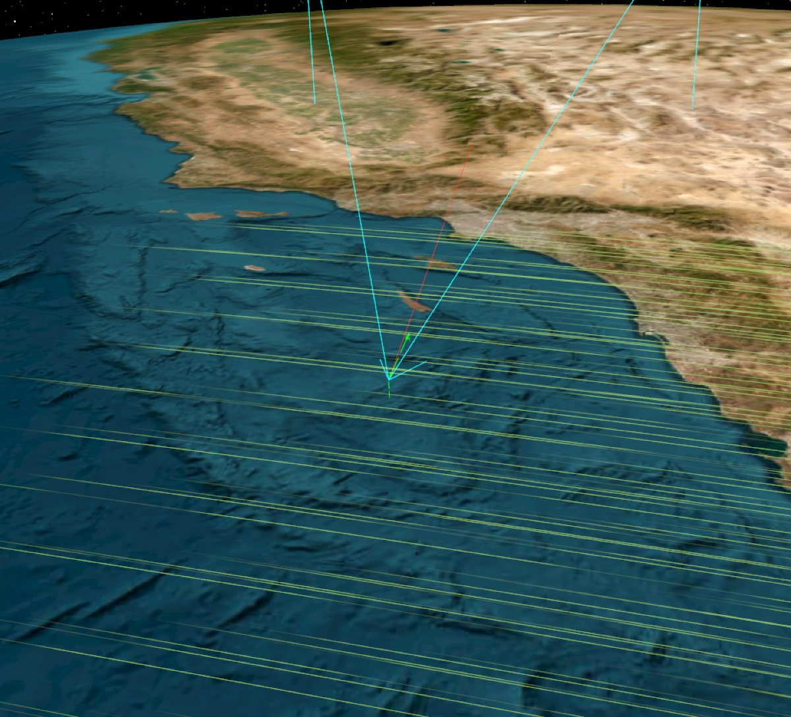
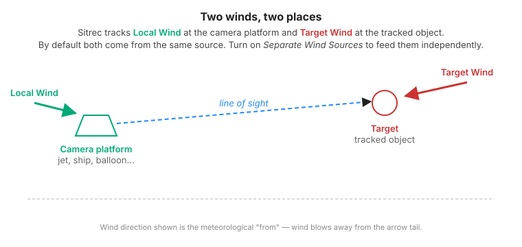
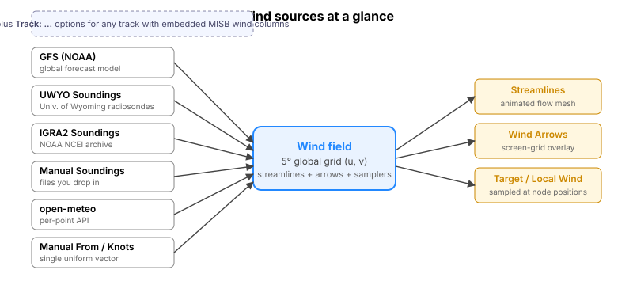
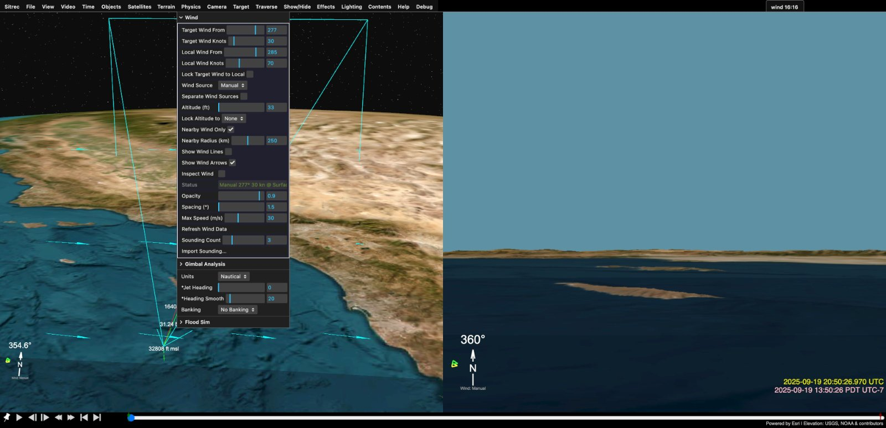
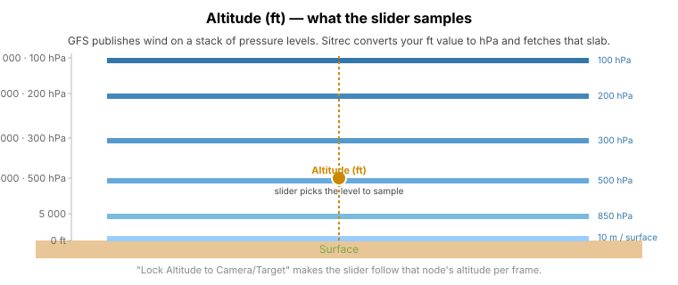
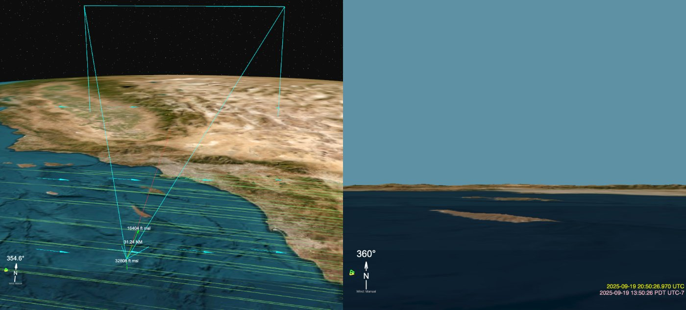

# Wind in Sitrec

The Wind menu controls wind speed and direction, pulls atmospheric data from real-world sources, and draws streamlines and arrows in the main view.

*Animated wind streamlines (green) flowing across the Pacific. The cyan view-frustum and red LOS belong to the camera tracking a target offshore.*

> **Just here for the controls?** Jump to [GUI reference](#gui-reference). For data-flow internals see [Wind-Internals.md](Wind-Internals.md).

## Quickstart

1. Open the **Physics** menu in the top menubar, then expand the **Wind** folder.
2. From **Wind Source**, pick **GFS (NOAA)** for any date in the last ~10 days, or **UWYO Soundings** / **IGRA2 Soundings** for older dates.
3. Set **Altitude (ft)** to the relevant flight level.
4. **Show Wind Lines** is auto-toggled on the first time you pick an atmospheric source — the streamlines appear once the data has loaded (a few seconds, then it's cached).

That's the common path. The rest of this doc fills in everything around it.

## Glossary

A few terms used throughout. If you've used Sitrec before some of these will be obvious; defining them up front saves having to guess.

- **sitch** — a saved Sitrec scene (geometry, tracks, settings).
- **target** — the object the user is tracking (a UFO, an aircraft, a satellite).
- **camera platform / local** — the observer's vantage point (the jet, ship, balloon, or fixed station the camera lives on).
- **From** (heading) — meteorological convention. "Wind from 270°" means the wind is *blowing from the west*. Sitrec follows this everywhere.
- **wind field** — a 2D grid of wind vectors covering the globe (or a region around the scene), sampled by the streamlines and the arrow overlay.
- **MISB track** — a track file containing per-frame metadata in the MISB 0903 standard, optionally including embedded wind columns.
- **IDW** — inverse-distance weighting; how Sitrec turns scattered sounding samples into a continuous grid.

## Concepts

Sitrec keeps two kinds of wind state side by side:

- **Target Wind** — the wind acting on the *target* (the thing you are tracking). Used by traverse methods that compute target motion through the air (e.g. `LOSTraverseConstantSpeed` in airspeed mode).
- **Local Wind** — the wind acting on the *camera platform* (the jet, ship, balloon you are looking from). Used by anything that needs platform-relative airflow.

Each has a heading-from (true degrees, north = 0, blowing **from** that direction) and a speed in knots. By default both come from the same **Wind Source**; turn on **Separate Wind Sources** to drive them from different inputs.

Behind the controls is a third object: the **wind field**, a coarse 2D grid of (u,v) wind vectors covering either the whole globe or just a region around your scene. This is what the streamlines and arrow overlay sample. Picking any non-Manual source builds (or fetches) a wind field; Target/Local Wind are then sampled from that field at their respective positions and altitudes.

## GUI reference

The Wind folder lives under **Physics**. Controls below appear in roughly the order they are shown.

*The whole Wind folder, expanded.*

### Manual override sliders (always live)

These four controls are the manual override. Even when you have a real wind source loaded, they let you type a value and have it take effect immediately. (When the **Wind Source** is set to **Manual**, these same values *also define* the entire wind field — see [Manual source vs. manual override](#manual-source-vs-manual-override) below.)

| Control | What it does |
|---|---|
| **Target Wind From** | Direction (true degrees) the *target's* wind is blowing **from**. North = 0, east = 90. |
| **Target Wind Knots** | Speed in knots at the target. |
| **Local Wind From** | Same as above, for the camera platform. |
| **Local Wind Knots** | Same as above, for the camera platform. |
| **Lock Target Wind to Local** | Forces Target's *values* to equal Local's on every change. |

> **"Lock Target Wind to Local" vs. "Separate Wind Sources" — they sound similar; they aren't.**
>
> | | Same source | Separate source |
> |---|---|---|
> | Values free | default | turn on **Separate Wind Sources** |
> | Values locked | turn on **Lock Target Wind to Local** | rarely useful (Lock would override Separate) |
>
> "Lock" ties the *numbers* together. "Separate" lets each side pull from a different *atmospheric data source*.

### Wind Source

Single dropdown when **Separate Wind Sources** is off. The label changes to **Target Wind Source** when the toggle is on, and a second dropdown (**Local Wind Source**) appears below it.

Available sources:

| Source | What it is | When to use it |
|---|---|---|
| **GFS (NOAA)** | Global atmospheric grid from the NOAA Global Forecast System. Whole-Earth coverage, 6-hour cycles. | Default for most modern dates. Good when you need wind at altitudes other than the ground. |
| **UWYO Soundings** | Radiosonde profiles from University of Wyoming. Auto-fetches the nearest stations and IDW-blends them. | Historical dates back to ~1973, good vertical resolution near launch sites. |
| **IGRA2 Soundings** | NOAA NCEI's Integrated Global Radiosonde Archive. Same idea as UWYO but a different upstream archive. | Older dates UWYO doesn't have, or when you want a second opinion against UWYO. |
| **Manual Soundings** | Soundings *you* dragged in (a UWYO `.csv`/`.txt` or an IGRA2 `.txt`). | When you want curated profiles instead of automatic nearest-station fetches. |
| **open-meteo** | Per-track-point fetches from the Open-Meteo public API (no key, rate-limited). | Useful for one-off lookups; not great for filling a whole grid. |
| **Manual** | A single uniform wind defined by **Target Wind From / Knots**. | Quick experiments, sitches without specific weather, or when the real data is missing/wrong. |
| **Track: \<name\>** | If your sitch has a track file with embedded wind columns (MISB-formatted WindDirection / WindSpeed), each loaded track shows up as its own option. The wind value comes straight from the track row at the current frame. | Aircraft data files (e.g. military pod metadata) that already contain wind telemetry. If no track has those columns, no Track: entry appears. |

#### Manual source vs. manual override

These are easy to confuse — they share the same four GUI sliders.

- **Manual override sliders** (Target/Local Wind From/Knots) are *always* live. Whatever atmospheric source is loaded, typing a value here takes effect immediately for that side. Useful for what-ifs.
- **Manual source** (the dropdown choice **Manual**) tells the wind field "there is no atmospheric data — synthesize one uniform wind everywhere from those sliders." With `Knots = 0` the field is all zero and the streamlines are invisible — type a non-zero knots value to see anything.

#### Manual Soundings

A pass-through. Drag a UWYO `.csv`/`.txt` or an IGRA2 `.txt` (a zipped `.txt.zip` is auto-extracted) onto the page; Sitrec parses it and adds it to the loaded-soundings pool. Picking **Manual Soundings** uses *only* what you've dropped in (no auto-fetch). Useful when you want curated profiles rather than nearest-station fetches.

**Selecting an atmospheric source for the first time** auto-toggles **Show Wind Lines** on once and triggers the data load — both happen in one step, so the streamlines appear as soon as the data arrives. If you turn the lines off explicitly, that auto-show won't fire again for that source in the same session.

### Separate Wind Sources

Off (default): a single Wind Source feeds both target and local. Toggling it on reveals **Local Wind Source** so the two can use different inputs.

A common reason to turn this on: a sitch where the camera platform has a track-file wind (MISB-derived) and you want the target to use real GFS data instead of inheriting from the platform.

When you turn **Separate** off again, Local Wind Source snaps back to whatever Target is set to, so the two pipelines don't quietly drift out of sync.

### Altitude (ft)

The altitude (feet, HAE — height above the WGS84 ellipsoid, not MSL) at which the wind field is sampled when building streamlines and arrows. The slider ranges from 0 to 60 000 ft. Drag-scrubbing this slider re-fetches GFS pressure levels (cached, so re-visits are instant) and rebuilds the streamlines.

### Lock Altitude to

| Value | Effect |
|---|---|
| **None** | Altitude is whatever you typed in the slider. |
| **Camera** | Slider tracks the camera's current altitude every frame. |
| **Target** | Slider tracks the target's current altitude every frame. |

Lock-to-Camera/Target is useful when you want the streamlines to always be at the relevant flight level as the scene plays. Setting it back to None freezes the slider at whatever value it last had.

### Nearby Wind Only / Nearby Radius (km)

By default Sitrec's wind grid is global (5° resolution); the streamline mesh covers the whole Earth. **Nearby Wind Only** restricts streamline seeding to a circle of **Nearby Radius (km)** around your scene, which is faster to compute and easier to read when you're zoomed in close.

The arrows overlay (see below) is unaffected.

### Show Wind Lines

The animated streamline mesh in the main view. First toggle-on triggers the data load (slight delay if the network is involved); subsequent toggles just flip visibility.

If a previous load failed (no network, no soundings nearby, etc.), toggling Show off and on again retries the load instead of showing an empty mesh forever.

### Show Wind Arrows

A screen-space grid of arrows in the main view, ray-cast onto the ellipsoid at the current wind altitude. Independent of the streamlines — either or both can be on. Arrows are usually clearer at low zoom; streamlines tell you more about flow structure when you're up close.

*Wind arrows alone — a clean read of direction at each grid cell.*

*Streamlines and arrows together: streamlines show flow structure, arrows give a per-cell direction lookup.*

### Inspect Wind

Turns on a cursor-driven readout. Move the mouse over the main view to see speed and direction at the cursor; **Shift-click** drops a persistent inspection point (a labelled vertical stalk to the surface), **Alt-click** removes the closest one. Inspection points are saved with the sitch.

### Status

A short read-only string ("Loading…", "GFS 500hPa", "UWYO (4)", error text). Just feedback — you can't edit it.

### Opacity / Spacing / Max Speed

Visual tuning for the streamlines.

- **Opacity** — overall alpha (0–1).
- **Spacing (°)** — seed density in degrees of latitude/longitude. Higher value = fewer, more spread-out streamlines.
- **Max Speed (m/s)** — clamps the colour ramp. Wind faster than this paints at the high end of the gradient.

### Refresh Wind Data

Re-runs the current source's load. Useful if:
- You moved the scene (different camera lat/lon) and want the fetcher to pick new nearby soundings;
- The atmospheric data was empty/failed earlier and you want to retry;
- The date or hour changed and you want the next GFS cycle.

### Sounding Count

How many of the nearest soundings to fetch when an auto-loading sounding source (UWYO / IGRA2) is picked. Default 3, max 10. More points = more accurate IDW grid in your region but more network round-trips.

### Import Sounding…

Opens a dialog to fetch a *specific* sounding by station + date + hour. Three-step:

1. **Station picker** — type to filter, pick from the list (sorted by distance to your camera).
2. **Source** — UWYO (fastest) or IGRA2 (NCEI archive, possibly more accurate).
3. **Date / hour** — defaults to the sitch's start date and the closest 00Z/12Z launch.

After fetching, Sitrec auto-switches your Wind Source to **Manual Soundings** so you can keep dropping more in without each one being clobbered by an auto-fetch.

If UWYO returns nothing for the requested station/date, Sitrec walks the next-nearest stations automatically. If they all fail, you'll see an error in **Status**.

## Workflows

### Quick wind for a synthetic sitch
1. Leave Wind Source on **Manual**.
2. Type the wind you want into **Target Wind From / Knots**.
3. (Optional) Toggle **Show Wind Lines** to see the uniform field.

### Real wind for a known date/place
1. Pick **GFS (NOAA)** (best for any date in the last ~10 days, plus a partial historical archive).
2. Set **Altitude (ft)** to the relevant flight level.
3. Optionally lock altitude to the camera or target track.

### Real wind for a sounding-friendly date
1. Pick **UWYO Soundings** or **IGRA2 Soundings**.
2. Sitrec will fetch the nearest *N* stations (where *N* is **Sounding Count**) for your sitch's date and hour.
3. **Refresh Wind Data** if you move the scene a long way.

### One specific sounding
1. **Import Sounding…**
2. Pick the station and date.
3. Sitrec auto-switches you to **Manual Soundings**; you can now import more, or just use that one.

### Camera and target on different inputs
1. Turn on **Separate Wind Sources**.
2. Pick the **Target Wind Source** (e.g. GFS).
3. Pick the **Local Wind Source** (e.g. a Track:* option from a MISB-equipped track).

## Notes, gotchas, and troubleshooting

### Date-related

- **GFS retention.** NOMADS keeps only the last ~10 days of model runs; AWS S3 has a deeper archive but not infinite. For very old or very recent dates, switch to soundings.
- **Cycle latency.** A GFS cycle (00Z, 06Z, 12Z, 18Z) takes ~3.5–4 hours to publish. If you ask for an hour that hasn't been processed yet, Sitrec falls back to the previous cycle on the same day.
- **Wind is tied to the sitch's date/time.** Change it via the date controls (Time menu) before loading wind, or **Refresh Wind Data** afterward to re-pull for the new time.

### Display issues

- **"Show Wind Lines" doesn't show anything.** Check **Status**. Common causes: Manual source with knots = 0; sounding fetch returned nothing for that location/date; GFS not yet published for that hour; network blocked.
- **Wind direction looks 180° off.** "From" is the meteorological convention — a north wind blows *from* the north. If your imported source uses "to" semantics, the import will have inverted it for you, but if you're typing values, check the convention.
- **Lock Altitude isn't tracking.** It updates per frame while playing. If the sitch is paused you'll only see the change at the next frame step.

### Sources

- **Sounding rate limits.** UWYO rate-limits aggressive callers; if you hit it, Sitrec waits ~66 s and retries, showing the countdown in the loading-progress overlay.
- **No PHP proxy?** UWYO needs the bundled PHP proxy for CORS. In serverless / static-build deployments, the **Import Sounding…** dialog's Source step skips the UWYO/IGRA2 prompt and silently defaults to IGRA2 (which is fetched directly from NCEI). The main Wind Source dropdown still lists UWYO, but it won't fetch without the proxy.
- **Sounding count slider doesn't seem to change anything.** Sounding Count only takes effect on the *next* fetch — change it, then **Refresh Wind Data** (or change the source).
- **Track: \<name\> isn't there.** That entry only appears for tracks whose underlying file carries MISB-format WindDirection / WindSpeed columns. Most generic GPS / KML tracks don't.

### Save / load

- **The chosen source persists with the sitch.** Saving a sitch with `Wind Source = GFS` and `Altitude = 18000 ft` saves those settings; reloading restores them and re-fetches the data (cache-served if available).
