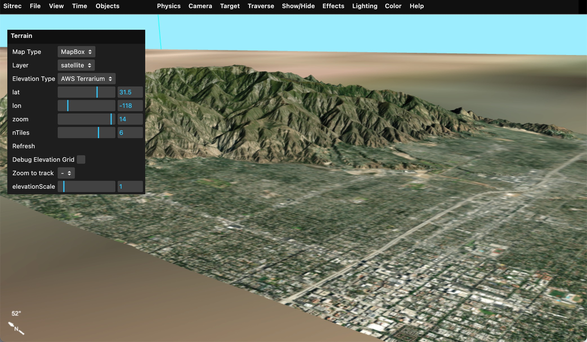
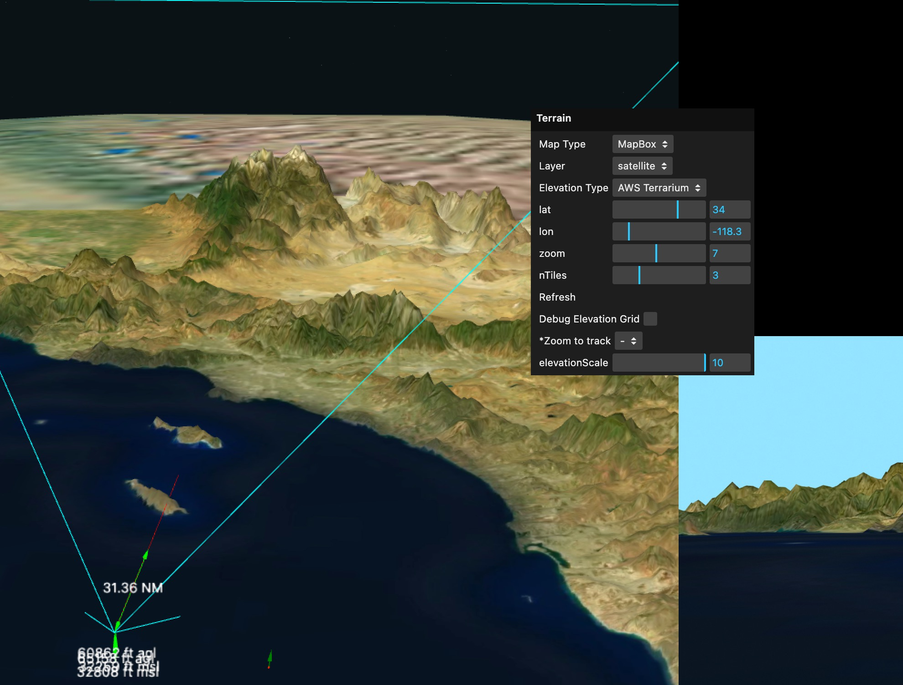

# Custom map, elevation, and water sources

Sitrec terrain combines two independent tile layers:

- a **map source**, the image draped over the ground; and
- an **elevation source**, the height samples used to shape the ground.



Both sources must use the same tile projection. Sitrec supports the usual Web Mercator
slippy-map grid (`EPSG:3857`, the default), an equirectangular/GoogleCRS84Quad-style grid
selected with `mapping: 4326`, custom URL templates, and limited WMS/WMTS adapters.

There are two ways to add a source:

1. add a URL-template source through `config/shared.env`; or
2. add a JavaScript source definition to the per-install `config/config.js`, based on
   [config/config.js.example](../../config/config.js.example).

Use the environment form for ordinary `{z}/{x}/{y}` tile servers. Use `config.js` when the
URL needs computed bounds, a date, a layer-dependent extension, or other JavaScript logic.

## URL-template sources from `shared.env`

Map variables use `SITREC_CUSTOM_MAP_<NAME>_*`; elevation variables use
`SITREC_CUSTOM_ELEVATION_<NAME>_*`. `<NAME>` becomes part of the internal source key and is
normally written in upper case for readability.

```dotenv
SITREC_CUSTOM_MAP_IMAGERY_URL="https://tiles.example.org/imagery/{z}/{x}/{y}.jpg"
SITREC_CUSTOM_MAP_IMAGERY_NAME="Internal imagery"
SITREC_CUSTOM_MAP_IMAGERY_MAX_ZOOM=18
SITREC_CUSTOM_MAP_IMAGERY_ATTRIBUTION="Example imagery service"
SITREC_CUSTOM_MAP_IMAGERY_TERMS_URL="https://tiles.example.org/terms"

SITREC_CUSTOM_ELEVATION_TERRAIN_URL="https://tiles.example.org/terrain/{z}/{x}/{y}.png"
SITREC_CUSTOM_ELEVATION_TERRAIN_NAME="Internal elevation"
SITREC_CUSTOM_ELEVATION_TERRAIN_MAX_ZOOM=15

DEFAULT_MAP_TYPE=CustomMap_IMAGERY
DEFAULT_ELEVATION_TYPE=CustomElevation_TERRAIN
```

The container entrypoint forwards arbitrary custom map and elevation variables to the
browser, so these settings can be supplied at container start as well as build time.

### Supported suffixes

| Suffix | Map default | Elevation default | Meaning |
|---|---:|---:|---|
| `_URL` | required | required | Template containing `{z}`, `{x}`, and `{y}`. |
| `_NAME` | `Custom Map (<NAME>)` | `Custom Elevation (<NAME>)` | Label shown in the Terrain menu. |
| `_MAX_ZOOM` | `20` | `15` | Deepest source zoom. At greater terrain zooms Sitrec reuses ancestor data. |
| `_MIN_ZOOM` | `0` | `0` | Lowest source zoom. Below it Sitrec uses a placeholder and makes no request. |
| `_MAPPING` | `3857` | `3857` | Tile grid: normally `3857`, or `4326` for a GoogleCRS84Quad-style source. |
| `_ZOFFSET` | `0` | `0` | Integer added to the value substituted for `{z}`. `{x}` and `{y}` are unchanged. |
| `_ATTRIBUTION` | empty | empty | On-screen source credit. |
| `_TERMS_URL` | empty | empty | Link opened from the attribution. |
| `_WATER_COLOR` | unset | not used | Flat map colour used by Water Reflection; see below. |

A negative `_ZOFFSET` automatically raises the effective minimum zoom to at least its
absolute value, and the substituted zoom is clamped to zero. This prevents negative tile
URLs. The offset changes only the `{z}` value; it does not rescale `{x}` or `{y}`.

To remove the built-in internet providers from the menus and retain only custom and
offline-safe sources, set:

```dotenv
SITREC_ENABLE_DEFAULT_MAP_SOURCES=false
SITREC_ENABLE_DEFAULT_ELEVATION_SOURCES=false
```

The remaining map choices include local/debug/flat sources; elevation retains Flat and
Local. The secure build forces both settings to `false`.

### Elevation format detection

Environment-defined elevation is decoded as Terrarium RGB when its generated URL ends
exactly in `.png`, or as Mapbox Terrain-RGB when the URL contains `.pngraw`. Any other URL
is sent to the GeoTIFF decoder. Consequently, a Terrarium URL with a query string after
`.png` will currently be misclassified; use a URL that ends in `.png`, or define a
`config.js` function that returns one.

The projection setting does not select the elevation encoding. Map and elevation sources
in use must still have matching `mapping` values.

## JavaScript source definitions

`config/config.js` is installation-specific and is not tracked. Its
`customMapSources` and `customElevationSources` objects are merged into the Terrain menus.
The object key is the source type used by `DEFAULT_MAP_TYPE` or
`DEFAULT_ELEVATION_TYPE`.

A basic map source is:

```javascript
customMapSources: {
    osm: {
        name: "OpenStreetMap",
        mapURL: (z, x, y) =>
            `https://tile.openstreetmap.org/${z}/${x}/${y}.png`,
        minZoom: 0,
        maxZoom: 19,
        mapping: 3857,
        waterColor: [170, 211, 223],
        attribution: "© OpenStreetMap contributors",
        termsURL: "https://www.openstreetmap.org/copyright",
    },
},
```

The function receives Sitrec's tile `z, x, y` and returns one URL. A browser fetch requires
the tile server to permit cross-origin image requests. Follow the provider's attribution,
caching, request-volume, and credential rules. In particular, the standard OpenStreetMap
tile service has a
[published usage policy](https://operations.osmfoundation.org/policies/tiles/) and is not
an offline or bulk-download service.

Common map-definition fields include:

| Field | Purpose |
|---|---|
| `name` | Menu label. |
| `mapURL(z, x, y, layerName, layerType)` | Returns the tile URL. |
| `minZoom`, `maxZoom` | Source coverage. |
| `mapping` | `3857` by default; `4326` for an equirectangular grid. |
| `layer` | Default layer name. Required when `capabilities` is used. |
| `layers` | Static layer definitions, including file type when the URL function needs it. |
| `capabilities` | WMS/WMTS capabilities URL from which Sitrec builds the layer menu. |
| `requiredToken` | Name of an environment setting required before the source is shown. |
| `attribution`, `termsURL` | On-screen credit and its link. |
| `waterColor` | Flat RGB water fill used by colour-based water reflection. |

The tracked Mapbox and MapTiler sources read their browser-visible credentials from
`process.env` and declare the corresponding supported name (`MAPBOX_TOKEN` or
`MAPTILER_KEY`) as `requiredToken`. This hides the source when the setting is absent or is
still `EXAMPLEKEY`. Never put a real value directly in `config.js`:

```javascript
maptiler: {
    name: "MapTiler",
    requiredToken: "MAPTILER_KEY",
    layers: {
        "satellite-v2": {type: "jpg", minZoom: 0, maxZoom: 22},
    },
    layer: "satellite-v2",
    mapURL: (z, x, y, layerName, layerType) =>
        `https://api.maptiler.com/tiles/${layerName}/${z}/${x}/${y}.${layerType}` +
        `?key=${process.env.MAPTILER_KEY}`,
    maxZoom: 16,
    attribution: "© MapTiler © OpenStreetMap contributors",
    termsURL: "https://www.maptiler.com/copyright/",
},
```

The value is necessarily visible to the browser. Restrict it by origin and service in the
provider console.

## WMS and WMTS map sources

`src/WMSUtils.js` supplies two adapters on the active map projection:

- `wmsGetMapURLFromTile(base, layer, z, x, y)` converts a Sitrec tile to a WMS 1.1.1
  `GetMap` request for a 256×256 JPEG in `EPSG:4326` bounds.
- `wmtsGetMapURLFromTile(base, layer, z, x, y)` builds the path used by a
  GoogleCRS84Quad WMTS service.

The tracked example contains working WMS and WMTS definitions. In abbreviated form:

```javascript
NRL_WMS: {
    name: "NRL WMS",
    mapURL: function (z, x, y, layerName) {
        return this.mapProjectionTextures.wmsGetMapURLFromTile(
            "https://geoint.nrlssc.org/nrltileserver/wms/category/Imagery?",
            layerName, z, x, y);
    },
    capabilities: "https://geoint.nrlssc.org/nrltileserver/wms/category/Imagery?REQUEST=GetCapabilities&SERVICE=WMS",
    layer: "ImageryMosaic",
    maxZoom: 12,
},

NRL_WMTS: {
    name: "NRL WMTS",
    mapURL: function (z, x, y, layerName) {
        return this.mapProjectionTextures.wmtsGetMapURLFromTile(
            "https://geoint.nrlssc.org/nrltileserver/wmts",
            layerName, z, x, y);
    },
    capabilities: "https://geoint.nrlssc.org/nrltileserver/wmts?REQUEST=GetCapabilities&VERSION=1.0.0&SERVICE=WMTS",
    layer: "BlueMarble_AUTO",
    mapping: 4326,
    maxZoom: 12,
},
```

`capabilities` is fetched by the browser and parsed for layer names. The source must also
provide a valid default `layer`; omitting it stops the source with an alert. The first
capability layer is only a fallback selection inside the populated layer menu, not a
substitute for the default.

The adapters are intentionally narrow rather than general WMS/WMTS clients. If a service
uses a different matrix set, axis order, image format, style, dimensions, or request
syntax, construct its URL in `mapURL()` instead.

## Elevation sources

Sitrec's standard RGB elevation format is Terrarium:

```text
height metres = (R × 256 + G + B / 256) - 32768
```

The public Tilezen/Mapzen terrain archive is one example:

```javascript
customElevationSources: {
    AWS_Terrarium: {
        name: "AWS Terrarium",
        mapURL: (z, x, y) =>
            `https://s3.amazonaws.com/elevation-tiles-prod/terrarium/${z}/${x}/${y}.png`,
        minZoom: 0,
        maxZoom: 15,
        tileSize: 256,
        attribution: "Elevation: USGS, NOAA & contributors",
        termsURL: "https://github.com/tilezen/joerd/blob/master/docs/attribution.md",
    },
},
```

See the [Registry of Open Data terrain entry](https://registry.opendata.aws/terrain-tiles/)
and the linked attribution terms before redistributing or mirroring tiles.

Sitrec also has a specialized adapter for the National Map 3DEP `exportImage` service:

```javascript
NationalMap: {
    name: "National Map 3DEP GeoTIFF",
    mapURL: function (z, x, y) {
        return this.mapProjectionElevation.getWMSGeoTIFFURLFromTile(
            "https://elevation.nationalmap.gov/arcgis/rest/services/3DEPElevation/ImageServer/exportImage",
            z, x, y);
    },
    minZoom: 0,
    maxZoom: 14,
    tileSize: 256,
    attribution: "Data: U.S. Geological Survey",
    termsURL: "https://www.usgs.gov/faqs/what-are-terms-uselicensing-map-services-and-data-national-map",
},
```

`getWMSGeoTIFFURLFromTile()` keeps the terrain on Sitrec's Web Mercator tile grid but asks
the service for the tile's latitude/longitude bounds. It expands the bounds by half a pixel
to align adjacent samples and requests a 256×256 TIFF.

The current GeoTIFF elevation decoder is deliberately limited. It expects a tiled,
little-endian, uncompressed 32-bit floating-point raster like the response above; it reads
raw tile offsets rather than using the general raster decoder. Strip-organized TIFFs,
compressed tiles, integer samples, and other layouts are not supported by this path.
`src/QuadTreeTile.js` coordinates the fetch and height conversion;
`src/TIFFUtils.js` reads the tiled float data.

Sitrec applies its geoid correction when loading both Terrarium and GeoTIFF elevation.
Keep **Elevation Scale** at `1` for measurements. Raising it is only a temporary visual
debugging aid: it exaggerates the terrain and currently scales the geoid correction too,
so geometry is no longer geodetically accurate.



## Water Reflection source metadata

The **Effects → Water Reflection** effect can identify water in three ways.

### Flat map colour

For a cartographic map with a uniform water fill, declare the source's RGB value:

```javascript
waterColor: [170, 211, 223], // #AAD3DF
```

Environment-defined maps use either form:

```dotenv
SITREC_CUSTOM_MAP_HOUSE_WATER_COLOR="#AAD3DF"
# or: SITREC_CUSTOM_MAP_HOUSE_WATER_COLOR="170,211,223"
```

The standard OpenStreetMap tile hosts are recognized by URL and get the standard OSM fill
automatically, including when the URL is encoded inside `cachemaps.php`. Existing
`config.js` entries keyed `osm` or `osmHighlight` are backfilled when `waterColor` is
undefined. An explicit value always wins; an invalid value is ignored.

Do not assign a flat water colour to satellite imagery. Similar-coloured ground would be
misclassified. Use a vector mask or **Combine Terrain with OSM** instead. The combine uses
the `osm` source when available, otherwise a compatible non-4326 map source that declares
a water colour.

### Vector water polygons

**Vector Water Mask** and **Water on 3D Tiles** use a `water` polygon layer in OpenMapTiles
Mapbox Vector Tile (`.pbf`) format. The `swimming_pool` class is omitted; other polygon
classes are rasterized to an antialiased coverage mask.

With a valid `MAPTILER_KEY`, MapTiler is the default. It is not required: point Sitrec at a
self-hosted or compatible service with:

```dotenv
SITREC_VECTOR_WATER_URL="https://tiles.example.org/water/{z}/{x}/{y}.pbf"
SITREC_VECTOR_WATER_MAX_ZOOM=14
SITREC_VECTOR_WATER_ATTRIBUTION="Water: © Example data provider"
SITREC_VECTOR_WATER_TERMS_URL="https://tiles.example.org/terms"
```

`SITREC_VECTOR_WATER_MAX_ZOOM` defaults to `14`. Above it, Sitrec magnifies the appropriate
ancestor polygons. Setting it higher than the server supports is a quiet failure: a 404 is
treated as a tile with no water, so water disappears. The URL is fetched by the browser;
any credential embedded in it is visible and must be scoped accordingly.

Custom OpenMapTiles-schema data defaults to an OpenStreetMap attribution. Override it when
the data has different terms. An explicitly empty `SITREC_VECTOR_WATER_ATTRIBUTION` means
no credit and should be used only when the data genuinely requires none.

### Photorealistic 3D tiles

Photorealistic 3D tiles replace the terrain surface instead of sitting on top of it, so
there is no map texture on which colour matching or a terrain mask can operate. **Water on
3D Tiles** shades the tiles' own material. It requires the same vector water source, then
combines the polygon mask with a height band around the water surface and an upward-facing
surface test. **3D Tile Water Band** and **3D Tile Mask Span** control those filters.

## Testing a source

1. Load `?action=new`, select the new map and elevation types, and move across tile
   boundaries at several zoom levels.
2. In browser developer tools, verify generated `z/x/y`, status codes, response content
   types, CORS headers, and attribution.
3. Test the minimum and maximum zooms. Below `minZoom` there should be no request; above
   `maxZoom` ancestor data should remain aligned.
4. Switch between map sources and press **Terrain → Refresh** to distinguish cache state
   from a URL or decoding problem.
5. For elevation, keep **Elevation Scale** at `1` while comparing known heights and tile
   seams.
6. For water, test the colour mask, vector mask, and 3D-tile path separately. A missing
   vector source should hide or disable the vector-dependent controls rather than silently
   use a map colour.
