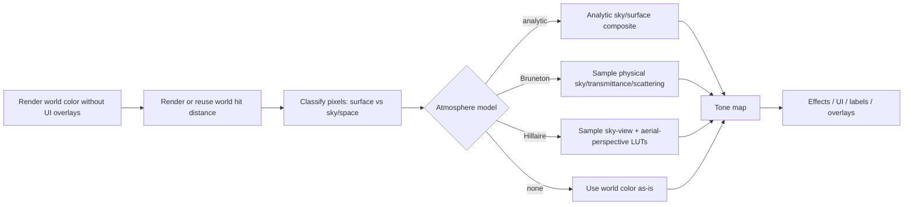
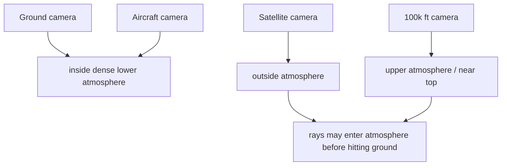

# Real-Time Atmosphere Rendering for Sitrec

**Status:** Exploratory design note.

**Date:** 2026-05-22.

**Scope:** Investigate whether Sitrec should keep extending the current analytic aerial-perspective shader, adopt a Bruneton-style precomputed atmosphere, implement a Hillaire 2020-style LUT renderer, or support multiple atmosphere models behind one interface.

This note is written in the context of the recent Sitrec atmosphere bugs:

- distant buildings fading toward a color that did not match the sky behind them
- black speckles from depthless / under-reported 3D tile fragments
- high-altitude nadir views darkening the ground incorrectly
- non-monotonic visibility response caused by coupling visibility to depth scale
- a hard transition near `364354 ft` caused by a discrete slant-view branch

Those failures are useful. They show that the problem is not just "make fog prettier"; Sitrec needs one coherent line-of-sight atmosphere model that works for sky and surfaces from ground level to space.

## Executive Summary

Sitrec should move toward a pluggable atmosphere system with at least two models:

1. **Fast analytic model**: the current screen-space aerial perspective, cleaned up and kept as the low-cost fallback.
2. **Physical LUT model**: a Bruneton or Hillaire-family model for ground-to-space sky and aerial perspective.

The strongest long-term target is a Hillaire 2020-style model, but a direct Unreal-style implementation assumes compute shaders and engine features that WebGL does not expose cleanly. In current Three.js/WebGL Sitrec, the practical path is:

- keep the current analytic model as Model 0
- prototype a Bruneton/takram integration as Model 1 because it already targets Three.js and Earth-scale rendering
- design the abstraction so Hillaire/WebGPU can become Model 2 without rewriting Sitrec's view logic

The key invariant for all models:

```text
sky pixels and surface pixels must be evaluated from the same atmosphere state
and the same line-of-sight optical-depth model.
```

If a distant hill fades, it should fade according to the same per-ray atmosphere model as the sky behind it. In the optically thick or far-limit case it should approach that sky radiance, not a separately tuned gradient. It is not generally true that a finite surface ray and an empty sky ray have identical color: the surface ray terminates at the surface, while the sky ray continues to the top of the atmosphere.

## References

Primary references:

- Bruneton and Neyret, 2008, **Precomputed Atmospheric Scattering**: https://github.com/ebruneton/precomputed_atmospheric_scattering
- Bruneton 2017 rewrite and WebGL demo documentation: https://ebruneton.github.io/precomputed_atmospheric_scattering/
- Hillaire, 2020, **A Scalable and Production Ready Sky and Atmosphere Rendering Technique**: https://diglib.eg.org/items/8a3e5350-18b3-46bd-9274-3add5af88c75
- Hillaire paper PDF: https://sebh.github.io/publications/egsr2020.pdf
- Three.js package closest to Sitrec today, `@takram/three-atmosphere`: https://www.npmjs.com/package/%40takram%2Fthree-atmosphere

Useful implementation references:

- `ebruneton/precomputed_atmospheric_scattering`: reference C++/GLSL implementation and WebGL demo.
- `sebh/UnrealEngineSkyAtmosphere`: reference Hillaire-family implementation.
- `@takram/three-atmosphere`: Three.js implementation of Bruneton-family scattering, developed in the context of geospatial / GIS rendering.

## Sitrec Requirements

Sitrec is not a normal game skybox. It needs to handle all of these without discontinuities:

- observer on the ground looking horizontally through dense near-surface air
- observer on the ground looking straight up
- aircraft altitude from `0` to `50,000 ft`
- high-altitude platform views around `100,000 ft` and above
- satellite / near-space views looking down through the atmosphere
- long slanted lines of sight, including tangent and near-horizon paths
- narrow FOV analysis views and wide FOV overview views
- day/night transitions, stars, satellites, and a daytime Moon
- terrain, Google photorealistic tiles, 3D buildings, overlays, and sky background
- eventual weather inputs such as visibility, aerosol optical depth, humidity, cloud base, and boundary-layer height
- visible and IR analysis modes. Rayleigh scattering is negligible in long-wave IR, while water-vapor absorption, aerosol extinction, and thermal self-emission become the important terms.
- low-elevation sensor reconstruction. At `1-5 degrees` elevation or depression, path length through the lower atmosphere is large and refraction can move apparent positions by tens of arcminutes.

The renderer also needs a true no-op path:

```text
Atmosphere off:
  no atmosphere render targets
  no atmosphere shaders
  no LUT recomputation
  no extra scene render
```

## Why The Current Analytic Model Keeps Hitting Edge Cases

The current model is intentionally small:

```text
scene_out = scene_in * T + airlight * (1 - T)
T = exp(-beta * integrated_density_path)
```

It is a good first-order aerial perspective model, but recent bugs show where it is fragile:

- The sky color and surface fog color started as separate systems.
- Depth from 3D tiles is not always reliable.
- Long slant rays need analytic Earth distance when depth is under-reported.
- Downward views should not get the same hacks as horizon views.
- Visibility must drive extinction, not depth encoding.
- Hard angle thresholds create visible transitions.

The current model can be kept as a fallback, but it is becoming a collection of case-specific corrections. A LUT-based physical model would move more of this complexity into a coherent transmittance/scattering formulation.

### Current Sitrec State

Useful pieces already exist and should be preserved rather than replaced wholesale:

| Piece | Current role |
|---|---|
| Koschmieder visibility mapping | Converts `Atmo Visibility (km)` to near-surface extinction with `beta = 3.912 / visibility_m`. |
| horizon-to-zenith sky gradient | Provides the current daylight sky look and remains a useful fallback/debug path. |
| aerial-perspective composite | Applies `scene * T + airlight * (1 - T)` after the scene render, currently focused on `lookView`. |
| distance prepass | Provides normalized view distance and avoids hardware-depth precision problems at Earth-scale far planes. |
| height-integrated optical depth | Handles high-altitude rays better than flat-distance fog by integrating an exponential density profile along the ray. |
| `CNodeAtmosphericProfile` | Stores radiosonde-style temperature, pressure, humidity, and wind profiles, but is not yet consumed by rendering. |
| HDR tone mapping | Lets the atmosphere composite happen in scene-linear space before final display mapping. |
| refraction work | Belongs beside the radiance model: it bends the ray; the atmosphere renderer integrates along that ray. |

There are also two distinct controls that should stay distinct:

- `lighting.atmosphere`, labeled `Daytime Sky`, controls whether a blue daytime sky is rendered at all.
- `view3d.atmosphere` controls whether a view applies aerial perspective / horizon haze.

Future models should keep the saved property names stable for compatibility. The label and tooltip can evolve without turning old sitches into migration problems.

## Core Physics Contract

All viable models should expose the same conceptual API:

```text
Transmittance(camera, point)
SkyRadiance(camera, view_ray, sun)
AerialPerspective(camera, point_or_depth, view_ray, sun)
```

For a surface pixel:

```text
L = L_surface * T(camera -> surface) + L_air(camera -> surface)
```

Here `L_surface` means the already-rendered outgoing surface radiance in Sitrec's current post-process pipeline. A fully physical renderer would also attenuate incident Sun/Moon illumination along the light path before the surface shading step. That matters for radiometric analysis, but it is a separate upgrade from view-path aerial perspective.

For a sky pixel:

```text
L = L_space * T(camera -> atmosphere_boundary) + L_air(camera -> atmosphere_boundary)
```

Usually `L_space` is black in daytime sky rendering, but Sitrec has stars, satellites, and the Moon. That means `L_space` cannot always be assumed to be black. At night or twilight, stars and satellites should be attenuated by the same atmosphere transmittance used for sky and terrain.

For physical LUT models, sky radiance should come from the sky LUT. Space-object radiance is then attenuated by view transmittance and composited consistently with that sky radiance. Do not add a separate `L_air` term on top of a sky LUT that already includes path radiance and multiple scattering.

All atmosphere compositing must happen in linear HDR before final tone mapping. UI, labels, analysis overlays, and other non-world-space annotations should remain post-composited unless they are intentionally modeled as physical objects in the atmosphere.

Atmosphere shaders should avoid Earth-scale ECEF values directly in fragment math. Use camera-relative coordinates, local-frame coordinates, or planet-centered normalized units with explicit conversion from Sitrec's ECEF/local frame. Several of the recent bugs were shader-coordinate bugs in disguise; precision needs to be a first-class part of the model contract.

### Diagram: One Model For Sky And Surface

```mermaid
flowchart TD
    C["Camera"] --> R{"View ray"}
    R -->|hits terrain/building| S["Surface point"]
    R -->|misses scene| A["Atmosphere boundary / space"]
    S --> T1["Integrate optical depth along camera -> surface"]
    A --> T2["Integrate optical depth along camera -> top of atmosphere"]
    T1 --> O1["surface * transmittance + path radiance"]
    T2 --> O2["space/stars/moon * transmittance + path radiance"]
```



The output colors are allowed to differ because the ray lengths and backgrounds differ. The model and atmosphere state should not differ.

## Model Options

### Model 0: Sitrec Analytic Aerial Perspective

This is the current approach.

Runtime:

- one lightweight distance pass
- one fullscreen aerial-perspective composite pass
- small shader, no LUTs
- no CPU ray marching

Pros:

- already integrated with `lookView`
- cheap
- easy to disable fully
- easy to debug
- good enough for many low-altitude and medium-range cases

Cons:

- approximate sky, approximate airlight
- no real multiple scattering
- hand-authored sky gradient still exists
- fragile around missing terrain depth and long slant paths
- not radiometrically calibrated
- hard to make twilight, limb, satellite views, and surface haze all agree

Role:

- keep as fallback and debug model
- use for mobile or WebGL1-style constraints
- useful for immediate fixes and visual regression tests

### Model 1: Bruneton / Precomputed Atmospheric Scattering

Bruneton and Neyret precompute scattering into LUTs parameterized by altitude/radius and angular terms such as view zenith, sun zenith, and sun-view angle, with specialized mappings into 2D/3D textures. The 2017 rewrite is well documented, unit-tested, and includes WebGL support.

Pros:

- designed for ground-to-space viewpoints within a spherical layered atmosphere model
- handles Rayleigh, Mie, and multiple scattering
- mature reference implementation
- good fit for Earth-scale apps
- `@takram/three-atmosphere` may provide a lower-friction Three.js path

Cons:

- larger precomputed textures than Hillaire
- harder to customize dynamically for changing weather
- may assume Earth-like atmosphere in packaged implementations
- material integration can be invasive: some implementations assume the render buffer is albedo or use unlit/Lambertian constraints

Role:

- best near-term physical prototype in Three.js/WebGL
- good candidate for sky and long-distance aerial perspective baseline
- useful reference for validating our analytic model

### Model 2: Hillaire 2020 / Unreal Sky Atmosphere Family

Hillaire avoids Bruneton's large precomputed 4D scattering table by combining lower-dimensional transmittance, sky-view, aerial-perspective, and multi-scattering approximation LUTs. It is not a drop-in physical equivalent to Bruneton; it is a production-oriented formulation with different approximations.

Typical LUTs:

| LUT | Typical size | Depends on | Lifetime |
|---|---:|---|---|
| Transmittance | `256 x 64` | atmosphere parameters | when atmosphere changes |
| Multi-scattering | `32 x 32` | atmosphere + sun | when atmosphere/sun changes, or per sun change |
| Sky-view | `192 x 108` | camera + sun | per frame |
| Aerial perspective | `32 x 32 x 32` | camera frustum + sun | per frame |

Pros:

- production-proven
- ground-to-space capable
- efficient at runtime
- explicitly separates sky-view and aerial perspective
- good conceptual match for Sitrec's need to evaluate sky and surfaces consistently

Cons:

- reference implementations assume compute shaders
- WebGL2 can emulate much of it with fullscreen passes, but not as cleanly
- aerial-perspective volume defaults are tuned for terrestrial games, not Sitrec's satellite/LEO slant ranges
- Three.js support for 3D render targets and layer rendering is more awkward than native engine/WebGPU code

Role:

- best long-term physical model, especially if Sitrec moves to WebGPU
- possible WebGL2 prototype if we accept some engineering complexity
- probably not the first integration step unless Bruneton/takram cannot meet the use cases

### Model 3: Scientific / Offline Reference

This is not a realtime renderer. It would be a slower reference path for testing:

- CPU ray-marched single scattering
- optional libRadtran/MODTRAN-style comparison later
- high sample count
- selected pixels/rays only

Role:

- validate realtime approximations
- create expected curves for visibility monotonicity, horizon transitions, and altitude sweeps
- answer scientific questions without requiring the interactive renderer to be fully radiometric

## Proposed Architecture: Multiple Atmosphere Models

Add an atmosphere-model layer rather than embedding all logic in `CNodeView3D`.

Conceptual interface:

```js
class AtmosphereModel {
    isAvailable(renderer) {}
    updateStaticResources(params) {}
    updateFrameResources(viewState) {}
    renderSky(viewState, target) {}
    applyAerialPerspective(viewState, sceneColor, sceneDistance, target) {}
    dispose() {}
}
```

Models:

```text
none
analytic
bruneton
hillaire
reference/debug
```

### Ownership And Serialization

For the first integration, make the selected model a `lookView` setting:

```text
lookView.atmosphereModel = "analytic" | "bruneton" | "hillaire" | "none"
```

Recommended default/fallback:

```text
Atmosphere off                  -> none
Daytime Sky on, no field present -> analytic
Unknown/unsupported model        -> analytic if atmosphere is on, otherwise none
Experimental physical model      -> bruneton/hillaire only when capability checks pass
```

This should follow the existing `CNodeView3D` pattern: initial sitch definitions may use nested `lookView.atmosphere` fields, while serialized mods should store flat per-view fields. LUTs, textures, render targets, and cached tables are runtime resources and must never be serialized.

For custom serialized sitches, remember the existing `force: true` rule: if a future built-in sitch needs to override old saved state with new atmosphere defaults, the node definition needs an explicit forced field rather than relying on missing-field behavior.

### Current Sitrec Hook Points

The first implementation should document and preserve the current `lookView` hook points:

- `renderSky()` draws the flat/gradient sky background.
- `GlobalDaySkyScene`, when present, can render an analytic Three.js sky path. Current aerial perspective gates itself off in that case.
- `pushLookViewAtmosphereFog()` / `popLookViewAtmosphereFog()` currently manage the legacy Three fog state.
- `renderAerialPerspectiveDepth()` renders the lightweight distance prepass.
- the aerial perspective composite runs after the main scene render and before later effects/overlays.
- HDR tone mapping happens after the composite; atmosphere math should be in linear scene space before tone mapping.
- current gates include `lookView`, atmosphere enabled, non-IR, non-XR, and no `GlobalDaySkyScene`.

The future model boundary should not quietly change those gates. If Hillaire/Bruneton is allowed with `GlobalDaySkyScene`, that should be an explicit migration with tests, not an accidental side effect.

### No-Op Contract

Model `none`, or Atmosphere off, must be a true no-op:

- do not call `updateStaticResources`
- do not call `updateFrameResources`
- do not call `renderSky` through the atmosphere model
- do not call `applyAerialPerspective`
- do not call `renderAerialPerspectiveDepth`
- do not allocate model-specific render targets, LUT textures, or shader materials

Model resources should be lazy-created and disposed when the model changes to `none`, matching the current `disposeAerialPerspectiveResources()` pattern.

### Diagram: Render Pipeline With Pluggable Atmosphere



This diagram deliberately separates world color, hit distance, and sky/space classification. A model must know whether a pixel represents a finite surface or a ray to the atmosphere boundary; otherwise it risks double-applying sky radiance or treating sky and surface pixels inconsistently.

### Distance Contract

A physical atmosphere model does not solve bad distance data by itself. Sitrec needs an explicit distance contract:

- opaque terrain/building pixels should provide view-ray hit distance in meters, not hardware non-linear depth
- Google tile / photogrammetry fragments that under-report distance need either a fixed path or a mask
- depthless world fragments should choose a documented fallback: analytic Earth intersection for terrain-like pixels, atmosphere-boundary distance for sky-like pixels, or exclusion for overlays
- transparent objects need a separate policy; the first physical model can exclude them
- labels, UI, analysis graphics, and screen overlays should not participate unless deliberately rendered as physical objects

The recent black-speckle and altitude-transition bugs were distance-contract bugs as much as atmosphere bugs.

## Hillaire Adaptation For Sitrec

Hillaire is attractive because it gives us exactly the split Sitrec needs:

- sky pixels sample a sky-view LUT
- surface pixels sample aerial perspective by screen position and depth
- transmittance and multiple scattering are shared

The challenge is scale. Sitrec's use cases exceed the usual game assumptions.

### Depth Range

Hillaire's default aerial perspective depth range is around `32 km`, appropriate for terrain games. Sitrec needs:

- `0-30 km`: ground and aircraft views
- `30-120 km`: high-altitude/near-space views
- `120-1000+ km`: satellite slant paths
- tangent/horizon rays that traverse long distances through low atmosphere

A single linear 32-slice volume will not work.

Possible Sitrec depth slicing:

```text
slice_z = logarithmic distance from near plane to horizon/atmosphere boundary
```

or split volumes:

```text
near aerial perspective: 0-64 km
far limb/slant aerial perspective: 64-4000 km
```

Better first prototype:

- keep Hillaire's sky-view LUT
- keep current analytic per-pixel optical depth for surfaces
- compare against full Hillaire aerial-perspective volume later

This hybrid is only a feasibility spike. It can validate LUT generation, camera-altitude handling, sky rendering, and transmittance for space objects, but it cannot prove the final sky/surface consistency invariant until sky and aerial perspective consume the same physical LUT chain.

### Camera Altitude

The model must handle observer altitude below, inside, and above the atmosphere:



This means sky rays need both entry and exit distances through the atmosphere shell. A satellite looking at the Earth limb is outside the atmosphere, but its ray can cross a long atmospheric chord.

### Coordinate Frame

Most Hillaire reference code assumes a local upright world with a single planet center and a convenient up axis. Sitrec's real positions are ECEF/double-precision, while rendering often uses local camera-relative coordinates. The first physical model should not do fragment math directly on full-size ECEF coordinates.

Two viable approaches:

- build a per-view local ENU frame at the camera and evaluate atmosphere rays in that frame
- pass planet-center-relative normalized coordinates and derive `up = normalize(position - planetCenter)` in the shader

The local ENU approach is the safer first step because it is easier to compare against Three.js/WebGL reference implementations. An ECEF-native shader can follow later if validation shows the local-frame transform is the limiting error.

### Multi-View Cost

Sitrec often has multiple synchronized 3D views. A Hillaire-style implementation should share what it can:

- transmittance and multi-scattering LUTs are atmosphere-state resources and can be shared across views
- sky-view LUTs depend on observer position and sun direction; they may be reusable between views at the same camera position, but not blindly across different observers
- aerial-perspective LUTs depend on the view frustum and are per-view
- exploratory views can use smaller LUTs or stay on the analytic model while `lookView` uses the higher-fidelity path

The no-op rule still applies: views with atmosphere disabled should not cause per-frame LUT updates.

### Day/Night, Stars, Satellites, Moon

Sitrec cannot render atmosphere as a simple replacement skybox:

- Stars and satellites are real scene objects.
- Daytime Moon should be attenuated and veiled by atmosphere but not hidden by a blue quad in a non-physical way.
- Night sky should remain visible when sky radiance is low.
- Twilight needs both sky radiance and transmittance for space objects.

Model contract:

```text
space object pixel = object_radiance * T(camera -> object through atmosphere)
                     + path_radiance(camera -> atmosphere exit)
```

For stars/satellites, the object is effectively beyond the atmosphere, so transmittance is to atmosphere exit, not to a finite terrain depth.

Visibility of celestial objects should be judged after HDR exposure, tone mapping, bloom/PSF, and the sensor/display response. A star or satellite can be physically present but invisible in daytime because sky radiance destroys contrast. The renderer should not encode that as an arbitrary on/off rule.

This suggests a later dedicated pass for celestial/night-sky objects:

```text
render space objects in linear HDR
apply atmosphere transmittance along their rays
composite with sky-view radiance
```

## WebGL / Three.js Practicality

### Bruneton In WebGL

Bruneton's 2017 implementation has a WebGL demo and a documented GLSL path. This makes it the safer immediate experiment.

Risks:

- integration with Sitrec's existing materials and Google tiles
- color-management and tone-mapping consistency
- making aerial perspective apply to arbitrary rendered terrain/buildings, not just demo geometry

### Hillaire In WebGL2

Hillaire is possible, but less direct:

- compute shaders are not available in WebGL2
- transmittance and sky-view LUTs can be generated with fullscreen fragment passes
- 3D aerial-perspective LUTs require WebGL2 3D textures and layer rendering, or packing slices into a 2D atlas
- updating a `32 x 32 x 32` volume every frame is not automatically cheap: the texel count is small, but each texel can raymarch and sample transmittance / multi-scattering LUTs. In Sitrec the cost is per active atmosphere view.

Capability gates should be explicit:

- WebGL2 availability
- `EXT_color_buffer_float` or viable half-float render-target path
- float / half-float filtering where required
- `highp` fragment precision
- 3D texture support if using volume textures
- Three.js support for rendering individual 3D texture layers, or a planned 2D atlas fallback

If a capability check fails, fall back to `analytic` or disable the physical model visibly. Do not silently degrade into a half-working Hillaire path.

Recommended WebGL2 approach:

```text
Transmittance LUT: 2D render target
Multi-scattering LUT: 2D render target
Sky-view LUT: 2D render target per frame
Aerial perspective: initially skip or pack 3D slices into a 2D atlas
```

Then the main view composite samples:

```text
sky pixel -> sky-view LUT
surface pixel -> current analytic depth integration OR packed aerial-perspective LUT
```

Prototype performance should be measured with GPU timing where available, not only CPU frame labels. Use `EXT_disjoint_timer_query_webgl2` for LUT generation and composite passes where possible, with a fallback A/B frame-time test at fixed render scale.

### Hillaire In WebGPU

If Sitrec later adopts WebGPU, Hillaire becomes much cleaner:

- compute passes can match the paper/reference implementation
- 3D storage textures / volume LUTs are natural
- GPU timing and debug views are easier

Do not block current work on WebGPU, but keep the model interface compatible with it.

## Weather Inputs

Current `Atmo Visibility (km)` is useful but incomplete.

Future inputs should map into atmosphere parameters:

| Weather / analysis input | Atmosphere parameter |
|---|---|
| meteorological visibility | near-surface total extinction at a reference wavelength, then partition into molecular/aerosol terms if enough data exists |
| aerosol optical depth | integrated aerosol density |
| relative humidity | aerosol growth / stronger Mie scattering |
| boundary-layer height | aerosol scale height or layered profile |
| ozone column | ozone absorption |
| cloud base / cloud cover | separate volumetric/cloud layer, not clear-air scattering |
| fog layer | separate participating-media layer near the ground |
| smoke/dust/ash | aerosol phase function and spectral extinction; may require non-standard particle distributions |

Do not make every weather input an ad-hoc color knob. Convert it into:

```text
beta_rayleigh(h)
beta_mie(h)
beta_absorption(h)
phase_rayleigh(theta)
phase_mie(theta)
ground_albedo
sun_radiance
```

Phase 5 should start with clear-air parameters. Clouds, fog banks, smoke plumes, and local weather gradients are separate participating-media problems and should not be implied as simple scalar visibility tweaks.

### Radiosonde Profiles

`CNodeAtmosphericProfile` can eventually make Sitrec better than a generic game-engine atmosphere because some sitches have real atmospheric profiles.

Potential mapping:

- pressure and temperature determine molecular number density, so Rayleigh extinction should scale with `P / T`
- humidity can drive aerosol growth and stronger Mie scattering through an empirical curve
- inversion layers should be represented as a piecewise profile rather than collapsed into one exponential scale height
- ozone usually needs a default mid-latitude profile unless the sitch has ozone-specific data

The first implementation should be conservative: consume pressure/temperature for molecular density first, then add aerosol/humidity behavior once there is a test case and a documented model.

### IR Bands

The visible-light model should not be reused unchanged for IR. At `3-5 micrometers` and `8-12 micrometers`, Rayleigh scattering is tiny compared with visible wavelengths. Aerosols, water vapor, carbon dioxide absorption bands, and sensor response dominate.

Pragmatic path:

- keep the initial physical LUT model explicitly visible-band
- keep IR using the existing simplified/no-main-lighting path until there is a separate IR atmosphere table
- later add a two-band model: `visible` and `IR`, selected by the view/sensor mode
- defer thermal self-emission unless Sitrec starts doing calibrated IR radiance simulation

### Refraction

Refraction should remain a separate geometric/ray problem. The clean coupling is:

```text
compute bent ray path -> integrate atmosphere radiance/transmittance along that path
```

This is more physically honest than baking refraction into the LUT parameterization. It also keeps the atmosphere renderer usable when refraction is off. The caveat is worth documenting: production game atmosphere renderers generally do not ship refraction-correct aerial perspective, so a Sitrec version would be a scientific extension rather than a standard Hillaire feature.

## Tests Sitrec Should Add

The recent bug hunt suggests these should become deterministic visual or shader-level regression tests.

Implementation locations:

- add visual cases to `tests_regression/regression.test.js`
- add matching entries to `test-registry.js`
- add at least one Playwright metric test that sets `NodeMan.get("lookView").atmosphereVisibilityKm` via page evaluation and samples rendered pixels
- include an atmosphere-off no-op regression: no aerial depth pass, no model resource allocation, and unchanged screenshot relative to the same sitch with atmosphere disabled

### Visibility Monotonicity

For a fixed camera/ray:

```text
visibility 1 km   -> strongest veil
visibility 10 km  -> less veil
visibility 62 km  -> less veil
visibility 250 km -> less veil
visibility 500 km -> weakest veil
```

At minimum, sample center-pixel contrast against the scene with atmosphere disabled.

### Altitude Sweep

Sweep camera altitude:

```text
0 ft
5,000 ft
50,000 ft
100,000 ft
364,354 ft
500,000 ft
LEO-like altitude
```

Watch for discontinuities in:

- average luminance
- center-pixel transmittance
- sky/terrain color difference at horizon

### Direction Sweep

At each altitude:

```text
straight up
45 degrees up
horizon / tangent
45 degrees down
straight down
```

### Field Of View Sweep

Wide FOV can expose screen-space assumptions:

```text
10 degrees
40 degrees
90 degrees
120 degrees
```

### Night And Celestial Objects

Cases:

- stars at night
- satellites near twilight
- daytime Moon
- low-elevation celestial object through long air mass

Expected:

- sky radiance changes with sun angle
- celestial objects attenuate by atmospheric transmittance
- objects do not disappear just because the daytime sky pass is enabled, unless physically overwhelmed by sky radiance/tone mapping

## Suggested Roadmap

### Phase 0: Stabilize Current Analytic Model

Already in progress:

- visibility controls extinction only
- fixed depth encoding scale
- sky pixels use atmosphere-boundary optical path
- hard slant thresholds replaced with smooth weights
- horizon haze tied to Daytime Sky / Atmosphere

Add:

- debug visualization of optical depth / transmittance
- visual regression tests for the problem sitches

### Phase 1: Atmosphere Model Interface

Refactor current logic behind:

```text
AnalyticAtmosphereModel
```

Keep behavior identical. This makes later models less invasive.

### Phase 2: Bruneton / Takram Spike

Goal:

- render a physically based sky in `lookView`
- compare sky colors and horizon transitions against current analytic model
- determine if arbitrary Sitrec terrain/buildings can receive matching aerial perspective

Spike boundaries:

- implement through a throwaway adapter behind an experimental GUI flag
- restrict to `lookView`
- fall back to `analytic` if renderer/package capabilities are missing
- prove terrain/building aerial perspective before committing any new package dependency
- do not change saved sitches by default

Success criteria:

- ground-to-space transition works without hand thresholds
- sky and terrain haze match at horizon
- no extra cost when disabled
- acceptable cost on desktop

### Phase 3: Hillaire Design Prototype

Start with LUT generation in WebGL2:

- transmittance LUT
- sky-view LUT
- optional multi-scattering LUT

Defer full aerial-perspective volume until the sky pipeline is proven.

This phase is a capability and architecture prototype, not a claim of final physical consistency. It should answer:

- can Sitrec generate/update the required LUTs at acceptable GPU cost?
- can the sky-view LUT handle ground, aircraft, and near-space camera altitudes?
- can stars, satellites, and the Moon use transmittance to the atmosphere boundary?
- can the implementation cleanly fall back when WebGL2 features are missing?

Success criteria:

- sky pixels and space-object transmittance work from ground to satellite altitude
- performance fits Sitrec's render loop
- LUT update rules are clear

### Phase 4: Hillaire Aerial Perspective

Implement aerial-perspective LUT either as:

- packed 2D atlas of depth slices, or
- WebGL2 3D texture/layer target if Three.js path is reliable, or
- WebGPU compute path in a future renderer

Use logarithmic depth slices or split near/far volumes for Sitrec-scale distances.

### Phase 5: Weather Integration

Convert weather data to atmospheric profiles:

- visibility
- aerosol scale height
- molecular scale height
- ozone
- humidity/aerosol growth
- cloud/fog layers

Keep the same renderer interface.

## Recommendation

Do not jump straight from the current analytic shader to a full Hillaire aerial-perspective volume in WebGL. The risk is high and the first failure mode will be exactly what we just saw: model correctness mixed with render-target/depth machinery.

Recommended path:

1. Keep and test the analytic model.
2. Add a pluggable atmosphere model interface.
3. Prototype Bruneton/takram because it is already close to Three.js/Earth rendering.
4. In parallel, design a Hillaire-compatible interface and WebGL2 LUT packing plan.
5. Move to full Hillaire when either WebGPU is available or the WebGL2 LUT prototype proves clean.

The decisive architectural move is not "pick Hillaire today." It is to stop embedding atmosphere assumptions directly in `CNodeView3D` and make sky, terrain, celestial objects, and weather consume the same atmosphere model.
